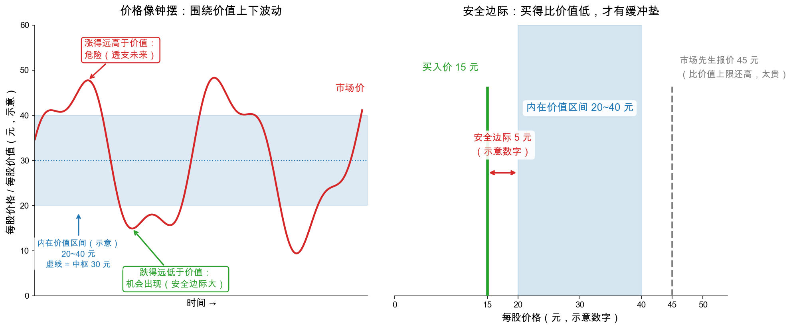

# 第 2 章：内在价值——价格的锚

> 本章你将：
> - 给"内在价值（intrinsic value）"下一个能上手的定义：**被事实支持的价值**；
> - 理解它为什么注定是一个**区间**，而不是一个精确数字；
> - 看懂本周第一张配图：价格围绕价值区间波动，安全边际是缓冲垫；
> - 搭起"价格 - 价值 - 安全边际"铁三角；
> - 知道证券分析师的三重功能：描述、选择、批判。

上一章的结尾我们说，"好公司"回答不了"现在能不能买"——要回答后者，得先有一个东西当锚。
这个锚，就是内在价值。

---

## 2.1 从一套房子说起：价格和价值是两回事

假设你家附近的楼盘，中介挂牌价突然从 450 万砍到 300 万，还卖不动，卖家急着回款。
你该兴奋还是害怕？

先别看行情，看**事实**：同小区近三年成交价、这套房的月租金、户型和学位、周边规划。
你拿着计算器把账算一遍，得出一个朴素结论："这套房自己住每月省下的租金、加上长期出租的收益，
怎么算都值 430 万上下。"300 万的挂牌价，明显**低于事实支持的水平**。

你看，这个过程里出现了两个数：

- **300 万**，是**价格（price）**——卖家今天愿意成交的数字，由着急、恐慌、流动性这些情绪参与决定；
- **430 万上下**，是你根据事实估出的**价值（value）**——注意你说的是"上下"，不是精确到万位。

投资里的所有关键动作，都发生在这两个数的关系里。格雷厄姆把"430 万上下"这个概念搬进证券市场，
给了它一个名字：**内在价值（intrinsic value）**。

> 📌 **划重点：** 价格是市场先生每天的报价，价值是企业事实决定的分量。便宜还是贵，
> 永远是拿价格和**价值**比，而不是拿价格和**昨天的价格**比。

## 2.2 定义：被事实支持的价值

格雷厄姆在第 1 章里给的定义非常克制（md 116）——内在价值是：

> "**that value which is justified by the facts**"——**被事实所支持的价值**。

哪些事实？他当场列了清单：**资产（assets）、盈利（earnings）、股息（dividends）、
确定的远景（definite prospects）**。同时划出了反面清单：**不包含**人为操纵出来的报价，
也**不包含**被情绪推向极端的报价。

四个词里最容易被忽略的是"确定的"三个字。格雷厄姆只把**有把握的**前景算进价值，
"管理层画的大饼"不算。为什么这么抠？因为他对未来的态度是防守式的——第 3 章你会看到，
他把未来叫作"结论必须闯过的危险"，而不是"结论的来源"。

> 💡 **你可能会问：价值为什么不干脆等于股价的"合理均值"？**
>
> 因为那就成了用价格解释价格。格雷厄姆的整个立足点是：价格之外，必须有一把**独立于报价的尺子**。
> 这把尺子的刻度，只能来自企业经营的事实——资产、盈利、分红——而不是来自市场情绪。

## 2.3 "价值 = 某个精确公式"，三个版本都被格雷厄姆亲手拆掉了

定义完概念，格雷厄姆花了好几页做"拆除违章建筑"的工作——把当年流行的三种"精确算价值"的
说法逐一拆掉（md 116-118）。这段特别值得细读，因为那些"违章建筑"今天依然满地都是：

| 流行说法 | 说法本身 | 格雷厄姆的拆除理由 |
|---|---|---|
| ① 价值 = 账面价值（book value，净资产账面数字） | 公司的净资产值多少，股票就值多少 | 被 30 年的市场数据证伪：平均盈利、平均股价都与账面价值基本无关。格雷厄姆原话毫不客气：作为实用指标**"几乎没有用处"**（md 117）。别急着扔——账面价值另有妙用，Week 8 我们再请它回来 |
| ② 价值 = 盈利能力（earning power）的精确倍数 | 把"未来每年能赚的钱"估成一个确定数，再乘个倍数 | "盈利能力"这个词**暗含对未来的自信预期**，而未来恰恰没法打包票——把未来的猜测包装成今天的"事实"，是自欺 |
| ③ 价值 = 精确计算出一个数字 | 比如用"十年平均盈利 乘 10"算出一个目标价 | 下面的 J.I. Case 反例就是打这个的（详拆在下一章） |

拆除之后，格雷厄姆给出全书最务实的一段话（md 118），大意是：

> **"证券分析并不试图确定某只证券的内在价值到底是多少。它只需要确立：价值是否足够
> （比如足以保障一只债券），或者价值明显比市场价格高很多、还是低很多。为了这些目的，
> 一个模糊而近似的价值衡量，就够用了。"**

紧接着他打了个流传至今的比方（md 118）：

> "就像不必知道一位女士的确切年龄，也能一眼看出她到没到投票年龄；不必知道一位男士的确切体重，
> 也能一眼看出他该减肥了。"

把这段话变成操作守则就是一句话：**你不需要量出价值的精确尺寸，只需要判断价格是否远在
"合理范围"之外。** 格雷厄姆甚至给这个范围起了名字——**近似价值区间（range of approximate
value）**：情况越看不清，区间越宽。他给的两个真实例子（md 119）：飞机制造商莱特航空（Wright
Aeronautical）1922 年的价值区间是 20 到 40 美元；农机公司 J.I. Case 1933 年的价值区间宽到
30 到 130 美元。区间再宽也没关系——**只要价格落在区间的足够远处，结论照样可靠**：
Case 1933 年股价 30 美元时你说不清它值 30 还是 130，可如果它跌到 10 美元，你就可以拍胸脯说
"市场错了"。

## 2.4 看图：价格像钟摆，安全边际是缓冲垫

概念到位了，来看本周第一张图：

**左图**：蓝色地带是内在价值区间（这里用 20 到 40 元做示意数字），红线是市场价。
价格像钟摆一样围着区间晃：有时跌到区间下方很远——机会出现；有时涨到区间上方很远——风险积累。
格雷厄姆说，这个图景背后其实站着两个前提（md 121-122）：

1. **价格经常偏离价值**——这个没什么争议；
2. **偏离有自我修正的倾向**——缺口迟早会被填上，但**可能迟到得很久**（他专门警告了
   "迟到的修正"：价格还没回归，公司本身可能已经变了）。这是证券分析的第一道软肋，下一章细说。

**右图**：把镜头拉近。假设你研究后认定价值区间是 20 到 40 元，而你在 15 元买入——
价值区间下沿（20 元）和你买入价（15 元）之间那 5 元的差，就是**安全边际（margin of safety）**。
它是干嘛用的？**为你估错值留缓冲**。万一你高估了公司，这 5 元的折扣是第一道保护。
格雷厄姆的追随者洛温斯坦在导读里打了个过桥的比方（md 100）：**没人会顶着桥的满载吨位开车过桥**——
你总会留点余量。按"价值全价"买股票，就等于满载过桥：你的估值差一点，安全垫就是零。

| 铁三角 | 谁决定 | 变化速度 | 你的用法 |
|---|---|---|---|
| 价格 | 千万个买卖者的情绪与行动 | 每天每秒 | 等它，利用它 |
| 价值（区间） | 企业事实：资产、盈利、股息、确定远景 | 缓慢（随经营变化） | 估它，保守地估 |
| 安全边际 | 你自己：买入价与价值下沿的差距 | 你下单那一刻定下 | 留它，越多越好 |

而"价格为什么会像钟摆一样偏离"？第 1 章里有句传世的回答（md 122）——**市场不是称重机，
是投票机**：无数人按"一半理性、一半情绪"的判断投票，投出来的价格自然大起大落。
这个比喻我们 Week 9 讲"市场先生"时还会正式请回来。

> 📌 **划重点：** 价值不是数，是区间；安全边际不是利润，是容错。买得比价值低，
> 不是贪心，是承认"我可能估错"的谦逊。

## 2.5 好公司不等于好股票：莱特航空的 8 美元与 280 美元

"区间"听着还是抽象？看格雷厄姆举的真实一对案例（md 115、md 119）：飞机制造商**莱特航空
（Wright Aeronautical）**，同一家公司，隔了 6 年，两次结论完全相反：

| | 1922 年 | 1928 年 |
|---|---|---|
| 市场价格 | 8 美元/股 | 280 美元/股 |
| 当年盈利 | 每股 2 美元以上 | 每股 8 美元 |
| 其他事实 | 每年派 1 美元股息；账上现金资产每股就超过 8 美元 | 每股净资产不到 50 美元；股价是盈利的 35 倍 |
| 分析结论 | 价值明显**高于**市价——光现金就值回了股价 | 价格的大头是**"对纯属猜测的前景的资本化"**（原话），价值明显**低于**市价 |

同一家公司，1922 年是香饽饽，1928 年是烫手山芋。公司还是那家公司，**变的是价格和人们愿意为
幻想付的钱**。1922 年"值 20 还是 40"说不清——但 8 美元买入不需要说清；1928 年"值 50 还是 80"
也说不清——但 280 美元买入同样不需要说清（因为结论都是"别碰"）。

这就是上一章 GE"25 美元 + 13 美元"拆账的又一次上演：**好公司不等于好股票，坏公司也不等于
坏股票；价格与价值的关系，才决定一笔操作的性质。**

## 2.6 分析师到底干什么：描述、选择、批判

"分析"这个词至此还是有点悬空。第 1 章给出了证券分析的三重功能（md 114 起，收尾在 md 126），
我们用一句话版把它们钉在这里：

| 功能 | 干什么 | 一句话人设 | 例子 |
|---|---|---|---|
| ① 描述（descriptive） | 把一家公司、一只证券的重要事实**整理成清楚的画面**，指出强弱项 | 体检报告解读员 | 把年报里散落的数字拼成"这家公司靠什么赚钱、欠了多少债" |
| ② 选择（selective） | 基于事实给出**买、卖、换**的判断 | 估价师 | 1932 年 Owens-Illinois 玻璃公司债券卖 70 元、到期收益率约 11%：盈利数倍于利息、光流动资产就够还本——分析指向"强烈值得买"；同期的圣路易斯-旧金山铁路优先股：盈利从来不够覆盖固定费用的 1.5 倍——分析指向"拒绝"（md 115） |
| ③ 批判（critical） | 审查**标准和手段本身**：会计手法有没有问题、条款是否保护投资者、管理层行为是否损害股东 | 独立董事+审计员 | 质疑"把一次性收益算进主营利润"——这正是 Week 6-8 的全部内容 |

注意第 ② 里的两个例子：一个拒绝、一个推荐，**都不需要算出精确价值**——只需要看出
"保障够不够、折扣大不大"。这就是 2.3 的"区间"思维在实际工作中的样子。

> ⚠️ **易踩坑：** 很多入门者把"证券分析"理解成"预测涨跌"。格雷厄姆明确反对：
> 分析关心的是**被事实支持的价值**，不是**被期望驱动的前景**（这个对照在第 2 章末尾，md 138，
> 我们第 3 章引用原文）。预测明天涨停的叫算命；判断"这价格比事实便宜太多"的才叫分析。

---

## ✍️ 想一想

1. 用"被事实支持的价值"检查这三种说法，哪种最接近格雷厄姆的"内在价值"，为什么：
   （a）"这股票主力资金在流入，肯定要涨"；（b）"这家公司账上现金比市值还高，业务也还在赚钱"；
   （c）"这家公司要做元宇宙，空间无限"。
2. 假设你研究后认为某只港股的价值区间是 30 到 45 港元。当前股价分别是 12 港元、38 港元、
   70 港元时，你分别会怎么做（买/不买/卖/继续研究）？每档用一句话说理由。
3. 2.4 的左图里，价格两次跌穿区间下沿、两次涨破上沿。如果"价格迟早回归价值"是规律，
   为什么格雷厄姆还要专门警告"回归可能迟到"？想一个迟到会发生的事情。

## 📖 回到原书

**第 1 章《证券分析的范围与局限、内在价值概念》（Chapter 1: The Scope and Limitations of
Security Analysis. The Concept of Intrinsic Value），md 页码 page_118（原书第 66 页）**

> "...it is quite possible to decide by inspection that a woman is old enough to vote
> without knowing her age or that a man is heavier than he should be without knowing his
> exact weight."

> **译文：** "……不必知道一位女士的确切年龄，也能一眼看出她够不够投票年龄；不必知道一位男士
> 的确切体重，也能一眼看出他确实该减肥了。"

**一句话点评：** 这句家常比喻治好了无数初学者的"精确强迫症"——估值的任务是**做判断**，
不是**报小数点**。

---
**第 1 章，md 页码 page_122（原书第 70 页）**

> "The market is not a weighing machine, on which the value of each issue is recorded by an
> exact and impersonal mechanism... Rather should we say that the market is a voting machine,
> whereon countless individuals register choices which are the product partly of reason and
> partly of emotion."

> **译文：** "市场不是一台称重机——仿佛每只证券的价值都会被一台精确而冷冰冰的机器记录在案……
> 更恰当的说法是：市场是一台投票机，无数人在上面登记自己的选择，而这些选择一半出于理性，
> 一半出于情绪。"

**一句话点评：** 注意这句名言的出处就在第 1 章，而不是很多人以为的《聪明的投资者》。
它解释了 2.4 左图里那条红线为什么晃得那么厉害。

---
现在你已经知道分析能做什么了。下一章我们反过来，认真回答"分析**做不到**什么"——
以及格雷厄姆更信数字还是更信故事。
