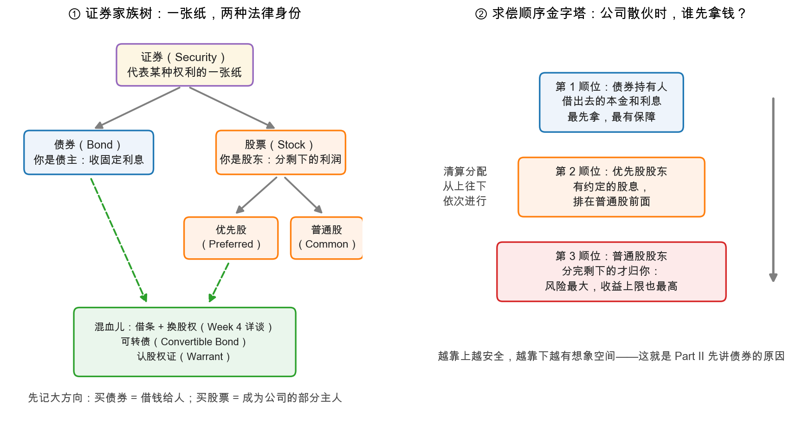

# 第 4 章：证券家族地图——股、债与它们的混血儿

> 本章你将：
> - 认识"证券（security）"这个大家族：债券、优先股、普通股，以及混血儿（可转债、认股权证）；
> - 看懂**求偿顺序金字塔**：公司散伙时，谁先拿钱、谁最后拿钱；
> - 记住 Part II 的灵魂一句：**安全不来自"债"这个字，而来自欠债人的还钱能力**；
> - 学会格雷厄姆的分类法：不问证券"叫什么"，只问它"买入后大概率会怎么表现"。

上一章结束时我们知道了分析"怎么想"；这一章解决"想的对象"——你买的到底是一张什么纸。
学完这章，Week 3、4 的债券内容就不再可怕：你已经见过它们的全家福了。

---

## 4.1 证券：一张代表权利的纸

**证券（security）**这个词，剥掉所有法律外壳，就是**一张代表某种权利的凭证**（今天多为
电子记账，纸都省了）。权利无非两大类：

- **"你欠我的"**——我是债主。我借出去的钱、约定的利息、还本的日期，白纸黑字。这是**债券（bond）**；
- **"公司有我一份"**——我是老板之一。公司赚了钱有我的份，亏了也砸在我手里。这是**股票（stock）**。

生活中的原型：借给开餐馆的朋友 10 万元、约定每年付息 5 千、三年还本——这就是一张"债券"；
如果改成入股：不还本、生意好一起分红、生意差一起扛——这就是"股票"。**一个保底不封顶，
一个不保底不封顶**，两大门派的所有恩怨情仇都从这里展开。

## 4.2 求偿顺序金字塔：公司散伙时，谁先拿钱？

看本周第二张图——左边是家族树，右边是求偿顺序金字塔：

右边的金字塔是全书后半部分（Part II、III）的地图。假设一家公司经营失败、变卖资产清算，
分钱的顺序是写死在法律里的：

| 顺位 | 谁来拿 | 拿什么 | 类比 |
|---|---|---|---|
| 第 1 顺位 | **债券持有人（bondholders）** | 本金 + 约定利息，先拿，拿不完的往下轮 | 讨回借出去的钱 |
| 第 2 顺位 | **优先股股东（preferred stockholders）** | 约定的股息与清算补偿，排在普通股前面 | "有优先分配权的小老板" |
| 第 3 顺位 | **普通股股东（common stockholders）** | 分完上面所有之后**剩下的** | 最后分剩下的合伙人 |

一句话记住金字塔：**越靠上越安全（保底强、上限低），越靠下越有想象空间（保底无、上限高）。**
这也解释了为什么原书用近乎四分之一的篇幅先讲债券——保住本金，是一切的前提。

而金字塔里还埋着一个 Week 3 的"灵魂伏笔"。格雷厄姆提醒（md 165）：债主的求偿权虽然排在
最前面，但他**从公司里拿走的钱，永远不可能超过这个公司属于"全资老板"时的价值**——公司本身
一文不值时，它发的债券同样一文不值。求偿顺序只决定**排队的位置**，不决定**有没有钱可分**。

## 4.3 格雷厄姆对传统三分法的三大反对

教科书都把证券分成"债券 / 优先股 / 普通股"三抽屉。第 5 章开篇（md 164-167），格雷厄姆
对这三个抽屉各插了一刀：

**反对一：优先股放错了抽屉。** 传统分类把优先股和普通股一起归为"股票"（因为法律上优先股
股东也算"所有者"）。格雷厄姆说：看看实际买优先股的人在图什么——**固定股息 + 本金安全**，
心态和债券持有人一模一样。"优先股股东是合伙人，只是在法律技术意义上；就投资目的和预期结果
而言，他们更像债券持有人"（md 164）。所以按"持有体验"分，优先股应该搬到债券那边去。

**反对二："债券"两个字不等于安全。** 这是第 5 章最重要的一段（md 164-165），值得整段读原文
（见本章末「回到原书」）。要点是：

- 债券整体确实比股票安全，但**不是**因为"债券"这个名头有魔力，而是因为**典型的发行人还算
  讲究、不会瞎借自己还不起的钱**；
- **安全完全取决于、也只取决于债务公司的履约能力**。一家没有资产、没有盈利能力的公司，
  它发的债券和它发的股票一样一文不值；
- 全靠"债券"二字就放心买的人，等于相信"在借条上写好还钱日期，钱就自动安全了"。

历史把这个道理讲得血淋淋。导读里的案例（md 095）：1988 年，百货集团 Federated 被杠杆收购，
此后每年要付利息 6 亿美元——而它一年总共只赚 4 亿。**借条写得再规范，也改变不了"赚的付不起
利息"这个事实**；不到两年，Federated 破产，债券价格崩塌。格雷厄姆式的评语只有一句：
"债权人也罢、普通人也罢，谁也不能从一家公司里拿走比它实际拥有的更多的钱。（顺带说：这也
违背常识。）"

> ⚠️ **易踩坑：** "保本理财""刚性兑付"式的安全感，就是 1930 年代"债券等于安全"的当代翻版。
> 近几年 A 股市场也出现了高评级、甚至 AAA 级国企债券的公开违约（2020 年前后，泛指，
> 不点名）——"国企""高评级""以前都没事"都不是履约能力本身。Week 3 的第一课就是这句话。

**反对三：名字会骗人。** 第三刀砍向"三抽屉"本身：现实中大量证券根本不按标准形态出牌
（md 165-166）。先看三张"标准像"（md 166），它们是所有变形的参照系：

| 标准形态 | 权利要点 |
|---|---|
| 标准债券 | 按固定日期付**固定利息**；到期还**固定本金**；除此之外不再分享利润，也不管经营 |
| 标准优先股 | 有**约定的股息率**，排在普通股前面领；公司清算时按约定金额先于普通股受偿；通常没有（或只有受限的）投票权 |
| 标准普通股 | 还清债务、付完优先股之后，**剩下的资产和利润都按比例归它**；按比例投票选董事会 |

然后是变形清单（md 166）：**收益债券**（income bond，赚到钱才付息——名不副实的典型，Week 4
专门拆）、**可转换债券**（convertible bond，借条 + 换股权）、**附带认股权证的债券/优先股**
（warrant，附带"未来按约定价买股票的权利"）、**参与优先股**（participating preferred，既拿
固定股息又额外分红）、**无投票权普通股**……极端案例如大北方铁路的"优先股"，多年以来其实就是
一只不折不扣的普通股（md 167）。格雷厄姆不无讽刺地记了一笔（md 167）：1929 年，仅美国电力
公司（American and Foreign Power）一家发行的认股权证，市值就超过 10 亿美元——比 1914 年
整个美国的国债还多。金融工程的想象力，1930 年代就已经很狂野了。

## 4.4 格雷厄姆自己的分类法：别问"叫什么"，问"会怎么表现"

拆完三个抽屉，格雷厄姆给出自己的分类标准（md 167-169）：**按买入之后这只证券的正常表现、
也就是持有人面对的"风险与利润特征"来分**，一共三类：

| 格雷厄姆的分类 | 大白话 | 典型代表 |
|---|---|---|
| I. 固定价值型（fixed-value type） | 我要的就是**稳稳的利息**，价格波动不重要 | 高等级（投资级）债券、高等级优先股 |
| II. 价值可变的高级证券 | 形式上"排前面"，但价格会大动 | A：保护充分、附带利润机会（典型：优质可转债）；B：保护不足（低等级债券/优先股） |
| III. 普通股型 | 风险与收益都**不封顶**，本质是企业所有权 | 普通股——以及一切"行为像普通股的东西" |

这个分类的妙处在第 III 类：**凡是行为像普通股的，无论名字叫什么，都按普通股分析。**
两个原书实例（md 169-170）：

- AT&T 的可转换债券，1929 年卖到 200 美元以上时——买它的人实际上买的就是普通股：债券和股票
  会在同一大段价格区间里同涨同跌，"债券"的名头保护不了他分毫；
- 反过来，一只跌到**一折**的优先股（面值 100 美元、市价 10 美元），也已经不是优先股了：
  它的"优先受偿"早已形同虚设，而向上空间反而全部打开——**行为上它就是一只普通股**。

第 5 章的收束句（md 171）值得抄下来：**分类的依据不是证券的名字，而是它的条款与处境对持有人
的实际意义——重点不是你在法律上有权主张什么，而是你很可能实际得到什么。**

> 📌 **划重点：** 名字是给发行方包装用的，条款和价格才是给你用的。拿到任何一只"花哨"证券，
> 第一步永远是翻译：它到底是借条、合伙凭证，还是两者的混血。

## 4.5 落到 A股 / 港股：家族成员都在哪

| 家族成员 | A 股 | 港股 |
|---|---|---|
| 普通股 | 主力品种：沪深主板、创业板、科创板（涨跌幅、交易规则略有差异） | 主力品种：港元/人民币柜台都有，交易规则与 A 股差异大（无涨跌停、T+0） |
| 债券 | 国债、地方债、公司信用债——个人直接参与少，多通过债基（Week 3 详谈） | 美元/港元债为主，个人参与更少 |
| 优先股 | 相对小众，主要见于银行等大型机构发行的优先股（固定股息） | 同样小众 |
| 可转债 | **非常活跃的个人投资品种**：A 股可转债有独特的下修、强赎、回售条款——Week 4 整章讲 | 零星存在 |
| 认股权证及更花哨的衍生品 | 主要是场外/机构市场 | 备兑权证（涡轮）、牛熊证很流行——它们是衍生工具，**不在本书与本课范围内**，先知道即可 |

一句话总结：**十周课程的主战场是普通股（Week 5-10）+ 债券思维（Week 3-4）+ 可转债（Week 4）**；
其余家族成员，认个脸即可。

---

## ✍️ 想一想

> 建议**先自己写两句话再看答案**。想不清楚的地方，就是下一遍该重读的地方。

### 问 1：借给餐馆 10 万 vs 入股餐馆

用 4.1 的"两大门派"框架描述：你如果把 10 万元借给朋友的餐馆（约定年付息、三年还本），
和入股餐馆（不还本、按份分红），各承担了什么风险、各图什么收益？

**解题思路：** 按 4.1 的两句话各填一张表——"你欠我的"和"公司有我一份"。关键是把**风险**和**收益**分开写，并且指出两者的**不对称结构**。

**参考答案：**
| | 借出去（债券门派） | 入股（股票门派） |
|---|---|---|
| 你的身份 | 债主 | 老板之一 |
| 约定收益 | 固定利息，三年还本——**上限锁死** | 按份分红——**上不封顶** |
| 主要风险 | 餐馆倒闭或赖账，本金收不回来（**信用风险**）；三年里通胀高于利率（**购买力风险**） | 生意差就不分红、本金没有还本日（**没有保底**）；生意好也可能被大股东占便宜 |
| 求偿位置 | 先拿——清算时排在老板前面 | 后拿——分完所有人才轮到 |
| 你图什么 | **确定的现金流**：可预算的利息 | **企业的成长**：利润增长带来的分红与份额升值 |
| 一句话 | 保底不封顶的反面：**保底、但封顶** | **不保底、但不封顶** |

这张表就是全课的骨架：后面 Week 3-4 讲的债券、优先股、可转债，全都是这两行字的不同配比。

**易错点：** ① 只写风险不写收益（或反之）——两大门派的区别恰恰在"风险与收益的**组合方式**"；② 以为"借给朋友"更安全——信用风险没有因为关系近而消失，熟人违约的追偿反而更尴尬；③ 忽略"求偿顺序"这一列——它是 Week 3"本金安全"和 Week 8"清算价值"的伏笔。

### 问 2：年利润 3 亿、要付 4 亿利息的债券

4.3 反对二的逻辑链是："安全取决于履约能力，而不是证券形式"。一家年利润 3 亿的公司发行
每年利息 4 亿的债券，"债券"两个字能提供什么保护？求偿顺序金字塔在这个例子里还管用吗？

**解题思路：** 把"债券"这个词从句子里拿掉，再读一遍这个生意：**它赚的钱够不够付利息？** 然后单独检验金字塔——金字塔回答的是"排队顺序"，你要问的是"锅里有没有饭"。

**参考答案：**
**"债券"两个字提供的保护：零。** 名称不是现金流，合同不是履约能力。这家公司每年赚 3 亿、却要付 4 亿利息——**利息保障倍数小于 1**，缺口 1 亿必须靠动老本、借新还旧或变卖资产来填。这样的偿付能力不可能长期维持，违约只是时间问题。这正是格雷厄姆的原话："谁也不能从一家公司里拿走比它实际拥有的更多的钱。"

**求偿顺序金字塔在这里：位置照旧有效，但意义被抽空了。** 债券持有人依然排在优先股和普通股前面，可前提是**锅里有饭可分**。金字塔只决定**排队的位置**，不决定**有没有东西可分**——一家付不起利息的公司，清算时资产往往先被抵押债权人锁走，残余价值远不够覆盖全部债务，"排第一"也拿不回本金。

**易错点：** ① 用"它是债券／有评级／是国企"替代对履约能力的检验——这正是 Federated（年付息 6 亿、年赚 4 亿）破产的原因，也是 A 股高评级债券违约的教训；② 以为"求偿顺序第一"等于"安全"——顺序是相对优势，不是绝对保障；③ 只看利润总额不看**利息保障倍数**——本周还不要求你会算，但要知道该看的是"赚的钱相对利息的余量"。

### 问 3：找一只可转债，指出哪部分是债、哪部分藏着股

找一只你熟悉或听过的可转债（A 股很多），说出它名字里哪部分是"债"、哪部分藏着"股"——
这就够 Week 4 入学了。

**解题思路：** 把"可转债"三个字拆开：**"债"**回答"如果股价一直不涨，我拿什么"，**"可转"**回答"如果股价涨了，我能分享什么"。找一个真实名字（比如"某某转债"）逐项对照它的募集说明书摘要即可。

**参考答案（以任一只 A 股可转债为例的通用拆解）：**
| 组成部分 | 具体条款 | 属性 |
|---|---|---|
| **债的部分** | 面值 100 元、票面利率（通常前低后高，加总往往只有个位数百分比）、到期赎回价（常含少量补偿） | **债券门派**：保底是"到期能拿回本金加一点利息"，前提是**公司不违约** |
| **股的部分（藏在"可转"里）** | 转股价、转股期——股价高于转股价时，把债券换成股票就能分享上涨 | **股票门派**：上不封顶的想象空间 |
| **给股性加杠杆的条款** | 下修条款（股价太低时下调转股价）、强赎条款（股价太高时逼你转股或卖出）、回售条款（股价长期低迷时你可要求公司买回） | A 股转债独有的"制度设计"，Week 4 整章讲 |

所以严格说它是"**一张利率很低的借条 + 一份看涨期权 + 几条规定双方动作的条款**"。它之所以能"进可攻退可守"，靠的正是**债底保护**与**转股权利**这两条腿。

**易错点：** ① 以为"可转债保本"——债底也要看发行人的履约能力（问 2 的教训），而且**买入价高于 100 元越多，保底越薄**；② 只看转股权利、不看强赎条款——很多人的亏损来自"被强制赎回落袋为安之前的高价追入"；③ 把可转债当纯股票炒——它的定价里同时有债性、股性和条款博弈三层，Week 4 会逐层拆开。

## 📖 回到原书

**第 5 章《证券的分类》（Chapter 5: Classification of Securities），md 页码 page_165（原书第 113 页）**

> "But it is not the obligation that creates the safety, nor is it the legal remedies of
> the bondholder in the event of default. Safety depends upon and is measured entirely by
> the ability of the debtor corporation to meet its obligations."

> **译文：** "但是，创造安全的并不是'债务义务'本身，也不是违约时债券持有人可用的法律补救。
> 安全完全取决于、也只能用债务公司履行其义务的**能力**来衡量。"

**一句话点评：** Part II 的灵魂、Week 3 的第一课。把"债"字换成"保本理财""国企信仰"，
这句话在今天的 A 股依然一字不用改。

---
**第 5 章，md 页码 page_171（原书第 119 页）**

> "Its basis is not the title of the issue, but the practical significance of its specific
> terms and status to the owner. Nor is the primary emphasis placed upon what the owner is
> legally entitled to demand, but upon what he is likely to get."

> **译文：** "分类的依据不是这只证券的名称，而是它的具体条款与处境对持有人的实际意义。
> 重点也不是持有人在法律上有权主张什么，而是他很可能实际得到什么。"

**一句话点评：** 一句顶一万句的"去名字化"心法——证券如此，基金产品名、理财说明书亦然。

---
认识了证券家族，还差最后一块拼图：**上哪儿查它们的底细**。下一章把格雷厄姆的信息来源清单
搬进 2020 年代的 A股/港股。
