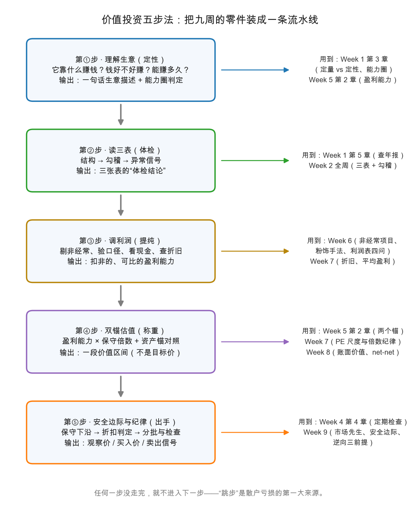

# 第 1 章：分析流程总装——五步法

> 本章你将：
> - 把九周的零件装上一条流水线：**① 理解生意 → ② 读三表 → ③ 调利润 → ④ 双锚估值 → ⑤ 安全边际与纪律**；
> - 每一步都拿到三样东西：要回答的问题、要用的工具（哪一周教的）、要产出的"成品"；
> - 认识四种最常见的"走法错误"：跳步、倒装、停在中途、把最后一步当装饰；
> - 记住一句反直觉的话：**"不买"也是结论**——而且是最常见的结论。

---

## 1.1 为什么要"总装"

上一章 Russo 在全球兜了一圈，用的自始至终是同一把尺子。你可能会想：这把尺子我也有零件了——九周下来，桌子上摆满了货：

| 周 | 你攒下的零件 |
|---|---|
| Week 1 | 投资三零件（深入分析/本金安全/满意回报）、内在价值是区间、能力圈、查年报的入口 |
| Week 2 | 三张表的读法、勾稽关系、复利与贴现 |
| Week 3-4 | 本金安全的第一课：保障倍数、"条款写在能力里"、定期检查持仓 |
| Week 5 | 盈利能力（earning power）、两个估值锚的骨架、私营企业试金石 |
| Week 6 | 利润表的逐行阅读法、非经常项目、粉饰手法、利润表四问 |
| Week 7 | 折旧与摊销、多年平均盈利、市盈率的正确用法、倍数纪律 |
| Week 8 | 账面价值、流动资产价值（net-net）、清算价值、破净股 |
| Week 9 | 市场先生、安全边际、逆向三前提、机械纪律 |

零件齐全，但桌子上的零件装不进任何一扇车门。缺的是**装配顺序**：先装什么、后装什么、每一步检查什么、什么算"检查通过"。原书第 1 章开篇给分析下过一个定义（md 113）：分析是对可获得的事实的仔细研究，并依据确立的原则和健全的逻辑从中得出结论——注意，"仔细""原则""逻辑"都是**纪律词**，不是灵感词。五步法就是把这三个词翻译成可以逐条检查的动作。

先看整机图，再拆开讲每一步：

> 📌 **划重点：** 五步法的本质，是把"深入分析"从一种态度变成一套动作。态度人人会说，动作才能检查——检查不了的努力，等于没发生。

---

## 1.2 第①步：理解生意（定性）

**要回答的问题只有三个：**

1. 它靠什么赚钱？（什么产品、卖给谁、通过什么渠道）
2. 钱好不好赚？（毛利率、净资产收益率这些常年水位高不高、稳不稳）
3. 能赚多久？（壁垒是什么、周期在哪里、什么东西能替代它）

**动作：** 用下面这个模板写出**一句话生意描述**，写不出来就说明还没理解：

> 它靠____赚钱；因为____，它的利润这些年稳定在____；只要____不发生，它会继续这么赚下去。

**产出：** 一句话生意描述 + 能力圈判定。三个空都填得实、且每个空都能指出证据来源 → 圈内；有一个空含糊 → 圈外。**"看不懂"不是失败，是流程给你的第一个正确结论。**

**用的是：** Week 1 第 3 章（定量 vs 定性：格雷厄姆更信定量，但第①步是给定量打地基）、Week 5 第 2 章（盈利能力的定义里那句"假设当前经营延续"——延续的是什么，就是这一步要写清的东西）。

> ⚠️ **易踩坑：** 第①步最容易写成的，是"增长故事"——"新能源/出海/AI 概念，未来空间巨大"。模板里的空要填**现在**：现在靠什么、现在赚多少、什么正在保护它。未来的部分属于第④步的倍数，而且只能占很小的一点便宜（Week 5 第 1 章讲过为增长付高价的危险）。

## 1.3 第②步：读三表（体检）

**要回答的问题：** 这家公司的报表干净吗？利润是真的吗？家底有没有暗雷？

**动作（建议顺序）：** 利润表（赚了多少）→ 现金流量表（是不是真钱）→ 资产负债表（家底与杠杆），最后做一遍勾稽自查（净利润与未分配利润、现金流与利润的差值能不能解释）。红旗速查：应收增速持续高于收入、存货异常膨胀、经营现金流常年低于净利润、有息负债高而利息保障薄、商誉占净资产比例畸高。

**产出：** 一句体检结论——"干净"、"有疑点（列出来）"或"不及格（放弃）"。

**用的是：** Week 2 全周（三表 + 勾稽）+ Week 1 第 5 章（年报去哪找、先读哪几节）。

## 1.4 第③步：调利润（提纯）

**要回答的问题：** 剔掉一次性成分、校准口径之后，这家公司**平均每年**真正能赚多少？

**动作：** 先过利润表四问（成色/口径/现金/可信，Week 6 第 4 章），再补两件 Week 7 的事：折旧计提足不足额（重资产公司必查）、用 5-10 年平均抹平周期。

**产出：** 一个数字——**盈利能力**：扣非的、可比的、多年平均的归母净利润。这是第④步唯一的原料，原料不纯，后面全歪。

**用的是：** Week 6（非经常项目、粉饰手法、四问）+ Week 7（折旧、平均盈利）。

> 💡 **你可能会问：为什么第②步和第③步分开？报表不是一起读的吗？**
>
> 分开是为了让"找事实"和"做加工"互相独立。第②步只记录、不加工（防止边看边脑补）；第③步只加工第②步记下的事实。就像体检和会诊分开：抽血的人不该同时开药。

## 1.5 第④步：双锚估值（称重）

**要回答的问题：** 这台赚钱机器 + 这份家底，合在一起值多少？

**动作：** 两个锚都算，不许偷懒只算一个：

$$\text{盈利能力锚} = \text{盈利能力} \times \text{保守倍数}$$

$$\text{资产价值锚} = \text{账面价值} \to \text{流动资产价值（net-net）} \to \text{清算价值（越算越严）}$$

**产出：** 一段**价值区间**（两个锚合成），外加一列"这个区间依赖哪些判断"的清单。锚 1 与锚 2 分歧很大时，先回头怀疑利润（Week 5 第 2 章）；倍数上限挂在**平均盈利**上，校准参数要写理由，纪律本身不漂移（Week 7 第 4 章）。

**用的是：** Week 5 第 2 章（两个锚）、Week 7（盈利能力、市盈率尺度）、Week 8（账面价值、net-net、清算）。

## 1.6 第⑤步：安全边际与纪律（出手）

**要回答的问题：** 现在的价格，配不配让我出手？出手之后我拿什么管住自己？

**动作：** 三连：

1. 定**保守下沿**：取区间下沿（悲观档）；
2. 定**买入判定线**：价格低到"保守下沿再打一个折扣"（折扣给多少是纪律，Week 9 第 3 章）；
3. 写**三个价**：观察价（开始跟踪研究）、买入判定价（到了才谈分批）、卖出信号（什么情况算"买入理由消失"——Week 4 第 4 章）。同时过一遍逆向三前提：资金久期、清单纪律、心理承受（Week 9 第 4 章）。

**产出：** 三个写下来的价格 + 一份可勾选的清单（下一章交货）。

**用的是：** Week 4 第 4 章（定期检查）+ Week 9（市场先生、安全边际、三前提）。

---

## 1.7 四种典型的"走法错误"

流程的价值在于执行。四种最常见的走法，每一种都见过太多人摔跤：

| 错误 | 长什么样 | 对症的解法 |
|---|---|---|
| **跳步** | 打开行情软件直奔第④步："才 15 倍 PE，便宜！"——盈利从哪来、扣没扣非、资产有没有雷，一概没看 | 强制自己先写第①步的一句话；写不出，后面全部停手 |
| **倒装** | 先有"我想买"的结论，再回头找利好证据——研究变成了装修，把结论装进预算 | 检查作业顺序：结论页只允许引用第①至④步的产出；引用不了的论据不许出现在结论里 |
| **停在中途** | 永远在研究，从不敢走到第⑤步——"再看看""等下个季报"。分析成了拖延的体面形式 | 给每次分析定截止日：两周内必须产出三选一的结论（买/不买/看不懂） |
| **把第⑤步当装饰** | 估值算完直接梭哈；"安全边际"停留在转发语里 | 无清单不交易：买入价、仓位、卖出信号不写下来，就不允许下单 |

## 1.8 "不买"也是结论

五步走完，结论其实只有三种：**买（分批）、不买、看不懂**。没有第四种叫"很想买但差点意思"——那是不买，只是嘴软。

对绝大多数公司，诚实的结论是"不买"。这不是失败：Week 1 第 3 章说过，分析只在"低价、特殊情况、相对比较"三类场景下有武之地；五步法的日常产出就是大量高质量的"不买"，它们替你省下的每一笔亏损，都计入复利（Week 2 第 5 章）。下一章你会看到一个完整的示范——包括它那个"不买"的结论。

> 📌 **划重点：** 记住装配顺序：定性打地基 → 报表找事实 → 利润做提纯 → 双锚出区间 → 折扣定动作。任何一步没走完，就不进入下一步——跳步的便宜不是便宜，是没贴标签的风险。

---

## ✍️ 想一想

1. 拿你最近关注过的一只股票自测：五步里你实际走到过第几步？停在哪一步？停下的原因属于 1.7 节四种"走法错误"里的哪一种（或者是一种新的，请给它起个名字）？
2. 用 1.2 节的模板给贵州茅台填空（提示：Week 6 第 4 章的利润表、Week 5 第 4 章的股东回报都分析过它）。四个空里哪一空最难填？难填的那一空，正好就是你下一步要补的功课——它是哪一类（定性 / 报表 / 口径 / 估值）？
3. "倒装"为什么在牛市里特别流行？（提示：Week 9 第 1 章的市场先生情绪 + Week 5 第 1 章的新时代理论——当所有人都在为同一个故事付钱时，"找证据"的活儿会被什么替代？）

## 📖 回到原书

**原书位置：** 第 1 章 The Scope and Limitations of Security Analysis，md 113（原书第 61 页），全书第一页。

> ANALYSIS CONNOTES the careful study of available facts with the attempt to draw conclusions therefrom based on established principles and sound logic. It is part of the scientific method.
>
> 分析，意味着对可获得的事实进行仔细研究，并依据确立的原则与健全的逻辑从中得出结论。它是科学方法的一部分。

**一句话点评：** 五步法不是格雷厄姆的原话清单，但它是这两句话的施工图——"仔细研究"是第②③步，"确立的原则"是两个估值锚与安全边际，"健全的逻辑"就是那条不许跳步的装配顺序。

---

**下一章：** [第 2 章：示范分析——从读财报到估出价值区间](./02-示范分析-从读财报到估出价值区间.md)。流水线装好了，下一章开进第一辆车：福耀玻璃，五步走完，看看这台机器吐出一份什么样的判定。
