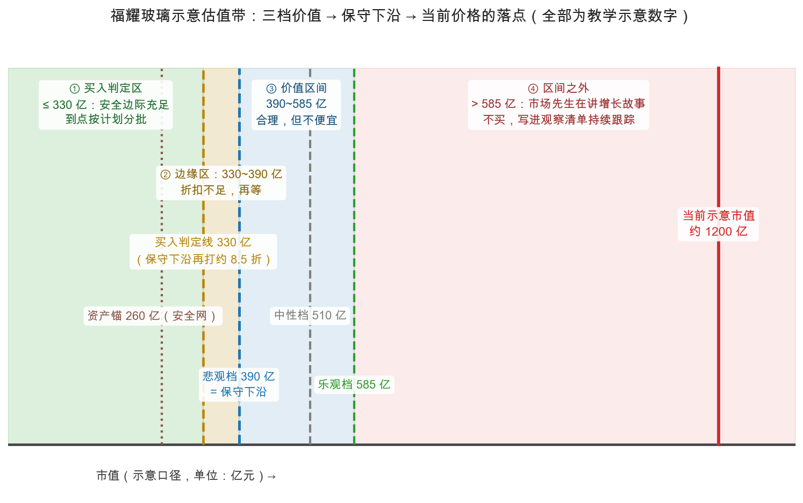

# 第 2 章：示范分析——从读财报到估出价值区间

> 本章你将：
> - 看着五步法被从头到尾走一遍——对象是福耀玻璃（600660.SH / 3606.HK）；
> - 每一步都拿到"成品"：一句话生意描述、三表体检结论、扣非后的盈利能力、一段价值区间、一个明确的判定；
> - 亲眼看一次"分析得出不买"是什么样子——结论不是目标价，是"当前价格落在判定带的哪里"；
> - 走一遍反向思考：**如果我错了，会错在哪**——整套流程里最防自大的一节。

> ⚠️ **开工声明（重要）：** 本章全部数字为**教学用示意数字/约数**——量级刻意贴近福耀玻璃近年公开报表的大致规模，并做了大幅取整，**不是任何真实年报或行情软件的精确数据**，更不构成对这家公司的判断或任何投资建议。目的只有一个：让你把五步法的每个动作亲眼走一遍。想看真实数字，按 Week 1 第 5 章的方法去巨潮资讯网（A 股）与披露易（H 股）下载年报，把本章的表格重填一遍——那就是你自己的第一份完整分析。

---

## 2.1 为什么选福耀玻璃

三个理由。第一，它是本课程案例池的老熟人：Week 6 第 4 章讲非经常项目时就预告过它的两个"真实场景"——汇兑损益与资产处置；第二，它是典型的**制造业**公司：重资产、有折旧、有周期，正好把 Week 7（折旧与平均盈利）和 Week 8（资产锚）的工具全部用上；第三，它 A+H 两地上市，接住上一章 Russo 的全球主题——同一家公司，两个市场，两把刻度。

先说清楚：福耀是一家公认的优秀制造企业。但"优秀"和"便宜"是两个问题——**这一章分析的正是这两个问题的差别**。

## 2.2 第①步：理解生意

**一句话生意描述：** 福耀为全球汽车厂生产汽车玻璃（前挡、侧窗、天窗/全景天幕），是一家典型的制造业公司——单品主导、客户是整车厂、靠规模效应和多年认证关系筑起壁垒。

三个问题逐个答：

| 问题 | 回答（定性判断，均为约数/公开常识口径） |
|---|---|
| 靠什么赚钱？ | 汽车玻璃，客户是全球整车厂与售后维修市场。汽车越高级玻璃越多：全景天幕、镀膜、HUD 抬头显示都在往玻璃上叠加，单车玻璃价值量在涨 |
| 钱好不好赚？ | 毛利率长期在 35% 上下（公开行情常识口径，约数）——在"给大厂打工"的零部件行业里，这是明显偏高的水位，说明规模和客户绑定真的在起作用 |
| 能赚多久？ | 车要玻璃、玻璃会碎（售后需求稳定）；进入整车厂供应链要多年认证、换供应商成本高（行业常识，约数）。主要风险：整车厂年年压价（"年降"）、汽车行业周期、海外工厂遭遇贸易摩擦 |

**能力圈判定：** 三个问题都答得出、且知道每个答案的证据去哪查 → **勉强圈内**。诚实的边界：我不了解它海外工厂的经营细节——这一条不在第①步硬补，留给第⑤步用保守假设补偿。

**产出 ✓：** 一句话生意描述（照抄上面那句），四问模板的第四空（"只要____不发生"）填：只要汽车还在大量生产、且年降压力不失控。

## 2.3 第②步：读三表（示意简化数字）

再看一眼声明：**下表全部为示意数字**，只保证行次结构和勾稽关系符合 A 股报表骨架。

**利润表（合并口径，简化示意，单位：亿元）**

| 行次 | 项目 | 示意金额 | 一句话读法（安检问题 → 观察结论） |
|---|---|---|---|
| ① | 营业总收入 | 350 | 单一产品线占绝对大头——生意简单是优点 |
| ② | 营业成本 | 227 | 毛利 123，**毛利率约 35%**：制造业优等生水位 |
| ③ | 税金及附加 | 3 | 约 1%，正常 |
| ④ | 销售费用 | 18 | 约 5%：B 端生意不烧流量广告 |
| ⑤ | 管理费用 | 28 | 约 8%，多年稳定 |
| ⑥ | 研发费用 | 14 | 约 4%：镀膜、HUD、轻量化玻璃都在这里 |
| ⑦ | 财务费用 | 约 0 | 示意简化为 0。真实现金多、有利息收入，海外扩张也有利息支出与**汇兑损益**——两者大致相抵（见 2.4 的汇兑说明） |
| ⑧ | 其他收益 | 4 | 政府补助为主——**第③步侦查对象** |
| ⑨ | 投资收益 | 2 | 闲置资金理财——**侦查对象** |
| ⑩ | 营业利润 | 66 | 主业答卷：营业利润率约 19% |
| ⑪ | 营业外收支 | 6 | 含处置一家非核心子公司股权的**一次性收益**——**侦查对象** |
| ⑫ | 利润总额 | 72 | |
| ⑬ | 所得税费用 | 11 | 有效税率约 15%（示意；制造业高新技术企业优惠的常见水位） |
| ⑭ | 净利润 | 61 | 净利率约 17% |
| ⑮ | 归母净利润 | 59 | 少数股东拿走约 2 |

勾稽自查（Week 2 第 4 章的老习惯）：350 - 227 - 3 - 18 - 28 - 14 - 0 + 4 + 2 + 6 = 72；72 - 11 = 61；59 + 2 = 61。对得上。

**资产负债表要点（示意，单位：亿元）**

| 项目 | 示意金额 | 读法 |
|---|---|---|
| 货币资金 | 130 | 家底里的活钱 |
| 应收账款及票据 | 65 | 占收入约 19%：整车厂账期长是行业属性，看趋势即可 |
| 存货 | 45 | 与收入规模匹配（示意） |
| 固定资产 | 280 | **大头**：厂房 + 海外工厂——重资产本色，折旧是利润表里最大的一笔非现金费用（Week 7 第 0 章） |
| 总资产 | 560 | |
| 有息负债 | 120 | 对照货币资金 130：净现金接近零（示意口径下），不紧绷也不宽裕 |
| 总负债 | 300 | 资产负债率约 54% |
| 归母净资产 | 260 | 总股本约 26 亿股 → **每股净资产约 10 元**（第④步资产锚的原料） |

**现金流量表要点（示意，单位：亿元）**

| 项目 | 示意金额 | 读法 |
|---|---|---|
| 经营现金流净额 | 85 | 净利润 61 + 折旧摊销约 30 - 营运资本占用约 6，合计约 85 |
| 投资活动净流出 | 45 | 主要是资本开支：还在扩产（海外工厂） |
| 筹资活动净额 | -20 | 分红 + 偿债 |

**体检结论 ✓：** 经营现金流 / 净利润 = 85 / 61 $\approx$ **1.4**——大于 1，利润是真金白银（Week 2 第 3 章的好生意长相；重资产公司折旧加回是主因）。应收、存货与收入同步（示意序列如此），无红旗。唯一的体检备注：**重资产、高折旧**——把它交给第③步处理。

## 2.4 第③步：调利润

利润表四问（Week 6 第 4 章）逐个过：

| 四问 | 检查过程 | 结论 |
|---|---|---|
| **一 成色** | 净利润 59 亿里的非经常/非主营成分：处置收益 6（明年不再）→ 剔；投资收益 2（非主营）→ 剔；政府补助 4 → 谨慎剔除看主业 | 扣非归母 = 59 - 6 - 2 = **51 亿**；若补助也剔，约 47~51 亿 |
| **二 口径** | 折旧政策与同行比（Week 7 第 0 章：重资产公司折旧年限忽长忽短就是警报）；示意口径下假设与同行一致 | 通过（真实分析时这里要翻附注） |
| **三 现金** | 经营现金流 85 > 净利润 61 | 通过 |
| **四 可信** | 审计意见正常（示意）；无"收益走正门、损失走后门"的痕迹 | 通过（真实分析时翻附注验证） |

**汇兑说明（福耀的特检项目）：** 它海外收入占比约一半（约数），人民币汇率波动会在报表里砸出汇兑损益的坑洼——Week 6 第 4 章讲过这是它利润表的两个经典"非经常场景"之一。正确处理不是找出某一年的数字，而是**用多年平均把它平掉**——这正是下面用五年平均的原因之一。

**盈利能力（5 年扣非归母，示意序列，单位：亿元）：29、33、38、45、51。**

$$\text{盈利能力} = \frac{29 + 33 + 38 + 45 + 51}{5} = \frac{196}{5} \approx 39 \text{ 亿/年}$$

10 年平均更低一些（早年规模小，示意约 35 亿）。主口径取 39 亿；你想更保守，取 35 亿也完全成立——区间会整体下移约一成（本章末尾的"想一想"第 1 题让你亲手试）。

**产出 ✓：** 盈利能力 $\approx$ **39 亿/年**（归母、扣非、5 年平均）。

## 2.5 第④步：双锚估值

**锚 1：盈利能力锚。**

$$\text{盈利能力锚} = \text{盈利能力} \times \text{保守倍数}$$

倍数从哪来？用 Week 7 第 2、4 章的纪律：10 倍对应盈利收益率 10%，15 倍对应约 6.7%；对照示意无风险利率约 2%（当代长期利率的大致水位，约数），风险补偿还有约 5~8 个百分点；制造业有周期性，倍数**封顶 15**——比格雷厄姆 1940 年的 20 倍上限更紧。这是参数校准（利率环境变了），纪律没漂移（上限依然挂在**平均盈利**上）。

| 档位 | 算式 | 市值 | 每股（26 亿股） |
|---|---|---|---|
| 悲观档 | 39 $\times$ 10 | **390 亿** | 约 15 元 |
| 中性档 | 39 $\times$ 13 | **约 510 亿** | 约 20 元 |
| 乐观档 | 39 $\times$ 15 | **约 585 亿** | 约 22.5 元 |

**锚 2：资产价值锚。**

- 账面价值：260 亿（每股约 10 元）。但先挤水分（Week 8 第 0 章）：资产大头是 280 亿固定资产——专用厂房和产线，按 Week 8 清算折扣表属于"骨折"变现的类别，所以账面打底的意义有限；
- 更严的 net-net 检查（Week 8 第 1 章）：流动资产 240 - 全部负债 300 = **-60 亿**。负数——**最保守口径不适用**。这把尺子量"高现金 + 破净"的公司才有劲，量正常经营的制造业常常失灵，这本身就是个有用的知识。

**两个锚怎么合成区间？** Week 5 第 2 章的例子里，资产锚（100 亿）只比锚 1 悲观档（120 亿）低一点，直接并入区间下沿；本例资产锚（260 亿）比锚 1 悲观档（390 亿）低得多，它的角色就从"区间下沿"退为**安全网**——主区间由锚 1 负责。判断标准（Week 5 的原话精神）：**盈利能力证据越干净，区间越听锚 1 的；盈利证据越可疑，估值重心越滑向锚 2。**福耀第③步四问全过，所以主区间听锚 1 的。但记住：哪天利润证据坏了（比如现金一问不过关），整个区间就要向 260 亿的方向重新谈。

**产出 ✓：** 价值区间 $\approx$ **390~585 亿**（每股约 15~22.5 元）；资产锚 260 亿是安全网。

## 2.6 第⑤步：安全边际与判定

- **保守下沿** = 悲观档 390 亿；
- **买入判定线** = 保守下沿再打约 8.5 折，即 **330 亿**（每股约 13 元）——为什么还要打折？因为 390 亿本身已经是估计值（Week 9 第 3 章：安全边际为估错值预留缓冲）；
- **当前示意市值约 1200 亿**（每股约 46 元）。落点在哪？看图：

换算成市盈率再验证一遍（Week 7 第 4 章的三口径习惯）：

| 口径 | 分母（示意） | 市盈率（市值 1200 亿） |
|---|---|---|
| 静态（归母 59 亿） | 59 亿 | 约 20 倍 |
| 扣非（51 亿） | 51 亿 | 约 23.5 倍 |
| 盈利能力（39 亿） | 39 亿 | 约 31 倍 |

两个口径指向同一个判定：**当前价格落在价值区间之外**——市盈率在静态口径下贴着 Week 7 说的"格雷厄姆红线"（20 倍），在平均盈利口径下远超。结论是流程自动给的，不是情绪给的：

> **判定：不买。** 三个价写下来——观察价：现在起持续跟踪（季报、年降幅度、海外工厂进展）；买入判定价：市值不超过约 330 亿（每股约 13 元）；卖出信号：无（从未买入；若未来买入，"买入理由消失"才是卖出信号——Week 4 第 4 章）。

**A/H 小注：** 同一家公司的 H 股（3606.HK）多数时间更便宜。按上一章的逻辑，折价里一部分是"该有的"（港股通股息税、流动性、名义持有人体系），一部分是市场先生的报价——所以同一把尺子，两地的"当前价格"不同，判定**可能**不同。这不是流程的漏洞，是"参数随市场变"的实况。

**诚实复盘：** 五步全绿的公司不等于便宜的公司。这一章的结论是"好公司 + 贵价格 = 不买"——Week 1 那句"好公司不等于好股票"，到今天才算真正落了地。

> 📌 **划重点：** 示范分析的产出不是目标价，是**一段区间 + 一个落点 + 三个价**。你能不能赚到钱，取决于市场先生哪天把价格送进判定区，以及你到时候还认不认自己的清单。

## 2.7 如果我错了，会错在哪

流程走完了，现在做最防自大的一件事：假定结论是错的，倒推它可能错在哪。五张牌，每张配一个"预警信号"——信号出现，就回来重检；信号没出现，就别自己吓自己：

| # | 我可能错在 | 如果错了意味着 | 预警信号（出现才触发重检） |
|---|---|---|---|
| 1 | **盈利能力高估**：39 亿其实是汽车景气周期中位偏上的成绩 | 悲观档 390 亿还得下移，判定区更低 | 整车厂年降幅度明显加大；毛利率连续两年下滑 |
| 2 | **倍数定得过紧**：利率长期走低抬高了全市场的倍数水位（Week 7 第 4 章的校准话题），15 倍上限可能是"过时的保守" | 区间上限 585 亿该上移——但**校准必须写理由、定在事前**，不许因为"想买"而校准 | 这是环境信号不是公司信号：长期利率中枢发生明显、可论证的移动 |
| 3 | **增长误判**：全景天幕与单车价值量提升、海外产能爬坡，可能已经属于"当前经营延续"的一部分——真实盈利能力也许接近 50~60 亿，我把"正在发生的事"错当成了"未来的梦想" | 区间整体偏低，"不买"错怪了好价格之外的好公司 | 连续两年扣非利润显著高于 5 年均值 → 重算盈利能力（这是数据触发的自我纠错通道，不是情绪触发的追高许可证） |
| 4 | **资产有水分**：海外工厂减值、应收与存货随行业周期恶化 | 资产锚 260 亿还得打折，安全网变漏网 | 减值计提出现；应收增速持续高于收入增速 |
| 5 | **最隐蔽的一张：把"看不懂"伪装成"不便宜"**——我对海外运营、当地劳动成本与诉讼环境的理解其实有限 | "不买"的真实原因是能力圈外，而不是估值外 | 当你发现自己只关心"价格够不够低"、不想再读年报时——能力圈在报警。此时结论该改成"看不懂"，那是一个更诚实、也更安全的版本 |

注意五张牌的共同点：**每一张都有"数据触发"的重检条件。**错不可怕，错了不设防才可怕——第⑤步买的从来不是"正确"，是"错了也亏不大"。这就是安全边际（Week 9 第 3 章）在单只股票上的完整用法。

---

## ✍️ 想一想

> 建议**先自己写两句话再看答案**。想不清楚的地方，就是下一遍该重读的地方。

### 问 1：扣非涨到 62 亿，重算一遍

沿用示意数字：假设下一份年报扣非归母涨到 62 亿，且你判断经营方式没有质变。重算盈利能力（提示：5 年窗口滚动，用 33、38、45、51、62）、三档价值和买入判定价各变成多少？这演练的正是 2.7 节第 3 张牌的"数据触发重检"。

**解题思路：** 三步走——① 窗口滚动（丢掉最老的 29，纳入新的 62）；② 重算平均，得到新的盈利能力；③ 用**同一套倍数与折扣**（10 / 13 / 15，买入判定线 0.85）重算市值与每股，**不许顺手把倍数也调高**。

**参考答案：**
**第 1 步：新盈利能力**

$$\text{盈利能力} = \frac{33 + 38 + 45 + 51 + 62}{5} = \frac{229}{5} = 45.8 \text{ 亿/年}$$

（原口径 39 亿，上升约 17%。）

**第 2 步：三档价值（倍数不变：10 / 13 / 15，总股本 26 亿股）**

| 档位 | 算式 | 市值 | 每股 |
|---|---|---|---|
| 悲观档 | 45.8 $\times$ 10 | **458 亿** | 约 17.6 元 |
| 中性档 | 45.8 $\times$ 13 | **约 595 亿** | 约 22.9 元 |
| 乐观档 | 45.8 $\times$ 15 | **约 687 亿** | 约 26.4 元 |

**第 3 步：买入判定线**

- 保守下沿＝悲观档 **458 亿**；
- 买入判定线＝458 $\times$ 0.85 $\approx$ **389 亿**（每股约 15 元）。

**与原文对照：** 区间从 390~585 亿上移到 **458~687 亿**，买入判定线从约 330 亿上移到约 **389 亿**（每股约 15 元）。当前示意市值 1200 亿仍远在区间之外——**结论不变，但"不买"的价格门槛抬高了**。

**这一问真正在演练什么：** 数据触发的重检必须三个要素齐全——**新数据（62 亿）、明确定义的触发阈值（连续两年显著高于 5 年均值）、事前写下的重算规则（滚动窗口 + 倍数不变）**。三者缺一，"重检"就会变成"追高许可证"。

**易错点：** ① 只把新数据纳进来，却忘了丢掉最老的年份——那不是 5 年平均，是"挑好的五年"；② 顺手把倍数也从 15 上调到 18（"业绩好了当然给更高倍数"）——这是**双重乐观**，把 2.7 节第 3 张牌扩权成了第 2 张牌的滥用；③ 用"股价涨到 46 元"当上涨的理由——股价从来不是重检的触发条件。

### 问 2：连亏三年、现金远超市值，主区间听谁的

2.5 节说本例的资产锚只当安全网。换一家公司：连亏三年、盈利证据可疑、但账上现金和流动资产远超市值——主区间该听谁的？把 Week 8 的净-净算法写出来，并说明为什么这时"听锚 2 的"反而更安全。

**解题思路：** 2.5 节给过判断句：**盈利证据越干净，区间越听锚 1；盈利证据越可疑，估值重心越滑向锚 2。** 这一问是把那句话推到极端——盈利证据几乎为零时，重心就完全落在资产锚上。

**参考答案：**
**主区间听锚 2（资产价值锚）。** 理由：连续亏损意味着"盈利能力"这个数字或者为负、或者无法代表任何可持续水平——锚 1（盈利能力 乘 倍数）**在概念上已经失效**：负数乘正数得不出价值，用亏损前的旧盈利又等于假设"亏损只是暂时"（而这正是需要证据的假设，恰恰没有）。锚 2 不依赖任何未来预测，它回答"当下就能清点的事实值多少"。

**Week 8 的净-净算法（net-net）：**

$$\text{净-净价值} = \text{流动资产} - \text{全部负债}$$

（更严一格：再按清算折扣给流动资产打折，并把固定资产、商誉等直接算作接近零。）

**为什么此时"听锚 2 的"更安全：**

1. **它把结论从"预测"降级为"盘点"**。锚 1 需要预测未来盈利，而这家公司的盈利证据已经坏了；锚 2 只需要数清流动资产、扣净全部负债——**证据要求从"预测能力"降到"阅读财报"**；
2. **它自带安全边际结构**。买入价必须远低于净-净价值（Week 8 第 1 章的口径：越低越安全）。这意味着你买入的那一刻，价格已经包含了"就算清算、就算资产要打折"的缓冲；
3. **最坏情形下有硬底**。市场先生的报价可以给"连亏三年"的公司贴上任何悲观标签，但账上的现金与流动资产是实打实的——它构成了"下有底"的约束，这正是安全网该干的事；
4. **它把"价值陷阱"的风险显性化**。连亏三年＋破净的最大风险是"永远不修复"；用净-净口径，你不再依赖"它必须好转"这个前提——不修复也能不亏大钱。

**易错点：** ① 把"连亏"与"便宜"划等号——只看亏损不看资产，正是主观抄底的经典死法；② 低估资产质量：要剔除收不回的应收、卖不掉的存货、被质押/受限的资金，负债要算全（含表外与或有负债），也可以参考 Week 8 第 1 章的"类 net-net"变形；③ 反向错误：因为"连亏"就给一个象征性价格（比如零）——净-净算法的意义恰恰是**算出它值多少，而不是感觉它值多少**。

### 问 3：第 2 张牌与第 3 张牌的本质区别

2.7 节第 2 张牌（倍数过紧）和第 3 张牌（增长误判）都指向"我可能太保守"。两者的本质区别是什么？（提示：一个由**市场环境**触发、改的是倍数；一个由**公司数据**触发、改的是盈利能力。为什么"因为股价一直涨所以我很保守错了"不算其中任何一张牌？）

**解题思路：** 做个二维切分：**触发源**（环境还是公司）与 **修正对象**（刻度还是原料）。两张牌各占一格；而"股价上涨"既不触发环境证据，也不触发公司数据——它落在两格之外，因为它压根不是证据。

**参考答案：**
| | 第 2 张牌：倍数过紧 | 第 3 张牌：增长误判 |
|---|---|---|
| **触发源** | **市场环境**：长期利率中枢发生明显、可论证的移动（或全市场盈利收益率水位系统性变化） | **公司数据**：连续两年扣非利润显著高于 5 年均值等 |
| **修正对象** | **刻度**：倍数上限（15 倍） | **原料**：盈利能力（金额/年） |
| **纪律要求** | 校准必须**写理由、定在事前**，不许因为"想买"而校准 | 重算等于承认"我把正在发生的事错当成了未来的梦想" |
| **错在哪时的后果** | 区间上限偏低，可能错过（错过不会亏本金） | 整个区间偏低，"不买"错怪了好公司 |
| **预警信号** | 环境信号：利率中枢的可论证移动 | 公司信号：连续两年扣非显著高于 5 年均值 |

**为什么"股价一直涨所以我很保守错了"不算其中任何一张牌：** 因为 2.7 节每一张牌都配了**数据触发的预警信号**，而股价**不是数据，是报价**。说"股价涨了所以我的倍数定低了"，等式两边用的是同一个东西（价格），这是拿价格验证价格——和 Week 1 第 2 章拆掉的"主力资金在流入所以会涨"是同一种循环论证。更深一层：如果股价上涨可以被用来校准你的假设，那么**你每一次买入都会自动获得"我是对的"的证明**，安全边际就彻底失效了。

**可以自问的三句话：** ① 我改的是刻度还是原料？② 触发我修改的，是一个**在我之外、可以拿给别人看**的数据，还是屏幕上跳动的价格？③ 这条修改理由，我敢在下跌 30% 的时候照样写下来吗？——三个问题里任何一个答不上来，就不是校准，是倒装。

**易错点：** ① 把两件事混着改（既上调倍数又上调盈利能力）——那是一次做两次乐观假设，区间会往上漂得没边；② 更隐蔽的错误：**"我其实看不懂这家公司，但我把结论写成'不便宜'"**（第 5 张牌）——把能力圈问题伪装成估值问题，会让你一直等一个永远不会让你安心的价格；③ 校准不留痕：事后补写理由，从此分不清"校准"与"漂移"。

## 📖 回到原书

**原书位置：** 第 31 章 Analysis of the Income Account，md 461（原书第 409 页），Part V 开篇。

> When an investor was able to take very much the same attitude in valuing shares of stock as in valuing his own business, he was dealing with concepts familiar to his individual experience and matured judgment. Given sufficient information, he was not likely to go far astray, except perhaps in his estimate of future earning power. The interrelations of balance sheet and income statement gave him a double check on intrinsic values...
>
> 当投资者能像给自己的生意估值一样去给股票估值时，他处理的是自己经验与成熟判断都熟悉的概念。只要信息充分，他就不大容易走得太偏——除了对未来盈利能力的估计之外。而资产负债表与利润表之间的相互勾稽，给了他对内在价值的双重核验……

**一句话点评：** "双重核验"就是本章的双锚——盈利锚与资产锚互相对答案；而格雷厄姆留的那句"除了对未来盈利能力的估计之外"，恰好是 2.7 节五张牌里最贵的那几张。

---

**下一章：** [第 3 章：投资检查清单——你的防错手册](./03-投资检查清单-你的防错手册.md)。示范分析里反复出现的"四问""五问""三前提"，下一章全部装订成册，加上两条新的——做成一本可以打勾的防错手册。
