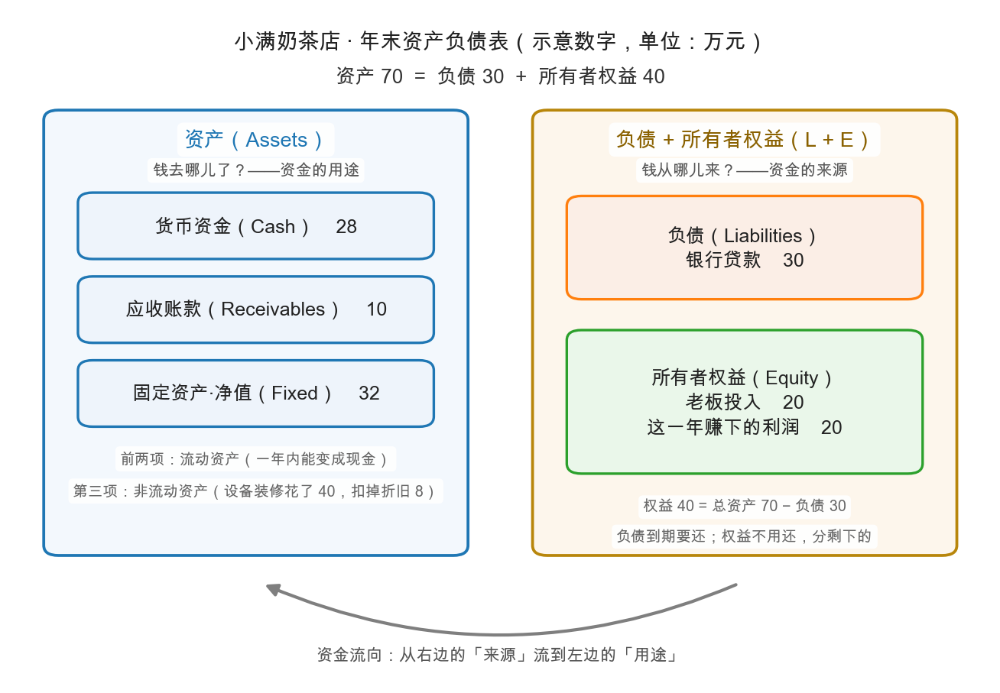

# 第 1 章：资产负债表——家底清单

> 本章你将：
> - 学会会计世界的第一条铁律：**资产 = 负债 + 所有者权益**（accounting equation），并用一家奶茶店亲手验证它；
> - 认识资产负债表上最常见的几个科目：货币资金、应收账款、固定资产、负债、所有者权益；
> - 理解"流动性排序"：为什么表里的项目要按"变成现金的快慢"排队；
> - 第一次碰到"折旧"（depreciation）：机器会旧，账要认；
> - 看懂左右结构的资产负债表：左边钱去哪儿了，右边钱从哪儿来。

---

## 1.1 上一章说好的第一张快照

上一章我们把资产负债表比作"某一天的身体底子"。这一章就给一家公司拍这张快照。主人公是本周的固定角色——**小满奶茶店**（所有数字均为教学示意数字，不对应任何真实公司）。

先看小满开店：**1 月 1 日，开业当天发生了三笔交易**。

1. 小满自己掏出 **20 万**积蓄投进店里；
2. 又向银行借来 **40 万**（3 年期，年利率 5%）；
3. 当天花 **40 万**买下设备和装修（制茶机、冰箱、门面装潢）。

现在盘点一下这个时刻的店里有什么、欠什么：

- 店里拥有的：现金 $20 + 40 - 40 = 20$ 万，设备与装修 40 万，合计 **60 万**；
- 店里欠别人的：银行 **40 万**；
- 真正属于小满的：**20 万**。

发现没有？**60 = 40 + 20**。这不是巧合，是必然。店里每一分钱都有出处：要么是借来的（负债），要么是股东自己的（权益）；每一分钱也必有去处：都变成了店里的某种资产。写成公式，就是会计恒等式：

$$\text{资产} = \text{负债} + \text{所有者权益}$$

> 📌 **划重点：** 资产负债表左边是"钱去哪儿了"（资金的用途），右边是"钱从哪儿来"（资金的来源）。两边描述的是同一堆钱，所以**永远相等**——这就是它叫"恒等式"的原因。

## 1.2 左右两张清单：看图说话

上图是小满奶茶店**年末**（12 月 31 日）的资产负债表结构。先别纠结年末数字怎么来的（第 2、4 章会拆开），先看结构：

- **左边（资产，assets）**按变现快慢从上往下排：货币资金（cash）最快，应收账款（accounts receivable，赊账还没收回来的钱）次之，固定资产（fixed assets，机器设备装修）最慢；
- **右边（负债，liabilities + 所有者权益，owners' equity）**按"离开的先后"排：负债是要还的，排在上面；所有者权益不用还、最后剩下才归股东，排在下面。

右边这个"所有者权益"值得停一下。

> 💡 **你可能会问：所有者权益为什么不干脆叫"欠老板的钱"？**
>
> 因为它和负债有本质区别。欠银行的钱有期限、有利息，到期必须还；而小满投入的 20 万没有"到期日"，公司不用还——它换来的不是一张欠条，而是**剩下的权利**：把所有欠款都还清之后，剩下的一切归老板。所以所有者权益也叫"剩余权益"。顺带一提，你买的每一股股票，本质上就是在买这种"剩余权利"的一小片。

## 1.3 年末快照与"流动性排序"

一年后的 12 月 31 日，小满的店重新盘点一遍（这些数字先照单全收，第 4 章逐笔验算）：

| 资产（12 月 31 日） | 万元 | 负债与所有者权益（12 月 31 日） | 万元 |
|---|---|---|---|
| 货币资金 | 28 | 银行贷款（还剩的） | 30 |
| 应收账款 | 10 | **负债合计** | **30** |
| 固定资产（净值） | 32 | 老板投入 | 20 |
| | | 这一年赚下的利润 | 20 |
| | | **所有者权益合计** | **40** |
| **资产合计** | **70** | **负债 + 权益** | **70** |

恒等式依旧成立：$70 = 30 + 40$。仔细看这张表，有三个新知识：

**第一，流动性排序（liquidity order）。** 左边按"变成现金的快慢"从上到下排，这叫流动性（liquidity）。排在前面的货币资金、应收账款合称**流动资产**（current assets）——一年内能变成现金的资产；排在后面的固定资产叫**非流动资产**（non-current assets）。为什么这么排？因为"短期活不活得下去"和"长期有没有家底"是两个问题：流动资产是否够还短期欠款，决定公司下个月会不会断气。右边同理：一年内要还的叫**流动负债**，一年以上才还的叫**非流动负债**。

**第二，固定资产记的是"净值"。** 设备装修当初花了 40 万，但机器会旧、装修会过时。第 1 年过去，账上把设备的价值削减了 8 万（40 万 ÷ 5 年，一年折旧 8 万），只剩净值 32 万。这个逐年削减就叫**折旧**（depreciation）——Week 7 会把它彻底讲透，本周你只需要记住一句话：**机器会旧，账要认**。

**第三，权益从 20 万变成了 40 万。** 多出来的 20 万是这一年赚下的净利润（小满没分红，全留在店里）。利润表的故事流进了资产负债表——这条"利润流入权益"的通道，就是第 4 章"勾稽关系"的主角。

> ⚠️ **易踩坑：账面数字 $\neq$ 值多少钱。** 表上"固定资产 32 万"是**记账的净值**，不是今天拿去卖能卖的价格；表上没有的品牌口碑、回头客，更是一项资产，只是会计不认。所以资产负债表叫"账面"价值（book value）——它是按规则记出来的账，不是评估师估出来的市场价。这个"账面与市价的裂缝"是 Week 8 的主题，先埋个种子。

## 1.4 怎么用：三眼扫表法

拿到一张真实的资产负债表（A股年报里叫"合并资产负债表"），零基础也能立刻做三件事：

1. **第一眼看右边**：负债合计多少？其中"短期借款""一年内到期的非流动负债"多少？——欠得多不多、急不急；
2. **第二眼看左边最上面**：货币资金多少？跟短期欠款比一比——手里现金够不够还急债；
3. **第三眼看权益**：权益里"未分配利润"（retained earnings，历年攒下的利润）是正数还是负数？多年累计是负数，说明这家公司历史上把股东的钱亏掉了。

> 📌 **实战联系：** 用这三眼去扫 A股 的贵州茅台和港股的腾讯，你会看到两种截然不同的家底长相（以下为方向性描述，具体数字请以最新年报为准）：茅台常年货币资金充裕、几乎没有有息负债、应收账款少到可以忽略——卖酒先收钱，家底越攒越厚；腾讯则有大量商誉与无形资产——它是买出来的生态，账面家底和"值多少钱"的裂缝更大。两种长相没有绝对好坏，但**你必须知道自己在看哪一种**。

## ✍️ 想一想

> 建议**先自己写两句话再看答案**。想不清楚的地方，就是下一遍该重读的地方。

### 问 1：权益怎么变，恒等式怎么平

小满的店年末资产合计 70 万、负债 30 万。这时候小满权益是多少？如果小满当初投入的是 50 万（其他都不变），恒等式要怎么调整才平衡？

**解题思路：** 把 1.1 节的恒等式当成一道"已知两项求第三项"的代数题：资产 = 负债 + 权益。第二问的关键在"其他都不变"这五个字——资产还是 70 万、负债还是 30 万，那么**权益就只能还是 40 万**，能变的只有权益内部的构成。别急着改总数，先问一句：多出来的那笔投入，对应的是哪一格的减少？

**参考答案：** 第一问：权益 = 资产 减 负债 = $70 - 30 = 40$ 万。这跟 1.3 节年末表里的"所有者权益合计 40 万"对得上，拆开就是老板投入 20 万 加 这一年赚下的利润 20 万。

第二问：资产 70 万、负债 30 万都没变，权益就只能是 40 万。变的是构成：

| 所有者权益构成 | 原情形 | 老板投入改成 50 万 |
|---|---|---|
| 老板投入 | 20 | 50 |
| 这一年赚下的利润 | 20 | **负 10** |
| **权益合计** | **40** | **40** |

恒等式写出来仍然是 $70 = 30 + 40$，两边照样平——**平的办法不是改总数，而是在"利润"那一格里减掉 30 万**：多投进来的 30 万，对应的是这一年亏掉 30 万（或者分红分掉了 30 万）。这正是 1.1 节"每一分钱都有出处"的厉害之处：**多投进来的钱不会自动变成更多权益，它只会改变权益的构成。**

（换个读法也成立：如果你把"其他都不变"理解成"多投的 30 万现金还躺在店里"，那资产就是 $70 + 30 = 100$ 万，恒等式变成 $100 = 30 + 70$。两种读法数字不同，但**两边必须相等**这条规矩一样。答题时先写明你用的是哪种假设，比算得快更重要。）

**易错点：** ① 直接答"权益变成 70 万"，把老板投入又加了一遍。50 万投入本身就在权益里（投入 50 加 留存利润 负 10 等于 40），不是额外多出来的一份；② 只报了个数字，没说明恒等式为什么还平。这道题的考点是**等式两边互相约束**，不是算术；③ 忽略"其他都不变"，顺手把资产也改成 100 万却不说明假设——那就变成另一道题了，答案自然也对不上。

### 问 2：哪些东西算流动资产

下面哪些属于流动资产？：a) 银行里的存款；b) 厂房；c) 客户欠的货款（约定 2 个月内付）；d) 库存的一批原料；e) 商标所有权。

**解题思路：** 拿 1.3 节给的那把尺子一刀切：**一年内能不能变成现金**。注意判据是"变现速度"，不是"值不值钱"，也不是"是不是钱"。心里排出那张流动性队伍：货币资金最快，应收账款次之，固定资产最慢。

**参考答案：** 逐个对照那把尺子：

| 选项 | 是不是流动资产 | 判据 |
|---|---|---|
| a) 银行里的存款 | **是** | 货币资金，本身就是现金，排在流动性排序第一位 |
| b) 厂房 | **不是** | 固定资产，非流动资产；厂房不是一年内说卖就能卖的东西 |
| c) 客户欠的货款（2 个月内付） | **是** | 应收账款，一年内能收回 |
| d) 库存的一批原料 | **是** | 存货，一年内会被用掉或卖掉，换成现金 |
| e) 商标所有权 | **不是** | 无形资产，不参加"一年内变现"的排队 |

所以答案是 **a、c、d**。d 这一项本章没单独给科目名，但 1.3 节的判据"一年内能变成现金"足够判断——真实报表里"存货"就排在应收账款下面；1.4 节提到的腾讯"大量商誉与无形资产"，跟 e 属于同一类。

**易错点：** ① 把 b 厂房算进去，理由是"厂房很值钱"。**值钱不等于流动**，流动性看变现速度，不看金额大小；② 把 e 商标算进去，理由是"商标能授权赚钱"。能不能赚钱和一年内能不能变成现金是两件事，会计上它归无形资产；③ 用"是不是已经到手的钱"当判据，于是漏掉 c 应收账款。**流动资产不等于现金**，它是"一年内能变成现金"的资产。

### 问 3：再借 10 万，两边各多少

开业当天三笔交易之后，小满店里现金 20 万、负债 40 万。假如小满又在 1 月 2 日新借了 10 万存进店里、什么都没买——资产负债表怎么变？恒等式两边各是多少？（提示：两边同时变大，依然相等。）

**解题思路：** 把这笔交易翻译成会计语言：**用负债换资产**，一边多一笔借款，一边多一笔现金。按 1.1 节"每一分钱都有出处、也必有去处"各过一遍，再套恒等式验证。

**参考答案：** 借之前：现金 20 万 加 设备 40 万，资产 60 万；负债 40 万 加 权益 20 万，也是 60 万。借之后：

| 项目 | 借之前 | 借之后 |
|---|---|---|
| 资产：现金 | 20 | **30** |
| 资产：设备与装修 | 40 | 40 |
| **资产合计** | **60** | **70** |
| 负债：银行借款 | 40 | **50** |
| 所有者权益：老板投入 | 20 | 20 |
| **负债 + 权益** | **60** | **70** |

恒等式：借之前 $60 = 40 + 20$；借之后 $70 = 50 + 20$。资产和负债**同时加 10 万**，两边依然是平的。

关键区别：这 10 万是**借来的**，不是**赚来的**，所以它进负债，不进所有者权益。家底确实变厚了（资产从 60 到 70），但**净资产没变**，还是 20 万——1.2 节说权益是"把所有欠款都还清之后剩下的"，借来的钱迟早要还，它不增加属于小满的那一份。这也正是 0.2 节"现金充裕但全是借来的"那种画像的会计长相。

**易错点：** ① 把 10 万记进"所有者权益"。借款有到期日、要付利息，是负债，不是股东投入；② 只改一边（比如只把现金加 10 万、负债不动），恒等式立刻被破坏。**任何一笔交易至少动两个格子**；③ 说"资产从 60 变成 70，所以小满更有钱了"。资产和净资产是两回事——10 万到手的同时也背上了 10 万债，**权益纹丝不动**。

## 📖 回到原书

原书第 42 章《资产负债表分析：账面价值的意义》（Balance-Sheet Analysis. Significance of Book Value），md 第 600-610 页（选读）。

> Let us list five types of information and guidance that the investor may derive from a study of the balance sheet: 1. It shows how much capital is invested in the business. ... 4. It provides an important check upon the validity of the reported earnings.

**参考译文：** 我们来列一列，投资者研究资产负债表能获得哪五类信息与指引：一、它显示有多少资本投入了这门生意；……四、它为报表所报盈利的真实性提供了一道重要的校验。

**一句话点评：** 格雷厄姆给资产负债表定的第一个用途是"这门生意里到底投了多少钱"——正是本章恒等式的左边；第四个用途"校验利润真假"，则是第 4 章勾稽关系的预告。

---

下一章：[第 2 章：利润表——一年到底赚了多少](02-利润表-一年到底赚了多少.md)。快照拍完了，接下来放这一年的录像：100 万收入是怎么一层层缩水成 20 万净利润的。
