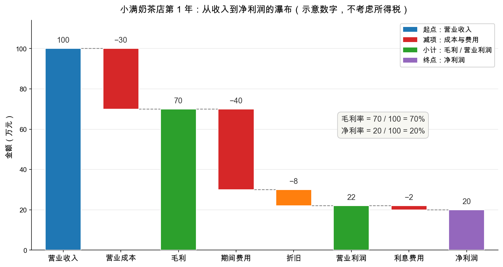

# 第 2 章：利润表——一年到底赚了多少

> 本章你将：
> - 看懂利润表的瀑布结构：收入 → 成本 → 毛利 → 费用 → 营业利润 → 净利润；
> - 认识两个最常用的比率：毛利率（gross margin）与净利率（net profit margin），并知道它们各看什么；
> - 用小满奶茶店第 1 年的示意数字，亲手把整张利润表走一遍；
> - 理解本章最重要的一句话：**利润是一个区间（opinion），不是一个精确的事实（fact）**。

---

## 2.1 从"有多少"到"赚了多少"

上一章的资产负债表回答"你有多少"，这一章的利润表回答"你这段时间赚了多少"。还是小满奶茶店：上章末尾我们看到，老板投入的 20 万一年后变成了 40 万权益——多出来的 20 万，就是这一年赚的。这一章我们把这一年录成"录像"，逐段回放。

利润表的结构像一条**瀑布**：收入从最高的地方跌下来，每流过一道坎就少一截，最后落到池子里的就是净利润：

$$\text{收入} \to \text{毛利} \to \text{营业利润} \to \text{净利润}$$

> 📌 **划重点：** 利润表不是一堆并列的数字，而是一条**一层层扣减的瀑布**。每一道坎都有一个名字，读利润表就是辨认每一道坎扣掉的是什么。

## 2.2 小满的第一年：逐行走一遍

第 1 年，小满的店发生了这些事（示意数字）：

1. 全年卖出 **100 万**的奶茶。其中 90 万当场收到现金，还有 10 万是公司客户（写字楼团购）的**赊账**，约定年后结清；
2. 制作奶茶用掉的原料（奶、茶、水果、杯子的折算成本）共 **30 万**，全部现款结清；
3. 全年房租、员工工资、水电共 **40 万**，已支付；
4. 设备装修 40 万按 5 年折旧，第 1 年认 **8 万**折旧（这笔钱**今年并没有付出去**，是上一年买设备的一次性支出按年分摊）；
5. 年底给银行付了 **2 万**利息（40 万借款 $\times$ 5%）；
6. 为教学简单，不考虑所得税。

按瀑布的顺序装进报表：

| 行次 | 项目 | 金额（万元） | 怎么来的 |
|---|---|---|---|
| ① | 营业收入 | 100 | 全年卖出的奶茶（含 10 万赊账） |
| ② | 营业成本 | 30 | 原料成本 |
| ③ | **毛利** | **70** | ① - ② |
| ④ | 期间费用 | 40 | 房租、工资、水电 |
| ⑤ | 折旧 | 8 | 设备装修 40 ÷ 5 年 |
| ⑥ | **营业利润** | **22** | ③ - ④ - ⑤ |
| ⑦ | 利息费用 | 2 | 40 万借款 $\times$ 5% |
| ⑧ | **净利润** | **20** | ⑥ - ⑦（不考虑所得税） |

画成图，就是那条一眼望到底的瀑布：

注意图里绿色柱子的位置：**毛利 70 万和营业利润 22 万是两个"中转站"**，不是新的钱，只是瀑布流到这里时的累计水位。真正的起点是收入 100，终点是净利润 20。

## 2.3 两个比率：毛利看产品，净利看整盘生意

光看金额不够，还要看"率"。两个最常用的：

$$\text{毛利率} = \frac{\text{毛利}}{\text{收入}} = \frac{70}{100} = 70\%$$

$$\text{净利率} = \frac{\text{净利润}}{\text{收入}} = \frac{20}{100} = 20\%$$

**毛利率看的是产品本身赚不赚钱**：一杯奶茶卖 15 元，原料 4.5 元，毛利 10.5 元——毛利率 70%。这个数字高，说明产品有定价权或者成本有优势。**净利率看的是整盘生意赚不赚钱**：毛利率再高，房租工资利息一层层扣完还剩多少，才是生意人的真实答卷。

> ⚠️ **易踩坑：毛利不是利润。** 新手最常见的口误是"这家公司毛利 70 万，真赚钱"。毛利只是瀑布的中转站——它连房租都还没付。看一家店行不行，先看毛利率（产品硬不硬），下结论要看净利率（整盘生意剩多少），两层楼都要爬完。

两个比率连起来看特别有信息量：毛利率高、净利率低，说明"产品好卖但盘子漏水"（费用失控）；毛利率低、净利率也低，说明生意本身薄如纸。作为参照（约数，按公开年报口径）：贵州茅台的毛利率长期在 91% 上下，是 A股 最高的一档；奶茶行业普遍在 60%-70%；而超市零售往往只有 20% 出头——所以超市靠周转速度赚钱，茅台靠毛利率赚钱，商业模式从这一行就开始分岔了。

## 2.4 慢着：利润竟然是"算出来的"

回看 2.2 节那张表，有一行很扎眼：**折旧 8 万**。设备是开业那天一次性花 40 万买的，第 1 年并没有再掏 8 万的现金——这 8 万纯粹是账面上的分摊。那么问题来了：为什么按 5 年摊？按 3 年摊行不行？

按 3 年摊，每年折旧变成约 13.3 万，净利润立刻从 20 万掉到约 14.7 万。**同一个事实（一台 40 万的机器），两种完全合法的算法，利润差了四分之一。**

这还没完。再想想那 10 万赊账：货发出了，收入 100 万里就包含了这 10 万——可这 10 万现金一分都没进店。如果客户年后赖账呢？利润表不会自动改口。再加上"原料跌价要不要提前计损失""装修算 5 年还是 8 年"……你会发现，净利润这个数字，从第一步起就充满了**人的选择**。

> 📌 **划重点：** 利润是一个 opinion（观点、估计的区间），不是一个 fact（精确的事实）。这不是说利润是假的，而是说：**利润的数字里揉进了大量会计判断，同一家公司、同样的事实，可以合法地算出不同的利润。**

> 💡 **你可能会问：那利润表还能信吗？干脆只看现金算了？**
>
> 能信，但要像法官审证人一样信：采纳，但交叉质证。质证的工具就是第 3 章的现金流量表——利润说是 20 万，现金进账了多少？两个数字对得上，可信度大增；对不上，就有故事要查。至于"只看现金"也不行：机器的折旧是真实的损耗，今天不认账，明天就得花大钱换机器。利润与现金各有各的真，缺一不可。

## 2.5 在 A股 / 港股读利润表

> 📌 **实战联系：** 真实报表比小满的复杂，但骨架一模一样，只是名字更全：收入叫"营业总收入"，瀑布中段多了"税金及附加""销售/管理/研发费用""投资收益"等，净利润还会拆出"归属于母公司股东的净利润"（归母净利润）——因为大公司底下有一堆子公司，有的不是 100% 持股，要把不属于上市公司股东的那部分刨掉。**看增长率、写估值，用的都是归母净利润。** Week 6 我们会拿着茅台的简化利润表逐行实战，本周先立骨架。

## ✍️ 想一想

1. 手算：另一家奶茶店第 1 年收入 200 万，原料成本 60 万，房租工资 100 万，折旧 10 万，利息 5 万。它的毛利、净利润、毛利率、净利率各是多少？
2. 接上题：如果这家店把设备折旧从 10 万改成 5 万（会计上有时的确有调整空间），净利润变成多少？净利率呢？——你认为这两种算法，哪个更"老实"取决于什么？
3. 小满的店里，赊账那 10 万如果年后收不回来，第 1 年"实际赚到的"和"报表上的净利润 20 万"之间差多少？这个差额藏在第 1 年的哪张表上？

## 📖 回到原书

原书第 31 章《利润表分析》，md 第 463 页（选读）。

> But these earnings per share, on which the entire edifice of value has come to be built, are not only highly fluctuating but are subject also in extraordinary degree to arbitrary determination and manipulation.

**参考译文：** 然而，整座价值大厦如今都盖在"每股收益"这个数字上，而它不仅波动剧烈，而且在极大的程度上，任凭人为的随意决定与摆布。

**一句话点评：** "arbitrary determination"（随意决定）说的正是本章的折旧年限、赊账记账这些会计选择——1934 年如此，今天依然如此。格雷厄姆整本《证券分析》的火力，有一大半都对着这句话。

---

下一章：[第 3 章：现金流量表——利润是不是真的](03-现金流量表-利润是不是真的.md)。收入 100 万里只有 90 万收到了现金，折旧一分没花——净利润 20 万的背后，钱包实际鼓了多少？该看第三张表了。
