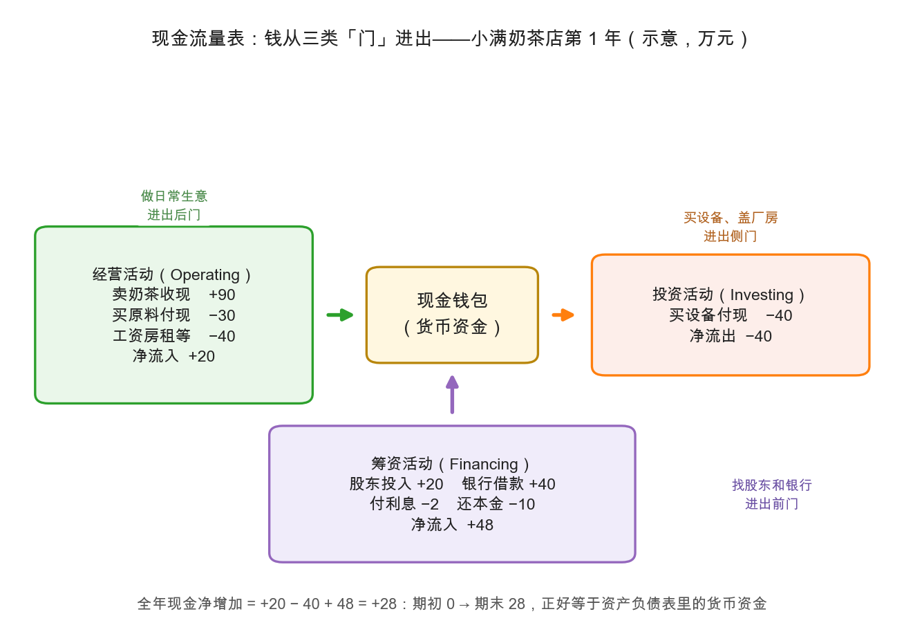

# 第 3 章：现金流量表——利润是不是真的

> 本章你将：
> - 彻底搞懂权责发生制与收付实现制（cash basis）的区别：为什么赊账卖出 10 万，利润表眉开眼笑，钱包分文未进；
> - 认识现金流量表的三扇门：经营活动、投资活动、筹资活动（operating / investing / financing）；
> - 用小满奶茶店第 1 年的数字，把第一张现金流量表完整编出来；
> - 记住一句价值投资的老话：**利润是观点，现金是事实**；
> - 学会辨认"好生意的现金流量表"长什么样。

---

## 3.1 一个赊账引发的血案

上一章结尾留了个尾巴：利润表说赚了 20 万，可钱包里到底多了多少现金？要回答它，得先回到第 0 章埋的那颗雷——**权责发生制**。

对比两种记账方式：

| | 权责发生制（利润表用它） | 收付实现制（现金流量表用它） |
|---|---|---|
| 记账规则 | 事情**发生**了就记账 | 钱**到账**了才记账 |
| 赊账卖出 10 万奶茶 | 收入立刻 +10 万 | 现金 +0，什么都没发生 |
| 客户年后付清 10 万 | 利润表不再动（早记过了） | 现金 +10 万，这天才算"卖出去" |
| 今年的折旧 8 万 | 算今年的费用 | 现金一分没动（钱是开业那天一次性付的） |

生活里你早就用过收付实现制：你的微信年度账单，记录的只是钱进钱出，不管你"理论上应得"什么。公司层面，利润表走权责发生制（才能跨期配比收入与成本），现金流量表走收付实现制（只认银行流水）。**两张表是同一年的两种拍法**：利润表按"事情"拍，现金流量表按"钱"拍。

> 📌 **划重点：** 赊账卖出 10 万：利润表眉开眼笑记了收入，现金流量表面无表情——因为钱包没动。利润与现金的第一道裂缝，就是这么来的。

## 3.2 三扇门：经营、投资、筹资

现金流量表把全年的现金进出分成三类，像房子开的三扇门：

1. **经营活动（operating activities）**：做日常生意进出的钱——卖奶茶收的钱、买原料付的钱、发工资付的钱。这是"正门里的日常"，最能反映生意本身的造血能力；
2. **投资活动（investing activities）**：买设备、盖厂房、做长期投资进出的钱。注意：这里的"投资"指公司**自己**买设备扩张，不是你买股票那种投资；
3. **筹资活动（financing activities）**：跟股东和银行之间的钱——股东投入、借新款是进；分红、还本金、付利息是出。

## 3.3 小满的第一张现金流量表

把小满第 1 年所有真金白银的进出按三扇门归类（示意数字）：

| 类别 | 明细 | 金额（万元） |
|---|---|---|
| 经营活动 | 卖奶茶收现 +90 | |
| | 买原料 -30 | |
| | 房租工资水电 -40 | **净额 +20** |
| 投资活动 | 买设备装修 -40 | **净额 -40** |
| 筹资活动 | 股东投入 +20 | |
| | 银行借款 +40 | |
| | 付利息 -2 | |
| | 还本金 -10 | **净额 +48** |
| **全年现金净增加** | +20 - 40 + 48 | **+28** |
| 期初现金 0 → 期末现金 | 0 + 28 | **28** |

期末现金 28 万——正好等于第 1 章资产负债表上"货币资金 28 万"。这不是巧合，这是**同一笔钱在两张表上的两种叫法**（第 4 章正式对账）。

> 💡 **你可能会问：2 万利息为什么放在"筹资活动"？有的教材不是放在经营活动吗？**
>
> 两种做法都存在。中国的《企业会计准则》把"偿付利息支付的现金"归入**筹资活动**——因为利息是借钱的代价，跟"找钱"有关；美国的准则则常把它放进经营活动。所以拿不同国家公司的现金流数据做比较时，口径要先对齐，别被这个差异吓到。本课从 A股/港股 出发，统一按中国口径。

## 3.4 利润是观点，现金是事实

现在可以回答上一章的问题了。第 1 年：

- 利润表说：赚了 **20 万**；
- 现金流量表说：经营活动净流入也是 **20 万**。

两个数字竟然一样？纯属这个例子的巧合。把账拆开看，差异因素其实有好几个，只是恰好抵消了：折旧 8 万（利润里扣了、现金没流出）抵掉了赊账 10 万（利润里算了、现金没进来），利息重分类又贡献 2 万。**只要这些因素不再是这个凑巧的搭配，利润和经营现金流立刻分家。**

比如第 2 年，如果小满学坏了，把赊账扩大到 30 万（收入不变还是 100 万）：净利润依然约 20 万，经营现金流却掉到约 0。利润表纹丝不动，钱包已经见了底。这就是那句话的含义：

> 📌 **划重点：利润是观点，现金是事实。** 利润建立在估计与选择上（第 2 章），现金数的是银行流水（本章）。当两老吵架时，信现金的。

> 💡 **你可能会问：那经营现金流是不是越大越好？比净利润大就一定健康吗？**
>
> 通常"经营现金流长期大于净利润"是好征兆：说明利润不是赊出来的，而且像折旧这类"只扣利润不扣现金"的项目在给现金流托底——重资产公司尤其明显，比如长江电力，大坝和水轮机每年计提巨额折旧，账面利润被压低，但现金哗哗地流，这也是它常年高分红的底气（方向性描述，具体数字以年报为准）。但"永远越大越好"也不对：经营现金流暴增有时只是压货给渠道换来的，Week 6 会拆这种把戏。

## 3.5 好生意的现金流量表长什么样

三扇门的进出组合，能讲出一家公司的状态：

| 经营 | 投资 | 筹资 | 画像 |
|---|---|---|---|
| + | - | 灵活 | 健康成长型：主业造血，自己花钱扩张（小满第 1 年就是） |
| + | + | - | 守成型：主业赚钱、设备也不买了、还在还债分红——常见于成熟行业 |
| - | - | + | 烧钱型：主业不造血，靠融资输血扩张——早期科技公司常见，风险在于"输血什么时候停" |
| + | - | + | 要留神：主业明明赚钱，还不断借钱扩张——钱去哪儿了？ |

> ⚠️ **易踩坑：经营活动现金流常年为负、年年靠筹资输血的公司，不管故事多动听都要先打问号。** 造血功能是生意的底子。当然，新店、新行业头几年经营现金流为负可以理解——所以要看**趋势**：是逐年收窄转正，还是越烧越多。

## 3.6 在 A股 / 港股读现金流量表

> 📌 **实战联系：** 年报现金流量表里最重要的两行：**"经营活动产生的现金流量净额"**和**"投资活动产生的现金流量净额"**（再看一眼其中的"购建固定资产、无形资产和其他长期资产支付的现金"，这是公司扩张的花钱速度）。一个朴素的格雷厄姆式筛查：拉出近 5 年数据，看"经营现金流净额合计"是否大于"净利润合计"。大于，说明利润大体是硬的；常年小于，就要去应收账款和存货里找原因了。港股报表结构相同，科目命名略有差异（如"经营业务所得现金"），意思一致。

## ✍️ 想一想

> 建议**先自己写两句话再看答案**。想不清楚的地方，就是下一遍该重读的地方。

### 问 1：赊账在第二年付清了

第 2 年 1 月，客户把上年赊账的 10 万付清了。这一天：三张表各有什么动静？（提示：利润表这次反而不动。）

**解题思路：** 拿 3.1 节那张"权责发生制对比收付实现制"的表逐行对：利润表按"事情"拍，现金流量表按"钱"拍。这 10 万的事情发生在第 1 年，钱发生在第 2 年，两张表的认账时点必然错开。资产负债表则盯住"欠条换成现金"这个动作。

**参考答案：** 三张表分开说：

| 报表 | 动静 | 为什么 |
|---|---|---|
| **利润表** | **不动** | 收入早在第 1 年就按权责发生制确认过了。3.1 节表格里那一行写得清楚："客户年后付清 10 万，利润表不再动（早记过了）"。这天只是收钱，没有新的事情发生 |
| **资产负债表** | 两行同时变：**货币资金 加 10 万**、**应收账款 减 10 万** | 一张欠条换成真金白银。资产总额不变，只是内部搬了个家 |
| **现金流量表** | **经营活动 加 10 万**（记进第 2 年的表） | 收付实现制只认银行流水，钱这天到账，才算数 |

再体味一下这一天的意味：公司**利润没增加一分**，**家底也没变厚一分**（资产总额没变），但**现金真的多了 10 万**。这就是 3.1 节说的"两张表是同一年的两种拍法"——同一笔生意，第 1 年留下"利润"，第 2 年留下"现金"。

**易错点：** ① 在第 2 年利润表上再记一次 10 万收入。这是最典型的重复确认，一笔生意不能在利润表上算两次账；② 说"资产负债表不动"。应收账款转成货币资金，总额虽然不变，但**结构变了**，而且这个变化正说明欠条兑现了，是好事；③ 把这 10 万归到筹资或投资活动。它跟股东、银行、买设备都没关系，是主业卖奶茶收回来的钱，**经营活动**无疑。

### 问 2：利润 5 亿，现金负 1 亿

一家公司连续三年净利润年年 5 个亿，经营现金流净额却年年是 -1 亿。最可能的两个解释是什么？你还会买它的股票吗？

**解题思路：** 先在脑子里搭起 4.4 节那座间接法小桥：净利润出发，加回不花现金的费用，减去没收到钱的收入。**桥上解释不了的差额，只能去应收账款和存货里找**——这是 4.4 节的原话。另外注意题目给的是"连续三年"：单年可能是季节性波动，连续三年就是模式。

**参考答案：** 先把两个解释摆出来：

两个最可能的解释：

1. **赊账堆积，收入是纸面的**。货确实发出去了，收入也按权责发生制确认了，但钱一直没收回来，全挂在**应收账款**上。第 3 章 3.4 节举的正是这个例子：小满把赊账从 10 万扩到 30 万，净利润还是约 20 万，经营现金流却掉到约 0。连续三年，说明欠条越堆越厚，甚至可能已经部分收不回来了。
2. **存货堆积，钱变成了仓库里的货**。4.4 节点名的另一个去处就是存货——"钱都变成了'别人欠它的'和'仓库里卖不掉的'"。占用现金、还没进成本，利润表上看不见。

**买不买？** 按 3.5 节那句"**造血功能是生意的底子**"，三年经营现金流为负、年年靠外部输血，这种公司**先打问号，不进买入清单**。3.6 节给的格雷厄姆式筛查正好用得上：拉近 5 年数据，看"经营现金流净额合计"是否大于"净利润合计"。这里三年利润合计 15 亿、经营现金流合计 负 3 亿，差着 18 亿——**利润再漂亮，也不等于生意在赚钱。**

真要救它，看两件事：应收账款和存货是"周转慢"还是"收不回"；经营现金流是"逐年收窄转正"还是"越烧越多"（3.5 节原话）。两条都过不了，故事再好听也是别人的故事。

**易错点：** ① 只答"财务造假"。现金流为负不等于造假，也可能是激进的赊销政策或行业下行压货——**先当可疑，再去验证**，别一步跳到结论；② 觉得"净利润 5 亿是硬指标，现金流负一点无所谓"。3.4 节那句"当两老吵架时，信现金的"就是为这种想法准备的；③ 只看单一年份就下判断。3.5 节提醒过，新店、新行业头几年经营现金流为负可以理解，所以**要看趋势**——题目给的"连续三年"恰恰是趋势层面的坏消息。

### 问 3：买设备的 40 万去哪了

小满买设备花的 40 万，出现在第 1 年现金流量表的哪一类？而第 1 年利润表里只认了 8 万。剩下 32 万去哪了？（提示：回去看资产负债表固定资产那一行。）

**解题思路：** 这道题就是把第 4 章总装台的第 ③ 笔和第 ⑦ 笔交易串起来看：一笔是"钱换设备"，一笔是"设备按年变成费用"。三张表各记什么、各不记什么，分开答。

**参考答案：** 三个问题连着答：

| 问法 | 答案 |
|---|---|
| 40 万在第 1 年现金流量表的哪一类 | **投资活动**，流出 40 万。3.2 节说得很清楚，这里的"投资"指公司**自己**买设备扩张，不是股民买股票那种投资 |
| 利润表为什么只认 8 万 | 设备是**一次性花 40 万、分 5 年受益**的资产，按 2.2 节的瀑布，第 1 年只把当年的分摊额 8 万记成折旧费用（$40 / 5 = 8$） |
| 剩下 32 万在哪 | 留在**资产负债表的固定资产**里，以净值形式存在：40 万原值 减 已提折旧 8 万 = **净值 32 万**（第 1 章 1.3 节年末表里正是这个数） |

所以 40 万没有消失，只是**换了个地方站**：开业那天以现金形式一次流出（现金流量表投资活动），换回一台设备（资产负债表固定资产 40 万）；此后 5 年里，这台设备每年以 8 万的速度从资产负债表搬进利润表当费用。第 4 章那句总结最传神：折旧是"**一个数字、两个身影**"——在利润表里是费用，在资产负债表里是净值从 40 变成 32。

**易错点：** ① 把 40 万算进经营活动现金流。买设备不是日常卖奶茶的开销，它归投资活动；同样，40 万也不是第 1 年的全部费用，只有 8 万进利润表；② 说"剩下 32 万进了现金流量表"。折旧**不动现金流量表**——第 4 章总装台表第 ⑦ 行写的就是"**不动**（没花钱！）"，这是新手最容易懵的一行；③ 认为"固定资产净值 32 万，就是这台设备现在能卖 32 万"。1.3 节的易踩坑说得很明白：这是按规则记出来的**账面净值**，不是市场价。**账面与市价之间有裂缝。**

## 📖 回到原书

原书第 31 章《利润表分析》，md 第 463 页（选读）。

> There are unbounded opportunities for shrewd detective work, for critical comparisons, for discovering and pointing out a state of affairs quite different from that indicated by the publicized "per-share earnings."

**参考译文：** 对精明的侦探式调查、对批判性的比较、对发现并指出一个与公告的"每股收益"截然不同的真相而言，这里面的机会是无穷的。

**一句话点评：** 格雷厄姆把财报分析比作侦探工作——现金流量表就是侦探的第一件工具：它不听嫌疑人怎么陈述（利润），只查它当晚到底在不在场（现金）。

---

下一章：[第 4 章：三张表怎么咬合——勾稽关系](04-三张表怎么咬合-勾稽关系.md)。到这里三张表你都见过了，但它们不是三座孤岛——同一笔交易会同时在三张表上留下痕迹。我们把小满这一年的 8 笔交易全部编号，亲手对一遍账。
