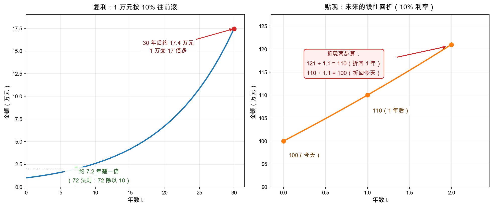

# 第 5 章：数学小灶——复利与贴现

> 本章你将：
> - 复习百分比与变化率，避开"基数变了"的经典陷阱；
> - 学会**复利**（compound interest）：$(1+r)^n$，以及心算神器 72 法则；
> - 学会**贴现**（discounting）：把未来的钱换算成今天的钱，$PV = \dfrac{FV}{(1+r)^t}$，配上奶茶店的手算例子；
> - 明白为什么格雷厄姆更信"多年的平均利润"——为 Week 7 埋好种子。

---

## 5.1 热身：百分比与变化率

三张表读完，你已经会看"公司现在怎样"。但从这一章起我们要回答估值问题："未来的钱，今天值多少？"先热身，把初中数学的三个老朋友请回来。

**变化率**：新数和旧数比，变了百分之几：

$$\text{变化率} = \frac{\text{新} - \text{旧}}{\text{旧}}$$

小满第 2 年收入从 100 万做到 120 万，变化率 $= (120 - 100) / 100 = 20\%$。简单，但有个大陷阱：

> ⚠️ **易踩坑：涨跌同幅，回不到原点。** 涨 50% 再跌 50%：$100 \to 150 \to 75$，你亏了 25%。为什么？因为第二次的 50% 基数变成了 150。同理，跌 50% 需要涨 100% 才能回本。这个"基数漂移"是散户直觉的头号杀手——亏 50% 的痛，远不止赚 50% 能补的。

## 5.2 复利：钱会自己生钱

**复利**就是"利滚利"：每期利息并进本金，下期连本带息一起生息。

假设小满把年终奖 1 万块放进一个年化 10% 的理财（示意收益率，真实理财并不保证），按复利滚：

$$\begin{aligned}
\text{第 1 年末} &: 1 \times (1 + 0.10) = 1.10 \text{ 万} \\\\
\text{第 2 年末} &: 1.10 \times (1 + 0.10) = 1.21 \text{ 万} \\\\
\text{第 3 年末} &: 1.21 \times (1 + 0.10) = 1.331 \text{ 万}
\end{aligned}$$

注意第 2 年生的息不是 0.10 万而是 0.11 万——**上一年的利息也在生息**，这就是"滚"字。写成一个公式（$PV$ 是今天的本金，$FV$ 是 $n$ 年后的终值，$r$ 是每期利率）：

$$FV = PV \times (1+r)^n$$

时间一长，指数的力量就露出了獠牙。1 万元按 10% 滚 30 年：

$$1 \times (1+0.10)^{30} \approx 17.4 \text{ 万}$$

看左图那条曲线：前 10 年温吞，后 10 年陡峭——**复利的威力在后半程**。这也解释了为什么价值投资反复强调"活得久"比"赚得快"重要：提前离场的人，永远滚不到陡峭段。

**72 法则**：心算复利的神器。翻一倍需要的年数约等于 72 除以利率的百分数数值：

$$\text{翻倍年数} \approx \frac{72}{r}$$

| 年化利率 r | 翻倍年数（72 法则） | 精确值 |
|---|---|---|
| 5% | 约 14.4 年 | 14.2 年 |
| 10% | 约 7.2 年 | 7.3 年 |
| 15% | 约 4.8 年 | 5.0 年 |

误差不到半成，心算够用。它反过来也能报警：通胀每年 3%，购买力约 24 年缩水一半——"钱在睡觉"的代价，72 一除就知道。

## 5.3 贴现：把未来的钱折回今天

现在把复利**倒过来放**。回到右图：有人想买下小满的奶茶店，出价方式很诚恳——"我现在没钱，**两年后一次性付你 121 万**"。

121 万听起来比 100 万多，但你已经会复利了，立刻警觉：今天的 100 万按 10% 滚两年，正好变成 121 万。也就是说，**"两年后的 121 万"和"今天的 100 万"是同一笔钱**。如果两年后的 121 万只卖今天 95 万的价格，你等于白赚；要卖今天 105 万，你还不如自己把钱拿去理财。这个"把未来的钱往回折"的动作，就叫**贴现**；折回来的结果叫**现值**（present value，PV）：

$$PV = \frac{FV}{(1+r)^t}$$

手算就是连续做除法：

$$\frac{121}{1.1} = 110 \text{（折回一年）}， \qquad \frac{110}{1.1} = 100 \text{（折回今天）}$$

> 📌 **划重点：** 复利用乘法，贴现就是它的逆运算——除法。$FV = PV \times (1+r)^n$ 与 $PV = \dfrac{FV}{(1+r)^t}$ 是同一枚硬币的两面：一个把今天的钱送往未来，一个把未来的钱押送回今天。估值里所有的"折现"，走的都是后一条路。

> 💡 **你可能会问：凭什么未来的钱要打折？钱又不会过期。**
>
> 两个原因。一是**机会成本**：今天的钱可以立刻去投资，两年后大概率变多——所以"未来的钱"天然比"今天的钱"廉价；二是**不确定性**：两年后的 121 万只是个承诺，承诺有兑现风险。贴现率 $r$ 里其实同时装着这两样东西，粗略地说：**$r$ 是你"不干这件事"时的替代收益率**。这就是为什么国债利率常被当作贴现率的起点——它是无风险的那把尺子。Week 3 讲债券时，这把尺子会正式上岗。

> ⚠️ **易踩坑：单位要配对，期限要敏感。** 年利率就配年数，月利率就配月数——$t$ 和 $r$ 的单位必须一致。另外看右图那条线的走向：贴现率越高、期限 $t$ 越长，现值缩得越狠。10% 利率下两年后的 121 万值今天 100 万；要是贴现率换成 20%，它只值今天约 84 万。"远期的承诺"最经不起高利率的折价。

## 5.4 平均数的意义：一年靠不住

最后一个工具最朴素：**平均数**。为什么要在这里讲？因为格雷厄姆分析利润表时反复念叨一句话：别太把单独一年的利润当回事。

小满的奶茶店运气起伏（示意数字）：第 1 年赚 10 万（夏天暴雨多），第 2 年赚 20 万，第 3 年赚 30 万（门口通了地铁）。三年平均：$(10 + 20 + 30) / 3 = 20$ 万/年。

单看第 3 年的 30 万，你会以为这是门"年赚 30 万"的生意，按它出高价接盘；单看第 1 年的 10 万，你又会把它贱卖。**平均数把运气的毛刺磨平，露出生意的正常赚钱能力。**这个"正常赚钱能力"（盈利能力，earning power）正是 Week 7 的主角——到时候我们拿原书的原话，算中国石油式周期股为什么要用 5-10 年的平均利润。今天先记住：**平均是防被骗的第一件武器。**

## 5.5 本周的工具箱，下周就开箱

> 📌 **实战联系：** 别小看本章这两件初中数学工具，整个 Part II（Week 3-4 债券周）就架在它们上面：一张 3 年期债券 = 三笔未来现金流的贴现加总；"到期收益率" = 让贴现总和刚好等于市价的那个 $r$。股票那边也一样，Week 7 的"盈利能力 $\times$ 合理倍数"，背后还是贴现直觉——**估值的一切，都是把未来的钱折回今天，再跟市价比大小。**今天多手算两遍，下周就能直接上手。

## ✍️ 想一想

> 建议**先自己写两句话再看答案**。想不清楚的地方，就是下一遍该重读的地方。

### 问 1：手算 10 万滚三年

手算复利：10 万本金，年化 8%，滚 3 年是多少？（提示：$1.08^2 = 1.1664$，再乘一次 1.08。）

**解题思路：** 用 5.2 节的公式 $FV = PV \times (1+r)^n$，一年一年往下乘，别偷懒做成单利。题目已经把 $1.08^2$ 算好递过来了，照着"每年乘一次 1.08"的节奏走，顺便体会第 2 年的利息为什么比第 1 年多。

**参考答案：** 按 5.2 节的复利公式逐期滚：

| 年份 | 计算 | 年末金额（万元） |
|---|---|---|
| 第 1 年 | $10 \times 1.08$ | 10.8 |
| 第 2 年 | $10 \times 1.1664$ | 11.664 |
| 第 3 年 | $11.664 \times 1.08$ | **约 12.6** |

也就是约 **12.6 万**。

跟单利对比一下就明白"滚"字的意思：单利三年是 $10 + 3 \times 0.8 = 12.4$ 万，复利多出约 0.2 万。多出来的部分，正是"上一年的利息也在生息"：第 1 年利息 0.8 万，第 2 年利息是 0.8 加 0.064 万，第 3 年再多生一点。5.2 节说 1 万块按 10% 滚 30 年能变成约 17.4 万，靠的就是这个机制——**前 10 年温吞，后 10 年陡峭。**

**易错点：** ① 用单利算成 $10 \times (1 + 8\% \times 3) = 12.4$ 万。3 年里差别很小，但时间一拉长就是指数级的鸿沟；② 把 $1.08^2$ 再平方（算成 4 年）或者少乘一次（只算 2 年）。提示说得很清楚：$1.08^2$ 是两年的结果，**再乘一次 1.08** 才是三年；③ 单位乱写，把 12.6 万写成 12.6 元或者 12.6%。5.3 节"单位要配对"那条提醒，第一层就是量和单位先钉死。

### 问 2：72 法则两连问

72 法则两连问：年化 6% 的理财，多少年翻一倍？多少年翻两番（变 4 倍）？翻两番的结果心算出来后，用一句话说明为什么"翻两番"不是"翻一倍的两倍时间"。

**解题思路：** 5.2 节给的公式是"翻倍年数 约等于 72 除以利率的百分数"。第一问直接代数；第二问先想清楚"翻两番"是 2 番、也就是 **4 倍**，再决定要翻几次；最后一问要落到复利的**乘法性质**上——年数相加，对应的是倍数相乘。

**参考答案：** 两问分别心算：

**翻一倍：** $72 / 6 = 12$ 年。

**翻两番（变 4 倍）：** 两次翻倍，约 **24 年**。

这里有一句话要说准，因为它容易被读反：在恒定复利下，$1.06^{24}$ 恰好约等于 $1.06^{12}$ 的平方，也就是约 2 乘 2 等于 4——**"翻两番"在时间上确实就是"翻一倍"的两倍（12 年 乘 2 等于 24 年）**。真正**不是**两倍关系的是另外两件事：

- **赚到的钱不是两倍**：翻一倍赚的是本金的 1 倍，翻两番赚的是本金的 3 倍（1 变 4，多出 3）；
- **倍数不能当年数用**：复利里"年数相加"对应的是"倍数相乘"，12 年加 12 年等于 24 年，对应的是 2 乘 2 等于 4 倍，而不是 2 加 2。

一句话记牢：**时间可以相加，倍数只能相乘。** 这就是 5.1 节"涨跌同幅，回不到原点"那条易踩坑的同一副面孔——基数一旦变了，直觉就不灵了。

（验算习惯照 5.2 节那张表格来：6% 的精确翻倍年数约 11.9 年，翻两番约 23.8 年，跟 72 法则给出的 12 与 24 对得上，误差小到可以忽略。）

**易错点：** ① 把"翻两番"读成 2 倍。翻一番才是 2 倍，翻两番是 2 乘 2 等于 4 倍——中文数字里最常见的误读；② 用单利思维估算：6% 乘 24 年等于 144%，于是以为 24 年只能变成约 2.4 倍。**72 法则背后是 $(1+r)^n$ 的指数增长，不是 $r \times n$ 的线性累加**；③ 把"时间成比例"错记成"收益也成比例"。24 年是 12 年的两倍，但翻两番赚到的 3 倍本金，是翻一倍赚到的 1 倍的 3 倍——**时间成比例，收益不成比例。**

### 问 3：133.1 万折回今天值多少

贴现手算：三年后的 133.1 万，按 10% 贴现，今天值多少？（提示：$1.1^3 = 1.331$，除一次就够。）如果贴现率换成 5%，现值是变大还是变小？

**解题思路：** 用 5.3 节的贴现公式 $PV = FV / (1+r)^t$——它是复利的逆运算，用除法。题目已给 $1.1^3 = 1.331$，一次除法就够。第二问不用重算，先看分母：$r$ 从 10% 降到 5%，$(1+r)^t$ 变小，分数值往哪边走？

**参考答案：** 代入贴现公式：

按 10% 贴现：

$$PV = \frac{133.1}{1.1^3} = \frac{133.1}{1.331} = 100 \text{ 万}$$

也就是**今天的 100 万**。这正是 5.3 节奶茶店收购例子的翻版：两年后的 121 万按 10% 折回今天是 100 万；这里是三年后的 133.1 万按 10% 折回今天，还是 100 万——因为 $1.1^3$ 恰好等于 1.331，**两边本来就是同一笔钱在两个时点上的身影。**

按 5% 贴现：

$$PV = \frac{133.1}{1.05^3} = \frac{133.1}{1.157625}$$

结果是约 **115 万**，比刚才的 100 万**变大**了。原因在 5.3 节那个"你可能会问"里：$r$ 是你"不干这件事"时的替代收益率。替代收益率降到 5%，意味着等这三年的机会成本变小了，未来的 133.1 万在你眼里自然更值钱。反过来记更实用：**利率一涨，所有远期承诺一起缩水**——这就是"远期的承诺最经不起高利率的折价"的算术版。

顺手往下一周看一眼：把"三年后的 133.1 万"换成一张三年期债券的三笔现金流，逐笔贴现再加总，你就已经在做债券定价了。5.5 节说的"一张 3 年期债券等于三笔未来现金流的贴现加总"，就是这个动作。

**易错点：** ① 把贴现做成乘法（$133.1 \times 1.1^3$），那是把今天的钱送往未来。**复利用乘，贴现用除**——5.3 节的原话是"复利用乘法，贴现就是它的逆运算——除法"；② 第二问不假思索答"变小"。分母 $(1+r)^t$ 里 $r$ 降了，分母变小，分数值变大——**贴现率越低，未来的钱越值钱**，一步就能定，不必重新算；③ 单位不配对。题目里 $t = 3$ 是年，$r$ 就必须是年利率。5.3 节专门提醒过"年利率就配年数，月利率就配月数"：如果手上拿的是季度利率，$t$ 就得换成 12 个季度。

## 📖 回到原书

原书第 42 章《资产负债表分析：账面价值的意义》，md 第 607 页（选读）。

> It is an almost unbelievable fact that Wall Street never asks, "How much is the business selling for?" Yet this should be the first question in considering a stock purchase.

**参考译文：** 有一个几乎令人难以置信的事实：华尔街从来不问"这门生意整个卖下来要多少钱？"——而这恰恰应该是考虑买入一只股票时的第一个问题。

**一句话点评：** "整个卖下来要多少钱"，就是本周数学工具要回答的问题：把生意未来的钱贴现回今天加总。股票不是屏幕上跳动的代码，而是整门生意的碎片——买之前，先学会算整门生意的价。

---

## 本周结语

从"体检报告"到"复利与贴现"，本周你补上了价值投资的两块地基：**看懂公司的证据**（三张表 + 勾稽关系）和**换算时间的数学**（复利与贴现）。Week 1 的"价格 vs 价值"从此有了抓手：价值藏在三张表里，算出来靠贴现。

下一周：[Week 3：债券——借出去的钱怎么保本](../week3/README.md)。债券是贴现公式的第一个实战对象，也是格雷厄姆花全书四分之一篇幅反复敲打的"本金安全"第一课。数学小灶，马上开箱。
