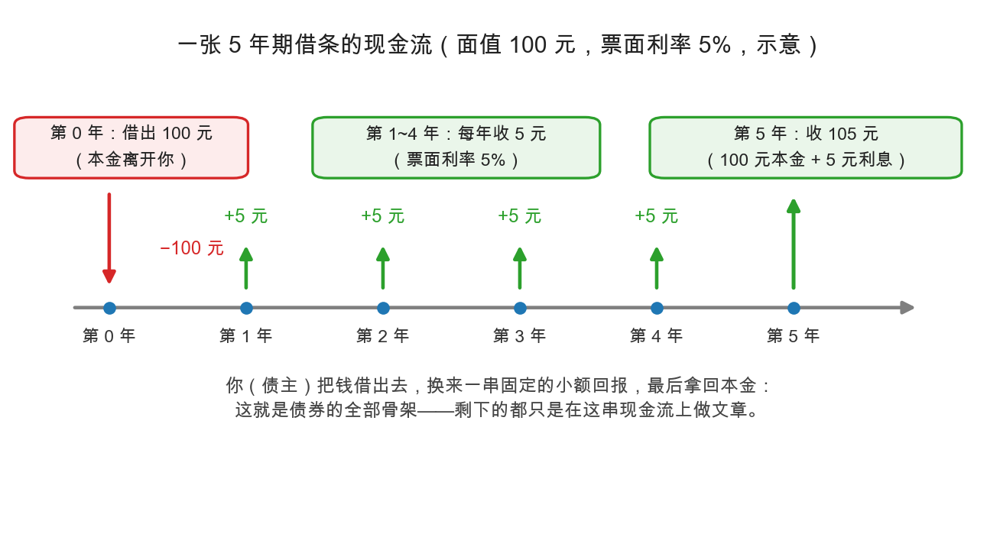
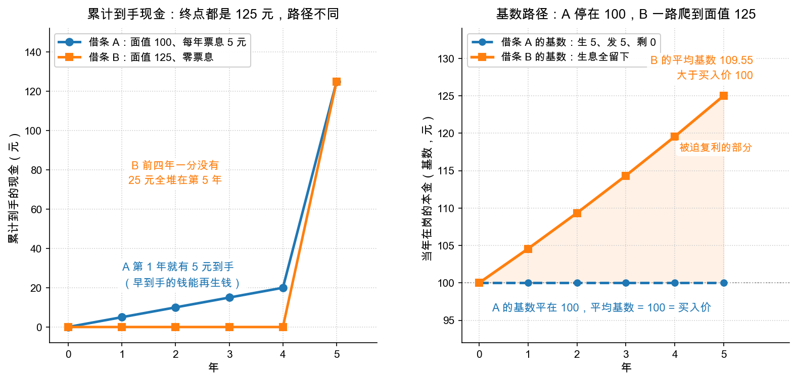

# 第 0 章：债券是什么——一张放大了的借条

> 本章你将：
> - 认识本周的主角：**债券**——一张被标准化、可以转手的"借条"；
> - 掌握借条三要素：**面值、票息、期限**，从此看懂债券新闻里的基本词汇；
> - 用一张时间线图看懂债券的全部现金流：现在借出去，每年收利息，到期拿回本金；
> - 分清**票面利率**和**到期收益率**——新手最容易搞混的一对概念；
> - 明白为什么格雷厄姆用接近三分之一的篇幅，先讲"把钱借出去"这件事。

---

## 0.1 从一张借条开始

上一周的数学小灶里，我们练好了两把算尺：复利与贴现——知道怎么把"未来的钱"折算成"今天的钱"。从这一章起，我们把这门手艺用到真刀真枪的证券上。第一个主角不是股票，而是更古老的品种：**债券（bond）**。

先回到你最熟悉的场景。好朋友小王想把奶茶店开到第二家，找你借 100 元。你们商量好：借 5 年，每年小王付你 5 元"感谢费"，第 5 年到期时把 100 元本金还给你，白纸黑字写一张借条。

这张借条上有三个关键数字，它们正是**债券的三要素**：

| 借条上写的话 | 对应的债券术语 | 本例的数字 |
|---|---|---|
| "借 100 元" | **面值**（face value，也叫 par value） | 100 元 |
| "每年付 5 元感谢费" | **票息**（coupon）；票息 ÷ 面值 = **票面利率**（coupon rate） | 每年 5 元，利率 5% |
| "借 5 年" | **期限**；到期的那天叫**到期日**（maturity） | 5 年 |

债券和这张借条的唯一区别，是它把借条**标准化**了：公司（或政府）需要借一大笔钱时，把债务切成成千上万份，每份就是一张一模一样的"迷你借条"，卖给成千上万个债主。打借条的一方叫**发行人（issuer）**，买借条的一方叫**持有人（holder）**——说白了，就是欠钱的人和债主。

> 💡 **你可能会问：借条也能卖给别人吗？**
>
> 能，而且这正是债券和普通借条最大的区别：债券是**证券**，可以在市场上自由转手。你把借条卖给老李之后，小王照样按借条每年付息、到期还本，只是收钱的人换成了老李。也正因为能转手，债券才有了**市场价格**——这个价格天天变，第 4 章我们就去研究它为什么变。

> 📌 **划重点：** 债券 = 一张可以转手的标准化借条。你借出去的每一分钱，换来的都是一串**事先写死的现金流**：利息按合同来，到期还本金。回报的上限从买入那一刻就锁定了——记住这一点，本周后面所有的逻辑都从它生长出来。

---

## 0.2 先看现金流：一张借条的一生

 Week 2 学过一个观念：**利润是观点，现金是事实**。看债券也一样——别听发行人讲故事，先把它承诺的现金流（cash flow）一笔一笔列出来。

读这张图：第 0 年（今天）你流出 100 元；第 1 到第 4 年，每年流入 5 元票息；第 5 年流入 105 元——100 元本金加最后一年的 5 元利息。除此之外，没有任何其他可能：小王生意再火爆，你也只拿这 105 元；小王生意再惨淡，只要他不违约，你还是拿这 105 元。

用上周数学小灶的话说：这张借条今天值多少钱，就是把 $+5$、$+5$、$+5$、$+5$、$+105$ 这五笔钱，按一个折现率逐一折回今天再加总。股票为什么难分析？因为它的现金流**没有人能提前写死**——这就是两种证券最本质的分水岭。

---

## 0.3 债券 vs 股票：债主和老板的区别

Week 1 第 4 章画过"求偿顺序金字塔"：公司真到了散伙清算那天，排队顺序是先债主、再优先股（preferred stock）股东、最后普通股股东。现在你可以从"回报结构"的角度再比一次：

| 维度 | 债券（你是债主） | 股票（你是老板之一） |
|---|---|---|
| 回报上限 | 事先约定，**封顶**（利息 + 本金） | 无上限，但也可能血本无归 |
| 公司赚疯了 | 只拿约定利息，一分不多 | 超额利润全归股东 |
| 公司很惨 | 排队在前，先于股东受偿 | 排在最后，剩下的才归你 |
| 话语权 | 没有投票权，只有合同条款 | 有投票权（哪怕常常用不上） |

格雷厄姆把高等级债券（和一部分优先股）合起来称作**固定价值证券（fixed-value securities）**——"回报固定"是这个家族的族徽。族徽决定了分析姿势：股票投资要问"它能涨多少"，债券投资只问一个问题——**"它还得起吗？"**

---

## 0.4 票面利率 vs 到期收益率：同样赚 25 元，为什么年化不同

重头戏来了。假设借条发出两年后，你急用钱，另一位债主老李想接手。可他嫌 5% 太低——现在市场上新发的借条都给 6% 了。于是你们讨价还价：老李只肯出 95 元买你这张**面值 100 元**的借条。

这张借条的**票面利率没有变**，白纸黑字还是"每年 5 元"。但对老李来说，真实回报变了——因为他付的价格变了。价格一变，回报就变，这句话背后藏着债券里最容易搞混的一件事。我们先用一个干净的对照实验，把它彻底拆开。

### 对照实验：两张借条，都赚 25 元

你花 100 元买借条，还有 5 年到期。市场给你两个选择：

| | 借条 A（赚票息） | 借条 B（赚差价） |
|---|---|---|
| 面值 | 100 元 | **125 元** |
| 每年票息 | **5 元** | **0 元** |
| 到期还本 | 100 元 | 125 元 |
| 你付出的钱 | 100 元 | 100 元 |

两张都是 100 元进、5 年、**总共多拿 25 元**。直觉上它们应该一样划算。

**先用最简单的算法（单利）**，两张都是：

$$\frac{25}{100 \times 5} = 5\% \text{ / 年}$$

意思是"25 元分成 5 份，每年 5 元，占本钱 100 元的 5%"。这个算法叫**单利**——它不管钱是什么时候到手的。

**再用到期收益率（YTM）算，答案就分家了：**

| | 借条 A | 借条 B |
|---|---|---|
| 单利 | 5.0000% | 5.0000% |
| **到期收益率 YTM** | **5.0000%** | **4.5640%** |

同样赚 25 元，B 的年化却低了 0.44 个百分点。为什么？

### 秘密在"钱到手的时间"

把两张借条每年的现金流摊开：

| 年 | A 拿到的钱 | B 拿到的钱 |
|---|---|---|
| 1 | 5 | 0 |
| 2 | 5 | 0 |
| 3 | 5 | 0 |
| 4 | 5 | 0 |
| 5 | 105 | 125 |
| **合计** | **125** | **125** |

合计一模一样。但 **A 的钱早到手**：第 1 年就拿回 5 元，这 5 元立刻可以拿去存银行、买国债、买别的借条，从第 2 年起就替你再赚钱。B 的 25 元要等到第 5 年才一次性给你，前面四年一分钱都不生息。

**同样多的钱，早到手更值钱。YTM 认这个账，单利不认。**

所以单利口径隐含了一个假设：**"收益均匀地发生在每一年"**。

- 对 A 来说，这个假设**恰好是真的**——它每年真的发 5 元现金。所以 A 的 YTM 正好等于单利的 5.0000%。
- 对 B 来说，这个假设**完全是假的**——收益全堆在第 5 年。所以 B 的 YTM（4.5640%）明显低于单利。

### 换个视角：本金（基数）的路径

还有一个更机械、也更能回答"分母为什么不是买入价"的看法。规则只有一条：

$$\text{明年的基数} = \text{今年的基数} + \text{今年基数} \times r - \text{发给你的现金}$$

这就是 Week 2 那句"复利就是利滚利"在债券上的具体长相：**生出来的息，减掉发走的，剩下的自动滚进基数。**

把两张借条的基数逐年写出来（$r$ 用各自的 YTM）：

| 年 | A 的基数 | A 生息 | A 发出 | B 的基数 | B 生息 | B 发出 |
|---|---|---|---|---|---|---|
| 0 | 100.000 | — | — | 100.000 | — | — |
| 1 | 100.000 | 5.000 | 5 | 104.564 | 4.564 | 0 |
| 2 | 100.000 | 5.000 | 5 | 109.336 | 4.772 | 0 |
| 3 | 100.000 | 5.000 | 5 | 114.326 | 4.990 | 0 |
| 4 | 100.000 | 5.000 | 5 | 119.544 | 5.218 | 0 |
| 5 | 100.000 | 5.000 | 5 | 125.000 | 5.456 | 0 |

- **A：生 5、发 5、剩 0**，所以基数永远停在 100；
- **B：生 4.56、发 0、全部留下**，所以基数从 100 一路爬到 125。

左右两幅图说的是同一件事的两面：**A 的钱早到手（左），所以它的本金不必靠复利长大（右）；B 的钱迟到（左），所以本金必须一路爬（右）。** 两条基数线的平均值不同——100 对 109.55——而"平均基数"正是年化收益率的分母。

现在，"年化收益率"这个词可以拆成一句大白话：**它是一个分数，分子是"平均每年赚多少"，分母是"当年在岗的本金"。**

$$\text{到期收益率 } r = \frac{\text{平均每年赚的钱}}{\text{平均基数}} \qquad \text{单利年化 } s = \frac{\text{平均每年赚的钱}}{\text{买入价 } P}$$

**两个算式的分子完全一样**（总收益 25 元分 5 年，每年 5 元，这一步是精确的）。差别只在分母：

- 单利用 **买入价 $P$**：它假设"这 5 年你账上一直是 100 元"；
- YTM 用 **平均基数**：它承认"账上的钱在变"。

两者的关系可以精确写成一行：

$$r = s \times \frac{P}{\text{平均基数}}$$

由此立刻得到三条规律：**基数不动时 $r = s$；基数往上爬时 $r < s$；基数往下掉时 $r > s$。**

**这就是"分母为什么不是 $P$"的完整答案**：$P$ 只是第 1 年的基数。基数会动，平均下来就不再等于 $P$；只有基数恰好不动时（平价债），两者才重合。而基数动不动，取决于"每年生出来的息有没有被票息领走"。

### 同一个数字，两种含义：事实 vs 条件

到这里还有更细的一层，它决定了 YTM 这个数字对你到底意味着什么。

| | 借条 A（赚票息） | 借条 B（赚差价） |
|---|---|---|
| YTM | 5.0000% | 4.5640% |
| 基数 | 不动（一直是 100） | 必须涨（100 涨到 125） |
| **这个数字是"事实"还是"条件"？** | **条件** | **事实** |
| 为什么 | 债券每年把钱全发走，内部一分不留。要真正拿到 5% 的**复合**年化，你得把每年收到的 5 元按 5% 再投出去 | 收益全锁在债券里自动复利。你什么都不用做，也做不到别的，必然拿到 4.564% |
| 不满足条件会怎样 | 票息压箱底（0% 收益）：你的实际年化只有 **4.564%** | 没有第二种可能 |
| 再投资风险 | 有 | 没有 |

注意表里那个漂亮的巧合：**A 在"票息压箱底"时的实际年化（4.564%），正好等于 B 的 YTM（4.564%）。**

这不算巧合。A 的票息压箱底，5 年后你手里是 100（本金）加 25（票息）等于 125；B 是 5 年后一次性拿 125。**起点一样、终点一样、时间一样，复合年化当然一样。** 区别只在路径：A 的财富是直线长上去的（每年加 5），B 是曲线长上去的（每年乘 1.0456）。

也正因为 A 的钱到手更早，**A 比 B 更值钱**：把票息按 5% 再投，A 的终值是 127.63，比 B 的 125 还多。**这就是 A 的 YTM（5%）高于 B 的 YTM（4.564%）的全部原因——它的钱到手更早。**

> 📌 **一句话记住这两种数字的身份：** 赚差价的零息债，YTM 是**已经发生的事实**；赚票息的付息债，YTM 是一个**前提条件**——前提是"你把票息按同样的利率再投出去"。

### 精确定义与手算近似：从开方到心算

上面反复用到 $r$，但 $r$ 到底是怎么算出来的？**到期收益率的精确定义只有一个式子**——"让未来全部现金流的折现值，正好等于你付的价格"：

$$P = \frac{CF_1}{1+r} + \frac{CF_2}{(1+r)^2} + \cdots + \frac{CF_n}{(1+r)^n}$$

已知左边的 $P$ 和全部现金流，反解出那个让等式成立的 $r$，它就是 YTM。三种情形，难度完全不同：

**① 零息债：能开方，一步到位。** 借条 B 只有一笔现金流（第 5 年拿 125），式子退化成 $100 \times (1+r)^5 = 125$，两边开 5 次方即可：

$$r = \left(\frac{F}{P}\right)^{1/n} - 1 = \left(\frac{125}{100}\right)^{1/5} - 1 = 4.5640\%$$

**② 平价债：不用解，一眼可见。** 借条 A 把 $r = 5\%$ 代进去，右边正好是 100（因为 100 元本金按 5% 生出的 5 元，刚好被票息全额付掉，本金纹丝不动）——所以**买入价等于面值时，YTM 永远等于票面利率**。

**③ 折价/溢价付息债：解不出来，只能试。** 老李那张（95 元买、每年 5 元、5 年）有多笔现金流，方程里 $r$ 同时出现在 5 个分母上，没有开方级的闭式解，只能一遍遍代入逼近——这就是为什么实务上需要心算近似公式。

**心算版长这样**：既然没有闭式解，就得找个不用试算的办法。障碍在于——精确的平均基数要先知道 $r$ 才能算，而 $r$ 正是要求的未知数（鸡生蛋）。于是人们干脆用买入价和面值的算术平均去顶替它：

> 设 $C$ 为每年票息，$F$ 为面值，$P$ 为买入价格，$n$ 为距到期年数：
>
> $$r \approx \frac{C + (F-P)/n}{(F+P)/2}$$
>
> - **分子**：平均每年赚多少（票息，加上差价摊到每年）——**精确**；
> - **分母**：平均在岗本金，用 $\frac{F+P}{2}$ 近似——**这是全公式唯一的近似**。

把老李的例子（95 元买面值 100、票息 5 元、还有 5 年）代进去：

$$r \approx \frac{5 + (100-95)/5}{(100+95)/2} = \frac{6}{97.5} \approx 6.15\%$$

三种算法摆在一起：

| 算法 | 结果 | 它的分母是什么 |
|---|---|---|
| 单利 | 6.3158% | 买入价 95（假设本金一直不变） |
| **手算近似公式** | **6.1538%** | $(95+100)/2 = 97.5$（近似的平均基数） |
| 精确 YTM | **6.1932%** | 真实的平均基数 96.88 |

三个数都落在 6.2% 上下，心算完全够用。**不用开方就能报出个八九不离十，格雷厄姆那年代的从业者就靠它吃饭。**

但它的精度有边界。回到对照实验里的借条 B（100 元买、面值 125）：

$$r \approx \frac{0 + (125-100)/5}{(125+100)/2} = \frac{5}{112.5} \approx 4.44\%$$

精确值是 **4.5640%**，差了 0.12 个百分点——因为 B 的差价高达 25%，而 $\frac{F+P}{2} = 112.5$ 离真实的平均基数 109.55 有点远。

**差价越大、期限越短，这个近似越粗糙。** 粗略的边界是：差价在 5% 以内（95 到 105 元买面值 100）、期限 5 年以上时，它和精确值的差距不到 0.05 个百分点，可以放心心算；差价到 15%（85 元买）时，误差会扩大到 0.2 到 0.35 个百分点——那时候就该老实开方了。

### 一张总表：四种买法的完整对照

四种情况摆在一起（除零息那张外，都是面值 100、票息 5 元、5 年）：

| 买法 | 总收益 | 单利 | **YTM** | 基数路径 | 被迫复利的比例 |
|---|---|---|---|---|---|
| 95 元买（折价） | 30 元 | 6.3158% | **6.1932%** | 95 爬到 100 | 15% |
| 100 元买（平价） | 25 元 | 5.0000% | **5.0000%** | 100 停着不动 | 0% |
| 105 元买（溢价） | 20 元 | 3.8095% | **3.8806%** | 105 跌到 100 | -23% |
| 100 元买零息（面值 125） | 25 元 | 5.0000% | **4.5640%** | 100 爬到 125 | 100% |

"被迫复利的比例"= 生出来的息里，有多大一部分被留在债券里自动滚。看它和"单利 vs YTM"的关系，规律整整齐齐：

- **被迫复利 0%**（平价）：单利 = YTM，都是 5.0000%；
- **被迫复利为正**（折价、零息）：YTM **低于**单利——因为基数往上爬，平均基数大于买入价；
- **被迫复利为负**（溢价：票息发得比生息还多，超出的部分其实是在退你本金）：YTM **高于**单利——因为基数往下掉，平均基数小于买入价。

三条规律，一个原因：**分母变了。**

最后，用三句话记住票面利率和到期收益率的关系：

| 买入价格 | 到期收益率 YTM | 直觉 |
|---|---|---|
| 等于面值（100） | = 票面利率（5%） | 平价买，各归各位 |
| 低于面值（95） | 高于票面利率（约 6.2%） | 折价买，赚利息还赚差价 |
| 高于面值（105） | 低于票面利率（约 3.9%） | 溢价买，赚的利息被差价吃回去一块 |

> 💡 **你可能会问：到期收益率和上周的"贴现"是什么关系？**
>
> 就是同一个硬币的两面。前面那个定义式，正是 Week 2 贴现公式的"反用"：**贴现是"给定利率，算今天的价格"；YTM 是"给定价格，反解利率"**。所以"YTM 是多少"和"这价格贵不贵"，其实是同一个问题。第 4 章你会看到，这个 $r$ 就由市场的利率水平决定。
>
> 再补一句刚才那层意思：**定义式对每一笔现金流都一视同仁地按 $r$ 复利。** 零息债（借条 B）只有一笔钱，所以 $r$ 是铁的；付息债（借条 A）中间几笔钱在你手上，定义式默认你会把它们按 $r$ 再投出去——这个默认能不能兑现，取决于你。

> ⚠️ **易踩坑：把票面利率当成自己的回报率。** 新闻里说"某债券票面利率 8%"，说的只是合同数字；你的真实回报取决于**你付的价格**。同一张债券，价格涨，收益率就降；价格跌，收益率就升——两者永远反向。买债券前先问自己一句："我按什么价格买，对应的 YTM 是多少？"
>
> 还有第二个更隐蔽的坑：**看到"YTM 5%"就以为躺着能拿 5%。** 对付息债，这个 5% 的前提是"票息按 5% 再投"；票息花掉或压在活期里，你的实际年化会明显低一截（借条 A 的例子：只有 4.564%）。想少操这份心，就看**零息债**——它的 YTM 是自动兑现的。

> 📌 **实战联系：** 在 A股/港股 世界里，最常见的债券有三类：**国债**（国家打的借条，几乎无信用风险，利率是全市场的"基准尺"）、**金融债**（银行等金融机构发行）、**公司债/企业债**（公司打的借条，可能有信用风险）。公司债比同期限国债多出来的那截利率，就是在补偿**信用风险（credit risk）**——也就是"发借条的人还不起钱"（**违约，default**）的可能性。个人直接买卖公司债门槛和流动性都不友好，多数普通人通过债券基金参与，第 5 章细说；至于"借条 + 换股权利"的混血儿——可转债，Week 4 专门讲。

---

## 0.5 为什么格雷厄姆用近三分之一的篇幅讲债券

翻开《证券分析》的目录你会发现：Part II 整个部分都在讲固定价值证券，再加上 Part III 讲"带投机特征的高级证券"，与债券家族相关的篇幅接近全书的三分之一。一本讲"证券分析"的书，为什么先花这么大力气讲借钱？

1. **本金安全是投资的第一课。** Week 1 讲过格雷厄姆对"投资"的定义：深入分析 + 本金安全 + 满意回报，三者缺一不可。债券把"满意回报"锁死了，于是全部分析的火力都集中在"本金安全"上——这是学习"不亏钱"最好的训练场。
2. **债券的输赢结构很残酷。** Part II 导读的作者霍华德·马克斯（Howard Marks）总结了它的不对称：赚，最多就是约定的利息；亏，可能亏掉大部分甚至全部本金。所以选债是一门"避开输家"的学问。
3. **债券的工具会迁移到股票。** 你本周学的保障倍数、排除法、安全边际，Week 7 看杠杆、Week 9 讲安全边际时会原样出现——债券周是全书的地基。

下一章我们就进入格雷厄姆选债四原则的第一条，也是整个 Part II 最反直觉的一句话：**债券安不安全，不看抵押物，看还钱能力。**

## ✍️ 想一想

1. **手算：** 老李的借条（面值 100、票息每年 5 元、还有 5 年到期）现在卖 92 元。用快捷近似公式算一算到期收益率，再和 95 元买入时比较：谁高？高了大约多少？
2. **概念：** A 债券票面利率 8%，B 债券票面利率 3%。能直接说"A 的回报一定比 B 高"吗？你还需要补充哪些信息才能下判断？
3. **生活：** 小王的奶茶店今年赚得特别多，债券持有人能多分一点吗？股票持有人呢？这对你"选债主身份还是股东身份"有什么启发？

## 📖 回到原书

**原书位置：** Part II 导读，Howard Marks《Unshackling Bonds》（解开债券的枷锁），本周阅读 md 页码 175-192（原书页码 123-140）。马克斯管理高收益债数十年，这篇导读是理解 Part II 的最佳入口。

> Gains are limited to the promised yield plus perhaps a few points of appreciation, while credit losses can cause the disappearance of most or all of one's principal. Thus the key to success lies in avoiding losers, not in searching for winners.
>
> 收益最多是约定的利息、外加几个点的升值，而信用损失却可能吃掉大部分甚至全部本金。所以成功的关键在于避开输家，而不是寻找大赢家。

一句话点评：债券的"赚小亏大"结构决定了它的玩法——先把不合格的统统划掉，再谈别的；这正是格雷厄姆"排除法"的现代版表述。

> **下一章预告：** 格雷厄姆选债第一原则——安全靠能力，不靠承诺。
