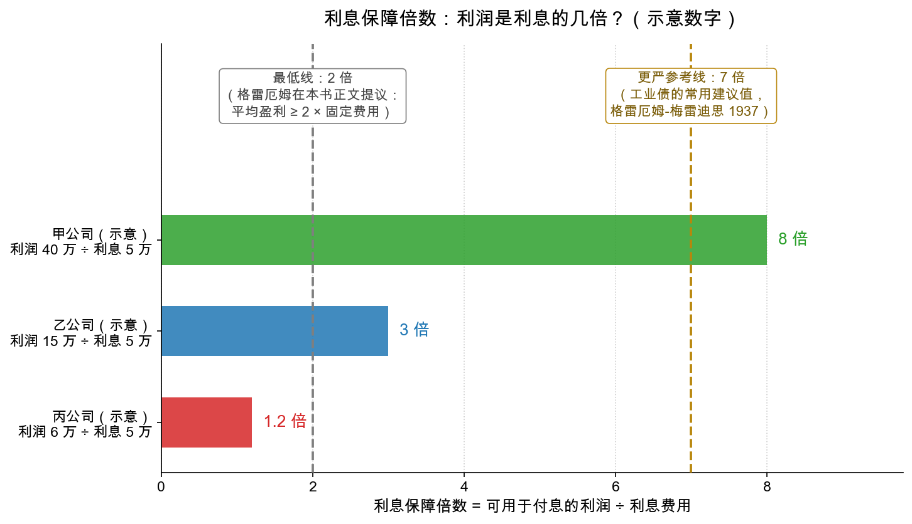

# 第 3 章：具体标准——什么样才算够格

> 本章你将：
> - 学会原则 IV：把"安全"翻译成一条条**可执行的硬标准**——标准是防情绪的护栏；
> - 走一遍格雷厄姆精选的选债清单：行业性质、规模、盈利记录、**利息保障倍数**；
> - 会算利息保障倍数，并记住两条参考线（2 倍的最低线与更严的 7 倍工业债参考线）；
> - 看清三个例外：什么情况下"抵押物"重新变得重要——设备信托、质押信托、房地产债；
> - 从 1920 年代的"评估价闹剧"里，学会对"评估值/评级"保持怀疑。

---

## 3.1 原则 IV：把标准写下来，交给清单而不是情绪

前三原则解决了"看什么"（能力、萧条、不拿利息换本金）。原则 IV 解决"怎么执行"：**选债应当适用排除规则和具体的定量标准**（原书 md 页码 195-196、221）。

格雷厄姆的灵感来自一个现成的制度：当年美国不少州为**储蓄银行**立了"法定清单"（legal list）——银行只能买清单上达标的债券。纽约州的法律要求债券满足七大类标准（原书 md 页码 222，当年背景，类别名称保留原文译法）：

| 序号 | 标准 | 检验什么 |
|---|---|---|
| 1 | 业务（或政府）的性质与地点 | 行业稳不稳、地在哪儿 |
| 2 | 企业（或发行额）的规模 | 体量太小经不起风浪 |
| 3 | 发行条款 | 期限、票息、担保结构 |
| 4 | 偿债与分红的记录 | 过去按时付息吗 |
| 5 | **利润与利息要求的关系** | 赚的是利息的几倍（本章主角） |
| 6 | 财产价值与债务的关系 | 抵押物值多少（有条件地看，见 3.3） |
| 7 | 股本与债务的关系 | 老板自己押了多少本钱 |

格雷厄姆的态度是"批判性继承"：他反对**类别一刀切**——纽约法一纸禁令把所有工业债、所有无担保公用事业债都扫地出门。原书在同一页留下了那句名言（md 页码 223）："**投资理论应当警惕轻易的概括。**"正确姿势是：类别有天然弱点，就用**更严的个体标准**去补偿——工业债可以买，但规模要更大、覆盖要更厚。

另一个方向他也泼冷水：**外国政府债**。理由很冷峻（原书 md 页码 225-227）：外国政府债本质是"**不可执行的合同**"——对方赖账，你既告不了它，也扣不了它的资产，还钱与否取决于政治考量。数据触目惊心：1932 年市场压力测试时，42 个发美元债的国家里，能在此前 12 年始终保持投资级地位的只有 3 个（加拿大、荷兰、瑞士）。当年的背景是两次大战之间的国际债务违约潮；当代表达是：买**主权债**或别国公司的债，要单独评估国家风险、外汇管制风险——"利率高 3 个点"往往就是对这种风险的定价。

> 📌 **划重点：** 标准不是保证书，而是**防情绪的护栏**。它防的不是"看不懂"，而是"看懂了但舍不得"——当你被 9% 的票息晃花眼时，清单会冷静地问：规模够吗？记录干净吗？倍数过线吗？下一节的数字就是护栏的横杆。

---

## 3.2 三条最核心的定量标准

### 标准一：规模——太小的不看

小公司抗风险能力弱：缺融资渠道、缺银行支持、一场行业逆风就能吹倒。格雷厄姆在原书 md 页码 230 给出一组**最低规模**建议（注意：这是 1939 年美元、当年的背景，绝对数值早已过时，但"划最低线"的思路永不过时）：

| 类型 | 建议最低线（当年） |
|---|---|
| 市政债：人口 | 1 万人 |
| 公用事业：年毛收入 | 200 万美元 |
| 铁路系统：年毛收入 | 300 万美元 |
| 工业公司：年销售 | 500 万美元 |

但他同时提醒（md 页码 231）："**最大的公司可能是最弱的——如果它的债券发得太多。**"规模是门槛，不是荣誉勋章；过了门槛之后，看的是债务结构（这一条 Week 7 讲资本结构时会展开成完整的一课）。

### 标准二：盈利记录——不止看平均值

格雷厄姆建议（原书正文脚注，md 页码 210）一条通用底线：**平均盈利要达到固定费用的 2 倍左右**。同时（经 Part II 导读引用的随书 CD 章节，md 页码 184、188）他还强调看三个维度：

- **趋势**：利润在往上走还是往下走？
- **最低值**：最差的那一年，还覆盖得住吗？
- **当前值**：现在这一年的成色如何？

三样里有一样欠缺，不必一票否决，但要把平均覆盖的要求抬到远高于最低线，并对定性因素更挑剔。这其实是 Week 7"平均盈利"主题的预告：**单年数字会撒谎，多年记录才是证据。**

### 标准三：利息保障倍数——最重要的单项检验

经 Part II 导读引用的随书 CD 章节里，格雷厄姆写道（md 页码 184）：**"当今的投资者已经习惯把'利润与利息费用之比'视为安全检验中最重要的具体指标。"** 它就是**利息保障倍数（interest coverage ratio）**：

$$\text{利息保障倍数} = \frac{\text{可用于付息的利润}}{\text{利息费用}}$$

分子的口径通常用"付息和交税之前的利润"（利息本来就是从这笔钱里付的），分母是这段时期要付的利息总额。举个例子（示意数字）：一家公司一年可用于付息的利润 40 万元，利息费用 5 万元，倍数就是 $40 / 5 = 8$ 倍——利润腰斩再腰斩，付利息的钱还有富余。

两条参考线怎么用：

- **2 倍——格雷厄姆在本书正文提议的最低线**（原书 md 页码 210 脚注："平均盈利达到固定费用的约 2 倍"）。低于它，直接出局。
- **7 倍——更严一档的工业债参考线**，出自格雷厄姆与梅雷迪思 1937 年合著的小册子《财务报表解读》（*The Interpretation of Financial Statements*）给工业债券的建议值（非本书正文，作为参考列出）。逻辑正是第 2 章那张"稳定性-门槛"表：工业生意波动大，门槛就要翻倍地抬。

你不必背数字，要带走的是这个**倍数感**：保障倍数不是"及格就行"的考试，而是"缓冲垫厚度"的测量——垫子多厚，取决于生意的颠簸程度。

---

## 3.3 什么时候"抵押物"重新变得重要：三个例外

第 1 章我们批了"抵押万能论"，但原书第 10 章（md 页码 232-241）诚实地列出了例外——当抵押物**不依赖这门生意也能变现**时，它就重新有了意义。

**例外一：设备信托债——当铺逻辑。** 铁路买机车、车厢时常用的融资方式：设备本身作抵押。妙处在于机车车厢是**可移动的**——这家铁路不要，别的铁路照样能拉货。原书打了个传神的比方：放款人可以像**当铺**一样，只看质押物本身放款，不管当东西的人混得怎么样（md 页码 233）。配套结构也稳：铁路自己先出设备款的至少 20%，借款不超过设备价值的 80%，本金分 15 年逐年还——债务掉得比设备折旧还快。当然原书也记录了反例（佛罗里达东海岸铁路某系列，变卖设备只收回 43 美分/美元）："几乎绝对安全"的话术要打折，但"可变现的抵押物"确实加分。

**例外二：质押信托债。** 拿股票债券作质押发的债，保护程度取决于质押品的价值与条款约束——同样走"看质押品"的逻辑。

**例外三：房地产债。** 房子是普通人最熟悉的"抵押物"，原书第 10 章却用了最大篇幅写它的**翻车史**。先看正常情况该长什么样（原书 md 页码 236 的例子）：一栋 1 万美元的住宅，年租金 1200 美元，扣掉税费开支后净收入约 800 美元；按"贷款不超过物业价值 $2/3$"的老规矩借 6000 美元，利率 5%，年利息 300 美元——净收入是利息的约 2.7 倍，而且租金就算跌去超过三分之一，付息仍有余。**在这类标的上，抵押物确实接近"独立于借款人生意"的保护**，因为房子的价值来自"总有人要住"的普遍需求。

然后是 1923-1929 年的闹剧（原书 md 页码 237，当年的背景）：房地产债大跃进时，发行文件里唯一的"保护"是一纸**评估价**——而且评估价几乎总是比债券发行额高出约三分之二。手法是拿当时的高租金"资本化"出一个漂亮数字：成本 100 万美元的大楼，"评估"出 150 万美元的身价，于是能按接近全成本发债，开发商一分钱不出还白赚现金。原书 footnote 里那家建筑公司：发了 123 万美元的债，实缴股本只有 7.5 万美元——**所谓的"安全垫"，本来就是纸做的**。等租金回落、造价下跌，整座纸牌屋轰然倒塌。

格雷厄姆由此给房地产债立了几条规矩（原书 md 页码 239-240），每条都值得抄进你的常识库：

1. 只认**真实成本或真实市价**，无视"评估价"，贷款不超过它的 $2/3$；
2. 收入测算必须保守：扣空置、扣楼宇老化后的租金下滑，付息后**余量至少翻一倍**，且要先扣掉一笔真正用于还本的折旧钱；
3. 发债人必须定期向债主提交经营和财务数据——信息黑箱是最大的风险；
4. **特殊用途建筑（酒店、车库、医院厂房）不算房地产债，算生意贷款**——它没有"总有人要"的普遍需求，必须按工业债的严格标准审。

> ⚠️ **易踩坑：把"评估价"和"评级"当事实。** 评估价可以"收费出具"，评级也可能失灵——2007 年美国次贷危机中，大批住房抵押证券从 AAA 直接跌进垃圾级，Part II 导读作者马克斯的原话（md 页码 192）：这正是"付钱买来的评估（和评级）制造了不当信心"的当代翻版。评估和评级是**参考**，你自己过一遍清单才是**判断**。

> 📌 **实战联系：** 在 A股/港股 做债券功课，这套清单的当代版是：① 主体规模与行业地位（国企/龙头 vs 小民企）；② 财报五年的付息记录与平均保障倍数（用 Week 2 的利润表自己算）；③ 增信措施按"清算打骨折"重估；④ 信息披露是否齐全（巨潮资讯网可查债券定期报告）。把第 5 章的检查清单打印出来，买任何"类债券"产品前过一遍。

---

## 3.4 本章小结

| 标准 | 及格线思维 | 一句话 |
|---|---|---|
| 规模 | 划最低线，低于不看 | 小公司经不起风浪；大不等于强，但小常常等于脆弱 |
| 盈利记录 | 平均 2 倍起步，看趋势/最低值/当前值 | 单年会撒谎，记录才是证据 |
| 保障倍数 | 2 倍最低线；工业生意用更严的线（参考 7 倍） | 量的不是"赚多少"，是"缓冲垫多厚" |
| 抵押物 | 默认靠不住 | 只有"离开生意仍可变现"的抵押物才有意义 |
| 评估/评级 | 一律怀疑 | 收费出具的漂亮数字，不是你的安全垫 |

到这里，选债的"事前功课"已经齐了。但还有半件事没说清：就算一切标准都过，债券的**价格**也会天天变——不违约，照样可能浮亏。下一章我们研究债券价格的两大开关：利率与信用。

## ✍️ 想一想

1. **手算：** 甲公司可用于付息的利润 15 万元，利息费用 5 万元；乙公司利润 6 万元，利息 5 万元。两家倍数各是多少？按"2 倍最低线"和"7 倍工业参考线"分别怎么判？
2. **压力测试：** 承上题，若行业下行让两家利润都跌一半，倍数变成多少？哪一家直接击穿最低线？
3. **应用：** 某理财产品的宣传页写着"底层资产为商业地产债权，物业评估价 12 亿元，融资 7 亿元，抵押率仅 58%，安全无忧"。学完本章，你会追问哪几个问题？

## 📖 回到原书

**原书位置：** 第 8 章《债券投资的具体标准》（Specific Standards for Bond Investment），本周阅读 md 页码 221-231（原书页码 169-179）；第 10 章《具体标准（续）》，md 页码 232-241（原书页码 180-189）。原书第 9 章（保障倍数等标准的展开）收录在随书 CD，本仓库文本没有，相关引文均经由 Part II 导读转引并已注明。

> Investment theory should be chary of easy generalizations.
>
> 投资理论应当对"轻易的概括"保持警惕。

一句话点评：既反对"工业债一概不能买"的一刀切，也反对"公用事业债一概安全"的一刀切——格雷厄姆永远站在"具体问题具体分析"这一边。

> But unfortunately they were purely artificial valuations, to which the appraisers were willing to attach their names for a fee, and whose only function was to deceive the investor as to the protection which he was receiving.
>
> 然而不幸的是，这些评估纯属人为炮制的数字：评估师收了钱就愿意把自己的名字签上去，而它们唯一的功能，就是让投资者误以为自己所受的保护货真价实。

一句话点评：写的是 1920 年代的房地产评估，读起来却像 2007 年的评级机构——80 年轮回，剧本没换过主角，只换了布景。

> **下一章预告：** 债券拿在手里不动，价格为什么天天变？两个开关：市场利率与信用信心——顺带破除"债券一定保本"的迷思。
