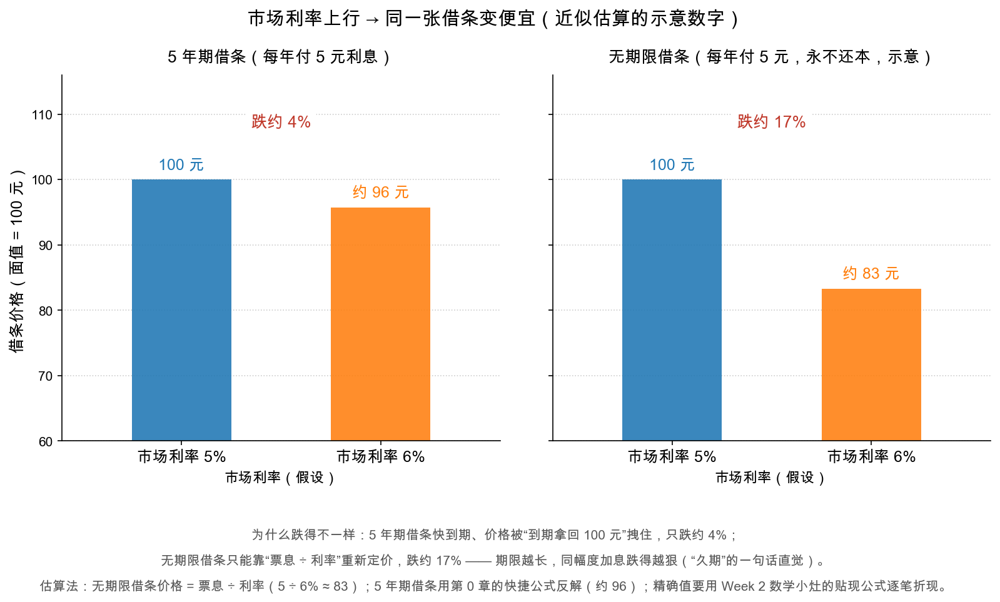

# 第 4 章：债券价格为什么波动——利率与信用

> 本章你将：
> - 打破"债券稳赚保本"的迷思：不违约的债券，价格也会天天变；
> - 学会债券亏钱的第二种方式：**利率上行 → 存量债券价格下跌**，并用两张手算看懂"反向关系"；
> - 理解为什么**期限越长，同幅度加息跌得越狠**（久期的一句话直觉）；
> - 认识第二个价格开关：**信用信心**——利差是市场给"怀疑"标的价格；
> - 听格雷厄姆劝一句：别去预测利率，那不是投资者的游戏。

---

## 4.1 债券的两种亏法

Week 1 讲过：投机者赚的是市场波动，投资者赚的是资产本身。那把债券拿在手里不动，还用管价格吗？要管。因为债券有两种亏钱的方式：

| 亏法 | 触发因素 | 影响的是 | 事后能挽回吗 |
|---|---|---|---|
| 第一种：**违约**（credit risk，信用风险） | 发行人还不起钱 | 拿回的本金和利息本身 | 很难，通常要打几年官司打折收回 |
| 第二种：**利率上行**（interest rate risk，利率风险） | 市场利率涨了 | 债券的**市场价格** | 能——拿到期就按面值还本，只是中途账面浮亏 |

本章重点讲第二种，因为它连好公司的好债券都躲不开：哪怕发行人稳如泰山，只要市场利率上行，你手里那张老借条的市价就会下跌。

---

## 4.2 老借条 vs 新借条：反向关系的手算

场景重现第 0 章：你持有一张面值 100 元、票面利率 5% 的借条。忽然，市场上新发的借条都给 6% 了。现在你想把老借条卖掉，买家会怎么想？

"每年才给 5 元，凭什么跟每年 6 元的新借条卖一个价？"想让买家动心，只有一个办法：**降价**。降到什么程度？降到让老借条的到期收益率也变成 6% 左右——价格负责把收益率"顶"上去。这就是全部机制：

> 📌 **划重点：** 票息是写死的，市场利率是活的。利率上行，存量债券的固定票息就不值钱了，价格必须下跌，把收益率抬回市场水平。**价格与利率，永远反向而行。**

**手算一：无期限借条（最极端的"长久期"）。** 假设有一张每年付 5 元、永不还本的借条（这种真实存在的品种叫永续债，perpetual bond，这里用作思想实验）。它的价格只有一个公式：

$$P = \frac{C}{r}$$

票息 $C$ 除以市场利率 $r$。利率 5% 时，价格 $= 5 / 0.05 = 100$ 元；利率涨到 6%，价格 $= 5 / 0.06 \approx 83.3$ 元。**加息 1 个点，价格跌约 17%。**

**手算二：5 年期借条（快到期的情况）。** 用第 0 章的快捷近似公式反解：要让它在新价格下的到期收益率变成 6%，价格得降到约 95.7 元——**同样加息 1 个点，只跌约 4%。**

把两个方向都算出来，列成一张表（均为近似估算的示意数字，无期限借条用 $P = C/r$，5 年期借条用快捷公式反解）：

| 市场利率 | 5 年期借条价格 | 无期限借条价格 |
|---|---|---|
| 4% | 约 104.5 元 | 125 元 |
| 5%（票面利率） | 100 元 | 100 元 |
| 6% | 约 95.7 元 | 约 83.3 元 |

两张图的差距说明了**期限的力量**。为什么无期限借条跌得狠？用 Week 2 数学小灶的贴现公式一想就通：债券价格是未来现金流的折现和 $\frac{CF_t}{(1+r)^t}$，离到期越远的钱，被 $(1+r)^t$ 消灭得越彻底——利率一动，"遥遥无期"的现金流全部重新定价，而 5 年后就能拿回 100 元本金的借条，价格被"到期按面值还钱"这个终点拽着，跌不动。这个"对利率变化有多敏感"的指标，行话叫**久期（duration）**——本周你只需要带走一句话直觉：**期限越长，同幅度加息跌得越狠；利率下行时，涨得也越狠。**

> ⚠️ **易踩坑：把"浮动亏损"不当亏损。** "反正拿到期就还本，中间跌就跌呗。"——这话对**个人持有到期**大体成立，但有两个前提：一，你真的能拿到期，中途不会被迫用钱、被迫割肉；二，发行人真还得起——如果价格下跌是因为市场怀疑它的信用（见下一节），"拿到期"未必等得到全额还本。看到债券基金净值回撤就说"债基骗人"，等于还没分清这两种亏法。

> 💡 **你可能会问：利率为什么会变？谁决定的？**
>
> 短期看央行的政策利率，长期看通胀预期与经济增速。这正是关键：**利率由宏观经济和央行决定，不由债券投资者决定**——所以格雷厄姆反复劝投资者别去"预测利率"（本章 4.4）。你能做的是理解机制、选择期限，而不是猜明年的利率。

---

## 4.3 第二个开关：信用信心与利差

利率是全体债券共享的开关，信用则是每只债券自己的开关。

回到第 1 章末尾埋的伏笔：同一家公司的第一抵押债和次级债，价差正常年份几个点，恐慌年份能拉大到 14 个点以上。原书第 6 章跟踪了几十年的 Atchison 铁路案例（md 页码 202-203）里最戏剧的一段：1938 年，铁路盈利恶化，次级的那只"调整债券"连 5 月 1 日的利息都一度付不出来，价格从 90 多跌到 $75\frac{1}{8}$，与优先债券的价差拉大到 24 个点；后来利息补付、信心恢复，1939 年价格又回到 96。

看懂了吗？这只债券的**条款一个字没变**，变的是市场对"它还得起吗"的答案。这个"公司债收益率超出无风险国债收益率的部分"，行话叫**信用利差（credit spread）**——它是市场给"怀疑"开出的价格。基本面恶化，利差走阔，价格下跌；基本面修复，利差收窄，价格回升。第 3 章清单里"保障倍数"那些硬标准，本质上就是在事前估计：这只债券的利差，在坏年景会走阔到什么程度。

> 📌 **划重点：** 债券价格 = 两个开关的叠加。**利率开关**（全体共享，看宏观）决定"钱本身值多少钱"；**信用开关**（每只独享，看公司）决定"这张借条配不配按足额还钱定价"。分析债，就是同时盯住两个开关。

---

## 4.4 格雷厄姆的劝告：别预测利率

既然利率对价格影响这么大，聪明人是不是该低买高卖、预测利率波段？原书（经 Part II 导读引用，md 页码 185）泼了一盆冷水，原话的力度一如既往：靠抓市场波动做债券交易，投资者很难成功；任何人若既想挑好个股又想踩准债券价格，这种努力"从根本上就是不合逻辑、自相矛盾的"——因为一旦把"交易"掺进投资，兴趣就会不可避免地滑向投机。

格雷厄姆那个年代还有个有趣的背景（当年的背景，原书 md 页码 191）：1926 到 1938 年间，40 只公用事业债的平均收益率只在 3.9% 到 6.3% 之间小幅摆动——利率时代的大波动是后来才有的现象。今天利率波幅大得多，但结论反而更成立：**连专业机构都做不好的利率预测，个人更不该把它当饭吃。** 这和第 2 章的"从最低标准往上挑"是同一种精神：把功夫花在**可以知道的事情**上（公司还得起吗），放下**不可知道的事情**（明年利率几何）。

格雷厄姆还留了另一句常被引用的话（md 页码 185）："**没有永久的投资（There are no permanent investments）。**"买入时合格的债券，几年后可能不再合格——所以持有不是终点，定期复查（Week 4 会讲怎么复查）才是投资的完成时。

## ✍️ 想一想

1. **手算：** 一张每年付 4 元、永不还本的借条，市场利率 4% 时价格是多少？利率升到 5% 呢？跌了百分之几？
2. **概念：** 央行宣布加息，同样票面的 2 年期债和 30 年期债，哪只跌得狠？用"折现消灭远期现金流"的语言解释。
3. **判断：** 某债券没有加息，市价却一个月跌了 15%，而同期市场利率几乎没动。最可能发生了什么？你该去查哪类信息？

## 📖 回到原书

**原书位置：** Part II 导读，Howard Marks《Unshackling Bonds》，本周阅读 md 页码 175-192（原书页码 123-140）。以下两段是马克斯转引的 1940 年版原文（关于债券择时的一段出自原书相关章节，导读注明页码 261）。

> It is doubtful if trading in bonds, to catch the market swings, can be carried on successfully by the investor. … Much as the investor would like to be able to buy at just the right time and to sell out when prices are about to fall, experience shows that he is not likely to be brilliantly successful in such efforts.
>
> 投资者靠捕捉市场波动来交易债券，能否成功是大可怀疑的。……投资者再怎么渴望在恰好的时点买入、在价格即将下跌前卖出，经验都表明：他不太可能在这种努力上大获全胜。

一句话点评：债券版的"别择时"——把钱押在利率预测上，本质是放弃了自己唯一真正的优势（分析具体公司），去参加一场没有胜算的猜谜。

> "There are no permanent investments."
>
> "世上没有永久的投资。"

一句话点评：九个字的风险管理总纲——买入时的合格，不等于永远的合格；持有是一种每天都要重新赢得资格的状态。

> **下一章预告：** 从理论落到口袋：普通人今天在 A股/港股 能碰哪些债券工具？高息债到底该不该碰？——格雷厄姆式的答案，外加一张买债检查清单。
