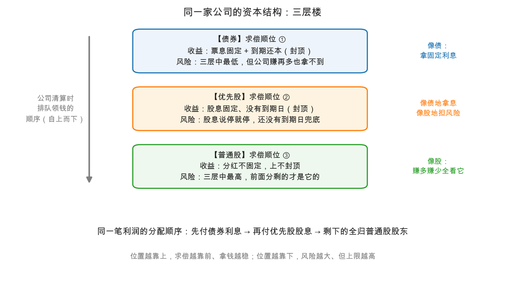

# 第 0 章：优先股——介于债与股之间的混血儿

> 本章你将：
> - 看懂**优先股（preferred stock）**这张"混血证券"的全套证件：固定股息、没有到期日、没有投票权；
> - 用一张**资本结构层叠图**搞清债券、优先股、普通股在同一家公司里的位置、求偿顺序与风险收益特征；
> - 学会格雷厄姆给优先股定的**更严标准**和"总扣减法"账算法（附 1930 年代真实手算案例）；
> - 知道"**非累积**条款"这颗最大的雷长什么样；
> - 把这套眼光落到当代：银行永续债、REITs 分层这些"新瓶装混血酒"的品种怎么辨别。

---

## 0.1 上周埋的扣子：两个"债不像债"的成员

Week 3 结尾我们说过，债券的世界里全都是防守——回报封顶，功夫全花在"别把钱借给还不起的人"上（没读过或忘了的，回看[第 0 章：债券是一张放大了的借条](../week3/00-债券是什么-一张放大了的借条.md)）。当时还留了一个预告：固定价值家族里还有两个"债不像债"的成员，一个是**优先股**，一个是**可转债**。

慢着，有读者可能会问：优先股不也是"股"吗，为什么放在债券周讲？问得好——这正是优先股的全部尴尬所在。它长着股票的脸（没有还本期限、股息可以停发），却揣着债券的心（股息率白纸黑字写死，涨起来没有它的份）。格雷厄姆在原书里给它的定位非常刻薄也非常准确：**收益是封顶的，风险却是不封顶的**——把两种证券最差的特征缝在了一起。

原书优先股的"理论篇"（第 13、14 章）恰好收录在随书 CD 里，本仓库文本没有；但没关系，第 15 章的技法讨论把结论讲得一清二楚。我们本章就踩着第 15、16 章的原文走。

## 0.2 优先股是什么：一张没有到期日的借条

先回到小满的奶茶店。Week 2 里小满已经会看三张表了，现在生意做大，要开第五家分店，缺 100 万。摆在面前三条路：

1. **再借钱**：可开到第五家店了，负债率已经不低，再借新债，银行要涨价（利率上浮），老债主也不同意（想想 Week 3 讲的"求偿顺序"，新增债务会稀释老债主的保护）；
2. **发新股**：找合伙人出钱、分利润，但小满的表决权会被稀释，以后店里的事就不能一个人说了算；
3. **发明一个新品种**：来一笔"股息率写死为每年 6%、破产时排在普通股前面赔、但永远不用还本"的钱。

第三条路，就是**优先股**。对发行人来说它的妙处在于：股息是**固定的**（不像普通股分红随利润浮动），但本质是股本（不用像债券那样到期还本，欠付股息也不构成违约）。代价是：必须给出比债券更高的回报、更硬的承诺，才有人肯买这个"三明治品种"。

把"三明治"画出来更直观。同一家公司，钱从哪来、谁排在哪一档，就是它的**资本结构（capital structure）**：

看图记住两句话：

- **利润往下流**：先付债券利息 → 再付优先股股息 → 剩下的才轮到普通股；
- **清算往上排**：公司散伙变卖家产时，顺序反过来，债券先赔，优先股次之，普通股拿残羹（Week 1 第 4 章的"求偿顺序金字塔"，这里正式展开）。

下面这张表把三层楼彻底摆平，建议存下来：

| 特征 | 债券 | 优先股 | 普通股 |
|---|---|---|---|
| 回报形式 | 票息（固定） | 股息（固定） | 分红（不固定，上不封顶） |
| 到期日 | 有，到期还本 | **没有** | 没有 |
| 回报上限 | 封顶 | 封顶 | 不封顶 |
| 公司赖账时 | 可以起诉、申请其破产 | **起诉也没用**，只能等、只能闹 | 无可起诉 |
| 破产清算顺位 | 第 1 | 第 2 | 第 3 |
| 表决权 | 无（但违约后话语权大） | 一般无 | 有 |
| 风险从低到高 | 低 | 中 | 高 |

> 📌 **划重点：** 优先股 = 债券的收益（封顶）+ 比债券差得多的法律地位（无到期日、无强索权）。**收益按债算，安全按股算**——这就是格雷厄姆嫌弃它的全部理由。

## 0.3 格雷厄姆的账：要买优先股，标准得比债券更狠

既然优先股的"合同地位"全面弱于债券，那么逻辑上只剩一条出路：**用更厚的安全垫去补更软的合同**。原书第 15 章开篇就把这个结论钉死：

> an investment preferred issue must meet all the requirements of a good bond, with an extra margin of safety to offset its contractual disadvantages.
>
> 一只够格投资的优先股，必须满足一只好债券的全部要求，**再外加一层额外的安全余量**，用来抵偿它在合同上的劣势。

"额外的安全余量"具体是多少？格雷厄姆给出了比债券更严的门槛（1940 年建议值，历史口径照抄原书）：

| 企业类型 | 投资级债券要求（利润/固定费用） | 投资级优先股要求（利润/（固定费用+优先股息）） |
|---|---|---|
| 公用事业 | 1.75 倍 | 2 倍 |
| 铁路 | 2 倍 | 2.5 倍 |
| 工业公司 | 3 倍 | 4 倍 |

注意右边一列的分母：**利息和优先股息要加在一起算**。这就是本节最值钱的方法论——**总扣减法**。

### 手算案例：一份"注水"的成绩单

原书举了一个 1929 年的真实案例（历史数字照抄）：科罗拉多燃料与钢铁公司（Colorado Fuel and Iron）当年账面数字如下——

- 可用于付息的利润：397.8 万美元
- 利息费用：162.8 万美元
- 优先股息：16 万美元

**习惯算法（错误）**：利息保障 $397.8 \div 162.8 \approx 2.4$ 倍；然后"付完利息剩下的归优先股"——$(397.8 - 162.8) \div 16 \approx 14.7$ 倍（原书口径），报表上还写着"每股优先股盈利 117.50 美元"。看起来"优先股息被赚了十几倍"，稳得很？

**总扣减法（正确）**：$(397.8) \div (162.8 + 16) \approx 2.2$ 倍。优先股的股息保障**只有 2.2 倍**，远低于格雷厄姆给工业优先股定的 4 倍线——不配投资级。

> 💡 **你可能会问：为什么"每股优先股赚了多少元"这种最常见的算法是错的？**
>
> 因为它把利息"藏"起来了。优先股排在债券**后面**，它的股息天然比利息**更危险**；可"每股盈利"的分母里没有利息，算出来的数字反而比利息保障还漂亮。格雷厄姆的原话近乎怒吼：这种表述"要么毫无意义，要么危险得误导人"——它暗示同一公司的优先股股息比债券利息还安全，"彻底荒谬"（an utter absurdity）。他还举了西宾夕法尼亚电气（West Penn Electric）A 类股的例子：习惯算法显示保障 7.43 倍，正确算法只有 1.26 倍，一池浑水养肥了 1937 年追高的买家。
>
> 记忆钩子：**排在后面的人，必须按"把前面所有人一起喂饱"来算安全感。**

### 一个绕不开的悖论

这里有个初学者最容易晕的地方，格雷厄姆专门花了一段解释：优先股股东**要求的**覆盖倍数比债券高（4 倍 vs 3 倍），可数学上优先股**实际能拿到的**覆盖倍数必然比债券**小**（分母多了优先股息）。这不是矛盾，而是大实话：

> the preferred stock can be safe enough only if the bonds are much safer than necessary.
>
> 只有当这家公司的债券**安全到绰绰有余**时，它的优先股才可能有安全感。

翻译成人话：**优先股的安全性完全是"蹭"债券的富裕**。债券刚好及格，优先股就不及格；债券大幅超标，优先股才有戏。所以投资级优先股必然稀少——这是它尴尬地位 arithmetic（算术层面）的注脚。

## 0.4 最大的雷：非累积条款

优先股股息欠付有两个版本，差别巨大：

| 版本 | 英文 | 欠的股息怎么办 |
|---|---|---|
| 累积优先股 | cumulative preferred | 欠息滚存，**补齐之前普通股不得分红** |
| 非累积优先股 | non-cumulative preferred | 今年没派就**永远没了**，明年照常 |

非累积条款的阴毒之处，格雷厄姆点得透彻：它给了董事会一个**合法克扣**的选项——哪怕年景很好、股息完全赚得出来，也可以一分不派，省下来的钱全部润了普通股股东。现实里的规律是：非累积股息"很少被支付，除非是为了给普通股分红铺路"；而一旦普通股分红停了，优先股息往往紧接着也停了。

案例在原书页脚里，惨烈程度值得单独一块牌子。美国客车铸造公司（American Car and Foundry）7% 非累积优先股：1928 年之前已连续派息 30 年，其间 20 年股价从未跌破 100——妥妥的"金字招牌"。然后呢？1932 年停派股息，股价跌到 **16**。30 年的记录，两个大牛市周期，最后连本带利地教育了所有"看历史派息"的买家。

> ⚠️ **易踩坑：** "连续 N 年分红"是**历史**，不是**权利**。对优先股来说，关键不是它派没派过，而是**欠了必须补**（累积条款）这条硬规则在不在合同里。格雷厄姆的建议干脆利落：非累积优先股的成绩再漂亮，也尽量选累积品种，为的是"万一风向不测"时手里多一张牌。

## 0.5 21 只幸存者的名单：形式不重要，身体才重要

1932 年市场大底，纽约证券交易所挂牌的 440 只优先股里，能按投资级连续交易的只有 **21 只**——5% 的及格率，用惨烈的方式印证了"优先股整体是劣质品种"。但这份幸存者名单的构成，反而推翻了若干"想当然"：

- 其中 4 只竟然是**非累积**的；好几只前面**垫着债券**（理论上该减分）；
- 行业分布最集中的冠军，居然是**鼻烟行业**——3 家公司全部上榜；
- 有 1 只面值只有 1 美元，有 1 只是"第二优先股"，只有 1 只设了偿债基金。

格雷厄姆借这份怪名单说出本章最重要的方法论（这段话超出优先股，值得背下来）：

> matters of form, title, or legal right are relatively immaterial, and that the showing made by the individual issue is of paramount importance.
>
> 形式、名目或法律权利上的条条框框，相对来说无关紧要；**个别证券交出的成绩单才是压倒一切的**。

鼻烟公司不是因为它"鼻烟"而安全，是因为生意稳定得惊人。反过来，一家"名字光鲜、条款漂亮"的公司照样能塌。所以别用标签选证券——用**长期记录 + 生意本身的稳定性 + 看不到变坏的具象理由**这三件套去选。原书把这称为固定价值投资"唯一可靠的基础"。

## 0.6 当代落点：A股/港股的"类优先股"去哪了

直接叫"优先股"的品种在 A股不多：2014 年《优先股试点管理办法》出台后，首批发行人几乎全是银行（如工商银行、中国银行等），目的很单纯——优先股计入银行资本的"其他一级资本"，用来满足资本充足率监管。这类优先股的股息同样"不保"：利润不够或监管指标不达标时可以不派，发行人也几乎没有动力派给自己找麻烦。

更值得普通投资者警惕的，是三种"换了马甲的优先股思维"：

1. **银行永续债**：名字带"债"，但通常没有固定期限、利息可以**递延**（递延不构成违约）、遇到触发条件还能**减记**本金——把 0.4 节的非累积雷和 Week 1 第 4 章的"混血儿"地图合起来看，它在三层楼里的真实位置远比"债券"两个字靠下；
2. **REITs 的分层结构**：公募 REITs 常见"优先/劣后"安排，"优先级"拿固定收益、劣后级兜底——买"优先级"之前，先问一句：劣后那一层够厚吗？这其实就是"股本缓冲垫"问题；
3. **港股优先股/永续证券**：港股大量机构发行人发行永续证券（perpetual securities），票息常有"重设"机制，条款千奇百怪——记住看条款，不看名字。

> 📌 **实战联系：** 以后在任何产品名称里看到"**永续**""**次级**""**可递延**""**可减记**"这类字眼，先别看票面利率有多香，先问：这东西在资本结构三层楼里**真实站在哪一层**？利息能不能停？本金能不能砍？格雷厄姆 1940 年给优先股的三问（覆盖够不够厚？前面垫着多少债？合同有没有雷？），今天照样好使。

## ✍️ 想一想

1. **手算（总扣减法）：** 某工业公司今年可用于付息的利润 6.5 亿元，利息费用 1.2 亿元，优先股息 0.25 亿元。用格雷厄姆的总扣减法算优先股股息保障倍数，达到 4 倍的投资级标准了吗？再算"习惯算法"的每股口径会把人忽悠到什么程度？
2. **概念题：** 朋友说："这只非累积优先股过去 15 年从未断过息，比很多累积优先股还稳，可以当债券买。"用本章的两个工具（合同地位 + American Car and Foundry 案例）反驳或修正他。
3. **判断题：** 银行永续债票面利率 5.8%，同一家银行 5 年期金融债利率 2.6%。利率差接近一倍，主要是在补偿什么？用"三层楼"的语言描述这两种证券各自站的位置。

## 📖 回到原书

**原书位置：** 第 15 章《Technique of Selecting Preferred Stocks for Investment》（为投资而选择优先股的技法），本周阅读 md 页码 242-253（原书页码 190-201）。本章全部案例与倍数均出自该章。

> Our discussion of the theory of preferred stocks led to the practical conclusion that an investment preferred issue must meet all the requirements of a good bond, with an extra margin of safety to offset its contractual disadvantages.
>
> 我们对优先股理论的讨论，引出了一个实践结论：够格称为投资的优先股，必须满足一只好债券的全部要求，并额外再加一层安全余量，以抵偿它在合同地位上的劣势。

一句话点评：一句话说完优先股的全部悲剧——它的"债"只体现在收益上，它的"债"的**保护**却一点不沾；想让它合格，只能用更厚的安全垫去硬补。

> An outstanding record for a long period in the past, plus strong evidence of inherent stability, plus the absence of any concrete reason to expect a substantial change for the worse in the future, afford probably the only sound basis available for the selection of a fixed-value investment.
>
> 过去长时期的出色记录，加上生意本身内在稳定性的有力证据，再加上找不到任何具体理由预期未来会显著变糟——这大概就是选择固定价值投资的唯一可靠基础。

一句话点评：注意格雷厄姆没说"行业""名字""条款"——名单里连鼻烟公司都有，靠的全是这三件套；这条标准放到今天选债、选高息股，一个字都不用改。

> **下一章预告：** 优先股的合同这么软，那债券的合同是不是就硬了？下一章我们打开借钱合同本身，看看那些护栏条款为什么"写在纸上是弱保护"。
