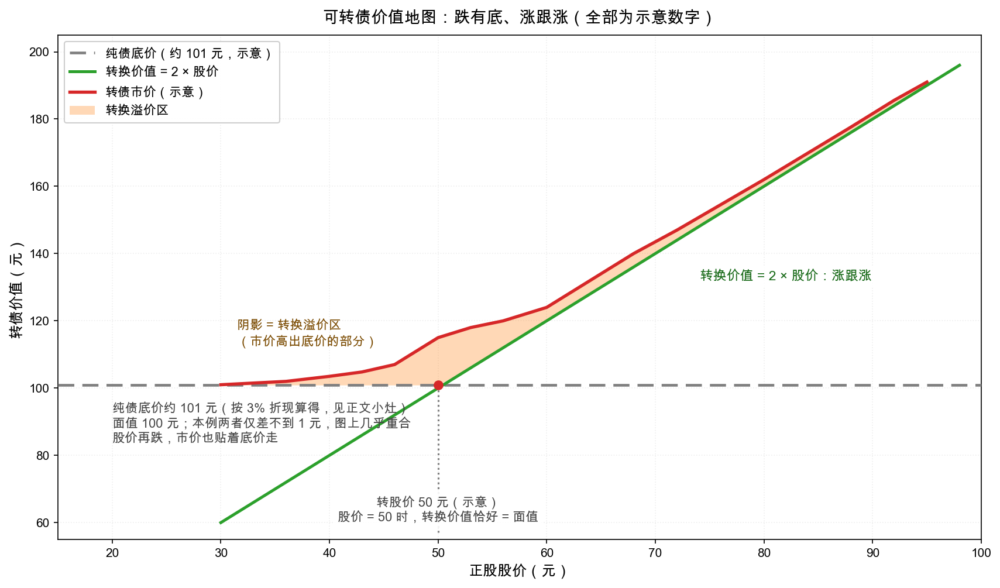

# 第 2 章：可转债——进可攻退可守的变形金刚

> 本章你将：
> - 认识**特权证券（privileged issues）**家族的三兄弟：转换、参与、认股权证，重点拆解**可转换债券（convertible bond，简称可转债/转债）**；
> - 手算四个核心概念：**转换比率、转换价值、转换平价、转换溢价**；
> - 看懂一张"价值地图"：债券底价托底、转换价值领跑、市价在两者之上——"跌有底、涨跟涨"到底是怎么回事；
> - 记住格雷厄姆的纪律：要么纯投资、要么纯投机，**不站在中间**；以及"典型情况下，投资者不应转股"这条反直觉规则；
> - 搞懂反稀释条款（转股价为什么会调整）和"滑动条款"的坑。

---

## 2.1 一张附带"变身卡"的借条

Week 3 开头我们说过，债券是个"回报封顶"的世界：公司赚翻了，你也只拿票息。于是从债券出世的那天起，就有人琢磨：能不能给借条加一张**变身卡**——公司要是真发达了，让我按约定的价格把借条换成股票，跟着喝口汤？

这个想法催生了原书第 22 章定义的**特权证券**家族，官方名单上有三种特权：

| 特权 | 英文 | 一句话解释 | 想象成 |
|---|---|---|---|
| 转换权 | conversion | 按约定条件把债券/优先股**换成**普通股 | 借条上附一张变身卡 |
| 参与权 | participation | 普通股分红多时，高级证券**跟着多拿**股息 | 借条上附一张"分红跟涨券" |
| 认股权 | subscription warrant | 有权按约定价格**另掏钱买**新股 | 借条上附一张优惠券 |

三者里最流行、也最值得花一整章的是**可转换债券**。它同时具备两个身份：

- **债的身份**：定期收利息，到期还本，公司破产时排在股东前面；
- **股的期权**：股价涨过转股价后，把它换成股票（或干脆按股票的价格卖掉），分享上涨。

听上去像永动机：跌，有债券托底；涨，有股票带飞。格雷厄姆承认"在形式上它确实是最迷人的证券"——**最大安全与无限升值听起来可以兼得**。但原书紧接着给了当头一棒：这类证券的实际投资记录乏善可陈。为什么？这一章就把这笔账算给你看。

## 2.2 手算四概念：读懂转债的"汇率"

先建一套小账本。**所有数字均为示意教学数字**，结构照搬 A股转债与原书案例的通行设置：

- 转债面值：100 元
- **转股价（conversion price）**：50 元/股——约定每 100 元面值可以按 50 元一股的"优惠汇率"换成股票

由此推出第一个概念：

$$\text{转换比率} = \frac{\text{面值}}{\text{转股价}} = \frac{100}{50} = 2 \text{（股）}$$

即每张转债可换 **2 股**股票。

**转换价值（conversion value）**：把转债立刻换成股票、立刻卖掉，值多少钱？就是"手里那点股票的市价"：

$$\text{转换价值} = \text{转换比率} \times \text{股价} = 2 \times \text{股价}$$

- 股价 40 元：转换价值 $= 2 \times 40 = 80$ 元；
- 股价 50 元：转换价值 $= 100$ 元——恰好等于面值，这条分界线就是"转股价"的经济学含义；
- 股价 60 元：转换价值 $= 120$ 元。

**转换平价（conversion parity）**：反过来问——转债现在卖 110 元，相当于股票什么价？$110 \div 2 = 55$ 元。转债市价"折算"成的股票价格就叫平价；转债价格除以转换比率即可。当你发现转债 110 元而股票才 50 元，你就知道：**转债里含 5 元的"变身费"**。

**转换溢价（conversion premium）**：变身费的正式名字，通常用比率表示：

$$\text{溢价率} = \frac{\text{转债市价} - \text{转换价值}}{\text{转换价值}} \times 100\%$$

例如转债卖 115 元、转换价值 100 元（股价 50），溢价率 $= (115 - 100) \div 100 = 15\%$。

### 把账本画成地图

上面三个点连起来，就是可转债的全景图：

图上三条线，请逐一认脸：

1. **灰色虚线（债券底价）**：图上先画成 100 元水平线（示意，为了看清结构）。股价再怎么崩，转债好歹是一张债——本金和利息还在那里，这是"底"。真实底价要按票息与到期赎回价**逐笔折现**算出来，通常不等于面值（下一小节手算；它的成色取决于发行人的信用，本节末尾就说它不是铁底）；
2. **绿色斜线（转换价值）**：$2 \times$ 股价，股价涨它就跟涨；
3. **红色曲线（转债市价）**：永远取"底价与转换价值的较大者"，再往上加一点**溢价**。股价越低，市价越贴近底价（变身卡还没用，值钱的是那张债）；股价越高，市价越贴近转换价值（变身卡快到期兑现，溢价被磨平）。

红绿两线之间的橙色阴影，就是**转换溢价区**——你为期权支付的价格。

### 手算小灶：底价那一百元是怎么算出来的

图上那条线先画在 100 元，是为了看清结构。真实的底价要一笔一笔算——把债券承诺的现金流按市场利率折回今天，再加总（贴现公式见 [Week 2 第 5 章](../week2/05-数学小灶-复利与贴现.md)）。

取一只 6 年期转债的典型结构（数字为示意）：票息前五年 0.3、0.5、1.0、1.5、1.8 元，第六年 2.0 元；到期赎回价 **115 元**，按通行写法**已含第六年利息**（115 = 面值 100 + 第六年利息 2.0 + 13 元补偿）。所以第六年只算这一笔 115，**不再另加票息**。再假设市场对这家发行人的要价是 3%（同信用等级、同期限债券的市场利率）：

| 年 | 1 | 2 | 3 | 4 | 5 | 6 |
|---|---|---|---|---|---|---|
| 现金流（元） | 0.3 | 0.5 | 1.0 | 1.5 | 1.8 | 115 |
| 贴现因子 $1/(1.03)^t$ | 0.9709 | 0.9426 | 0.9151 | 0.8885 | 0.8626 | 0.8375 |
| 现值（元） | 0.29 | 0.47 | 0.92 | 1.33 | 1.55 | 96.31 |

$$PV = \frac{0.3}{1.03} + \frac{0.5}{1.03^2} + \frac{1.0}{1.03^3} + \frac{1.5}{1.03^4} + \frac{1.8}{1.03^5} + \frac{115}{1.03^6} \approx 100.9 \text{（元）}$$

**约 101 元，这就是纯债底价。** 三个容易漏掉的口径：① 第六年不再另加票息（赎回价已含）；② 折现率用**市场利率**，不是票面利率——票面写死、市场是活的（[Week 3 第 4 章](../week3/04-债券价格为什么波动-利率与信用.md)）；③ 算出来**高于**面值，是那 13 元补偿把前五年的低票息补了回来——底价不等于面值，也不一定低于面值。

三条线里最会动的是折现率。同一串现金流：市场要 2.5% 时底价 103.8 元，要 4% 时只剩 95.3 元，要 5% 时 90.1 元。**公司信用恶化，市场就要求更高的折现率，底价跟着往下塌**——这就是"底的成色取决于发行人"的算术版。

> 📌 **划重点：** 债券底价是**算出来的一个数**，不是券面上印着的 100 元。它由三样东西共同决定：现金流（票息与到期赎回价，合同写死）、折现率（市场利率与发行人信用）、剩余年限。

### 对答案：原书的 1930 年代同款例子

这张图不是我发明的，它的原始版本画在原书第 22 章里（历史数字照抄）：一只高等级 3.5% 债券，面值 100，按 50 元转股价可换 2 股，买入时股价 45。格雷厄姆推演——

- 股价跌到 35：转换价值只剩 70，但债券**依然接近 100**——底价托住了（这就是"技术优势"：持有人的下场比股东好得多）；
- 股价涨到 55：转换价值 110，债券涨到 **115 上下**（转换价值加一点溢价）；
- 股价再涨到 65：转换价值 130，债券也就卖 **130 上下**——注意，从这一刻起，债券的价格**完全由股票价格决定**。

## 2.3 涨过头之后：你的"债"悄悄变成了"股"

原书那个例子最精彩的是下半场。股价 65 之后：持有人想继续赚，就只能眼睁睁看着债券价格被股票牵着走——"要想多赚，就得把已经到手的利润押回去赌"。格雷厄姆算了一笔狠账：**当转债涨到面值的约 1.3 倍以上时，你的"投资仓位"实际上已经变成了"股票仓位"**；如果一路拿到 180（股价 90），"从一切实用目的看，你已经承担了股东的身份和风险"——票息那点收入，在 180 元的持有成本面前形同遮羞布。所以他说：

> The unlimited profit possibilities of a privileged issue are thus in an important sense illusory.
>
> 特权证券"利润上不封顶"的可能性，从一个重要的意义上说，是**虚幻的**。

虚幻在哪？上不封顶的利润属于**股东**。想在转债上兑现它，你就得转股或按天价持有，也就完成了从债主到股东的身份偷渡。保守地说，投资型买入的转债，能"落袋"的利润区间通常就在**面值的 25%-35% 以内**——过了这条线，你拿的已经不是债了。

> 📌 **划重点：** 可转债的"涨跟涨"不是免费午餐——涨幅越大，它越不像债；当市价远超底价时，"债券保护"四个字已经名存实亡。

## 2.4 格雷厄姆的三条纪律

把 1926-1929 年的学费提炼成规则，原书给了三条，条条锋利。那几年的实际情况是（原书原话的直译）：**实力雄厚的大企业发普通股融资，把带特权的优先证券留给实力较弱的公司**——于是这类券的整体投资记录乏善可陈：

**纪律一：要么纯投资，要么纯投机，别站中间。** 原话是：

> A privileged senior issue, selling close to or above face value, must meet the requirements either of a straight fixed-value investment or of a straight common-stock speculation, and it must be bought with one or the other qualification clearly in view.
>
> 一只在面值附近或以上交易的特权高级证券，必须**要么**满足纯固定价值投资的全部要求，**要么**被当作一股普通的股票投机来对待——买它之前，你必须想清楚自己拿的是哪一个。

格雷厄姆反对"中间路线"的理由很心理学：抱着"债券的安全 + 股票的上涨"幻想买入的人，通常是**放松了安全标准**去换一张变身卡——跌下来才发现底是纸糊的；而想借转债"降低投机风险"的人，注意力在"公司前景"和"条款优劣"之间来回摇摆，最后不知道自己到底是股东还是债主。他的评语精炼到只有六个字：糊涂、自欺、亏钱。

**纪律二：能兑现时就兑现。** 投资型买入的转债涨了 25%-35%，就该卖出、换下一只还在面值附近的好券——像收庄稼一样滚动。原书给的节奏示例：100 买入、125 卖出、换一只面值附近的新券。

**纪律三：典型情况下，不要转股。** 这是全书最反直觉的规则之一：

> In the typical case, a convertible bond should not be converted by the investor. It should be either held or sold.
>
> 在典型情况下，投资者**不应把可转债转成股票**——要么继续持有，要么直接卖掉。

道理想通很简单：转股的那一刻，你亲手扔掉了优先权和"到期还本"的硬承诺——而这正是你当初买入的全部理由。之后股价若塌，你损失的不只是利润，还有本金。更优雅的做法是：**直接在市场上卖掉转债**（市价里已经包含转换价值），钱货两清，身份干净。原书还有一句著名的警示，值得每个被"进可攻退可守"广告词打动的人抄下来：

> there is something insidious about even a good convertible bond; it can easily prove a costly snare to the unwary.
>
> 即使是**一只好的可转债**，也有它阴险的一面；对粗心大意的人来说，它随时可能变成一只代价高昂的陷阱。

## 2.5 技术细节小抄：转股价为什么会变

最后补两块技术拼图，后面第 5 章读 A股条款时直接复用。

**反稀释条款（anti-dilution clause）**：如果公司送股、拆股、低价增发，原有股东的每股含金量被稀释，转债若不跟着调转股价，变身卡就贬值了。所以转债契约都规定：转股价要按比例下调。通用公式是"加权平均"：

$$C' = \frac{C \times O + N \times P}{O + N}$$

其中 $C$ 是原转股价，$O$ 是现有总股本，$N$ 是新发股数，$P$ 是新发价格。手算一遍：总股本 1000 万股、转股价 50 元，现以 30 元增发 200 万股，则新转股价

$$C' = \frac{50 \times 1000 + 30 \times 200}{1000 + 200} = \frac{56000}{1200} \approx 46.7 \text{（元）}$$

转股价从 50 降到约 46.7，每张转债能换的股数从 2 股涨到约 2.14 股——稀释被"补"回来了。注意格雷厄姆的提醒：这套保护只保**面值**，不保**溢价**。他的例子：转债和股票都炒到 200，公司按 100 配股、配股权值 50，除权后股票只值 150——未转股的转债瞬间损失约四分之一的市值，而反稀释条款**管不着**。溢价越大，这个软肋越疼。

**滑动条款（sliding scale）**：另一种"随时间或随进度提高转股价"的设计——早转股便宜、晚转股贵，逼持有人尽早就范。格雷厄姆把它骂得很惨：它给变身卡装了定时器，"直接违背了这种特权应有的自由选择"。他举的 Hiram Walker 转债（1936-1939 年）正股从约 26 涨到 54，若转股价一直是 40，债券本该涨到 135 以上，实际却被分期上调的转股价摁在 100-111 区间——**股票翻倍，转债原地**。碰到这类条款，多漂亮的公司也要多留个心眼。

> 💡 **你可能会问：第 5 章要讲的 A股"下修条款"，就是滑动条款吗？**
>
> 恰好相反，方向完全不同。滑动条款**上调**转股价、从持有人身上收租；A股的"下修"是公司**主动下调**转股价、给持有人让利——为什么天下会有这种好事？因为A股转债的发行人压根不想还钱，他想让你转股，把债变成股本。这个动机，正是第 5 章"下有保底"故事的钥匙。

## 2.6 当代落点：A股把这只"变形金刚"玩成了国民品种

原书 1940 年的结论是：好的可转债稀少，多数特权证券是为"补信用短板"而生的。有趣的是，八十年后的 A股把这件事反过来做了：可转债成了上市公司标准的融资工具，条款高度标准化，还发展出下修、回售、强赎一整套格雷厄姆没见过的机制——"跌有底"从理论变成了可以逐条阅读的合同条款。这是不是意味着 A股转债就是格雷厄姆梦想中的"安全 + 上行"？不全是：底价依赖发行人信用、溢价照样可能很贵、强赎照样会"请"你下车。完整答案在第 5 章实战拆解。

现在，请先记住本章的三句话：**转换价值是跟涨的绳子，债券底价是托底的网，市价高出转换价值的部分是你为期权付的钱。**

## ✍️ 想一想

> 建议**先自己写两句话再看答案**。想不清楚的地方，就是下一遍该重读的地方。

### 问 1：转债四概念一把算清

**手算四连：** 某转债面值 100 元，转股价 25 元，正股现价 30 元，转债市价 132 元。求：转换比率、转换价值、转换平价、转换溢价率。

**解题思路：** 四个概念是四个不同的"口径"，别串门：**转换比率**只由面值和转股价决定（股价涨跌不影响它）；**转换价值**是"立刻换成股票、立刻卖掉值多少"（比率乘股价）；**转换平价**是"转债市价折合成的股价"（转债价格除以比率）；**转换溢价率**的分母是转换价值，不是转债市价。算完再拿 2.3 节那条"面值约 1.3 倍"的线量一量这只券现在是什么身份。

**参考答案：** 四连算下来是这样。

- **转换比率** $= 100 \div 25 = 4$ 股（每张转债换 4 股）。
- **转换价值** $= 4 \times 30 = 120$ 元（转股这件事本身值 120 元，已在面值之上，变身卡是"实"的）。
- **转换平价** $= 132 \div 4 = 33$ 元——转债市价折算成的股票价格是 33 元，而正股只有 30 元，那 3 元的差价就是你多付的"变身费"。
- **转换溢价率** $= (132 - 120) \div 120 = 12 \div 120$，即 **10%**。也就是说，你为这张变身卡付了 10% 的价钱（对应 2.2 节那张图上红绿两线之间的橙色阴影）。
- 再做一步 2.3 节的体检：面值 100 元的约 1.3 倍就是 **130 元**，这只转债市价 132 元**已经站在这条线之上**。按格雷厄姆的标准，你的"投资仓位"实际上已经变成了"股票仓位"——真要想继续赚，就得把已经到手的利润押回去赌；而投资型买入的转债，能落袋的利润区间通常就在面值的 25% 到 35% 以内（也就是 125 到 135 元这一带），132 元差不多到了该兑现的位置。

**易错点：** ① 拿正股价格去除以转股价算比率——比率只由**转股价**决定，股价只影响转换价值；② 溢价率的分母误用转债市价（$12 \div 132$ 约 9%）——分母必须是转换价值；③ 把转换平价和转换价值混为一谈——一个的单位是"元/股"，一个的单位是"元/张"，混了就会得出"平价 120 元"这种答非所问的结论。

### 问 2：转股还是不转股

**概念题：** 老王 105 元买入一只转债，涨到 150 后宣布"我转股了，长期看好公司"。用格雷厄姆的纪律三分析：他放弃了什么？更稳妥的做法是什么？

**解题思路：** 先按纪律三回答"该不该转"（结论是典型情况下不转），再把老王这一手拆成"他扔掉了什么"的清单，最后用纪律二算一算他其实该在哪个位置兑现。注意别把"长期看好公司"当理由——那是股票投机的语言，得先按纪律一确认自己买的是哪一类。

**参考答案：** 老王这一手，教科书级别地演示了纪律三要防的事。

- **他放弃了什么**：转股那一刻，他亲手扔掉了优先权（公司破产时排在股东前面的求偿顺位）和"到期还本"的硬承诺——而这正是他当初在 105 元买入一只**债**的全部理由。之后股价若塌，他损失的不只是利润，还有本金。更别提票息那点收入：在 150 元的持有成本面前，它形同遮羞布。
- **更稳妥的做法**：直接在市场上**卖掉转债**（市价里已经包含转换价值，还多带一点溢价），钱货两清，身份干净——这正是纪律三的原话："要么继续持有，要么直接卖掉"。
- 再往前追一步，他连"该不该拿到 150"都值得复盘：买在 105 元，按纪律二，投资型买入的转债涨到面值的 25% 到 35%（也就是 125 到 135 元一带）就该卖出、换一只还在面值附近的好券，像收庄稼一样滚动。从 105 到 150 已经涨了约 43%，超出"能落袋"的区间一大截——那段多出来的涨幅，本质上是股东才能拿到的钱，而他还是债主。
- 一句值得抄下来的原话：即使是**一只好的可转债**，也有它阴险的一面；对粗心大意的人来说，它随时可能变成一只代价高昂的陷阱。老王不是被公司坑了，是被"进可攻退可守"这句广告词哄着忘了自己是谁。

**易错点：** ① 认为"转股就是落袋为安"——转股只是换了个身份继续持有，风险敞口反而变大；② 只算"我赚了 45 元"、不算"我从债主变成了股东"，把身份变化当免费；③ 拿"长期看好公司"当持有理由——那是股票投机的理由；按纪律一，买它之前就得想清楚自己拿的是哪一个身份，中途偷偷换身份正是格雷厄姆说的"糊涂、自欺、亏钱"。

### 问 3：债底不是铁底的两个前提

**判断题：** "转债有债券底价，所以股价腰斩时转债最多小亏。"这句话漏了哪两个前提？（提示：一个关于发行人还钱能力，一个关于你买入的价格。）

**解题思路：** 这句话的病根在于把"底价"当成了合同的承诺。去 2.2 节看底价的算法（它是逐笔折现算出来的市场判断），再去 2.3 节看它什么时候名存实亡。题目已经给了提示方向：一个关于发行人，一个关于买入价。

**参考答案：** 漏掉的两个前提是"**发行人还得起**"和"**你买得不贵**"。

- **前提一：发行人还得起钱**。2.2 节说得很清楚：灰色虚线那条债券底价，成色**取决于发行人的信用，它不是铁底**。底价是市场对还本付息能力的定价，而信用就装在折现率里——公司信用塌了，市场要求的折现率抬上去，底价跟着一起塌（小灶里那三个数 103.8、95.3、90.1 就是这么来的）。"股价腰斩时最多小亏"这句话，只有在发行人真能还钱时才成立。
- **前提二：你买在面值附近**。图上的规律是：股价越低，转债市价越贴近底价。用 2.2 节算出的底价（示例券约 101 元）算一算就明白：买在 100 元附近的人，跌到底价也就是几乎不亏；买在 2.3 节说的面值 1.3 倍（130 元）的人，回到底价就是 $(130 - 101) \div 130 \approx 22\%$ 的坑。所谓"债券保护"，保护的从来是**买价**，不是持有人的感情。
- 补一句 2.3 节的狠话：当市价远超底价时，"债券保护"四个字已经名存实亡——涨到面值 1.3 倍以上就是股票仓位，这时候谈"跌有底"，谈的是别人的底。

**易错点：** ① 把"债券底价"当成合同写死的铁底——它是逐笔折现算出来的市场估值（2.2 节小灶），不是承诺；② 忽略买入价，以为"转债"两个字自带保底——保底保的是面值附近买入的人；③ 答成"股价会涨回来"或者"公司会下修"——那是另外两个问题（A股条款的事在第 5 章），本题的两个前提只关于**发行人的还钱能力**和**你的成本**。

## 📖 回到原书

**原书位置：** 第 22 章《Privileged Issues》（特权证券），md 页码 341-350；第 23 章《Technical Characteristics of Privileged Senior Securities》（特权高级证券的技术特征），md 页码 351-364；第 24 章《Technical Aspects of Convertible Issues》（可转换证券的技术面），md 页码 365-374（原书页码 289-322）。本章的价值地图与三条纪律均出自第 22 章。

> A privileged senior issue, selling close to or above face value, must meet the requirements either of a straight fixed-value investment or of a straight common-stock speculation, and it must be bought with one or the other qualification clearly in view.
>
> 在面值附近或之上交易的特权高级证券，必须要么满足纯固定价值投资的要求，要么被当作一股普通的股票投机来看待——买它时，你必须明确知道自己选的是哪一种身份。

一句话点评：可转债最危险的地方不是它的条款，而是它允许你**不清醒**——"进可攻退可守"的诱惑，恰恰是让人放弃思考的迷魂汤。

> ...there is something insidious about even a good convertible bond; it can easily prove a costly snare to the unwary.
>
> ……即使是一只好的可转债，也有它阴险之处；对粗心的人来说，它很容易变成一只代价高昂的陷阱。

一句话点评：注意他说的是"even a good convertible bond"——好券也会坑人，坑人的从来不是券，而是拿着好券忘了自己为什么买它的人。

> **下一章预告：** 变身卡讲完了。下一章我们看两种"名字与内容严重不符"的证券——**收益债券**（利息赚到了才付的"债券"）和**担保证券**（担保两个字值多少钱）——顺便学一条给高级证券估值的天花板法则。
