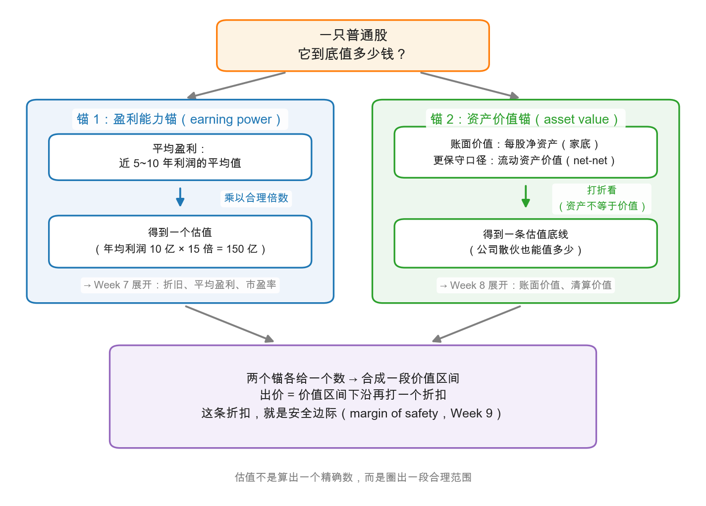

# 第 2 章：股票的价值从哪里来

> 本章你将：
> - 找到普通股估值的支点：**过去的盈利记录 + 对未来克制合理的预期**，并学会"盈利能力（earning power）"这个关键定义；
> - 借 Part IV 导读作者伯克维茨（Bruce Berkowitz）的杂货店故事，理解"自由现金流"这个估值的原料；
> - 拿到全课程估值的骨架——**两个估值锚**：盈利能力锚与资产价值锚，看它们如何合成一段价值区间；
> - 学会格雷厄姆的"私营企业试金石"，用它检验任何一个报价是否越界；
> - 分清"买在大盘低位"与"捡个股便宜"两条路各自的难点，知道本课程为什么选后者。

---

## 2.1 估值的支点：一半在过去，一半在未来

上一章我们亲手拆掉了"新时代理论"：未来确实重要，但只靠对未来的想象做不出分析。那正确的姿势是什么？格雷厄姆的回答是两脚站立，一脚踩过去，一脚踩未来：

- **过去的盈利记录**——定量证据，可查、可算、可比较；
- **对未来的合理预期**——定性判断，但要克制：它是记录的延伸，不是想象力的自由飞行。

注意两者的分工：记录是**证据**，不是预言。Week 7 会专门用两章讲"怎么质疑一份漂亮的过往记录"，这里先立住一个态度：**估值永远从事实出发，让预期只走一小步。**

从这份记录里，提炼出本章最重要的概念：

> **盈利能力（earning power）**：假设公司当前的经营方式大体延续，它在未来一段时期里**平均每年能赚到的钱**。

三个关键词都不许漏。"平均"——用多年的均值抹平单年的景气波动，中国石油这类周期股用某一年的利润去估值必然出错，Week 7 拿它当主角细讲；"当前经营延续"——估算的默认假设是生意照旧，不是"业务腾飞"；"未来"——它估的是往后能赚的钱，所以历史记录只是估算未来用的原料，原料不等于成品。

> 💡 **你可能会问：盈利能力是"现在"的数，还是"未来"的数？**
>
> 都是。它站在现在，估的是未来——"假如日子照今天这样过下去，每年平均能赚多少"。这就像给你朋友的奶茶店估值时问的那句话："不出意外的话，这店一年能稳稳当当赚多少？"注意问的不是"去年赚了多少"（可能撞上大年），也不是"要是开出十家店能赚多少"（那是梦想，要单独付钱，还记得上一章的三重风险吗）。

---

## 2.2 原料的纯度：从利润到自由现金流

第六版 Part IV 的导读作者、基金经理伯克维茨（Bruce Berkowitz）讲过一个例子，完美接住了 [Week 2 的](../week2/03-现金流量表-利润是不是真的.md)"利润是观点，现金是事实"。他说自己小时候常去的街角杂货店，账目一眼就能看懂：收银机里进来的钱，减掉进货、房租、水电和伙计工钱，再扣掉**维持这家店继续正常开下去必须花的钱**（翻修货架、更换冰柜），剩下的才是老板真正能塞进口袋的钱。

伯克维茨说，格雷厄姆和多德把这口袋里的钱叫作**盈利能力**或**所有者盈余**；用今天的词说，就是**自由现金流（free cash flow）**——而它正是股东一切回报的源头：分红从它出、回购从它出、未来增长也靠它再投资。上市公司比杂货店复杂得多：折旧摊销怎么加回、维护性支出怎么扣、养老金缺口怎么补……Week 6 的利润表分析全在给"提高原料纯度"服务。你现在只需要记住直觉版定义：**自由现金流大约等于"公司维持生意正常运转之后，一年真正多出来的现金"。**

顺带补一个连接件：Week 2 第 5 章教过贴现——未来的钱折算成今天的钱。任何资产的理论价值，都等于它未来全部现金流的折现和。债券的现金流是白纸黑字写死的（Week 3 开篇那张时间线图），所以能算得准；股票的现金流没有合同保证，所以**算不准，但并非不能估**——这就是本章接下来要做的事：不追求一个精确数字，而是用两个锚圈出一段合理范围。

---

## 2.3 两个估值锚：本课程的估值骨架

估值从哪里下手？格雷厄姆在 ch29 开篇把普通股估值的要素分成三类：股息因素、利润表因素（盈利能力）、资产负债表因素（资产价值）。我们把它整理成一把两爪锚，本周先装好骨架，细节分别留给 Week 7 和 Week 8：

| | 锚 1：盈利能力锚 | 锚 2：资产价值锚 |
|---|---|---|
| 问的问题 | 这门生意**每年能赚**多少？ | 这份家底**打底值**多少？ |
| 用的原料 | 近 5-10 年平均盈利 | 账面价值（每股净资产）；更保守口径：流动资产价值 |
| 怎么算 | 平均盈利 乘以 一个合理的倍数 | 资产打折看待（资产不等于价值） |
| 适合谁 | 生意稳定、盈利可延续的公司 | 重资产、破净、或怀疑"利润注水"的公司 |
| 在哪周展开 | Week 7（折旧、平均盈利、市盈率） | Week 8（账面价值、清算价值） |

手算一遍骨架的用法（**全部为教学示意数字**）：某公司近 5 年利润分别为 8 亿、9 亿、10 亿、11 亿、12 亿，平均 10 亿。参考长期利率与同行水平，觉得给它 12 到 15 倍比较合理（怎么定这个倍数是 Week 7 的事），盈利能力锚给出 120 亿到 150 亿；翻开资产负债表，净资产账面价值 100 亿（Week 8 会教你先挤掉水分再用），资产价值锚给出约 100 亿的底线。两个锚一叠，价值区间大约落在 100 亿到 150 亿。

看到 100 亿-150 亿这个写法你应该会心一笑——[Week 1 第 2 章](../week1/02-内在价值-价格的锚.md)就说过，**内在价值不是一个数，是一段区间**。两个锚的意义正在于此：锚 1 估计"这台赚钱机器值多少"，锚 2 兜底"就算赚钱能力看走眼，家底还值多少"。好生意的估值主要靠锚 1，锚 2 是安全网；对利润可疑或景气谷底的公司，锚 2 反而变成主尺。

> ⚠️ **易踩坑：把两个锚的输出当成精确目标价。** 它们是**估算器的输入**，不是答案本身。均值靠过去的记录支撑，倍数靠利率与同行参照——每一环都有主观判断。所以输出必须写成区间，且买入价要对区间下沿再留折扣（安全边际，Week 9）。谁给你报一个精确到小数点的"目标价"，你就把本章的流程在他身上再走一遍。

---

## 2.4 私营企业试金石：把自己当老板来报价

两个锚给出了数，可"合理倍数"仍是主观的——有没有更土、但更防骗的检验？有，ch28 给的**私营企业试金石**：

> 你付的价格，应当和"一个审慎的生意人，为获得同样一家企业的控制权而愿意出的价"相去不远。

想象这家公司没有上市：没有报价器每天报个数字撩拨你，买入就是真的盘下一门生意。你还会出这个价吗？原书承认上市公司有两样好处——流动性好、公司体量大——并建议给这些好处**最多再付两成上下的溢价**（原书当年的经验值，非精确定律），超过这个幅度，投机成分就开始超标了。第 1 章讲过它是怎么收拾"为增长付高价"的；这一章要强调它的另一半用法——**捡便宜**。

原书观察到（大意照译，出处 md 426）：市场沉迷于"增长故事"，于是大量**历史悠久、财务稳健、行业地位重要、注定会长期经营并盈利，唯独没有故事**的公司，受到冷落——尤其在利润平平的年份——卖价远低于这门生意对一名私营老板的价值。格雷厄姆由此亮明态度：他强烈倾向于把"**价格远低于私营业主视角下的价值**"当作发掘普通股投资机会的试金石。这条思路一路生长，就是 Week 8 的账面价值、清算价值与破净股。

> 📌 **实战联系：** 在 A 股和港股做估值，先把这套骨架装进脑子：打开行情软件，先别看 K 线，问自己三个问题——近 5-10 年平均每年赚多少（锚 1 的原料）？每股净资产多少、含多少水分（锚 2 的原料）？当前市值落在区间的哪一段？价格先于故事，估值先于买卖——这是"买股票 = 买公司"在操作层面的第一步。

---

## 2.5 两条捡便宜的路：抄大盘的底，还是挑个股的货

基于安全边际的买入，原书给了两条具体打法，难点各不相同：

**路线一：等大盘便宜时买。** 用定量标准衡量整体市场，低位买入一篮子代表性股票，高位卖出。听起来直觉，难点有三个（原书亲列）：具体买卖点位事后才见分晓，可能两头踏空；市场的"性格"会变，过去的规律未必延续；最要命的是它考验人性——**要在人人狂热时离场、人人绝望时进场，买完还常看着继续跌**。原书的态度是：对少数性格合适的人，这套方法值得认真对待。

**路线二：捡低估的个股。** 不等大盘，逐个寻找"分析下来明显值钱更多"的股票。原书指出，一只股票**同时**满足定性上无可挑剔、定量上（盈利、股息、资产）又便宜，是非常罕见的；更常见的猎物，是定量便宜、前景普通的那一类——正是 2.4 节末尾说的被市场冷落的稳健公司。本课程的主路线就是它：从 Week 6 的利润表、Week 7 的盈利能力，到 Week 8 的资产价值，我们练的全是给**个股**称重的手艺。

两条路殊途同归，安全边际都藏在"价格低于你估出的最低价值"那截折扣里。

> 📌 **划重点：** 普通股的价值来自两份证据——盈利能力（每年能赚多少）与资产价值（家底打底多少）；两个锚圈出区间，私营企业试金石守住常识，安全边际负责容错。估值是证据的整理，不是预言的竞赛。

下一章，我们给这台估值机器装上第一个"现实修正器"：利润变成股东回报的那一步——股息。为什么格雷厄姆说"一块钱的盈利，派出来的比留在公司里更值钱"？

## ✍️ 想一想

1. 一家公司今年的利润是 30 亿，前 4 年分别是 8 亿、9 亿、10 亿、11 亿。它的"盈利能力"更接近 30 亿还是 13.6 亿（5 年平均）？如果你的答案是"看情况"，取决于什么？
2. 用私营企业试金石检验一个场景：小区门口经营了 15 年的便利店，每年稳赚 40 万。老板说要移民，出价 300 万整店转让；同一周，他的外甥劝你："这店要连锁化，500 万我都买。"两份报价里哪份更容易出错？错在哪一环？
3. 锚 1 和锚 2 分别适合给哪家公司估值为主：贵州茅台（白酒，盈利常年高企）、中国石油（盈利随油价大幅波动）、一家濒临清算的纺织厂？各用一句话说理由。

## 📖 回到原书

**原书位置：** 第 27-28 章（md 400-427）与 Part IV 导读（md 391-399，原书页码 339-347）。

> Graham and Dodd argued that stocks, like bonds, have a well-defined value based on a stream of future returns. With bonds, the returns consist of specific payments made under contractual commitments. With stocks, the returns consist of dividends that are paid from the earnings of the business, or cash that could have been used to pay dividends that was instead reinvested in the business.
>
> 格雷厄姆和多德主张：股票和债券一样，有一份基于未来回报流的、可以明确界定的价值。债券的回报是合同约定的特定付款；股票的回报，则是企业从盈利中派发的股息——以及本可用来派息、却被留下再投资于企业的那部分现金。

一句话点评：股息与留存，本质是同一份回报的两种形态——这句导读把第 3 章（股息）和 Week 7（盈利能力）提前缝在了一起。

> quite a number of enterprises that are long established, well financed, important in their industries and presumably destined to stay in business and make profits indefinitely in the future, but that have no speculative or growth appeal, tend to be discriminated against by the stock market—especially in years of subnormal profits—and to sell for considerably less than the business would be worth to a private owner.
>
> 相当多的企业历史悠久、财务稳健、在行业内地位重要、大概会永远经营下去并持续盈利，却没有任何投机或增长魅力——它们往往受到股票市场的歧视，尤其是在利润欠佳的年份，卖价远低于这门生意对一名私营老板的价值。

一句话点评：这是"捡烟蒂"策略的理论源头，也是 Week 8 破净股一周的门票——市场给"无聊"打的折扣，就是耐心者的利润空间。
