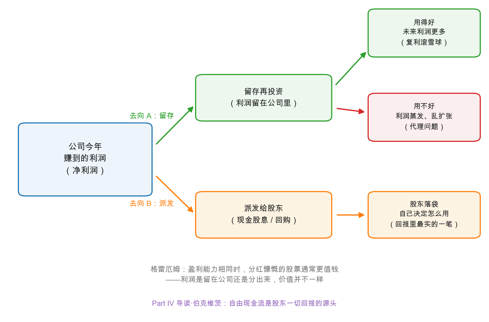

# 第 3 章：股息——真金白银的信号

> 本章你将：
> - 学会三个最基础的股东回报指标：**股息率、盈利收益率、派息率**，并各自手算一遍；
> - 看懂利润的两个去向——留存再投资与派发股息，以及两条路各自的价值逻辑；
> - 用原书的艾奇逊铁路和美国钢铁两个案例，理解"留存利润防灾"为什么常常保不住险；
> - 抓住格雷厄姆的分红原则："被迫留存的盈余是虚构的盈余"——分红纪律是给管理层的笼头；
> - 一句话认清"送股"的真面目，为 Week 7 的股本变动埋好伏笔。

---

## 3.1 股息：股东回报最古老的形式

上一章我们估出了价值区间，这一章把镜头拉近到利润**离开公司、落到你手里**的那一刻——派发**股息（dividend）**。原书 ch29 开篇的表述斩钉截铁：**经营公司这种组织形式，首要目的就是向股东支付股息**；所谓成功的公司，就是能持续派息、并且随时间逐步提高派息的公司。在 Week 5 这个时间点上（1920 年代之前），股息几乎就是普通股投资的全部回报来源。

先把手算工具备齐。原书 ch29 专门给了定义，我们照原书的例子算（历史案例数字照抄）：

| 指标 | 定义 | 原书的例子 |
|---|---|---|
| **股息率（dividend yield）** | 每股股息 除以 每股股价 | 每年派 6 美元、股价 120 美元，股息率 = 5% |
| **盈利收益率（earnings yield）** | 每股盈利 除以 每股股价 | 每股赚 6 美元、股价 50 美元，盈利收益率 = 12% |
| **派息率（payout ratio）** | 每股股息 除以 每股盈利 | 派 3 美元、赚 6 美元，派息率 = 50% |

用公式写就是：

$$\text{股息率} = \frac{\text{每股股息}}{\text{每股股价}} \qquad \text{盈利收益率} = \frac{\text{每股盈利}}{\text{每股股价}}$$

留意第二个指标：盈利收益率其实就是市盈率的倒数（Week 7 的主角先露个脸）——市盈率 20 倍的股票，盈利收益率就是 5%。而三者的关系可以连成一条恒等式（由定义变形而来，纯算术）：

$$\text{股息率} = \text{派息率} \times \text{盈利收益率} = \frac{\text{派息率}}{\text{市盈率}}$$

这条式子第 4 章实战要用：看懂一家公司的股息率，等于同时看懂了"它愿意把利润分多少给你"（派息率）和"你为这份利润付了多少钱"（市盈率）。

---

## 3.2 当年的铁律：股息定价格

在战前的市场里，股息率不只是回报指标，它直接**锚定股价**。原书给了两组对照数据（数字照抄原书）：美国精糖公司 1907-1913 年间，每股盈利在 0.02 美元到 18.92 美元之间剧烈摆动，可股价始终被钉在 100-138 美元的小区间里——因为股息雷打不动是 7 美元；艾奇逊铁路 1916-1925 年盈利从 10 美元爬到 17 美元，股价同样被 6 美元的股息率死死锚住。原书的结论：当年"每股派多少"对价格的影响力，压倒了"每股赚多少"。

这个铁律后来松动了（今天没人为一家成长股定 3% 的股息率而付溢价），但格雷厄姆从那个年代提炼出的一条观察，历经百年依然锋利：

> **两家公司处境相近、盈利能力相同，派息更慷慨的那家，股价总会更高。**

为什么？他的答案分两层：其一，投资者天然想要现金回报；其二，也是更深刻的一层——**没有派出来的利润，对股东来说容易贬值**。这就要说到利润的两个去向了。

---

## 3.3 利润的两个去向：留，还是分

公司一年赚到的净利润，只有两个去处（[Week 2 第 4 章](../week2/04-三张表怎么咬合-勾稽关系.md)的勾稽关系里你见过它的会计身份——**未分配利润**）：

**去向 A：留存再投资。** 钱留在公司里，变成新厂房、新门店、并购、研发。它的价值逻辑是一条复利曲线：如果再投资回报率高，未来利润更多——这正是第 1 章史密斯研究里"赚 9% 派 6% 留 3%、价值滚雪球"的机制，也是 Week 2 复利公式在生意里的应用。但注意图里的红色分支：**再投资可能失败**——利润投进低回报项目、乱扩张、或干脆趴在账上吃灰，股东的钱就蒸发了。原书列举了管理层偏爱留钱的几种"私心"：现金留在账上，经营起来省事；持续扩张，能撑大公司也撑高自己的薪水与地位；甚至会利用自由裁量权低买高卖自家股票，或按大股东自己的税务状况来定分红政策。这类"管钱的人未必替钱的主人着想"的问题，当代金融学有个名字：**代理问题（agency problem）**。

**去向 B：派发股息。** 钱离开公司，真金白银到股东手里。它的价值逻辑最朴素：**回报里最实的一笔**——落袋为安，之后怎么用（消费、再投资别处）由你自己决定；同时，分出去的钱管理层再也无法乱花。原书对这套逻辑的推论相当激进：与其让公司"替你平均收入"，不如股东自己平均——如果公司把每年赚的绝大部分派出来（股息随景气波动），股东完全可以自己把丰年的钱匀到灾年，就像他估计"平均盈利能力"一样去估计"平均股息"。

> 💡 **你可能会问：图里"派发给股东"的框里为什么写着"现金股息 / 回购"？**
>
> 因为**回购（share buyback）**——公司用现金买回自家的股票——是另一种把钱递到股东手里的方式：不卖股票的股东，持股比例被动变大，相当于按市价拿到了现金。它是当代美国公司的主流玩法，也是港股的常见操作，第 4 章拿腾讯实战细讲。

---

## 3.4 "储蓄防灾"为什么常常保不住险

公司留钱的正当理由，原书归纳为三条：充实营运资本、扩大产能、消除历史遗留的"注水股本"（上一章的掺水股，很多公司确实靠多年留存利润才把水分挤干，如原书记载的伍尔沃斯和美国钢铁）。听起来天经地义——平时多存钱，灾年好过冬。但原书用两个案例给了这套逻辑一记重击（数字均照抄原书，历史案例）：

**案例一：艾奇逊铁路。** 1910-1924 年的 15 年里，它把股息死死钉在每年 6 美元，而平均盈利超过 12 美元——**超过一半的利润被留存**。1927 年股息终于提到 10 美元，股价 1929 年一度接近 300 美元；然后萧条来了，1931 年 12 月按 10 美元派完最后一次息，**不到半年，股息干脆停发**。格雷厄姆复盘：那笔巨额"防灾储蓄"，没能保住任何东西——股东当年拿到的回报偏低，提息那年被引诱去追高，灾年照样颗粒无收；真正在运营层面亏掉的钱，与多年攒下的盈余相比微不足道。

**案例二：美国钢铁。** 1901-1930 年整整 30 年，可供普通股分配的利润共 23.44 亿美元，其中现金股息只派了 8.91 亿，**留存的利润高达 12.5 亿**。结果呢？1931 年初到 1932 年中的亏损只有区区 5,900 万美元，1932 年 6 月普通股股息停发。原书一句话判词：**一年半的行业下滑，就足以抵消三十年持续再投资的全部功劳。**

两个案例指向同一个结论：**留存的是股东的财富，不是公司自有的积蓄**；它防不防灾，取决于管理层把它投向哪里，而不是"存了"这个动作本身。原书还给了正面模板：盈利在 5-15 美元间波动、均值 10 美元的公司，理想安排是**稳定派息 8 美元**（丰年多留、灾年动用盈余补足），平均每年还能再留 2 美元滚雪球。可现实中，公司求稳的捷径往往是"少派"——平均赚 10 美元的公司，轻轻松松就能把股息"稳定"在 1 美元，这不是稳健，是克扣。

> ⚠️ **易踩坑：把"公司有巨额留存利润"当成安全垫。** 账上的盈余属于全体股东，它既可能变成下一个工厂，也可能变成管理层的自由提款机；能不能在灾年变成现金股息，要看治理，不看存款余额。中国投资者对这一点应当格外有感："账上有钱"和"钱能到你手里"之间，隔着一整个公司治理的距离。

---

## 3.5 分红纪律：给管理层戴上的笼头

基于以上分析，格雷厄姆在 ch29 提出了一条著名原则（原书原文照译）：

> **"股东有权获得其资本的收益，除非他们自己决定将收益再投资于企业。管理层留存或再投资利润，应当以获得股东的具体认可为前提。至于那些'为保护公司地位而不得不留存'的部分——那根本不是真正的盈利，不该记作利润，而应作为必要支出从利润中扣除。被迫留存的盈余，是虚构的盈余。"**

1934 年，这几乎是对公司治理的宣战书——原书自己也承认，当年英美两国的惯例完全相反：美国公司把定股息当成管理层的专属权力，英国公司反而要每年把分红方案摆到股东大会上过目（格雷厄姆显然更欣赏后者）。

用当代的眼光看，这条原则讲的其实是**代理成本**：钱只有离开公司，才真正无法被乱花。所以看一家公司对股东好不好，第一道检验不是"赚了多少"，而是"**赚到的钱有多少以分红或回购的形式真正到达股东**，剩下的部分管理层交代了什么用途"。第六版导读作者伯克维茨补了当代视角：市场把股息政策当作管理层对自身现金流的"供词"——现金流的变化若被当成暂时的，公司就不会动股息；若被当成永久的，才会调整。所以**乱调股息的公司要警惕，而基本面恶化却迟迟不肯砍股息的公司更危险**（他点名了当年的通用汽车和花旗：困难中的公司几乎总是拖到最后才砍股息）；至于靠增发新股凑钱来派息的公司，那是在用假信号操纵投资者，直接拉黑。

---

## 3.6 悖论与边界：格雷厄姆不是"分红原教旨主义者"

最后要把分寸讲准，否则本章就会被读歪。原书承认这里有个奇怪的悖论：**价值因拿走而增加**——股东把利润从公司里拿走越多，剩下的部分反而估值越高。他自己打了个典故比方：古罗马传说里女预言家西比拉卖书，每被拒绝一次就烧掉一卷，剩下的卷数越少，单价反而越贵（典故，见罗马王塔克文与西比拉之书的传说）。"分红多=更值钱"的市场惯例，和这个传说的逻辑一样反直觉。

而格雷厄姆自己的边界划在哪里？原书写得明明白白：**他批评的是"留存 70%"式的惯性留存，而不是正常的再投资**——公司留存约三成利润滚雪球，完全正当；处于成长期的公司多留少派，也无可指摘（他举的反例是当时已经进入成熟期的通用汽车：从 1932 年底起把约八成盈利派给股东；正例是快速扩张的飞机制造商，留存天经地义）。原书的总结分三种情形，可以做成一张表：

| 情形 | 谁对？ | 原因 |
|---|---|---|
| 成长期公司大量留存，利润能高效再投资 | 市场（容忍低分红） | 留存确实在增值，复利在跑 |
| 成熟或衰退行业照旧大量留存 | **股东**（要求多分红） | 再投资回报低，利润在体内贬值 |
| 用留存粉饰"其实保不住的盈利" | **股东**（要求挤水分） | 那是虚构盈余，不是利润 |

> 📌 **划重点：** 分红问题没有标准答案，但有一把可靠的尺子——**这笔利润留在公司里，能不能比股东自己拿着更增值？** 能，留；不能，分。格雷厄姆一生反对的，是用"稳健"之名、行"免于追问"之实的惯性留存。

---

## 3.7 送股：左手换右手，30 秒讲完

顺带把 A 股投资者最熟的"送股"说清楚：**股票股息（stock dividend）**——公司不发现金，按持股比例白送新股。每 10 股送 10 股，你从 1,000 股变成 2,000 股，但公司一分钱没出、你占公司的份额一丝没变，股价同步除权——**左手换右手**，除非公司借机宣布了新的派息承诺，否则它什么也没创造。原书有一整章《Stock Dividends》（第 30 章）专门讨论它，但该章只收录于随书 CD，本书正文没有，本课程按一句话处理，不展开。Week 7 讲市盈率时我们还会碰到它——"送转股本"会把每股盈利、每股股价同时摊薄，是新手看错估值的常见陷阱。

下一章实战：把茅台、腾讯、中国石油三家的股东回报方式摆上桌，手算股息率，算完再聊聊"到手才是真回报"的股息税。

## ✍️ 想一想

> 建议**先自己写两句话再看答案**。想不清楚的地方，就是下一遍该重读的地方。

### 问 1：股价纹丝不动说明了什么

一家公司连续三年盈利 10 亿，股息分文未派，股价也纹丝不动。市场在用什么方式表达对这笔留存利润的判断？如果三年后公司宣布把利润的六成用于分红，股价当天大涨——市场此前怀疑的是什么？

**解题思路：** 本题要串起三节：3.3 的两个去向（留存还是派发）、3.2 的两层原因（为什么派息慷慨的公司股价更高）、3.5 的分红纪律（被迫留存的盈余是虚构的盈余）。关键是别把"股价不动"读成"市场没意见"——**不涨本身就是一种判断**，它在说这笔留存没被算进价值里。第二问再回答"那天涨的是什么"。

**参考答案：** 先看第一问。**纹丝不动，就是市场给出的定价：这三年留存的 30 亿，没有被算进股价。**

按 3.3 节的框架，留存再投资的价值逻辑是一条复利曲线，前提是**再投资回报率高**；用途看不见、回报看不见，市场就不会为它加价。3.2 节格雷厄姆那两层原因正好解释这个态度：其一，投资者天然想要现金回报；其二，也是更深刻的一层——**没有派出来的利润，对股东来说容易贬值**。所以股价原地不动不是"市场没注意到"，而是**市场没有给这笔留存记账**。

三年后宣布六成利润用于分红，股价当天大涨，市场此前怀疑的是三件事：

1. **利润是真的吗？** 连年账面盈利却分文不派，市场很难不怀疑那 10 亿里有多少是"其实保不住的盈利"。3.5 节的原书原话正是冲这个来的：那些"为保护公司地位而不得不留存"的部分，"根本不是真正的盈利，不该记作利润……**被迫留存的盈余，是虚构的盈余**"。分红一动，等于用现金给利润背书。
2. **留存的用途与回报。** 3.3 节列了管理层偏爱留钱的几种私心——现金留在账上经营起来省事；持续扩张能撑大公司，也撑高自己的薪水与地位；甚至按大股东自己的税务状况来定分红政策。这就是**代理问题**，而分红承诺是对这只手的约束。
3. **管理层愿不愿意被套上笼头。** 3.5 节说，看一家公司对股东好不好，第一道检验是"赚到的钱有多少以分红或回购的形式真正到达股东"；伯克维茨的当代视角更直接——市场把股息政策当作管理层对自身现金流的"**供词**"。宣布六成分红，等于管理层承认现金流撑得住，并且愿意受这条纪律管着。

再加一层 3.6 节的悖论：**价值因拿走而增加**——股东把利润从公司里拿走越多，剩下的部分反而估值越高。这就是那天股价大涨的理论注脚。

**易错点：** ① 把"股价不动"当成"市场认可留存"——不动是**没给留存定价**，不是给了高分；② 只答"分红是好事"就收尾——这一问真正考的是"此前怀疑什么"，落点必须指向利润真实性与代理问题；③ 忽略反面情形——同样的动作放在一家成长期、再投资回报率高的公司身上，市场未必大涨，因为 3.6 节的尺子是"这笔利润留在公司里，能不能比股东自己拿着更增值"，分红多不等于永远正确。

### 问 2：用三年数据检验一家公司

用 3.5 节的尺子检验你关注过的一家公司：它近三年把多少比例的利润真正递到了股东手里（分红 + 回购）？剩下的利润，管理层给出的用途是什么？你信吗？

**解题思路：** 这是一道要查年报的开放题，**答案因公司而异**，所以评分点在口径和步骤，不在数字。四个动作：① 定口径——"真正递到股东手里"包括现金分红和**注销式回购**，用于股权激励的回购要另算（钱没离开公司，只是换了持有人）；② 算三年合计而不是单年，避免被一个丰年或灾年带偏（3.3 节的精神：像估平均盈利能力一样估平均股息）；③ 给剩下的留存分类；④ 用 3.6 节那张三分表下判断，并说清"你信不信"的理由。

**参考答案：** 按四步走。**第一步，算递到手里的比例。** 分母用近三年净利润合计，分子用"现金分红总额 + 注销式回购金额"。示意口径：三年合计净利润 X 亿元，累计现金分红 Y 亿元、用于注销的回购 Z 亿元，则股东到手比例 $= (Y + Z) \div X$。**示意演算：** 若 X 为 300 亿、Y 为 150 亿、Z 为 30 亿，到手比例 $= (150 + 30) \div 300 = 60\%$。作答时把三个原始数字和出处（年报、分红公告、回购公告）一起列出来。

**第二步，给剩下的留存分类。** 对照 3.4 节公司留钱的三条正当理由——充实营运资本、扩大产能、消除历史遗留的"注水股本"——把余下的 40% 逐项归位；归不进去的（趴在账上吃灰、说不清用途的对外投资）单独点出来。

**第三步，用尺子下判断**（3.6 节）：这笔利润留在公司里，**能不能比股东自己拿着更增值**？

| 情形 | 谁对？ | 对你的公司适用吗 |
|---|---|---|
| 成长期公司大量留存，利润能高效再投资 | 市场（容忍低分红） | 看它的再投资回报，别只看"在扩张" |
| 成熟或衰退行业照旧大量留存 | 股东（要求多分红） | 行业若已过顶峰，留存的那部分就该被追问 |
| 用留存粉饰"其实保不住的盈利" | 股东（要求挤水分） | 对照 Week 2：经营现金流长期低于净利润就是警号 |

**第四步，回答"你信吗"。** 判断标准就两句话：信，是因为**用途可验证**（历史上说的和做的对得上，再投资确实带来了利润增长）；不信，是因为**用途不可验证**（只有宏大叙事，说不出回报率，甚至一边留存一边伸手要钱）。顺手再加一条 3.5 节的当代检验：这家公司是"**乱调股息**"（要警惕），还是"**基本面恶化却迟迟不肯砍股息**"（更危险）？

**易错点：** ① 把用于股权激励的回购也算成股东回报——那笔钱给了员工，没有离开公司，**只有注销式回购**才是把钱递到全体股东手里；② 只看单年派息率——丰年便宜、灾年吃亏，近三年合计才是有意义的"平均"；③ 用"公司说要上大项目"直接结案——需要回答的是**回报率**，不是决心，说不出的就按 3.6 节归到"要求多分红"那一栏。

### 问 3：稳定派息还是跟着浮动

"稳定派息 8 美元（均值 10 美元的公司）"与"跟着盈利浮动派息"，你作为股东更偏好哪种？提示：想想你自己怎么估"平均股息"，以及公司在灾年动用盈余补息时，钱从哪里来。

**解题思路：** 两种政策的差别不在"哪个数字更大"，而在**风险和处置权在谁手里**。把 3.4 节原书的正面模板（盈利在 5 到 15 美元间波动、均值 10 美元、稳定派息 8 美元、平均每年还能再留 2 美元滚雪球）当作 A 方案，把"股息随景气浮动"当作 B 方案，逐项比：可预期性、你自己能不能"平均"、灾年补息的钱来自哪里、以及治理前提。别忘了 3.6 节的边界——这不是一道"稳定永远更好"的题。

**参考答案：** 如果公司已经进入成熟期、盈利只在 5 到 15 美元之间波动，**我更偏好稳定派息 8 美元**；如果公司还在高速扩张、再投资回报明显高于我自己拿钱能挣到的，那就该让它多留少派，浮动或者低派都合理。理由分三层：

1. **稳定的股息可以被我"平均"。** 3.3 节的原书推论相当激进：与其让公司"替你平均收入"，不如股东自己平均——如果公司把每年赚的绝大部分派出来（股息随景气波动），股东完全可以自己把丰年的钱匀到灾年，就像他估计"**平均盈利能力**"一样去估计"**平均股息**"。既然这笔账我自己会算，公司就没必要替我熨平，更没必要以"稳定"为名把股息压到 1 美元。
2. **灾年补息的钱，本来就是我自己的钱。** 这一点最容易被忘掉。3.4 节的结论是：**留存的是股东的财富，不是公司自有的积蓄**——丰年多留的那部分，本质是股东暂存在公司的钱；灾年拿它补息，不是公司在施恩，而是把股东的钱还回来。所以"稳定派息"要成立，前提是**治理靠得住**：管理层不会把这份"防灾储蓄"投向低回报项目。3.4 节两个案例正是反面教材——艾奇逊铁路 15 年把股息死死钉在 6 美元、平均盈利超过 12 美元，超过一半的利润被留存，结果 1931 年 12 月按 10 美元派完最后一次息，不到半年干脆停发；美国钢铁 30 年留下 12.5 亿美元，原书的判词是"**一年半的行业下滑，就足以抵消三十年持续再投资的全部功劳**"。**"储蓄"这个动作本身不防灾，投向才防灾。**
3. **要警惕的是"以稳定为名的克扣"。** 3.4 节说得很直白：平均赚 10 美元的公司，轻轻松松就能把股息"稳定"在 1 美元——**这不是稳健，是克扣**。真正的稳定派息是"均值 10 美元、派 8 美元、丰年多留、灾年动用盈余补足"，而不是把派息压到任何年份都不必动用盈余的水平。

**一句话结论：** 偏好哪种，取决于那把尺子——**这笔利润留在公司里，能不能比我自己拿着更增值？** 能，浮动甚至低派都行；不能，就该要求把钱派出来，哪怕股息随景气上下浮动——反正"平均股息"这笔账，我自己会算。

**易错点：** ① 把"稳定"当成公司实力——3.4 节专门拆过这个错觉，把派息压到 1 美元的"稳定"是克扣，不是稳健；② 忘了灾年补息的钱从哪来——它来自股东自己丰年少拿的那部分，不是公司的额外恩惠，所以判断的关键在治理与投向；③ 站到"分红原教旨主义"那边——3.6 节明确划了边界：格雷厄姆批评的是"留存 70%"式的惯性留存，成长期公司多留少派无可指摘（他举的正例是当时快速扩张的飞机制造商）。

## 📖 回到原书

**原书位置：** 第 29 章《普通股分析中的股息因素》（The Dividend Factor in Common-Stock Analysis），本周阅读 md 页码 428-444（原书页码 376-392）。

> Experience would confirm the established verdict of the stock market that a dollar of earnings is worth more to the stockholder if paid him in dividends than when carried to surplus.
>
> 经验将证实股票市场早已形成的判断：对股东而言，一美元盈利以股息的形式派到他手里，比转入盈余账户留在公司里，更有价值。

一句话点评：这句话的分量不在"分红好"，而在它点破了股东财富与管理层利益之间那道缝——Week 8 讲"股东的权利"时，这句话会再回来。

> Stockholders are entitled to receive the earnings on their capital except to the extent they decide to reinvest them in the business. The management should retain or reinvest earnings only with the specific approval of the stockholders. ... A compulsory surplus is an imaginary surplus.
>
> 股东有权获得其资本的收益，除非他们自己决定将收益再投资于企业。管理层留存或再投资利润，应当以获得股东的具体认可为前提。……被迫留存的盈余，是虚构的盈余。

一句话点评：1934 年写下的股东权利宣言——今天的分红监管、回购注销、股东大会表决，都是这条原则在不同市场的迟到的落地。

> **下一章预告：** 实战——茅台靠什么做到高分红率？腾讯为什么偏爱回购？中国石油的股息率为什么是后视镜？手算见分晓。
