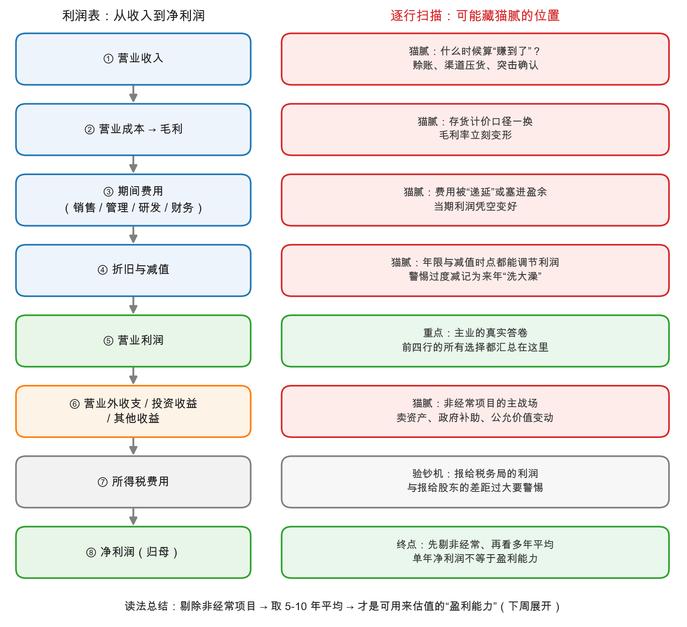

# 第 1 章：一张利润表的逐行阅读法

> 本章你将：
> - 把 Week 2 学过的利润瀑布，升级成一张**逐行扫描的阅读地图**——8 行、每行一个"藏猫腻"高发点；
> - 沿着小满奶茶店那张熟悉的报表，逐行问"这一行在什么情况下会骗人"；
> - 认识每个高发点的当代版本：收入确认、存货口径、费用递延、减值洗大澡、非经常项目、税负验钞、归母口径；
> - 收获一条总读法：**先剔非经常、再看多年平均，才有资格谈盈利能力**。

---

## 1.1 从"读一遍"到"过一遍安检"

上一章我们拿到了本周地图：三把刀（剔非经常、并子公司、验储备）+ 四个旋钮。这一章先把第一把刀磨快——但磨刀之前，得先熟悉地形。

Week 2 你已经会顺着瀑布读利润表了：收入一层层扣到净利润。现在换个姿势：**不是顺流而下地读，而是每一行都停下来过一遍安检**。安检员的问题只有一个："这件行李里，能藏东西吗？"

先上图，这是本章的主角——利润表逐行阅读地图：

下面逐行走。报表还是 Week 2 那张小满奶茶店的报表（示意数字），好处是你对每个数都有印象，注意力可以全部放在"哪里能藏猫腻"上。

## 1.2 逐行安检

小满第 1 年的瀑布（Week 2 原表）：收入 100 万 → 原料成本 30 万 → 毛利 70 万 → 期间费用 40 万 → 折旧 8 万 → 营业利润 22 万 → 利息 2 万 → 净利润 20 万。

**第①行：营业收入——"什么时候算你赚的？"**

收入确认（revenue recognition）是整个利润表的起点，也是第一个玄机：货发出去就算，还是收到钱才算？客户承诺明年买，今年要不要记？Week 2 你见过 10 万赊账——货出了门，收入里就有它，现金还没影。放大到真实公司，同一行还能玩出花样：给渠道压一批货（下年再退货）、年底突击签大单、平台公司把"代收的货款"全额算成自己的收入（总额法）还是只算佣金（净额法）——同样是 100 亿收入，含金量天差地别。

> 📌 **实战联系：** 读年报时看两个附注："收入确认政策"和"应收账款增速 vs 收入增速"。**应收账款跑得比收入快得多，往往说明收入是"赊"出来的**——Week 2 的老朋友，现金流量表在这里就是照妖镜。

**第②行：营业成本 → 毛利——"成本怎么算出来的？"**

毛利 = 收入 - 成本，看着简单，可"成本"本身就有一堆算法：存货用什么价格入账（先买先卖？后买先卖？还是干脆钉死一个"基准库存价"）？原书第 32 章专门讲过，同一家公司换一种存货计价方法，利润在不同年份之间会被重新切分——长期总量可能不变，但**你要比较的那几年，排名可能整个反转**（第 2 章有一个真实的反转案例）。另外记住毛利率是"结构信号"：毛利率突然跳升或跳水，先别急着兴奋或恐慌，查一查是不是口径变了。

**第③行：期间费用——"费用去哪了？"**

销售、管理、研发、财务费用，是公司的日常开销。猫腻的经典玩法是**"递延"**：本该今年的费用，包装成"未来几年才受益的支出"，推到以后去摊。原书有个辛辣的假设（md 页码 484）：如果总裁把未来十年的工资一次性预付，然后整笔塞进盈余当"特殊支出"——往后十年的利润不就凭空高了一截？这不是纯虚构：原书记载，当年有公司把大额广告费只记一半进成本，另一半绕道盈余，报出的利润在上市申请时被挤水分，直接缩水一半多（md 页码 484-485 的 Kraft 案）。

**第④行：折旧与减值——"旧账怎么认？"**

折旧你已经在 Week 2 亲手玩过：5 年摊还是 3 年摊，利润立刻不同。这一行还有个更凶险的当代玩法：**"洗大澡"（big bath）**——某一年把资产、应收、存货往死里减记（反正那年已经难看），把亏损一股脑出清；资产基数被砸到异常低，往后几年的折旧、成本跟着异常低，利润"V 型反转"。原书在 md 页码 476-477 用假设数字演示了这套"制造利润"（manufactured earnings）：减记过头，来年利润可以变成正常值的三倍。展开在第 2 章。

**第⑤行：营业利润——"主业的真实答卷"**

前四行的所有会计选择，最终都汇总在这一行。它是最该细看的一层：**只含主业经营的结果**，没掺卖楼、补助、理财这些"外快"。读年报先读它，再用它做同比、做同行比较，比直接盯着净利润可靠得多。

**第⑥行：营业外收支 / 投资收益 / 其他收益——"非经常项目的主战场"**

卖子公司、卖厂房、政府补助、罚款与赔偿、理财浮盈……全挤在这一带。它们有一个共同名字：**非经常项目**。这是第 2 章的全部内容，这里只立一块牌子："前方施工，请绕行"——绕行的意思不是不看，而是**把这一行的数字从估值基数里剔出去**。

**第⑦行：所得税费用——"验钞机"**

很少有人教你这行的妙用：它是利润的**验钞机**。利润要交税，所以"报给税务局的利润"和"报给股东的利润"理应大体相关。原书第 33 章演示过（md 页码 489-490）：把一家公司每年的应交税金倒推回税前利润，再与它报给股东的利润并排放——早年两者咬得很紧，某几年股东版利润突然变成税版的两倍，几年后公司暴雷。两张账对不上，不一定有鬼（税法口径确实有差异），但**差距大到离谱时，一定要追问**。

**第⑧行：净利润（归母）——"终点，但不是终点线"**

终于到了净利润。先过一个 Week 2 讲过的口径：大公司底下有非全资子公司，净利润要先切一块给"少数股东"，剩下的才是**归母净利润（归属于母公司股东的净利润）**——估值永远用归母口径。但过完这一关还没完：这个数里掺着第⑥行的一次性项目、受着第③④行的会计选择影响。所以本章的总结论是：

> 📌 **划重点：** 净利润是行程的终点，却是分析的起点。正确顺序：**剔除非经常项目 → 修复会计口径 → 取 5-10 年平均**——三步之后那个数，才有资格叫"盈利能力"。

## 1.3 一张自检表

把 8 行安检收进一张表，读任何一家 A股/港股 公司的利润表时，从头到尾过一遍：

| 行 | 安检问题 | 佐证材料（去哪查） |
|---|---|---|
| ① 收入 | 什么时候算赚的？应收账款和收入谁跑得快？ | 附注"收入确认"、应收账款明细 |
| ② 成本/毛利 | 存货计价口径变了吗？毛利率突变有无解释？ | 附注"存货"、毛利率同行比较 |
| ③ 费用 | 有没有大额"其他/递延"科目吸收费用？ | 附注"其他应收/长期待摊" |
| ④ 折旧减值 | 折旧年限与同行一致吗？巨额减值后次年是否"奇迹反转"？ | 附注"固定资产/减值" |
| ⑤ 营业利润 | 同比、环比、同行比，趋势讲得通吗？ | 三年利润表并排 |
| ⑥ 营业外等 | 每一项一次性项目，明年来还会有吗？ | 附注"非经常性损益明细" |
| ⑦ 所得税 | 有效税率反推的利润和报表利润差多远？ | 附注"所得税费用" |
| ⑧ 净利润 | 归母口径吗？扣非后还剩多少？ | 利润表 + "扣非净利润"披露 |

> ⚠️ **易踩坑：安检不等于否决。** 发现猫腻痕迹，结论不是"这公司造假"，而是"这里需要解释"。有的解释正当（行业特性、一次性重组），有的解释牵强——**你要抓的不是痕迹本身，而是解释不掉的痕迹**。真正一票否决的东西，第 3 章才登场。

## 1.4 好报表的"无聊"，坏报表的"精彩"

最后给一个反直觉的观察：**好公司的利润表往往无聊透顶**——收入慢慢涨、毛利率稳、费用率稳、营业外干干净净、税负正常。茅台的利润表读起来像白开水（第 4 章你会亲眼见到）；而"精彩纷呈"的利润表——年年有惊喜、年年有特殊项目、毛利率上蹿下跳——反而要多加小心。法医的作案现场感，常常就来自"这案子太顺了"的违和感。

---

## ✍️ 想一想

1. 某电商平台年报"营业收入 2000 亿"，同行另一家平台"营业收入 800 亿"。假如前者把平台代收的商家货款全额计入收入（总额法），后者只计佣金（净额法），你能直接说前者规模是后者 2.5 倍吗？需要先弄清什么？
2. 小满奶茶店第 1 年有 10 万赊账。第 2 年收入 120 万、赊账涨到 35 万。用第①行的安检问题判断：第 2 年的收入质量比第 1 年好了还是差了？你会去查什么？
3. 第⑦行的"验钞机"逻辑：如果一家公司连年"报表利润很高、但缴纳的所得税很少"，可能有哪些**无害**的解释？又有哪些**有害**的解释？各举一个。

## 📖 回到原书

**原书位置：** 第 31 章《利润表分析》，本段出自 md 页码 464（原书正文页码 412）。

> If an income statement is to be informing in any true sense, it must at least present a fair and undistorted picture of the year's operating results.
>
> 一张利润表若想提供任何名副其实的信息，它至少必须公正而不加歪曲地呈现当年的经营成果。

**一句话点评：** 这是第 31 章下半篇的开篇第一句——格雷厄姆先立标准（"公正、无歪曲"），然后整章都在教你：绝大多数报表达不到这个标准，差多少，往哪个方向差。

---

下一章：[第 2 章：非经常项目——一次性损益要剔除](02-非经常项目-一次性损益要剔除.md)。第⑥行是本周案情最密集的现场——"一次性"三个字，既可能是真相，也可能是惯犯的口头禅。
