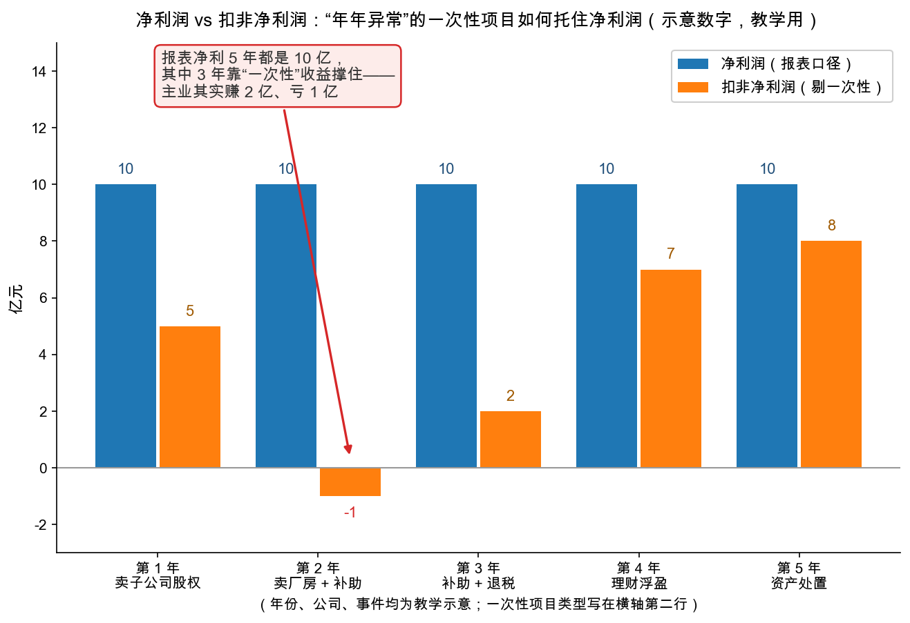

# 第 2 章：非经常项目——一次性损益要剔除

> 本章你将：
> - 学会本周第一把刀：辨认**非经常性损益（non-recurring items）**，并理解为什么必须把它从利润里剔出去；
> - 看两个 1930 年代的原案：一笔"卖资产"收益如何让利润翻三倍、甚至把亏损变成盈利；
> - 认识更隐蔽的一面：**一次性损失**的处理——减记过头会"制造利润"（manufactured earnings），储备会成为平滑利润的工具；
> - 明白"扣非净利润"这个 A股 指标的来历和正确用法；
> - 学会一眼识破"年年异常"的非经常项目——以及为什么它们恰恰最值得怀疑。

---

## 2.1 定义：什么算"一次性"

先给工作定义。**非经常性损益（non-recurring items）**：与主业经营无关、或明显不会再定期发生的一次性收益或损失。三个判据，命中任意一条就要警惕：

1. **与主业无关**——卖厂房、卖子公司股权，跟你"卖奶茶"没关系；
2. **不可重复**——那块地卖掉就没了，明年没有第二块；
3. **来去无常**——诉讼赔偿、税务返还、资产盘盈，哪年有、多大金额，全看运气。

原书第 31 章（md 页码 465）列了一张九类的清单，翻译过来就是：

| 类型 | 收益面孔 | 损失面孔 |
|---|---|---|
| 出售固定资产 | 卖楼、卖产线 | 低价甩卖资产 |
| 出售有价证券 | 炒股/卖股权赚的 | 持仓跌价 |
| 赎回自己的债券/优先股 | 折价买回自己欠的债 | 溢价赎回 |
| 保险赔付 | 收到保险赔款 | — |
| 税务返还 | 退税及利息 | 补税 |
| 诉讼结果 | 赢了官司的赔偿 | 输了官司的赔付 |
| 存货大幅减记 | — | 存货跌价 |
| 应收款项大幅减记 | — | 坏账 |
| 闲置资产的维护成本 | — | 养着不用资产的开销 |

> 💡 **你可能会问：这张清单里的项目，有的好像也不算太"一次性"？**
>
> 好眼力——这正是难点。存货跌价跟生意直接相关，衰退年份几乎家家都有，严格说不算"非常"；诉讼赔偿偶尔也会有第二回。所以格雷厄姆的口径很实际：**不用纠结每项在哲学上算不算"经常"，先全部单列出来看清楚**。金额小，随它去；金额大，就必须问一句"它明年还会来吗"。

## 2.2 为什么必须剔除：你要估的不是"这一年"

回顾第 0 章：投资者想从年报里知道的是**指示盈利能力**——如果当年经营条件延续，公司年复一年能赚多少。拿这个标尺一量，非经常项目的问题就清楚了：

- 卖楼赚的 3 亿，**不代表公司明年还能卖一栋楼**——放进估值基数，等于给一个不再重复的数字付钱；
- 搬迁赔的 2 亿，**不代表公司年年搬一次家**——放进基数，等于惩罚一个不会再发生的错误。

所以分析师的刀法：**剔掉一次性项目，把利润还原成"常态年份该有的样子"**。注意刀是双刃的——一次性**收益**要剔出去，一次性**损失**也要捞回来。只剔收益、不捞损失的人，不是保守，是没学会。

## 2.3 收益端原案：一笔卖资产生意如何改写利润

**案例一：一进一出，利润翻三倍（md 页码 467）。** 1926 年，曼哈顿电气器材公司（Manhattan Electrical Supply）报告盈利 88.2 万美元、每股 10.25 美元，市场交口称赞。后来公司申请增发上市，底牌翻开：这 88.2 万里，58.7 万来自出售电池业务。真实的主业利润只有约 29.5 万美元、每股约 3.4 美元——**不到报告数的四成**。更妙的是同一年，公司还把 54.4 万美元的特殊损失记进了盈余池子。收益进利润、损失进盈余，一进一出，画面彻底改观。

**案例二：从盈利 1300 万到亏损 630 万（md 页码 467）。** 1931 年，美国钢铁（U.S. Steel）报出"特殊收益"约 1930 万美元——主要是出售印第安纳州加里市的一批公用事业资产——并把这笔钱算进了当年利润，最终报出净利 1300 万美元。格雷厄姆把这笔一次性的钱剔掉：**当年实际经营亏损 630 万美元**（优先股股息前）。同一家公司、同一份年报，从"还算盈利"变成"实际亏损"，只隔着一个剔除动作。

**案例三：买回自己的债，也能"赚"出利润（md 页码 472-473）。** 萧条年份债券价格暴跌，出现了一种奇特的"盈利"：公司用自己的现金，折价买回自己发行的债券。犹他证券公司 1915 年的利润表里，"赎回自家票据的收益"高达 131 万美元，而主业净收益只有 74.1 万——**不靠这笔一次性收益，它连 106.3 万的利息都覆盖不住**。1932 年的 Armour 公司如法炮制：报告净利 163.3 万，其中 552 万来自折价买回自家债券。这种"利润"的本质是跟自己的债权人做了一笔交易，跟"这家公司会不会做生意"毫无关系。

**案例四：一笔官司赔偿，扭亏为盈（md 页码 475）。** 海湾石油（Gulf Oil）1932 年把一桩诉讼中拿回的 551.2 万美元石油算进利润，成功把 276.8 万美元的**亏损**变成 274.3 万美元的**盈利**——从亏到赚，一步之遥，全靠"非经常"。

四个案例摆在一起，套路已经裸奔了：**一次性收益进利润表，亏损瞬间变盈利；一旦剔除，画皮落地。**

## 2.4 损失端原案：减记过头的"制造利润"

一次性损失的处理，比收益端更微妙。先看客观事实：1932 年大萧条谷底，几乎每家公司都减记了存货和应收账款——但记账路径千差万别：多数公司为了保住利润表的脸面，把损失绕道盈余；而 1937-38 年那次温和的存货跌价，几乎家家都老老实实记进了利润表。同一类损失，两代处理，**利润的"口径"就这样漂移了**。

然后是精髓一页（md 页码 476-477）。格雷厄姆用一组假设数字演示什么叫**制造利润（manufactured earnings）**：

| 假设（1932 年末） | 金额（美元） |
|---|---|
| 存货和应收的**公允**价值 | 200 万 |
| 按公允价值算，1933 年本该报的利润 | 20 万 |
| 但 1932 年借"稳健"之名超额减记，账面砸到 | 160 万 |
| 于是 1933 年实际报出的利润 | 60 万 |

成本基数被人为砸低，来年卖同样的货，利润凭空翻三倍。整套手法的本质，格雷厄姆一句话捅破（本节结尾的金句）：**把钱从盈余池子里舀出来，再当成利润端上来。** 支出那笔没人细看，收入这笔却直接推高股价。

这个 1934 年的把戏，你几乎不需要翻译就能认出它的当代化身：**"洗大澡"**——某年商誉、存货、应收一次性巨额减值（那一年利润反正已经没法看），把资产基数砸到地板上；次年折旧、成本齐齐变轻，利润"触底反弹"，配合一句"轻装上阵"。看到"V 型反转"先别鼓掌，查一查去年的澡洗得有多狠。

**储备：平滑利润的旋钮。** 与减记配套的还有一手"预提储备"——好年景先计提一笔"未来存货跌价准备"压低当年利润，坏年景损失真来了就用储备消化，利润表稳如老狗。原书给了对活教材（md 页码 478-479）：1925-27 年橡胶价格剧烈波动，固特异（Goodyear）把 1150 万美元的原料跌价准备**记进利润**；美国橡胶（U.S. Rubber）计提了 2045 万美元却**绕道盈余**。统计手册上两人并排：美国橡胶三年平均每股 8.91 美元，固特异 7.42 美元——美国橡胶"更赚钱"。把口径拉齐、把损失放回实际发生的年份重算：**美国橡胶平均每股只剩约 0.49 美元，固特异反而有 9.73 美元**。排名整个反转。这就是第 0 章说的"横向比较必须拉齐口径"——不是修辞，是能颠倒胜负的大事。

> ⚠️ **易踩坑：把"稳健"当成"安全"。** 超额减记打着"谨慎"的旗号，看起来是保守主义，实际是把利润在年份之间挪移——今年的过度悲观，就是明年的虚假繁荣。对分析者来说，**保守的偏差和乐观的偏差，都是偏差**。

## 2.5 "年年异常"的异常项目：最值得怀疑的一类

现在可以揭晓本章最重要的一句口诀了：

> 📌 **划重点：** 一次性项目偶尔出现，是正常经营的一部分；**年年都出现的"一次性"项目，按定义就不是一次性的**——那是主业在流血，或者管理层在化妆。

看图。下面这个 5 年的教学案例（示意数字，非任何真实公司）里，报表净利润纹丝不动、稳定得让长线股东安心；扣非之后，真相是主业赚 2 亿亏 1 亿地挣扎，靠卖子公司、卖厂房、政府补助、理财浮盈一年一年续命：

读图的三个要点：

1. **盯蓝橙之差**：两根柱子的落差，就是当年非经常项目的净贡献。落差常年不小，主业成色必然存疑；
2. **看橙色柱的趋势**：扣非利润的走势才是主业的体温——图里它在 5、-1、2、7、8 之间挣扎，"稳定增长"的叙事立刻破产；
3. **查横轴第二行**：每根"一次性"的类型。卖子公司卖到第 5 年，你家是有多少子公司？

## 2.6 落到 A股/港股：扣非净利润怎么用

> 📌 **实战联系：** A股 年报现在会同时披露两个净利润：**净利润**和**扣非净利润**（全称"归属于母公司股东的扣除非经常性损益的净利润"）——后者就是监管替你做了一次本章的剔除动作，把处置资产损益、政府补助、公允价值变动等监管认定的非经常性损益剔掉了。用法三条：
> 1. **估值看扣非**：算市盈率（Week 7 的主角）优先用扣非口径，别给一次性收益付钱；
> 2. **看差的方向**：净利润远高于扣非——利润靠"外快"，成色差；扣非反而高于净利润——当年有一次性损失拖累，主业可能没那么糟（刀是双刃的）；
> 3. **看差的年头数**：偶尔有差，正常；年年大差，把第 2.5 节的口诀默写一遍。
>
> 港股报表没有统一的"扣非"科目，需要自己动手：翻到"其他收益/（损失）净额"的附注，逐项判断"明年还会不会有"。原书里有个正面示范（md 页码 498）：通用汽车 1931 年的年报主动同时列出口径——含非经常项目每股 2.01 美元，剔除后 2.43 美元——**好公司不怕给你两套数**。

最后一个反向提醒：剔除非经常项目是**分析工具**，不是万能咒语。原书第 32 章也讲了另一面（md 页码 482-483）：一家输油管公司 1926 年主业全失，养着一条闲置管道，年年亏、股价跌到比它手里的现金还低；1928 年董事会把闲置管道卖掉、清盘包袱，股东前后拿到每股合计 72 美元的特别分配——差不多是前两年股价的两倍。市场把"闲置资产的持续成本"当成了永久性负担，分析师看到了"这是可以终止的一次性拖累"。**别把非经常的损失当成永久的能力，也别把一次性的包袱当成永久的判决**——两个方向的错误，都要避免。

---

## ✍️ 想一想

1. 某公司今年净利润 12 亿，其中出售一块土地贡献 9 亿；去年净利润 8 亿，全部来自主业。两家财经媒体，一家写"利润大增 50%"，一家写"利润下滑 25%"——用扣非口径算一算，谁对？（手算：今年扣非、去年扣非各是多少？）
2. 接第 2.4 节的假设表：如果 1932 年不是超额减记、而是减记不足（存货账面还停在 240 万），1933 年的利润会怎么走？这告诉你"稳健计提"和"如实反映"的边界在哪？
3. 朋友给你荐股："这家公司连续 4 年净利润增长 15% 以上，稳得很！"你拉出数据发现它每年非经常收益 3-5 亿、占净利润三成。用本章的话写一句最短的回复。

## 📖 回到原书

**原书位置：** 第 32 章《利润表中的非常损失和其他特殊项目》（Extraordinary Losses and Other Special Items in the Income Account），本周阅读 md 页码 476-486，本段出自 md 页码 477。

> They consist, in brief, of taking sums out of surplus (or even capital) and then reporting these same sums as income. The charge to surplus goes unnoticed; the credit to income may have a determining influence upon the market price of the securities of the company.
>
> 简而言之，这类手法就是：把钱从盈余（甚至股本）里取出来，再把同一笔钱当作利润报出来。计入盈余的那一笔无人注意，计入利润的这一笔却足以左右公司证券的市场价格。

**一句话点评：** "同一笔钱，记两本账"——支出无声，收入惊雷。这 21 个字的机理，从 1934 年到今天每一次"洗大澡"里都没变过。

---

下一章：[第 3 章：粉饰手法——管理层的数字魔术](03-粉饰手法-管理层的数字魔术.md)。如果一次性项目是"流弹"，下一章就是"预谋"：当管理层存心让你看错利润时，整套魔术是怎么搭台的。
