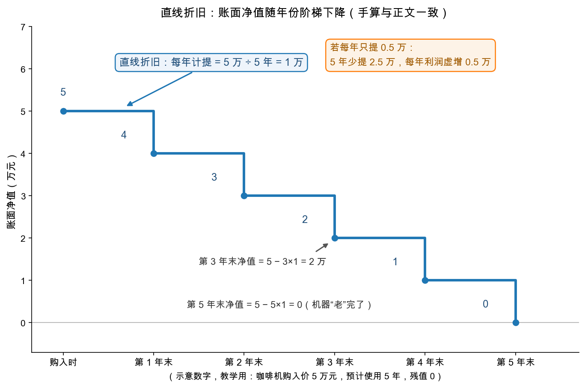

# 第 0 章：折旧与摊销——机器会老，账要认

> 本章你将：
> - 认识利润表里最特别的一笔费用：**折旧（depreciation）**——它不花一分钱现金，却实实在在削减利润；
> - 用一台 5 万元的咖啡机亲手算一遍**直线折旧（straight-line depreciation）**，看懂"年限-账面净值"的阶梯下降；
> - 学会格雷厄姆检查折旧的三个疑点：**基数**（按什么价值提）、**费率**（提多少年）、**去向**（走利润表还是走后门），并见识 1930 年代真实发生的"折旧魔术"；
> - 分清折旧的三个表亲：**摊销（amortization）**、**折耗（depletion）**，以及商誉的特殊处理；
> - 把镜头转回 A股/港股：长江电力的高折旧、腾讯的摊销、茅台的"轻"，各是什么长相。

---

## 0.1 接上周：利润洗干净了，然后呢

[Week 6](../week6/04-实战联系-茅台利润表走一遍.md) 结尾我们立了一条规矩：利润表分析四问——成色、口径、现金、可信。四问全过，才够格把利润送进**估值**。本周就干这件事。

但先别急，四问里还漏了一个体检项目。Week 6 教你剔掉了"一次性损益"，可利润表里还有一类**年年都有、笔笔合法、却最容易被动手脚**的费用——机器厂房的折旧、矿山的折耗、无形资产的摊销。格雷厄姆把第 34 章的开篇话讲得很重（md 505）：一份被严肃分析的利润表，**必须**特别审视折旧及类似摊提的金额。为什么？往下看。

## 0.2 折旧：机器会老，账要认

你开一家奶茶店，花 5 万元买了一台商用咖啡机。这机器能用 5 年，5 年后报废，残值算零。问题来了：这笔 5 万的支出，算哪一年的成本？

- 算买入当年？那一年你"巨亏"，后面 4 年却"白用机器"——荒唐；
- 都不算？那更荒唐，机器明明在一年年变旧、变不值钱。

会计的答案是**折旧**：把这 5 万的成本，**分摊到它服务的每一年**。最常用的分法叫直线折旧——每年提一样多：

> 每年折旧 = 购入成本 / 使用年限 = 5 万 / 5 年 = 1 万（每年）

于是每一年的利润表里，都有 1 万元的"折旧费"。机器的账面价值（账上还挂着多少）也跟着一年降 1 万：买来时 5 万，第 1 年末剩 4 万，第 2 年末 3 万……第 5 年末归零。

| 时点 | 当年计提折旧 | 累计折旧 | 账面净值 |
|---|---|---|---|
| 购入时 | — | 0 | 5 万 |
| 第 1 年末 | 1 万 | 1 万 | 4 万 |
| 第 2 年末 | 1 万 | 2 万 | 3 万 |
| 第 3 年末 | 1 万 | 3 万 | 2 万 |
| 第 4 年末 | 1 万 | 4 万 | 1 万 |
| 第 5 年末 | 1 万 | 5 万 | 0 |

> 📌 **划重点：** 折旧不是玄学，就是把"一次性大支出"摊成"每年的真实成本"。机器每老一岁，你的利润就该为它的衰老埋一次单。**该提的折旧不提或少提，利润就是虚的**——图中橙色框那句话，是本章的题眼。

> 💡 **你可能会问：折旧费交出去了吗？我怎么在银行流水里找不到它？**
>
> 找不到就对了。这正是折旧最特殊的地方，下一节专门讲。

## 0.3 折旧的特殊体质：不流出现金的费用

Week 2 学过：费用一般是"钱花出去了"。但折旧不一样——格雷厄姆在 md 505 一上来就点破：折旧这类摊提**与普通经营费用的不同，在于它们不代表当期对应的现金支出**。买咖啡机的 5 万是购买那天一次性流出的；之后 5 年里每年计提的 1 万折旧，只是账本上的"分摊记录"，当年没有一分钱流出。

这个体质带来两个后果：

1. **好的一面**：利润被折旧削掉一块，但现金还在账上。所以重资产公司常有"经营现金流明显高于净利润"的现象——Week 2 说的"利润是观点，现金是事实"，折旧是最大的观点修正项之一。
2. **坏的一面**：正因为折旧"不疼不痒"，管理层调节它的冲动特别强——多提一点，利润难看；少提一点，利润立刻漂亮，而且**不违反"钱真花过"的任何常识**。隐蔽，所以危险。

## 0.4 折旧魔术的三个旋钮：基数、费率、去向

格雷厄姆把 ch34 的笔墨花在三类真实案例上。我们按"旋钮"整理成一张安检表——看任何一家公司的折旧，先拧这三下：

| 旋钮 | 正常做法 | 可疑做法 | 原书案例（历史案例，数字照原书摘录） |
|---|---|---|---|
| ① 基数：按什么价值提 | 按购入成本 | 任意重估资产价值，抬高或压低折旧 | 美国制冰公司 1926 年把固定资产一次性调高约 787 万美元，此后折旧跟着变大；1935 年又调回去。美国机车公司 1933 年大幅调低资产，**折旧费用降到原来的约 40%**（md 506-507） |
| ② 费率：提多少年 | 按资产真实寿命定率（原书列举的标准做法：房屋约 50 年、机器约 14 年，md 508-509） | 随心所欲，今年提明年停 | 美国精糖公司嘴上说"政策宽松"，实际 1916-1932 年间有的年份一分不提、有的年份提一半塞进盈余（md 509-510） |
| ③ 去向：费用记在哪 | 计入当年利润表 | 绕开利润表：塞进盈余，或干脆不披露 | 鲍德温机车厂 1924-1928 年折旧一会儿走利润、一会儿走盈余、有的年份根本不提（md 511） |

### 旋钮②③一起拧的代价：鲍德温机车的"3.33 vs 0.06"

原书里最触目惊心的一组数字（历史案例，照原书摘录，md 511-512）：鲍德温机车厂 1924-1928 年向股东报告的 5 年平均每股盈利是 **3.33 美元**；把每年应提的折旧足额补上之后，5 年平均每股盈利变成 **0.06 美元**——**只剩报告值的约 2%**。一个"持续盈利"的公司，补上机器衰老的成本后，其实五年白干。当年买它股票的人，是按 3.33 美元的盈利能力付的钱。

还有一个朴素却锋利的对比法（md 512）：同行业、体量差不多的公司，折旧占固定资产的比例应该差不多。原书列表：美国精糖公司约 1.73%，同行国家糖业公司约 4.79%；美国车床公司约 1.65%，同行美国铸钢公司约 3.66%。**比同行低一大截的折旧率，就是利润注水的嫌疑现场。**

### 反过来的案例：折旧提太多，利润被藏起来

魔术也有反向玩法。国民饼干公司早年间把新建厂房的钱**直接计进当年费用**（相当于一年提完折旧），利润被严重压低（历史案例，md 514-515）。1922 年它改了会计政策、又按 7 换 1 拆股、把现金股息提高 3 倍——账面盈利能力"突然翻倍"。老股东赚了：多年被藏起来的利润，以股价重估的方式还给了他们。这个案例告诉你：**折旧旋钮往哪边拧都可能**——往下拧是注水，往上拧是藏富。分析时两个方向都要检查。

> ⚠️ **易踩坑：把"利润突然变好"全当成经营改善。** 像国民饼干这样的"利润跳升"，可能只是会计口径变了（折旧政策、费用资本化与否）。看到利润突增，先问一句：**算法变了吗？**——这正是 Week 6 四问中的第二问。

### 藏在报表附注里的折旧

更隐蔽的一手：美国罐头公司 1922-1936 年每年只披露一笔固定金额的折旧，另有一笔"重置支出"偷偷计入费用却不给金额（历史案例，md 513-514）。真相直到证监会的 10-K 文件和 1937 年年报才陆续揭开——那笔藏着的支出一年高达 300 多万美元，是明面折旧的 1.5 倍以上。原书由此感叹：股东是"分好几个阶段"才知道自己家产的实情。**今天的对应动作：折旧政策藏在年报"重要会计政策及会计估计"附注里，别只看利润表主表那行数字。**

## 0.5 折旧的表亲们：摊销、折耗、商誉

格雷厄姆把这类"按年认列的成本"统称摊提（md 505）。除了厂房机器，还有三个常见面孔：

| 名字 | 折的是什么 | 典型场景 | 一句话要点 |
|---|---|---|---|
| 折旧 depreciation | 固定资产 | 厂房、设备、车辆 | 本章主角 |
| 折耗 depletion | 自然资源储量 | 矿山、油气田 | 卖一吨矿，矿就少一吨，成本要按产量认；原书特别提醒：矿业公司的折耗基数常常是税务口径，**投资者要按自己的买价自算**（md 516） |
| 摊销 amortization | 使用寿命有限的无形资产/权利 | 租赁权改良、专利、许可权、游戏版权 | 租来地皮上盖的房子，租期一到归房东，所以必须在租期内摊完（原书举的伍尔沃斯连锁 1938 年一年摊销约 393 万美元，md 522） |

**商誉（goodwill）单独说。** 当年有个别公司（如美国广播公司/RCA）按年把商誉摊进费用，格雷厄姆明确说这"没有事实依据"——商誉没有独立于企业本身的寿命（md 523）。当代中美准则已经改成了另一套：**商誉不摊销，但每年做减值测试，减了就一次性砸进利润**。形式变了，格雷厄姆的提醒一点没过期：商誉相关的费用/损失弹性极大，是 Week 6 说过的那间"杂物间"里最大的一件家具。

> 📌 **实战联系：** 三家案例公司，三种"折旧体质"。**长江电力**（600900.SH）：大坝、水轮机组价值数百上千亿、按数十年折旧，折旧费用常年是利润表上的大项，所以它的经营现金流显著高于净利润——这是重资产公用事业的常态，也是 Week 8 给它做资产估值的前情。**腾讯控股**（0700.HK）：游戏版权、内容与无形资产年年摊销，商誉减值隔几年来一次大的——读它的利润表，摊销与减值是第一号观察项。**贵州茅台**（600519.SH）：厂房酒窖当然也有折旧，但相对它的毛利，存在感很低——轻资产高毛利生意，利润的"水分嫌疑"不在折旧这一项。同一家公司，折旧的地位可以天差地别，这就是为什么格雷厄姆要求逐家检查。

> 💡 **你可能会问：折旧高说明什么？是坏事吗？**
>
> 折旧高本身不是坏事——它说明公司在认认真真为"机器会老"买单。要警惕的是两头的异常：**明显低于同行**（虚增利润嫌疑）和**忽高忽低没解释**（口径变动嫌疑）。对投资者还有一层：Week 5 讲自由现金流时说过，"维持生意正常运转必须花的钱"才是真成本——折旧约等于这份"维持成本"的会计表达，把折旧完全忽略的利润，等于假设机器永远不坏。

## ✍️ 想一想

> 建议**先自己写两句话再看答案**。想不清楚的地方，就是下一遍该重读的地方。

### 问 1：12 万元制冰机的折旧手算

手算：你的奶茶店又添了一台 12 万元的制冰机，预计用 6 年，残值 0。（a）直线折旧下每年计提多少？（b）第 3 年末账面净值是多少？（c）如果会计把它按 10 年折旧，每年利润会比正确算法多出多少？

**解题思路：** 回到 0.2 节那台 5 万元咖啡机的算法，只是把数字换掉：直线折旧就是"购入成本除以使用年限"，账面净值就是"成本减去累计折旧"。三个小问里，(b) 要先算累计数再减，(c) 比的是"两种年限下每年折旧费的差额"——**动的不是利润总额，而是利润的年度分布**。

**参考答案：** （a）每年折旧 $= 12 / 6 = 2$ 万元。（b）第 3 年末累计折旧 $= 2 \times 3 = 6$ 万元，账面净值 $= 12 - 6 = 6$ 万元，相当于"还剩 3 年的机器价值"。（c）按 10 年折旧，每年只提 $12 / 10 = 1.2$ 万元；正确算法每年 2 万元，两者相差 $2 - 1.2 = 0.8$ 万元——**前 6 年每年利润虚增 0.8 万元**。这不是白赚：机器第 6 年末实际已经报废，账上却还挂着 $12 - 1.2 \times 6 = 4.8$ 万元，第 7 到第 10 年每年接着提 1.2 万、四年合计 4.8 万元，等于给一台早就死掉的机器继续付账单。**前 6 年虚增的利润，被后 4 年虚减的利润原样吐回来，但当年看报表的人已经被骗过一次了**——这正是 0.4 节旋钮②（费率）被人为拧松的后果。

**易错点：** ① 把第 3 年末账面净值算成 $12 - 2 = 10$ 万元（只减了一年折旧）——账面净值要看**累计**折旧；② 以为"10 年折旧总共也是 12 万，利润总额不变，所以无所谓"——总额确实一样，但**利润的年度分布被改写了**，而市场恰恰习惯拿单年利润给公司定价（第 1 章的老毛病）；③ 只算出 0.8 万就收手，答不出这 0.8 万是**虚增**——判断要落回 0.2 节那句话：该提的折旧不提或少提，利润就是虚的。

### 问 2：折旧率远低于同行

判断并说理由：某制造业公司折旧占固定资产的比例是 1.5%，同行业另外五家主流公司在 3.5% 到 5% 之间。仅凭这一条，你对它的报表利润应该持什么态度？你还会去查哪两处证据？

**解题思路：** 用 0.4 节那个"朴素却锋利"的同行对比法：美国精糖约 1.73% 对同行国家糖业约 4.79%，美国车床约 1.65% 对同行美国铸钢约 3.66%。这里的关键是分清**嫌疑**与**判决**——比率异常只给出怀疑的理由，定罪要回到"三个旋钮"里找证据。题目问"哪两处"，就往费率与基数上找。

**参考答案：** **态度：高度怀疑，但先不下结论——把它的利润当成"待证伪的高利润"，查清之前不给它正常的估值倍数。** $1.5 / 3.5 \approx 0.43$，它只有同行下限的四成出头，按 0.4 节的判词，**比同行低一大截的折旧率，就是利润注水的嫌疑现场**。但嫌疑不等于定罪：资产较新、机器占比低、大量在建工程尚未转固，都可能合法地压低这个比率。要查的两处证据：**其一，年报附注"重要会计政策及会计估计"里的折旧年限与残值率**（旋钮②费率）——房屋、机器各按多少年提，和原书列的标准做法（房屋约 50 年、机器约 14 年）以及同行比是长是短，近年政策有没有变过（"算法变了吗"，Week 6 四问第二问）；**其二，固定资产的构成与账龄**（旋钮①基数）——固定资产里多少是房屋土地、多少是机器设备，成新率如何，有没有刚做过资产重估把分母做大。补一个加分动作：把"经营现金流 减 资本开支"再对一次——如果折旧长期偏低、资本开支却常年高企，说明机器是靠真金白银在换命，利润表却没认这笔账。

**易错点：** ① 直接宣判"一定造假"——1.5% 对 3.5% 到 5% 只构成嫌疑，会计估计差异可以是合法的，格雷厄姆要求的也只是"特别审视"；② 只看比率不看基数——分子分母都能被人为调整（美国制冰公司 1926 年把固定资产一次性调高约 787 万美元，折旧跟着变大；美国机车公司 1933 年大幅调低资产，折旧费用降到原来的约 40%）；③ 忘了另一个方向——折旧也可能**提得太多**把利润藏起来（国民饼干公司把新建厂房的钱直接计进当年费用），所以查的是"异常"，不是"往哪边异常"。

### 问 3：90 亿现金流能否直接估值

长江电力式的思考：一家水电公司报告净利润 50 亿，经营现金流净额 90 亿，两者差异主要来自每年计提的折旧。有朋友说"现金流才是真的，干脆直接用 90 亿给它估值"。这个说法漏掉了什么？（提示：大坝能用几十年，但能永远不修不换吗？这笔钱最后从哪里出？）

**解题思路：** 拆三层。第一层用 0.3 节"折旧的特殊体质"：折旧确实不是当期现金支出，所以重资产公司经营现金流高于净利润是常态，朋友这半句没说错。第二层用 Week 5 的自由现金流：**经营现金流不等于可以拿走的现金**，中间隔着维持性资本开支。第三层补上 0.4 节的时间维度：折旧年限拉得越长当期利润越好看，但大修与更换的那一天总要来。

**参考答案：** **漏掉的是"机器会老"这件事的付账日——折旧只是把一笔迟早要花的钱推迟了，不是把它取消了。** 净利润 50 亿、经营现金流净额 90 亿，多出来的约 40 亿正是折旧等非现金费用"加回来"的部分（0.3 节）。可大坝和水轮机组能用几十年，却不会永远不修不换——大修、技改、机组更换的钱走的是**资本开支**，不在折旧那一行。所以正确的估值起点是：**自由现金流 约等于 经营现金流净额 减 维持性资本开支，即 90 亿 减 资本开支**；这笔资本开支去年报现金流量表"购建固定资产、无形资产和其他长期资产支付的现金"那一行找。**用 90 亿直接估值，等于假设这家公司永远不修不换、资本开支为零**——0.5 节那句话正是冲这个来的：折旧约等于"维持生意正常运转必须花的钱"的会计表达，把折旧完全忽略的利润，等于假设机器永远不坏。还有一层：费率（旋钮②）拉得越长，当期计提越少、利润越好看，可资产真实老化的速度不会跟着变慢，某一年集中大修或减值，利润就会突然难看一次。

**易错点：** ① 把"经营现金流净额"当"自由现金流"直接用——两者之间隔着维持性资本开支，这是 Week 5 就划过的线；② 认为"折旧不花现金，所以不是真成本"——准确说法是**不是当期的现金支出，但是真实的长期成本**，它只是被推迟到资本开支那一天；③ 反向犯错：把净利润加回**全部**折旧去做估值，等于假设资本开支为零——对重资产公司，这和忽略折旧一样危险。

## 📖 回到原书

**原书位置：** 第 34 章 Depreciation and Similar Charges to Earning Power（md 505-523），本节金句出自 md 505 与 md 507。

> A critical analysis of an income account must pay particular attention to the amounts deducted for depreciation and kindred charges. These items differ from ordinary operating expenses in that they do not signify a current and corresponding outlay of cash.
>
> 对利润表的批判性分析，必须特别留意折旧及同类摊提的金额。这些项目与普通经营费用的不同之处在于：它们并不代表一笔当期对应的现金支出。

一句话点评：开篇第一句就是全章的"安检令"——不流现金的费用，恰恰最需要人盯。

> In our opinion excessive write-downs of fixed assets, for the avowed or obvious purpose of decreasing depreciation and increasing reported earnings, constitute an inexcusable subterfuge and should not be condoned by the accounting profession.
>
> 在我们看来，为了压低折旧、抬高报表盈利而过度调减固定资产价值——无论是否明说——都构成一种不可原谅的托辞，会计职业界不应姑息。

一句话点评：1930 年代的格雷厄姆气到用重话；今天看到"资产减值后利润立刻变好看"的公司，把这句话再默念一遍。

---

下一章，我们把单年的利润升级成"很多年的平均"——为什么 5-10 年的平均盈利比任何单年都更接近"盈利能力"？以及，什么情况下连平均数也不能信？见 [第 1 章：盈利记录——平均数比单年靠谱](01-盈利记录-平均数比单年靠谱.md)。
