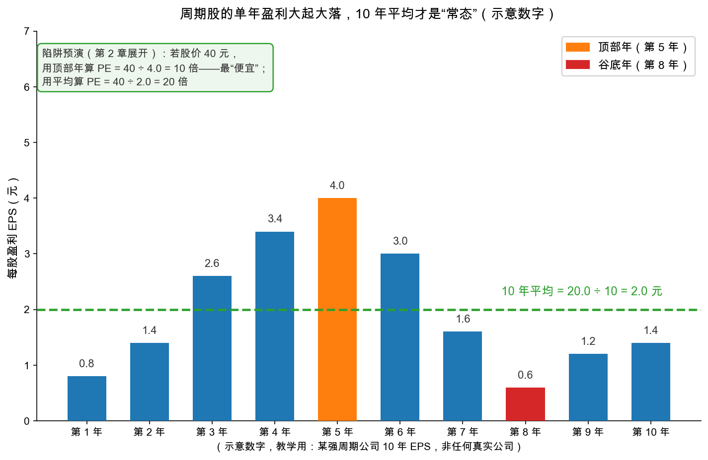

# 第 1 章：盈利记录——平均数比单年靠谱

> 本章你将：
> - 理解全书最重要的过渡句：**过去的记录是通往未来的线索**——"最重要、也最不能令人满意"的一步；
> - 把 Week 5 的"盈利能力"落地成可操作的算法：**多年平均 + 定性把关**，并学会分辨"真平均"与"假平均"；
> - 看清市场最大的老毛病：**用单年盈利给整家公司定价**，以及周期股"顶部 PE 最低"的陷阱；
> - 处理两个技术难题：亏损年份怎么进平均？"增长趋势"和"平均数"打架听谁的？
> - 拿到一份**质疑过往记录的清单**：什么样的过去，不能直接外推成未来。

---

## 1.1 最重要、也最不能令人满意的一步

第 0 章结束时，你手里的利润已经"洗干净"了：非经常项目剔除（Week 6）、折旧足额（第 0 章）。现在面对最后一步，也是格雷厄姆说得最坦诚的一步（md 524，大意）：分析师研究过去，唯一实际的用途是**它可能给未来提供线索**——这是整个证券分析里最重要的环节，却也是最不令人满意的环节，**因为这条线索从来不是完全可靠的，而且经常被证明毫无价值**。

听到这里你也许想问：那还分析什么？格雷厄姆紧接着给了答案：尽管有这些毛病，过往记录在足够多的案例里足够可靠，**足以继续充当估值与选股的主要出发点**。注意这句话的分量：记录不是预测，是**出发点**。分析的未来，是从证据出发的谨慎外推，不是算命。

## 1.2 盈利能力：把"平均数"用对地方

[Week 5 第 2 章](../week5/02-股票的价值从哪里来.md)给过盈利能力的定义：假设当前经营延续，未来平均每年能赚的钱。原书 ch37 把它展开成两半（md 524）：

1. **实际盈利**：过去若干年的真实记录（原料，必须经过第 0 章 + Week 6 的清洗）；
2. **合理预期**：如果没有异常情况，未来大体仍会接近这个水平（外加的一小步）。

为什么必须看多年？原书给了两条理由，都朴素得可爱：其一，**连续或反复的表现，永远比孤立的一次更有说服力**——一年赚钱可能是运气，年年赚钱才像本事；其二，**足够长时期的平均，会吸收并拉平商业周期的扰动**。第二条就是 Week 2 数学小灶里平均数的用法：单点是噪音，均值是信号。

手算热身（示意数字）：某公司近 5 年净利润为 8 亿、9 亿、10 亿、11 亿、12 亿。

> 平均盈利 = (8 + 9 + 10 + 11 + 12) / 5 = 50 / 5 = 10 亿/年

拿计算器按一遍，30 秒的事——但"用哪 5 年""这 5 年能不能代表未来"，才是本章真正的功夫。

## 1.3 两种平均：真平均与假平均

原书立刻泼了盆冷水（md 524-525）：**不是所有平均数都有意义**。它把平均分成两种：

- **常态平均**：各年数字都紧贴着平均值小幅波动，平均数就是这家公司的"体温"；
- **算术假象**：各年数字上蹿下跳，平均值只是把十个不相连的数字硬除了一下——**它不代表任何一年，更不预示任何一年**。

原书用两家真实公司做过对照（历史案例，数字照原书摘录，md 525），我们压缩成对比卡：

| | 克雷斯（S. H. Kress，连锁五元店） | 哈德逊汽车（Hudson Motors，汽车制造商） |
|---|---|---|
| 1923-1932 十年平均每股盈利 | 约 4.36 美元 | 约 4.75 美元 |
| 各年波动范围 | 2.80 到 5.92 美元 | 亏损到 13.39 美元 |
| 最差年相对平均 | 约 6.4 折 | 直接亏损 |
| 最好年相对平均 | 约 1.4 倍 | 约 2.8 倍 |
| 这个平均说明什么 | **真盈利能力**：年年贴着 4 块多赚 | **算术假象**：十年里没有一年接近 4.75 |

更有说服力的是"验收"：原书写于 1933 年，它回头列了 1933-1939 的实际结果——克雷斯之后几年仍在 2.76 到 4.76 美元之间转（还是贴着老平均），哈德逊则在亏损与小额盈利之间反复横跳，**离 4.75 十万八千里**（md 525）。

> 📌 **划重点：** 用平均之前，先检查"离散度"——各年数字是**围着平均值小幅转**，还是**把平均值当橡皮筋乱扯**。前者，平均就是盈利能力；后者，平均只是算术游戏。这一眼，比平均数本身重要。

落到 A股：这就是[Week 5](../week5/02-股票的价值从哪里来.md)预告过的中国石油式难题。强周期公司（石油、航运、面板、猪周期）的单年利润跟着产品价格大起大落，**单年数字既不是常态、平均也常常是假象**——克雷斯式的稳定公司才能放心用平均。第 1.5 节你会看到，用错分母的市盈率会把人坑到什么程度。

## 1.4 平均之上，还要过定性这道闸

只算平均就完事了吗？原书在 md 526 给了一条全书的总纲式原则：

> 定量数据只有在得到定性调查支持时才有用。

过去稳定，不等于未来稳定。原书的对照组：斯图贝克（Studebaker，汽车）1920 年代利润也很稳定，但**生意本身的性质**注定它活不长——行业剧变一来，记录瞬间作废；反过来，美国钢铁那种周期起伏剧烈的公司，只要行业地位牢固、产量与吨利润有清楚的"常态水平"，平均反而更可信（原书用"常态产量乘以常态吨利润"推算过它的正常盈利，md 526-527）。**记录的稳定性 + 生意的恒久性，两个都过关，平均才能用。**

## 1.5 市场的老毛病：用单年给公司定价

如果平均这么重要，市场是怎么做的？格雷厄姆观察（md 528）：**股价跟随的更多是当年盈利，而不是长期平均**——好年景股价跟着利润一起飞，坏年景跟着利润一起摔。他评价这"相当不理性"，并给了那个著名的私营老板类比：

> 一个私营企业，景气年赚的钱完全可以是差年的两倍，但老板绝不会因此把整个店的身价翻一倍或砍一半。

对私营老板天经地义的常识，一到股市就失灵。格雷厄姆接着说：正因为公众在这上面系统性地犯错，**"在利润暂时下滑造成的低价买入、在异常繁荣造成的高价卖出"才成为跑赢市场的经典配方**——但它需要逆向而行的性格、和等待机会年复一年出现的耐心（md 528-529）。这句是 Week 9"市场先生"的预热，先埋个种子。

看这张图：同一家周期公司，第 5 年 EPS 4.0 元，第 8 年只有 0.6 元，十年平均 2.0 元。假如你在顶部年看它：利润创新高，股价 40 元对应 PE 只有 10 倍——"便宜"！可那 4.0 元是景气吹出来的，**用常态盈利一量，真实的倍数是 20 倍**。反过来，谷底年 PE 高得吓人，却可能是最好的买点。**周期股的市盈率，经常把尺子的刻度印反**——第 2 章用一整张图把这件事说透。

> ⚠️ **易踩坑：把"景气顶部的低 PE"当成便宜货信号。** 2015 年前后航运、2021 年前后的部分资源与海运公司，都在利润顶峰出现过"个位数市盈率"——随后利润与股价一起回落。低 PE 是结果（分母膨胀），不一定是便宜的原因。先判断利润能不能站住，再谈倍数。

## 1.6 平均与趋势打架，听谁的？

市场除了偏爱单年，还偏爱**趋势**——"利润连年增长"的故事总是最动听。可趋势和平均在数学上就掐架。原书造了三家假想公司（md 529-530）：

| 公司 | 第 1 到第 7 年每股盈利 | 7 年平均 | 趋势 |
|---|---|---|---|
| 甲 | 1、2、3、4、5、6、7 美元 | 4 美元 | 优秀 |
| 乙 | 7、7、7、7、7、7、7 美元 | 7 美元 | 平 |
| 丙 | 13、12、11、10、9、8、7 美元 | 10 美元 | 恶劣 |

同样"今年赚 7 美元"：甲的趋势最好、平均最差；丙的趋势最差、平均最好。该信哪个？原书的回答很"格雷厄姆"：**趋势必须研究，但绝不允许自动外推**。竞争、监管、规模变大后的报酬递减，都是无限增长的天敌；同样，持续衰退也常被反向力量止住（md 530）。处理办法：

- **趋势向上（甲）**：先做定性研究，搞清楚增长的原因、掂量能不能延续。即使答案乐观，**估值所用的盈利，仍不得超过公司在正常年景已经证明过的水平**——对甲，盈利能力按 7 美元（已实现）取，不按"明年 8 美元"取。为增长多付的那部分钱，原书称之为价格里的"投机成分"（md 531）。
- **趋势向下（丙）**：不假设"跌多了必反弹"，也不拿十年前的高平均当常态；但也别急着宣判死刑——认真做定性研究，如果行业恒久、公司地位牢固、财务稳健，衰退可能只是暂时因素，**此时扎实的平均反而比吓人的趋势更有参考价值**。原书举的大陆烘焙（Continental Baking）与美国洗衣机械两家公司，1925-1932 年利润逐年下滑，华尔街判了死刑；但生意本身恒久、行业地位领先，后来证明悲观过度（历史案例，md 532）。

> 💡 **你可能会问：那成长股怎么办？好公司不值得给溢价吗？**
>
> 值得，但溢价有上限。原书允许对前景出色的公司把倍数放宽，但坚持给倍数封顶——按 1940 年的条件，投资性买入的倍数上限大约 20 倍（md 531，第 2 章细讲）。换句话说：**好公司可以多给，但"多给"必须是有限的多给**。为增长付高价是否划算是 Week 5 第 1 章的旧战场，本周只是补上"封顶"这枚螺丝。

## 1.7 亏损年怎么进平均？

十年里有三年亏损，平均还算得出来（正负相抵嘛），但**算出来的平均还有意义吗**？原书在 md 532-533 给了一个精彩的归谬：假设甲公司去年每股亏 5 美元、乙公司每股亏 7 美元，两只股票都卖 25 美元——能说甲比乙好吗？荒谬。因为**把乙的股本一拆二，每股亏损立刻变成 3.5 美元**，难道拆个股公司就变好了？"每股亏损"这个数字本身没有可比性。

正确的处理是**定性对待亏损**：亏损是大是小、是周期性的还是结构性的、当年发生了什么特殊事件——逐个问，而不是机械地丢进算术平均。原书自己的操作建议（针对 1930 年代的萧条背景）：对多数公司，**萧条后正常年份的平均**（比如 1933 年之后的几年）比包含深度亏损的十年平均更能代表盈利能力（md 533）。翻译成今天的话：**取平均的窗口要挑"有代表性的年份"，被极端事件主导的年份，要么剔除、要么单独说明。**

## 1.8 质疑清单：什么样的过去，不能直接外推

ch37 讲"怎么用记录"，ch38 专门讲"什么时候不能用"。格雷厄姆拿矿业举例：一家矿企的未来取决于矿的寿命、年产量、开采成本、金属价格——**任何一项将要变化，过去的盈利就作废**（md 539）。四个经典场景，配今天的对应版：

| 质疑点 | 原书案例（历史案例，数字照原书摘录） | 当代对应版 |
|---|---|---|
| **利润来自"一次性存量"** | 卡尔库姆铜业 1936 年的利润拆开有四块来源：卖以前年度的存货（不可持续）、主力矿（官方估计 12-14 个月内采完）、尾矿再选厂（寿命 5-7 年）、高成本矿（当年基本停着）——四块里三块是倒计时（md 539-540） | 公司当年利润主要来自一次性资产处置、以前年度存货结转、临时大订单——先问"明年还能有吗" |
| **利润来自"另一门生意"** | 自由港硫磺公司拿 1928-1932 年的记录给 1933 年的新股背书——可过去的利润来自自有矿山，未来的利润要靠**尚未开采的新租赁矿**，条件完全不同。原书判词：这等于两家不同的企业，过去的数字"跟别家公司的数字一样不相干"（md 541-542） | 并购并表、新项目投产、新业务放量——"过去的利润"和"未来的利润"常常不是同一门生意挣的 |
| **产品价格处在极端位** | 战时锌价飞涨，布特苏必利尔矿业两年每股赚 64 美元——原书说这种战争红利**根本不许混进"正常盈利"的平均**（md 543） | 涨价周期里的资源股、航运股、猪周期——顶部利润是价格的礼物，不是能力的证明 |
| **合同/政策给利润封了顶（或兜了底）** | 纽约地铁 IRT 公司 1917 年每股赚 26 美元、分红 20 美元，看似如日中天；但新线路通车后按合同它的利润被封死在 1911-1913 年的水平，**数学上确定**：好日子只剩最后一年。知道内情的人照着报表买，血本无归（md 544-546） | 补贴、特许经营协议、价格管制、大客户长约定价——合同条款能锁死未来利润，读报表也要读合同 |

再补两条现代高频项：**会计口径变更**（第 0 章的国民饼干就是"改口径制造利润跳升"）与**并购堆出来的增长**（并表第一年利润"增长"，只是把别人买进来算上了）。

> 📌 **划重点：** 记录是证据，不是预言。平均数负责抹平周期，定性检查负责识别"这份过去根本通向不了那个未来"。两者都过了，你才有资格说："这家公司的盈利能力大约是每年 X。"

## ✍️ 想一想

> 建议**先自己写两句话再看答案**。想不清楚的地方，就是下一遍该重读的地方。

### 问 1：A 与 B 的五年平均谁更可信

手算：A 公司近 5 年每股盈利为 2.0、2.1、1.9、2.2、1.8 元；B 公司为 0.2、4.8、亏损 1.5、5.5、亏损 1.0 元。分别算五年平均（亏损按负数计入），再算每年相对平均的偏离。哪家的平均更像"盈利能力"？用一句话给出判断依据。

**解题思路：** 先机械地算两遍（亏损按负数计入），再回到 1.3 节的"真平均与假平均"：只报平均数不够，必须同时报**偏离度**。判断标准就是克雷斯对哈德逊那组对照——各年是围着平均小幅转，还是把平均当橡皮筋乱扯。

**参考答案：** **A 公司**：平均 $= (2.0 + 2.1 + 1.9 + 2.2 + 1.8) / 5 = 10.0 / 5 = 2.0$ 元；各年偏离依次是 0、加 0.1、减 0.1、加 0.2、减 0.2，最大偏离 0.2 元，相当于平均值的 10%。**B 公司**：平均 $= (0.2 + 4.8 - 1.5 + 5.5 - 1.0) / 5 = 8.0 / 5 = 1.6$ 元；各年偏离依次是减 1.4、加 3.2、减 3.1、加 3.9、减 2.6，最好年 5.5 元是平均的 3 倍多，中间还夹着两年亏损。**A 公司的平均更像"盈利能力"。** 一句话判断依据：A 各年紧贴平均值小幅波动，属于 1.3 节的**常态平均**（像克雷斯那样年年贴着 4 块多赚）；B 各年上蹿下跳，平均值 1.6 元只是把五个互不相连的数字硬除了一下，属于**算术假象**——它不代表任何一年，更不预示任何一年（哈德逊汽车十年平均 4.75 美元，可十年里没有一年接近过它）。

**易错点：** ① 把亏损年跳过、只拿三个正数平均（得 3.5 元）——原书确实要求定性对待亏损年，但前提是**先按负数计入**，直接剔除会系统性抬高平均；② 只比平均值大小（1.6 对 2.0）就下结论说"B 更差"——均值必须配**离散度**一起看，这两个平均数在可信度上根本不在一个层级；③ 认为"B 的平均低所以更便宜"——1.6 元连"B 每年大约赚多少"都回答不了，拿它当分母算 PE，是拿算术游戏当估值。

### 问 2：5 倍 PE 的资源股便宜吗

某资源类公司今年每股盈利 8 元，股价 40 元，市盈率 5 倍，隔壁老王说"5 倍市盈率的便宜货不买是傻子"。已知它十年盈利在每股 0.5 到 8 元之间大幅波动，十年平均约 2.5 元。用"平均盈利"重算市盈率，再替老王把风险说清楚。

**解题思路：** 分三步。第一步按题目给的十年平均重算 PE，让"5 倍"和"16 倍"并排站着。第二步回到 1.5 节：周期股在景气顶部 PE 最低，低 PE 是**分母膨胀的结果**，不是便宜的原因。第三步用 1.8 节的质疑清单查这 8 元里有多少是价格红利——原书对战时锌价的判词是"这种战争红利根本不许混进正常盈利的平均"。

**参考答案：** **重算**：用十年平均 2.5 元做分母，$P/E = 40 / 2.5 = 16$ 倍；用当年 8 元算才是 5 倍——同一个价格、两个分母，差了三倍多。**替老王把风险说清楚**：他买的不是"5 倍 PE 的便宜货"，而是**用一个景气顶部的 E 换来的 5 倍**。这 8 元站在十年区间（0.5 到 8 元）的最高点，只要盈利回落到常态 2.5 元，同一只股票立刻变成 16 倍；回落到谷底的 0.5 元，就是 80 倍——**分母一收，尺子立刻翻脸**。原书那个私营老板的类比讲得很清楚：景气年赚的钱可以是差年的两倍，老板绝不会因此把整份家产翻倍，可市场天天这么干（1.5 节）。还要替老王多问一句"这 8 元里有什么"：是否含一次性资产处置、以前年度存货结转、临时大订单（1.8 节的卡尔库姆铜业，四块利润来源里三块在倒计时），产品价格处在历史什么位置（涨价周期里的资源股，顶部利润是价格的礼物，不是能力的证明），再用"常态产量乘常态吨利润"的思路估一遍正常盈利（原书推美国钢铁用的就是这个办法）。**结论**：5 倍本身不构成买入理由——先证明 8 元站得住，再谈倍数。

**易错点：** ① 拿 5 倍和银行理财的收益率一比就下单——绕过了"这个 E 能不能持续"这个前置问题；② 以为换成平均 2.5 元算出的 16 倍就一定可靠——用平均之前先过 1.8 节的质疑清单，若这十年里公司并购过、换过主业、遇过政策封顶，平均数同样会骗人；③ 反过来一口咬定"周期股不能碰"——原书说的是别用顶部盈利定价，景气谷底的悲观同样常常过度（大陆烘焙与美国洗衣机械就是被判了死刑又活过来的例子）。

### 问 3：甲乙丙三家谁最让人放心

回看 1.6 节甲乙丙三家公司的表格：如果三家今年都卖"7 美元盈利的 15 倍"即 105 美元，你对哪一家最放心？哪一家最可能让你为"想象中的未来"付了钱？为什么？

**解题思路：** 三家今年都赚 7 美元、都卖 105 美元，**表面上同一个 15 倍**，但 1.6 节的表格告诉我们，"今年赚 7 美元"这件事在三家公司的含义完全不同。答题分两个动作：一是用各自的平均盈利把 15 倍换算一遍（甲的 7 年平均 4 美元、乙 7 美元、丙 10 美元），二是用原书对趋势的两条处理办法分别说清甲和丙。

**参考答案：** **最放心的是乙公司。** 它七年年年赚 7 美元，7 年平均就是 7 美元，$105 / 7 = 15$ 倍买的是**已经反复证明过的常态盈利**，里面几乎没有为想象付的钱。**最可能让你为"想象中的未来"付钱的是甲公司。** 它趋势最漂亮（1、2、3、4、5、6、7 一路爬升），可 7 年平均只有 4 美元，$105 / 4 = 26.25$ 倍——已经越过第 2 章那条"约 20 倍平均盈利"的投资上限。原书的规矩很硬：**即使定性研究乐观，估值所用的盈利也不得超过公司在正常年景已经证明过的水平**（对甲按已实现的 7 美元取，不按"明年 8 美元"取）；105 美元里超出 7 美元支撑的那部分，就是格雷厄姆说的价格里的**投机成分**。**丙公司要单独说。** 它趋势最恶劣（13 一路降到 7），但 7 年平均 10 美元，$105 / 10 = 10.5$ 倍，按平均口径反而是三家最便宜的。原书提醒：不假设"跌多了必反弹"，也不拿十年前的高平均当常态，但也别急着判死刑——行业恒久、地位牢固、财务稳健时，衰退可能只是暂时因素，**此时扎实的平均反而比吓人的趋势更有参考价值**（大陆烘焙与美国洗衣机械就是华尔街判了死刑、后来证明悲观过度的例子）。所以：**乙最放心，甲最危险，丙取决于你定性研究的结论**。

**易错点：** ① 用"今年 7 美元"给三家统一估值——这正是 1.5 节市场的老毛病：用单年给整家公司定价；② 看到甲趋势最好就愿意给它更高的倍数——趋势必须研究，但**绝不允许自动外推**，为增长多付的钱只能是"有限的多给"（第 2 章封顶 20 倍）；③ 看到丙趋势最差就直接拉黑——同一个 105 美元，按平均口径它反而最便宜，先做定性研究再下结论。

## 📖 回到原书

**原书位置：** 第 37 章 Significance of the Earnings Record（md 524-538）与第 38 章 Specific Reasons for Questioning or Rejecting the Past Record（md 539-547）。金句分别出自 md 524 与 md 542。

> This is at once the most important and the least satisfactory aspect of security analysis. It is the most important because the sole practical value of our laborious study of the past lies in the clue it may offer to the future; it is the least satisfactory because this clue is never thoroughly reliable and it frequently turns out to be quite valueless.
>
> 这是证券分析中最重要的环节，同时也是最不能令人满意的环节。说它最重要，是因为我们辛辛苦苦研究过去，唯一实际的用途就是它可能为未来提供线索；说它最不能令人满意，是因为这条线索从来不完全可靠，而且经常被证明毫无价值。

一句话点评：全书写得最诚实的一句——价值投资的起点，是承认"过去不保证未来"之后，仍然认真研究过去。

> Evidently the stock market—like the heart, in the French proverb—has reasons all its own.
>
> 显然，股票市场——正如法国谚语里的心脏——有它自己的一套道理。

一句话点评：前一句是自由港硫磺股东按常识觉得市场疯了；格雷厄姆借谚语幽了一默——市场有它的道理，但那套道理经常经不起分析。

---

下一章，我们给盈利能力装上市场最爱的那把尺——市盈率。为什么说它"最流行也最危险"？为什么格雷厄姆给投资性买入硬划了 20 倍的红线？见 [第 2 章：市盈率——最流行也最危险的尺子](02-市盈率-最流行也最危险的尺子.md)。
