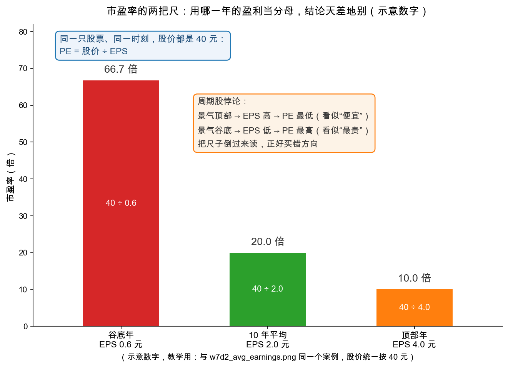

# 第 2 章：市盈率——最流行也最危险的尺子

> 本章你将：
> - 学会市盈率 $P/E$ 的两种等价算法（每股口径与市值口径），并知道它为什么成了全市场的默认语言；
> - 听一段"倍数简史"：10 倍标准如何被 1920 年代的狂热冲垮，利率为什么是倍数的水位线；
> - 掌握格雷厄姆的投资纪律：**20 倍平均盈利是投资性买入的上限**，以及"低 PE 陷阱"的三种成因；
> - 学会被大多数人忽略的半步：**股本变动（送转、增发、转债转股）对每股盈利的稀释**，并亲手算一个"转股后 EPS 缩水三分之一"的案例；
> - 顺手带走原书 ch41 的选读提醒：**股价低不等于便宜**。

---

## 2.1 全市场最流行的尺子

上一章我们把盈利能力算成了"每年平均赚 X"。市场会给这台赚钱机器标价，标价的通用语言就是**市盈率（price-earnings ratio，简称 $P/E$ 或 PE）**：

> 市盈率 = 股价 / 每股盈利（EPS）
>
> 另一种等价写法：市盈率 = 公司总市值 / 公司净利润

两种写法一定算出同一个数，因为每股数据就是总量除以股本。手算一遍（示意数字）：某公司净利润 10 亿元，总股本 5 亿股，股价 48 元。

> 每股口径：EPS = 10 亿 / 5 亿 = 2 元/股；PE = 48 / 2 = 24 倍
>
> 市值口径：总市值 = 48 $\times$ 5 亿 = 240 亿元；PE = 240 亿 / 10 亿 = 24 倍

PE 的直觉翻译：**你为每 1 元的年盈利，付了多少钱**。24 倍就是"花 24 块买一台每年产 1 块的机器"。它同时藏着另一面：盈利收益率 = 1 / PE，24 倍对应约 4.2%——把股票当成一张"盈利型的债券"看它的年息。这个倒数视角，马上会在格雷厄姆的红线里派上用场。

> 📌 **划重点：** PE 回答的从来不是"这公司好不好"，而是"**市场为它的盈利开了什么价**"。它是价格与盈利之间的汇率，本身没有好坏，放进具体公司、具体盈利口径里才有意义。

## 2.2 倍数简史：从 10 倍标准到"新时代"

ch39 开篇是一段简短的估价史（md 548-549），读来像看一把尺子被逐渐撑弯：

| 时期 | 市场流行的倍数 | 格雷厄姆的注脚 |
|---|---|---|
| 1927 年之前 | **10 倍盈利**是公认的出发点 | 特别好的公司才配更高，反之更低 |
| 1927-1929 | 名人名言喊出"好股票值 15 倍"；公用事业、连锁店等宠儿卖到 **25-40 倍** | 时任通用汽车高层拉斯科布（John Raskob）1928 年公开说，通用汽车"按 15 倍盈利能力"应值 225 美元/股（历史案例，md 548） |
| 1932 年之后 | 价格相对盈利系统性抬高 | 原因很实在：**长期利率大幅下降**——利率是所有倍数的水位线（md 549） |

最后一条值得单独记住：**盈利收益率（1/PE）天然和利率较劲**。利率 8% 的年代，20 倍股票（收益率 5%）看起来就很贵；利率降到 2% 的年代，同样的 20 倍却像"合理定价"。这就是为什么倍数的"合理值"会随时代漂移——但漂移的是**参数**，不是**纪律**，下一节你看纪律长什么样。

## 2.3 精确估值不存在：投票机与分析师的三件事

格雷厄姆接着泼冷水（md 549）：任何股票都**不存在**一个可以算出来的"正确倍数"，"该 10 倍还是 15 倍还是 30 倍，说到底是任意的选择"。但他给市场画了那张著名的像：

> 股票市场是一台投票机，而不是一台称重机。它对事实数据的反应不是直接的，而是只在这些数据影响买卖双方决策时才发生。

市场必须先报价、再找理由。那分析师还剩什么活干？原书列了三件**有限的、具体的**事（md 549）：其一，给普通股搭一套**保守/投资性的估值基准**，与投机性估值区分开；其二，指出**资本结构**（第 3 章）与**利润来源**对估值的意义；其三，发现资产负债表里影响盈利含义的异常因素（Week 8 的主战场）。本章干的就是第一件。

## 2.4 投资的红线：20 倍平均盈利

格雷厄姆给出的投资性估值基准，核心就三条（md 550-551）：

1. **估值的原料**：过去 5-10 年的平均盈利（上一章的成果）。仅当三个条件同时满足——当年商业环境不算特别好、公司多年上升趋势、你对行业持续增长有信心——才允许用最新一年的盈利当原料。
2. **倍数的上限**：**约 20 倍平均盈利，是投资性买入能出的最高价**；前景中性的典型公司，合适价位在 12 到 12.5 倍附近。
3. **为什么是 20**：20 倍对应盈利收益率 5%——**平均盈利连股价的 5% 都不到，这个价格就得不到安全边际的保护**。愿意为此买单的人，赌的是"未来盈利会更大"，而按原书最本义的用法，这叫投机，不属于普通股投资的范畴。

> ⚠️ **易踩坑：把"20 倍以上不能买"读成"20 倍以上的股票都会跌"。** 格雷厄姆的原话很精确：超过 20 倍买，**这笔买入的性质是投机**——它完全可能赚大钱，但那属于"聪明或幸运的投机"，而且"很少有人能持续地又聪明又幸运"。他还留了一句更狠的推论：**习惯性以 20 倍以上平均盈利买入的人，长期大概率亏不少钱**——因为没有了这道机械闸门，人总会被牛市里那些"这次不一样"的说辞反复俘虏（md 551）。反过来还有一条甜的推论：**一笔有吸引力的投资，天然也是一笔有吸引力的投机**——价格合理的好公司，总有机会被市场重新发现。

参数要当年化，纪律不用。1940 年的"20 倍"诞生在长期利率高企的年代；今天应用这条红线，要先看无风险利率的水位，再决定倍数的松紧——但"**用平均盈利当分母 + 给倍数封顶 + 超线即算投机**"这三件事，一样都不能省。

## 2.5 高 PE 的三种含义与低 PE 的陷阱

遇到一个 PE 数字，先别急着下"贵/便宜"的结论。**高 PE 至少有三种完全不同的含义**：

1. **真的贵**：市场为繁荣支付了溢价（第 3 章的主角）；
2. **增长预期**：买家在为"未来的 E"付钱——E 还没长大，价格先到了；
3. **盈利失真**：分母 E 处在异常低的年份（周期谷底、一次性损失、计提大年），把倍数"顶"高了。

而**低 PE** 同样三种成因：真的便宜（格雷厄姆最爱的那种）、市场看错了、以及最危险的——**分母 E 被景气吹到顶部**。看图：

这就是第 1 章埋的雷，现在引爆：**周期股在景气顶部 PE 最低、在景气谷底 PE 最高**。谁若机械执行"只买低 PE"，就会精确地在周期顶部满仓、在周期谷底割肉——把尺子倒着用。解法回到第 1 章：**分母必须用常态化的盈利能力（平均盈利），而不是任何单年的数字**。对一次性损益同理：先扣非（Week 6），再进分母。

## 2.6 半步之差：股本一动，EPS 就变

PE 的分母是 EPS，而 EPS = 净利润 / 总股本。**净利润没变，股本一变，EPS 跟着变**——这是最流行尺子里最常被忽略的机关。原书 ch39 后半整段都在讲怎么调整（md 555-558）：

| 股本事件 | 对每股盈利的影响 | 分析师的动作 |
|---|---|---|
| 送股、拆股（如 10 送 10） | 股数翻倍、每股数据减半——纯数字游戏（Week 5 说过：左手换右手） | 把**全历史按最新股本口径重述**，再谈趋势 |
| 低价增发、配股 | 老股东的每股权益被摊薄 | 原书建议：给新增资金按 5%-8% 的保守回报估算它"本应挣多少" |
| 可转债转股、认股权证行权 | 转股后债主变股东：利息回来了，股本也变大 | **假设全部转股/行权，重算 EPS** |
| 管理层持股激励行权 | 同上，量小但年年有 | 看年报"稀释每股收益"即可，当代报表已替你算好 |

原书手把手算了美国航空公司的例子（历史案例，数字照原书摘录，md 556）：截至 1939 年 9 月的 12 个月，报告盈利 112.8 万美元、流通约 30 万股，**每股盈利 3.76 美元**，股价约 37 美元，看着才 10 倍。但账上还有 260 万美元年息 4.5% 的可转债，转股价 12.5 美元/股——远低于市价，转股几成定局。格雷厄姆假设全部转股重算：

> 利息加回：260 万 $\times$ 4.5% = 11.7 万 → 盈利变 112.8 + 11.7 = 124.5 万美元
>
> 股本变大：260 万 / 12.5 = 20.8 万股 → 总股本约 30 + 20.8 = 50.8 万股
>
> 调整后 EPS = 124.5 万 / 50.8 万 $\approx$ 2.45 美元

**3.76 美元一下子缩水到 2.45 美元——报告盈利的三分之一多，在转股面前蒸发。** PE 也从"10 倍"变成约 15 倍。原书由此给出通用规则：只要股票前面挂着可转债、期权、参与权这类"未来的新股"，它的估值**不得高于"全部转股/行权后"所支持的水平**（md 558）。

落到 A股/港股：送转高压文化（高送转行情）是本条的本土版；可转债转股稀释正是 [Week 4](../week4/02-可转债-进可攻退可守的变形金刚.md) 转股溢价的另一面。当代报表已经把这道题做了一半——利润表上"基本每股收益"与"**稀释每股收益**（diluted EPS）"两行并列，**保守起见看稀释口径**。

## 2.7 选读角：ch41 的两个提醒（可选读）

本周指定章节外，原书第 41 章（低价普通股与利润来源分析，md 572-586）还有两句话，正好贴在本章结尾。第一，**股价低不等于便宜**：市场上流传"低价股涨得快"（从 10 涨到 40 比从 100 涨到 400 容易），但格雷厄姆拆穿了话术——很多"几块钱"的股票只是**股本被刻意做大**，每股几美元、总市值却早已高得离谱；真正总市值远低于资产的便宜货，反而无人推销、无人问津（md 572-575）。第二，**利润要按来源分开估值**：当一家公司相当一部分利润来自持有的债券或收租资产时，把这些"类债券利润"也乘 10 倍市盈率，会得出"金边债券只值三折"的荒谬结论——不同来源的利润，配不同的倍数（md 579-580）。这条思路通向 Week 8 的资产价值锚。

> 💡 **你可能会问：行情软件里的 PE 到底是哪个口径？**
>
> 通常是静态（最近年报）或 TTM（最近四个季度滚动）之一，不同软件还可能不一样。所以开口谈 PE 之前，先说清口径——第 4 章你会亲眼看到，同一只股票同一价格，三种口径能差出一倍以上。

## ✍️ 想一想

> 建议**先自己写两句话再看答案**。想不清楚的地方，就是下一遍该重读的地方。

### 问 1：增发之后 EPS 与 PE 怎么变

手算：乙公司净利润 12 亿元，总股本 8 亿股，股价 30 元。求 EPS 与 PE（两种口径各算一遍）。若它明年以 25 元/股增发 1.6 亿股、募资 40 亿（假设净利润不变），新的 EPS 和"旧股价下的 PE"各是多少？老股东每股盈利被摊薄了百分之几？

**解题思路：** 先用 2.1 节的两种等价算法互验（每股口径与市值口径必须算出同一个数），再进入 2.6 节的"股本一动，EPS 就变"。摊薄幅度要按 **EPS 之比**算，不是拿新增股数去除旧股本。

**参考答案：** **增发前**：$EPS = 12 / 8 = 1.5$ 元/股；每股口径 $PE = 30 / 1.5 = 20$ 倍；市值口径：总市值 $= 30 \times 8 = 240$ 亿元，$PE = 240 / 12 = 20$ 倍，两种算法相等。**增发后**：总股本 $= 8 + 1.6 = 9.6$ 亿股；净利润不变，$EPS = 12 / 9.6 = 1.25$ 元/股；旧股价 30 元下，$PE = 30 / 1.25 = 24$ 倍。**摊薄幅度** $= 1 - 1.25 / 1.5 \approx 16.7$%，净利润不变时它恰好等于新股本占增发后总股本的比例，$1.6 / 9.6 \approx 16.7$%。**再按原书口径补一刀**：2.6 节要求给新增资金按 5% 到 8% 的保守回报估算它"本应挣多少"。募资 40 亿，按 5% 算多赚 2 亿，$EPS = 14 / 9.6 \approx 1.46$ 元；按 8% 算多赚 3.2 亿，$EPS = 15.2 / 9.6 \approx 1.58$ 元——**后者反而高于原来的 1.5 元**。这不是巧合：老股东按 30 元市价对应的盈利收益率是 $1.5 / 30 = 5$%，而这次增发价只有 25 元，新股东按增发价买入的收益率是 $1.5 / 25 = 6$%，**新钱要赚回 6% 才不摊薄老股东**，原书那个 5% 到 8% 的区间正好跨过这条线。所以"增发一定摊薄"是错觉——**摊薄与否，取决于新增资金赚回来的回报率**。

**易错点：** ① 只算 EPS 不算 PE 的变化，或者拿"新净利润 除以 旧股本"这种口径不配对的组合；② 把摊薄算成 $1.6 / 8 = 20$%——分母要用**增发后**的 9.6 亿股，或者干脆用 EPS 之比算，两种算法都约等于 16.7%；③ 默认"净利润不变"就收工——那只是最保守的下限，原书要求给募来的钱估一个回报（5% 到 8%），不估等于认定这笔钱一分也赚不回来。

### 问 2：24 亿转债全部转股的稀释

某转债面值 100 元、转股价 20 元，对应正股股价 30 元、总股本 6 亿股，公司年净利润 9 亿元，该转债规模 24 亿元全部转股。（a）转股新增多少股？（b）若转债年利息 1.2 亿、转股后不再支付，新的"全额稀释 EPS"是多少？和原 EPS 差多少？（提示：把 Week 4 的转股价值与本章的稀释放在一起想）

**解题思路：** 这是 2.6 节美国航空公司例子的本土版，三个动作一个都不能少：算转股价值判断债主会不会转、按**面值**除转股价算新增股数、把利息加回利润表再重算 EPS。题干里正股 30 元远高于转股价 20 元，转股几乎必然——正是 Week 4 说的"进可攻"兑现的时刻。

**参考答案：** **先看转股动力**：每张面值 100 元的转债按 20 元转股价可换 5 股，对应市价 $5 \times 30 = 150$ 元，远高于 100 元面值——债主不转才是傻子。**(a)** 转股新增股数 $= 24 / 20 = 1.2$ 亿股，这里除的是**债券面值**，不是转股价值。**(b)** 原 $EPS = 9 / 6 = 1.5$ 元/股。转股后利息不再支付，加回利润 1.2 亿，净利润 $= 9 + 1.2 = 10.2$ 亿元；股本变为 $6 + 1.2 = 7.2$ 亿股；**全额稀释 EPS** $= 10.2 / 7.2 \approx 1.42$ 元/股，与原 EPS 相差 $1.5 - 1.42 = 0.08$ 元，**缩水约 5.6%**。PE 跟着变：老口径 $30 / 1.5 = 20$ 倍，稀释后 $30 / 1.42 \approx 21.1$ 倍。**为什么缩水不算多？** 股本增加了 20%（$1.2 / 6$），利息加回却只让利润增加 13.3%（$1.2 / 9$），利润补回来的没有股本摊出去的快。对照 2.6 节美国航空的例子：报告盈利 112.8 万美元、流通约 30 万股，EPS 3.76 美元，全部转股后掉到约 2.45 美元，PE 从"10 倍"变约 15 倍——**这正是原书那条通用规则的理由：股票前面挂着可转债、期权这类"未来的新股"时，估值不得高于"全部转股行权后"所支持的水平。**

**易错点：** ① 忘了把利息加回利润（只加股本不加利润），会把稀释算得过重——格雷厄姆在美国航空例子里专门做了"利息加回 11.7 万"这一步；② 用转股价值 150 元去除转股价——新增股数只跟**债券面值**和转股价有关，$24 / 20 = 1.2$ 亿股；③ 以为"转股是债主的事，与我这个股东无关"——转股后债主变股东，股本变大、EPS 被摊薄，而且**正股涨得越高转股越确定、稀释越真实**，所以读报表要直接看"稀释每股收益"那一行。

### 问 3：给 8 倍 PE 的航运股做体检

你朋友的选股清单上写着："PE 8 倍的航运股，便宜！"用本章的三种"低 PE 成因"给这句话做一次体检：你需要先确认哪三件事，才敢在清单上加一个问号或对勾？

**解题思路：** 直接套 2.5 节的三种低 PE 成因（真的便宜、市场看错了、分母 E 被景气吹到顶部），再把第 2 章散落的三道口径问题落成要查的三件事：**E 是哪一年的、扣非了吗、股本变了吗**。航运是第 1 章点名的强周期行业，所以第一件事必然是周期位置。

**参考答案：** **三件事，缺一件就只能画问号。** **第一件：这个 8 倍的分母 E 是哪一年的、处在周期什么位置。** 航运是石油、面板、猪周期那一类的强周期生意，2.5 节的图说得明白：周期股在景气顶部 PE 最低、在谷底最高，机械执行"只买低 PE"会精确地在顶部满仓。要拿 5 到 10 年平均盈利重算一遍——如果 8 倍是顶部单年 EPS 换来的，平均口径下很可能立刻翻倍（第 1 章那张图里，顶部年 10 倍的公司用常态盈利一量就是 20 倍）。**第二件：这个 E 扣非了吗、成色如何。** 卖船收益、汇兑损益、政府补贴、以前年度存货结转算进去了没有？先扣非（Week 6），再进分母；顺手看一眼折旧足额不足额（第 0 章），以及 1.8 节质疑清单上的三条——利润来自一次性存量、来自另一门生意、产品价格处在极端位，这三条对航运股条条致命。**第三件：股本会不会变。** 航运公司常在低谷低价增发，也常挂着可转债和期权（2.6 节），把"全部转股行权"后的稀释 EPS 算出来，8 倍可能变成 9 倍、10 倍。**判定标准**：三件都查清、都过关，可以在清单上打对勾，但要带着口径写成"按某某年扣非平均盈利计算的 8 倍"；只要有一件答不上来，就画问号。**8 倍是结果（分母膨胀），不一定是便宜的原因**——而在它跌到谷底、PE 高得吓人的那一年，反而可能是最好的买点。再补一句：8 倍对应盈利收益率 $1 / 8 = 12.5$%，看着比无风险利率厚得多，可这是**周期顶部的 12.5%**，盈利一回落收益率跟着塌——2.2 节说盈利收益率天然和利率较劲，前提是那个 E 站得住。

**易错点：** ① 拿 8 倍直接和同行比，却不知道对方的 PE 是静态、TTM 还是平均口径——同一只股票同一价格，三种口径能差出一倍以上（2.7 节、第 4 章）；② 用"8 倍低于 20 倍红线，所以算投资"来收尾——红线是给**平均盈利**划的，用顶部单年盈利算出的 8 倍根本没进过这道闸门；③ 反过来认为"周期股 PE 会失真，所以 PE 没用"——PE 不是没用，是**必须配常态化的分母**，用对了它照样是全场最顺手的尺子。

## 📖 回到原书

**原书位置：** 第 39 章 Price-Earnings Ratios for Common Stocks（md 548-558），金句出自 md 549 与 md 550。

> Hence the prices of common stocks are not carefully thought out computations but the resultants of a welter of human reactions. The stock market is a voting machine rather than a weighing machine. It responds to factual data not directly but only as they affect the decisions of buyers and sellers.
>
> 因此，普通股的价格并不是深思熟虑的计算结果，而是纷乱人性反应的合成物。股票市场是一台投票机，而不是一台称重机。它对事实数据的反应不是直接的——只有当事实改变了买卖双方的决策时，价格才会动。

一句话点评：为什么"低 PE"未必便宜、"高 PE"未必贵——因为报价的是投票机，不是称重机；称重的活，留给了分析师。

> We would suggest that about 20 times average earnings is as high a price as can be paid in an investment purchase of a common stock.
>
> 我们的建议是：约 20 倍平均盈利，就是一笔投资性普通股买入所能支付的最高价格。

一句话点评：一句话里三个限定词——"约""平均""投资性"——少了任何一个，这条纪律都会被读歪。

---

尺子有了，刻度也有了。但同一台赚钱机器，**融资方式**不同，每股盈利的弹性可以差出一倍——下一章看杠杆的两副面孔。见 [第 3 章：资本结构——杠杆的两副面孔](03-资本结构-杠杆的两副面孔.md)。
