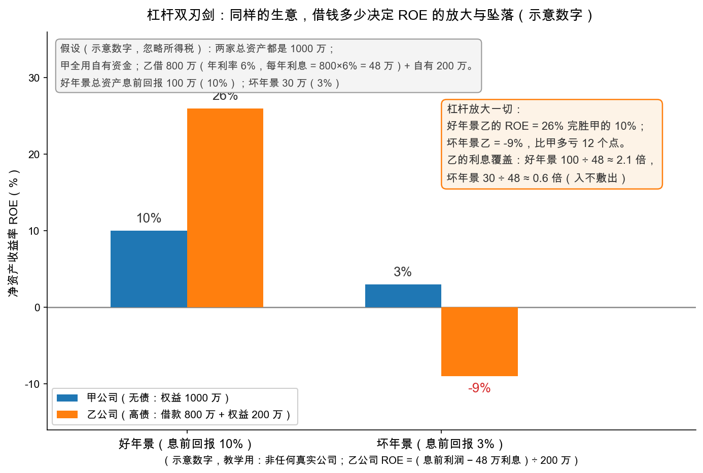

# 第 3 章：资本结构——杠杆的两副面孔

> 本章你将：
> - 说清**资本结构（capitalization structure）**：公司的钱里，借来的（债）与股东的（股）各占多少，为什么它直接决定每股盈利的弹性；
> - 亲手算"杠杆双刃剑"：两家总资产相同的公司，好年景与坏年景的 ROE 对比（结果与配图逐数一致）；
> - 读懂格雷厄姆的"三家公司"假想例：同样 100 万美元的盈利能力，仅凭借钱多少，公司总估值可以差出一半；
> - 见识杠杆在历史里上演的三出大戏——涨 400 倍的水电股、每股盈利从 0.87 到 84 美元的玉米加工厂、两年涨 16 倍再跌 98% 的橡胶股；
> - 记住那句判词：**"正面我赢，反面你输"**——以及"在好年景买杠杆公司，等于为繁荣支付溢价"。

---

## 3.1 每股盈利之前，先看钱是怎么凑的

前两章我们把"赚多少"（盈利能力）和"卖多少钱"（市盈率）都讲完了。但中间还藏着一个变量：**同一门生意，钱可以全部靠股东出，也可以借一大块**。公司的全部资本里，**债、优先股、普通股各占的比例**，就叫资本结构。

[Week 1 第 4 章](../week1/04-证券家族地图-股债与它们的混血儿.md)画过求偿顺序金字塔：债在最上面（旱涝保收、利息固定），普通股在最底下（剩多少拿多少）。现在把这个金字塔和利润表接起来——**利润分配是自上而下的瀑布**：先付利息，再付优先股股息，剩下的才轮到普通股。于是同一笔利润，金字塔的形状一变，落到最底层（普通股股东）的量就和波动幅度全变。这个"被放大/被踩扁"的机制，就是**杠杆（leverage）**，原书也叫 trading on the equity（举债经营效应）。

## 3.2 手算双刃剑：两家公司，四种年景

造两家假想公司（示意数字，全部手算可复现，忽略所得税——两家同样忽略，结论不受影响）：

> **甲公司（无债）**：总资产 1000 万，全部由股东出资，股本 1000 万，没有任何借款。
>
> **乙公司（高债）**：总资产 1000 万，其中借债 800 万（年利率 6%），股东只出了 200 万。
>
> 乙每年利息 = 800 万 $\times$ 6% = **48 万**，这是一笔**下雨也要付**的固定支出。

两家做一模一样的生意，总资产的息前回报（付利息之前的利润）分两种年景：**好年景** 100 万（回报率 10%），**坏年景** 30 万（回报率 3%）。算各家的净资产收益率（ROE = 归普通股东的利润 / 股东权益）：

| 年景 | 甲公司（无债） | 乙公司（高债） |
|---|---|---|
| 好年景 | 100 万 / 1000 万 = **10%** | (100 万 - 48 万) / 200 万 = 52 万 / 200 万 = **26%** |
| 坏年景 | 30 万 / 1000 万 = **3%** | (30 万 - 48 万) / 200 万 = 亏损 18 万 / 200 万 = **-9%** |

一目了然：**生意是同一门，借钱多少让股东回报从"10% 对 3%"变成"26% 对 -9%"**。乙把甲的波动放大了两倍多——好年景多赚的，坏年景加倍还回去。

再看乙公司的软肋——**利息保障倍数（interest coverage，息前利润 / 利息）**，Week 3 的老朋友：

> 好年景：100 万 / 48 万 $\approx$ 2.1 倍；坏年景：30 万 / 48 万 $\approx$ 0.6 倍（入不敷出）

坏年景 0.6 倍意味着经营利润不够付利息，缺口要从老本里掏。好年景 2.1 倍看着还行？格雷厄姆在 md 563 特意点名：**对工业公司来说，两倍的利息保障是不够的**。他的论证方式很毒辣——假如两倍就够安全，那么任何一家"用 1000 万本钱赚 80 万（8%）"的稳健生意，都可以发行 4% 的债券把债主的钱全数套回来，股东白拿一半利润还保留控制权——"这对老板极具吸引力，但对买债券的人愚蠢至极"。**两倍覆盖的"安全"，是拿债主的安全换股东的甜头。**（Week 3 讲过工业债的保障倍数门槛远高于两倍，正是同一枚硬币的另一面。）

> 📌 **划重点：** 杠杆不创造利润，只**重新分配**利润和风险——从债主手里搬到股东手里（景气时），再从股东手里搬回去（衰退时）。看一家公司的股票，先看它脚下垫了多少债。

## 3.3 格雷厄姆的三家公司：借钱能"借出"估值吗？

ch40 开篇的假想例是本章的灵魂（假想案例，数字照原书摘录，md 559）。三家公司盈利能力完全相同——都是每年 100 万美元，只是资本结构不同：

| 公司 | 资本构成 | 归普通股的盈利 | 普通股估值（按 12 倍） | 债券价值（按面值） | 公司总估值 |
|---|---|---|---|---|---|
| 甲 | 仅 10 万股普通股 | 100 万（每股 10 美元） | 1200 万 | — | **1200 万** |
| 乙 | 600 万 4% 债券 + 10 万股普通股 | 76 万（每股 7.60 美元） | 约 900 万 | 600 万 | **1500 万** |
| 丙 | 1200 万 4% 债券 + 10 万股普通股 | 52 万（每股 5.20 美元） | 约 600 万 | 1200 万 | **1800 万** |

**同样的盈利能力，总估值 1200 万、1500 万、1800 万**——借钱越凶，公司越"值钱"？格雷厄姆先自己拆穿这个悖论：甲公司的股票其实"内含"了乙的债券加股票两部分，只是市场把全部股权都按 12 倍盈利计价，其中相当于"债券成分"的那块本该按 4% 的债券标准计价——**是定价的方式制造了差异，不是借钱本身创造了财富**（md 560-561）。他由此给出那条著名原则：

> The optimum capitalization structure for any enterprise includes senior securities to the extent that they may safely be issued and bought for investment.
>
> （对任何企业而言）最优的资本结构是：高级证券（债）的规模，以"能够安全地发行、并且值得投资者买入"为限。

翻译成大白话：**适度借钱是聪明的**——股东的钱效率更高，市场上也多了安全的债券可选；**借钱必须以"债券本身够格成为投资品"为界**。乙公司（4 倍覆盖：100 万 / 24 万 $\approx$ 4.2 倍）的债够格，结构是"合适的"；丙公司（约 2.1 倍覆盖）的债不够格——它的债券理应折价，股票也会因为头顶悬着巨额固定支出而被保守买家嫌弃，**结果可能是债和股加起来卖不到 1500 万，甚至不如甲**（md 563-564）。甲那种一分钱不借的结构，原书叫"过度保守"：股东的钱没有发挥全部效率。

## 3.4 杠杆的放大器：为什么周期一来，EPS 上蹿下跳

把丙公司的盈利摆一摆，就能看到杠杆的数学（md 564）：

> 息前利润涨 25%（100 万 → 125 万）：归普通股 = 125 - 48 = 77 万，每股 7.70 美元——**涨了 48%**
>
> 息前利润跌 25%（100 万 → 75 万）：归普通股 = 75 - 48 = 27 万，每股 2.70 美元——**跌了 48%**

**生意波动 25%，股东盈利波动 48%**——乙公司那张柱状图（10% 对 26%、3% 对 -9%）说的就是同一件事：固定利息像一支杠杆，撬动底下那小块股东权益。丙公司利息涨到 6% 会怎样？利息 72 万，好年景覆盖倍数只剩 100 / 72 $\approx$ 1.4 倍。格雷厄姆提醒（md 563）：如果有投资者嫌"6% 债券覆盖 1.4 倍"太危险、却接受"4% 债券覆盖 2.1 倍"——他实际上是在**因为债息给得大方而拒绝一只债券**，荒唐；安全边际的下限必须定得足够高，**不能让"利率低"伪装成"安全"**。

> 💡 **你可能会问：借钱多当然是公司管理层的选择，我买股票的为什么要关心？**
>
> 因为你买的就是金字塔最底层的那块。第 1 章教你问"这利润能不能持续"，本章加一问：**"这利润的波动被放大了几倍？"** 同样 20 倍 PE 的两家公司，无债那家的 E 更接近常态，高杠杆那家的 E 可能站在景气顶上——同一个 PE，风险完全不同。

## 3.5 历史三幕剧：杠杆的巅峰与深渊

原书用三段真实历史把杠杆演给你看（历史案例，数字照原书摘录）：

**第一幕：涨 400 倍的水电股。** 美国自来水与电气公司（American Water Works and Electric）1921 到 1929 年，老股 1 股 6.5 美元涨到（经送股调整后约 12.5 股）合计约 2500 美元——**约 400 倍**；而同期公司总收入只增长到约 2.6 倍（md 565-566）。多出来的几百倍从哪来？高投机性资本结构把业务扩张的每一分好处都聚焦到底层小股份上，再叠加牛市给每股盈利开出的近 50 倍高价。**杠杆 + 好年景 + 高倍数，三级火箭。**

**第二幕：从 0.87 到 84 美元。** 玉米加工厂斯托利（A. E. Staley）1925 到 1933 年，每股盈利在 **0.87（实际为亏）到 84.09 美元**之间摆荡——业务本身就有周期，再被"大债权 + 小股本"放大（md 566-567）。它 1933 年 1 月的总市值远低于同行业资本结构保守的美洲玉米制品公司，随后几年股价从 33 美元的低点涨到 1939 年的约 320 美元（按拆股调整）——**高杠杆公司在谷底被踩得越扁，反弹的百分比越高**；但同一家公司 1927 到 1928 年也曾从 75 涨到近 300。两头都是杠杆的礼物，接不接得住另说（md 569）。

**第三幕：两年 16 倍，再跌 98%。** 莫霍克橡胶（Mohawk Rubber）1927 年股价 15 美元时，优先股在上方压着 196 万美元、普通股总市值只有区区 30 万美元。1927 年公司利润 63 万美元——**几乎全归底下这层"薄薄的"普通股**，每股 23 美元开外，股价从 15 窜到 1928 年的 251 美元；1930 年重新亏损，1931 年股价跌回约 4 美元（md 569）。格雷厄姆给这种结构的判词成了名言：

> The common stockholder is operating with a little of his own money and with a great deal of the senior security holder's money; as between him and them it is a case of "Heads I win, tails you lose."
>
> 普通股股东只用一小部分自己的钱、大量使用高级证券持有人的钱在做生意；在他与后者之间，局面就是"正面我赢，反面你输"。

## 3.6 在好年景买杠杆股，等于为繁荣支付溢价

把本周三章拧成一句话：第 1 章说市场爱用**单年盈利**定价，本章说杠杆会把**单年盈利的起伏放大**——两者相乘，就是高杠杆公司在景气顶部利润最漂亮、市盈率看起来最"合理"、股价也最贵的时刻。此时买入，你按"被杠杆放大的繁荣盈利"付了全款，**等于为繁荣本身支付溢价**；而格雷厄姆观察到，这类公司的真正便宜货出现在萧条里人人避之不及的时刻（md 564-565, 569）。这不是让你去抄底高杠杆公司——那需要 Week 9 讲的整套纪律——而是提醒你：**好年景里，对高杠杆公司的高盈利要多打一个问号；坏年景里，对它的惨状也别照单全收。**

> 📌 **实战联系：** A股 与港股对杠杆的"文化差异"很有意思。A 长期偏爱股权融资——增发、配股、定增，能发股票绝不发债（第 2 章讲的稀释因此更常见）；港股及中资地产、航空公司则大量使用高息美元债，杠杆的断裂声在下行周期格外响（地产行业 2021 年后的债务困境就是当代教科书）。银行则是"杠杆天然高"的特例——十几倍的资金杠杆是商业模式的一部分，报表要另眼看待（Week 8 拿招商银行细说）。查任何一家公司的杠杆，两个数起步：**资产负债率**（总负债/总资产，看趋势）与**利息保障倍数**（息前利润/利息，对照 Week 3 的门槛），有息负债和无息经营负债要分开看——占压上下游的应付款不算真正的"债"。

## ✍️ 想一想

> 建议**先自己写两句话再看答案**。想不清楚的地方，就是下一遍该重读的地方。

### 问 1：两种年景下的利息与 ROE

手算：丙公司总资产 2000 万，其中年息 5% 的借款 1200 万，股东权益 800 万。息前利润 200 万和 60 万两种年景下：（a）利息是多少？（b）归普通股东的利润和 ROE 各是多少？（c）好年景的利息保障倍数是多少，够不够格雷厄姆的及格线？

**解题思路：** 先把固定支出从息前利润里减掉（3.1 节的瀑布顺序：先付利息，再轮到普通股），再用"归普通股东的利润 除以 股东权益"求 ROE。第 (c) 问要当心两点：保障倍数的及格线不是 2 倍，而且**必须按坏年景量**。

**参考答案：** **(a)** 利息 $= 1200 \times 5$% $= 60$ 万元/年，这是一笔"下雨也要付"的固定支出。**(b)** 好年景：归普通股利润 $= 200 - 60 = 140$ 万元，$ROE = 140 / 800 = 17.5$%；坏年景：归普通股利润 $= 60 - 60 = 0$ 万元，$ROE = 0 / 800 = 0$%。**注意坏年景这个 0**：息前利润刚好等于利息，经营赚的钱被固定支出吃得一分不剩，股东白干一年——而这只算"小年"，还不算"灾年"。**(c)** 好年景利息保障倍数 $= 200 / 60 \approx 3.3$ 倍。够不够？先纠正一个误解：**格雷厄姆的及格线不是 2 倍**——他在 md 563 特意点名，"对工业公司来说，两倍的利息保障是不够的"，理由是假如两倍就够安全，任何一家用 1000 万本钱赚 80 万（8%）的稳健生意，都能发行 4% 的债券把债主的钱全数套回来，股东白拿一半利润还保留控制权。3.3 节那组"三家公司"的例子里，覆盖率 4.2 倍那家的债券被称为"够格"，约 2.1 倍那家被称为"不够格"。所以这个约 3.3 倍属于**偏紧的中间地带**：比 2 倍安全垫厚，但没到"债券够格当投资品"的水平；更要命的是坏年景只有 1 倍——按格雷厄姆的标准，**安全边际要按坏年景量，不是按好年景量**。

**易错点：** ① 用息前利润去算 ROE（忘了先扣利息）——ROE 的分子是"归普通股东的利润"，利息排在普通股前面；② 把股东权益算成 2000 万（权益只有 800 万，1200 万是借来的），分母一错 ROE 全错；③ 看到好年景 3.3 倍就放心——保障倍数要按坏年景量，坏年景只有 1 倍，经营利润刚好被利息吃光，**这不是安全，是走钢丝**。

### 问 2：生意涨 20% 股东回报涨多少

甲（无债）与乙（借 60%，年利率 6%）总资产同为 1000 万。息前利润从 100 万增长 20% 到 120 万，两家的 ROE 各从多少变到多少？把"生意涨 20%"翻译成"股东回报涨百分之几"，体会放大倍数差在哪里。

**解题思路：** 两家总资产相同、生意相同，只有资本结构不同——这是 3.2 节"手算双刃剑"的复刻。先算出乙的借款与利息，再分别求两个年景的 ROE，最后比较"息前利润的涨幅"和"ROE 的涨幅"。

**参考答案：** **甲公司（无债）**：股东权益 1000 万。原来 $ROE = 100 / 1000 = 10$%；息前利润涨 20% 到 120 万，$ROE = 120 / 1000 = 12$%。生意涨 20%，股东回报从 10% 到 12%、也涨 20%（$(12 - 10) / 10 = 20$%）——无杠杆，一比一传导。**乙公司（借 60%）**：借款 $= 1000 \times 60$% $= 600$ 万，股东权益 400 万，年利息 $= 600 \times 6$% $= 36$ 万。原来归普通股利润 $= 100 - 36 = 64$ 万，$ROE = 64 / 400 = 16$%；息前利润涨到 120 万后，归普通股利润 $= 120 - 36 = 84$ 万，$ROE = 84 / 400 = 21$%。股东回报从 16% 到 21%，**涨了 31.25%**（$(21 - 16) / 16$）。**放大倍数差在哪**：生意同样涨 20%，甲涨 20%、乙涨约 31%，乙的放大倍数 $= 31.25 / 20 \approx 1.56$ 倍——这个数恰好等于"息前利润 除以 归普通股利润"，即 $100 / 64 = 1.5625$。原因就是 3.4 节那句话：**固定利息像一支杠杆，撬动底下那小块股东权益**——36 万利息雷打不动，息前利润多出来的 20 万全部落进 400 万的股东权益里，而不是摊到 1000 万上。**别忘了反面**：息前利润若跌 20% 到 80 万，乙的归普通股利润变成 $80 - 36 = 44$ 万、$ROE = 11$%，同样被放大约 1.56 倍地往下砸——3.2 节那张"10% 对 26%、3% 对 -9%"的表说的就是这件事。

**易错点：** ① 忘记先扣 36 万利息，直接拿 120 万去除以权益或总资产——ROE 的分子是"归普通股东的利润"；② 把乙的股东权益写成 1000 万（借来的 600 万不是股东的），分母一错，杠杆的放大效果就消失了；③ 只算好年景、只报"涨到多少"不报"涨了百分之几"——放大倍数的算式是"息前利润 除以 归普通股利润"（乙是 $100 / 64 \approx 1.56$ 倍），而它在利润下滑时会同样放大地往下砸。

### 问 3：两家 12 倍 PE 贵贱一样吗

概念题：某高杠杆公司今年 EPS 5 元，股价 60 元，PE 12 倍，处于行业景气高点；同行业无债公司 EPS 5 元，PE 12 倍。有人得出结论"两家的贵贱一样"。用本章的语言（繁荣溢价、常态盈利、固定支出）写出这句结论错在哪。

**解题思路：** 这句话的毛病在于**用一个不含资本结构信息的比率，去比较两家资本结构完全不同的公司**。拆成三层：固定支出（3.2 节的"下雨也要付"）、繁荣溢价（3.6 节）、常态盈利（第 1 章，以及 3.4 节结尾那句"同一个 PE，风险完全不同"）。

**参考答案：** **这句结论错在：12 倍只说明"价格与当期盈利的比率相同"，没有说明这两份 E 的可靠性与波动性相同。** **第一，固定支出不一样。** 高杠杆公司头顶挂着一笔固定利息，景气高点时它被漂亮的息前利润轻松覆盖，周期一回落，同一笔雷打不动的支出会先吃掉一大块利润——3.4 节算过：息前利润变动 25%，归普通股的盈利会变动 48%，**杠杆是放大器，对坏消息同样放大**。无债公司那 5 元 EPS 来自生意本身，高杠杆公司那 5 元 EPS 是"扣完利息、由被放大的息前利润变成的"，两者稳定性不在一个层级。**第二，这是繁荣溢价，不是常态盈利。** 景气高点的 5 元 EPS 是行情送的礼物，按它付 60 元，等于 3.6 节说的**为繁荣本身支付溢价**——你按被杠杆放大的顶部盈利付了全款。**第三，把分母换掉再比。** 第 1 章与 3.4 节都要求用 5 到 10 年平均盈利当分母；由于杠杆放大了波动，高杠杆那家的顶部利润相对自身平均的虚高幅度更大，同一条 60 元股价在平均口径下会算出**更高**的倍数——所以 12 倍对 12 倍只是两个用顶部 E 算出来的巧合，换了分母就不再相等。**一句话**：贵贱要按同一套动作重判——把 E 换成常态盈利、把保障倍数按坏年景算、再问一句"这笔利润的波动被放大了几倍"，而不是看两个相同的倍数。

**易错点：** ① 用"同一个 PE 数字"推出"同样的风险"——PE 是价格与盈利的比率，不含资本结构信息；② 只用好年景的利息保障倍数判断安全——格雷厄姆点名两倍对工业公司不够，而且安全边际要按坏年景量（本章坏年景 0.6 倍就是入不敷出）；③ 反过来一棍子打死所有杠杆公司——本章说的是"适度借钱是聪明的"、甲那种零负债反而叫"过度保守"，错的是**在好年景为杠杆付溢价**，不是杠杆本身。

## 📖 回到原书

**原书位置：** 第 40 章 Capitalization Structure（md 559-571），金句出自 md 561 与 md 569-570。

> The optimum capitalization structure for any enterprise includes senior securities to the extent that they may safely be issued and bought for investment.
>
> 对任何企业而言，最优的资本结构是：高级证券的规模，恰好以"能够安全地发行、并且值得投资者买入"为限。

一句话点评：既不为"零负债洁癖"站台，也不给"借鸡生蛋"开绿灯——格雷厄姆的答案永远是那条中间的、有刻度的线。

> The common stockholder is operating with a little of his own money and with a great deal of the senior security holder's money; as between him and them it is a case of "Heads I win, tails you lose."
>
> 普通股股东只用一小部分自己的钱、大量使用高级证券持有人的钱在做生意；在他与后者之间，局面就是"正面我赢，反面你输"。

一句话点评：翻开任何一家高杠杆公司的报表，先想想这句话——底层的狂欢，都是上层在买单。

---

估值的三块积木——盈利能力、市盈率、资本结构——都到齐了。下一章进入收官实战：把 Week 6 洗过的利润、本章的尺子，全部用到贵州茅台身上，从净利润一路手算到市盈率。见 [第 4 章：实战联系——给茅台算一遍市盈率](04-实战联系-给茅台算一遍市盈率.md)。
