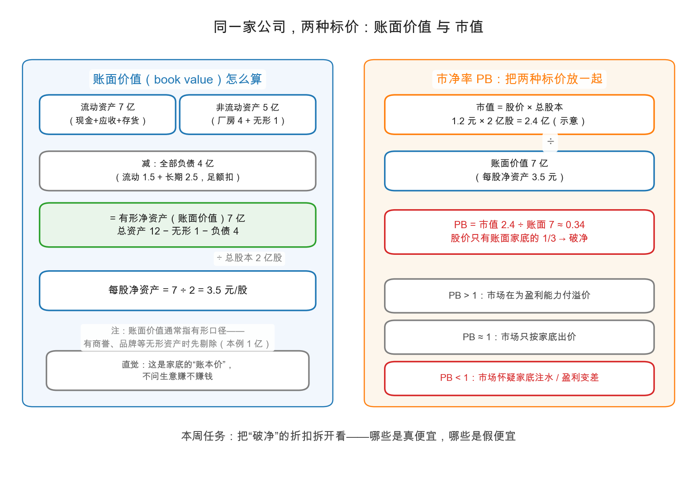

# 第 0 章：账面价值——会计意义上的家底

> 本章你将：
> - 接住 [Week 5 第 2 章](../week5/02-股票的价值从哪里来.md)埋下的第二只锚：资产价值锚，本周整周都在展开它；
> - 学会算**每股净资产（book value per share）**：有形资产 - 全部负债，再除以股本；
> - 用美国钢铁公司 1938 年的真实报表手算一遍完整流程（数字照原书摘录）；
> - 理解账面价值的两大局限：账面记录不等于真实价值、最值钱的无形资产偏偏不上账；
> - 认识**市净率（PB）**这把尺子的三种读法，以及账面价值的四种正确用法。

---

## 0.1 接上一周：第二只锚该下水了

上一周我们一直在给"赚钱能力"称重：平均盈利、市盈率、资本结构。但 [Week 5 第 2 章](../week5/02-股票的价值从哪里来.md)说过，估值有两只锚——除了"这台机器每年能赚多少"，还有一句更硬气的问题：**"这台机器本身，按账本值多少？"** 这就是资产价值锚，也就是本周的主题。

有意思的是，这个问题恰恰是当代市场最不爱问的。第六版 Part VI 的导读作者、价值投资者格林沃尔德（Bruce Greenwald）开篇就吐槽：今天的估值讨论几乎被市盈率垄断（连 EBITDA 这种口径都发明出来了），资产负债表又一次"几乎完全出局"——而 1934 年格雷厄姆写下这句话时，针对的正是当年一模一样的风气（md 589）。**八十多年过去，这条裂缝还在。** 谁愿意多看一眼资产负债表，谁就多一件大多数人已经不带的工具。

[Week 2 第 1 章](../week2/01-资产负债表-家底清单.md)教过你这张表的基本结构：资产 = 负债 + 所有者权益，左边按流动性排序。当时还埋过一句话：**账面数字不等于值多少钱**。本周就是把这句话彻底展开。

> 📌 **划重点：** 账面价值回答的问题是——"把公司按账本清算一遍，理论上归属股东的家底摊到每股是多少？"它是估值的**起点**，不是终点。

## 0.2 每股净资产怎么算：三步减除法

原书第 42 章开宗明义（md 600）：**股票的账面价值，就是报表上归属这些股票的资产价值**；习惯上只算**有形资产**——商誉、商标、专利、特许权这些"看不见摸不着"的，先剔除。写成三步：

$$\text{账面价值} = \text{有形资产} - \text{全部负债} - \text{排在普通股前面的股票}$$

$$\text{每股净资产} = \dfrac{\text{账面价值}}{\text{总股本}}$$

拿原书的原案走一遍：**美国钢铁公司（United States Steel），1938 年 12 月 31 日**（数字照原书摘录，md 601，单位：亿美元）：

| 步骤 | 项目 | 金额 |
|---|---|---|
| ① | 有形资产合计（厂房矿权 + 流动资产等） | 17.11 |
| ② | 减：排在普通股前的一切（优先股 3.60 + 债券 2.32 + 流动负债 0.79 + 其他 0.17） | 6.88 |
| ③ | = 归属普通股的净资产 | 10.23 |
| ④ | 总股本 870 万股，$\dfrac{10.23\text{ 亿}}{870\text{ 万股}} \approx 117.59$ | **每股 117.59 美元** |

第 ④ 步请拿计算器按一遍：$102300 \div 870 = 117.59$（万美元对万股，单位正好消掉）。这就是当年美国钢铁普通股的账面价值。

原书还给了条捷径，顺手验证一下：普通股面值 6.53 + 盈余与各类"自愿储备"3.70 = 10.23 亿美元——**殊途同归**。所谓"自愿储备"，指的是公司以"备用金"名义提走、实际上就是留存利润的一部分，算账时要把它当盈余看。

> 💡 **你可能会问：为什么优先股不能直接按票面扣？**
>
> 原书举了个刺眼的例子（md 602）：岛溪煤炭（Island Creek Coal）的优先股面值**每股 1 美元**，但每年固定领 6 美元股息、公司解散时每股分 120 美元。你若只从账上扣 1 美元，等于把一张大额欠条记成了零钱。格雷厄姆的办法：按**有效面值（effective par）**扣——与股息水平相称的真实求偿额。一句话：**扣多少，要看它真拿走多少，不看它脸上写多少。** A股 投资者很少遇到优先股，但这个"按实质不按名义"的原则，在第 1 章数资产时同样适用。

## 0.3 两大局限：为什么它只是"起点"

**局限一：账面记录不等于真实价值。** 资产负债表上的数字是**按记账规则算出来的**，不是评估师估出来的。原书点名了两种病（md 607）：早年流行把厂房"吹胀"上市（掺水股的余毒，[Week 5 第 0 章](../week5/00-普通股曾经是投机的代名词.md)讲过）；后来风向一转，公司反过来把厂房**减记到零**——图什么呢？图以后不用提折旧，利润表好看。格雷厄姆一针见血：两个方向相反的花招，结果是同一个——**账面价值失去意义**。

**局限二：最值钱的资产，恰恰不上账。** 商誉、品牌、客户关系、组织能力——会计要么不认，要么只在并购时记一笔。原书自己都承认（md 610）：在现代条件下，所谓"无形资产"从真金白银的角度看，**和厂房机器一样真实**；靠无形资产赚来的钱，甚至比靠砸设备赚来的更抗竞争。茅台的品牌没上过资产负债表，但这不妨碍它天天在赚钱。

> ⚠️ **易踩坑：看到 PB 低就喊便宜。** PB 的分母是账面价值，而账面价值可能被吹胀（虚增资产）、也可能被减记过头（隐藏资产）、还可能漏掉最值钱的东西（无形资产）。**用 PB 之前，先给分母做安检**——这正是本章和第 1 章要练的手艺。

## 0.4 市净率 PB：把账本价和市价放在一起

定义一句话：$\text{PB} = \dfrac{\text{股价}}{\text{每股净资产}} = \dfrac{\text{总市值}}{\text{账面价值}}$。它回答的是：**市场给这份账本标了几倍价**。

PB < 1 就是常说的**破净**——市价连账面家底都不到。市场为什么会给家底打折？先看原书摆出的四个极端案例（数字照原书摘录，md 608，请拿计算器把最后一列算出来）：

| 公司 | 年份与股价 | 每股账面价值 | 市价 ÷ 账面 |
|---|---|---|---|
| 通用电气 | 1930 年，95 美元 | 13.75 美元 | 约 6.9 倍 |
| 商业溶剂公司（Commercial Solvents） | 1933 年，57 美元 | 3.50 美元 | 约 16.3 倍 |
| 佩珀雷尔制造（Pepperell） | 1932 年，18 美元 | 176 美元 | 约 0.10 倍 |
| 宾夕法尼亚煤焦（Pennsylvania Coal & Coke） | 1933 年，3 美元 | 50 美元 | 约 0.06 倍 |

同一天的市场里，有人愿意为一美元账面家底付 16 美元，也有人把一美元家底 6 美分甩卖。格雷厄姆评论这类案例说：行情电报机（ticker）上跳出的公司总估值，与它作为一门普通生意的地位毫无关系——那根本不是生意估值，而是华尔街戏法、或者说是水晶球占卜的产物（md 607）。他反复强调一个商人常识：**买入股票的人，几乎从不问"这门生意整个卖多少钱"**——要是有人向你出价 1 万美元买一家店 5% 的股份，你第一反应必然是"那整店值 20 万，20 万买这家店划算吗？"（md 607-608，金额为原书例子）。

> 📌 **划重点：** PB 是一把"相对尺"，不是"便宜认证章"。PB 高，可能是市场在为盈利能力付钱；PB 低，可能是市场在怀疑家底注水或盈利恶化。**尺子本身不判断，判断的是你对分母成色和分子预期的核查。**

## 0.5 账面价值的四种正确用法

格雷厄姆的态度其实很克制（md 610）：他不认为账面价值与市价之间能立什么铁律，只坚持一条——**买家必须知道自己按什么账本在出价**。落实到操作，账面价值有四种用法：

**用法一：排查虚胖。** 市值远高于账面，说明市场在为"账上看不见的东西"付钱——付得有理（品牌、垄断）是好事，付得离谱就是警报。格林沃尔德在导读里给了个当代案例（md 597）：世通公司（WorldCom）1999 年年中市值 1250 亿美元，而账面净资产只有约 512 亿，其中八成半是并购换来的商誉与无形资产；市值对**有形**净资产超过 15 倍——2002 年它破产时回头看，1999 年的资产负债表上早已写着答案。（金额照原书摘录，此为导读案例。）

**用法二：衡量清算底线。** 这是本周的下半场：把家底进一步打折，算出"散伙价"。第 1、2 章专门展开。

**用法三：金融股的尺子更合身。** 银行、保险的资产本来就是"钱和准钱"（贷款、债券），不像厂房设备存在"账面八折也卖不掉"的问题，所以金融股是少数 PB 参考意义较强的行业——**但**银行杠杆极高，资产端一点估计误差会被放大好多倍，第 4 章拆招商银行时细说。

**用法四：反过来审计利润。** 资产负债表格式比利润表标准（原书语，转引自格林沃尔德导读，md 591），而且有个独门绝技：**盈余池子对账**。原书第 45 章给了个漂亮的案例（md 651，数字照原书摘录）：美国工业酒精公司 1929-1938 十年间账面共报盈利 678 万美元、分红 596 万，那么盈余应该增加约 82 万；可资产负债表上盈余反而**减少了 802 万**。手算链条分四步：一、按报表应留存的盈余 $678 - 596 = 82$ 万；二、查表，实际盈余变动是减 802 万；三、两者的差距 $82 - (-802) = 884$ 万，就是绕过利润表、直接从盈余里扣掉的减记；四、修正后的十年真实盈利 $678 - 884 = -206$ 万——不是盈利 678 万，是**亏损约 206 万美元**。这招在 [Week 6 第 3 章](../week6/03-粉饰手法-管理层的数字魔术.md)的"盈余后门"里露过脸，这里是它的完整用法。

## 0.6 顺手的两个流动性体检

原书第 45 章开篇还交代了两把老尺子（md 643-644），本周顺手带走：

| 尺子 | 算法 | 1930 年代的老标准 |
|---|---|---|
| 营运资本（working capital） | 流动资产 - 流动负债 | 越厚越从容 |
| 流动比率 | 流动资产 ÷ 流动负债 | 老标准：2 比 1 |
| 酸性测试比率（acid-test ratio，今称速动比率） | （流动资产 - 存货）÷ 流动负债 | 不低于 1 |

格雷厄姆提醒：这些是**当年**工业公司的经验值，不是永恒定律（他还吐槽了"低于同组平均就可疑"的机械用法）。当代公司行业差异极大，别拿一把尺子量所有公司——但"存货占比越高，流动性体检越要打折看"这条直觉，永远成立。

> 📌 **实战联系：** 打开任何一家 A股/港股 公司的年报"主要会计数据"页，每股净资产和 PB 都是现成披露的。你要做的是多问一句：**这个净资产是怎么来的？** 商誉占比多少？应收和存货占比多少？有没有大额减记历史？三问之后，PB 才从"行情软件的角标"变成"你的尺子"。

## ✍️ 想一想

1. 手算：某公司有形资产 50 亿，全部负债 30 亿，优先股按有效面值 4 亿，总股本 2 亿股。每股净资产是多少？若市价 6 元，PB 是多少？
2. 手算：美国钢铁 1938 年每股账面价值 117.59 美元。假如你能在 70 美元买入（原书年代的部分年份确实远低于此），PB 是多少？再想想：市场把"一美元家底"标价六折以下，通常在怀疑什么？至少写出两条。
3. 茅台的 PB 长年显著高于 1，一家钢铁公司 PB 常年低于 1。结合"账面价值的局限"，分别说说：市场在为什么付溢价？又在为什么打折扣？

## 📖 回到原书

**原书位置：** 第 42 章《资产负债表分析：账面价值的意义》（Balance-Sheet Analysis. Significance of Book Value），md 第 600-610 页（原书 548-558）。

> It is an almost unbelievable fact that Wall Street never asks, "How much is the business selling for?" Yet this should be the first question in considering a stock purchase.
>
> 一个几乎令人难以置信的事实是：华尔街从不问"这门生意整个卖多少钱？"——而这恰恰应当是考虑买一只股票时的第一个问题。

一句话点评：把股价乘以股本换算成"整店标价"，是商人本能，却是金融市场的稀缺动作——PB 就是逼自己完成这一步的最简工具。

> Let the stock buyer, if he lays any claim to intelligence, at least be able to tell himself, first, what value he is actually setting on the business and, second, what he is actually getting for his money in terms of tangible resources.
>
> 买股票的人但凡自称理性，至少该能对自己说清两件事：第一，我给这门生意定的总价是多少；第二，我的钱换回来的有形资源究竟有哪些。

一句话点评：格雷厄姆不要求你同意他的任何估值数字，只要求你别当"付了钱不知道买了什么"的人——这是资产锚的最低纲领，也是本周的入场券。

---

下一章：[第 1 章：流动资产价值——最保守的估值](01-流动资产价值-最保守的估值.md)。账面价值好歹还给厂房留了位置；接下来我们要把厂房、品牌全部划掉，只数最硬的那部分家底——看看一家公司还能值多少。
