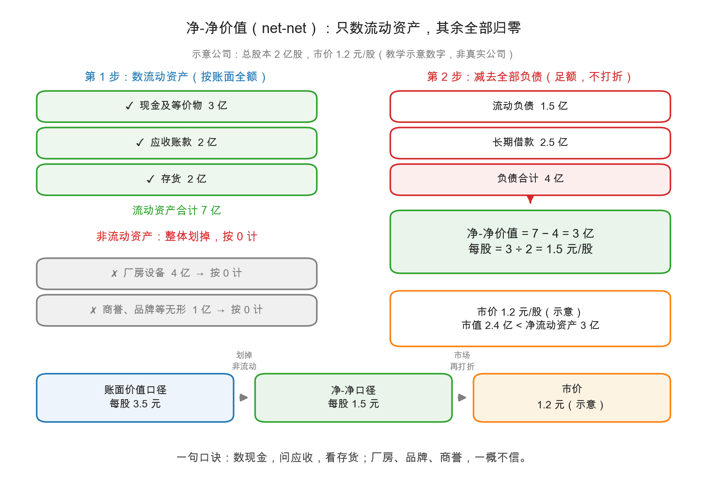

# 第 1 章：流动资产价值——最保守的估值

> 本章你将：
> - 认识全书最苛刻的便宜标准：**净-净股（net-net）**——市价连"流动资产减全部负债"都不到；
> - 掌握三个口径的阶梯：账面价值 → 流动资产价值 → 现金资产价值；
> - 拿计算器把一家"示意公司"的 net-net 完整算一遍，再用奥蒂斯公司 1929 年的真实报表验证（数字照原书摘录）；
> - 看净-净股的历史战绩：1932 年的美股，四成工业股曾跌破净流动资产；
> - 知道它今天为什么稀缺，以及 A股/港股 里"类 net-net"长什么样。

---

## 1.1 三个口径，一条阶梯

上一章的账面价值，好歹还给厂房设备留了位置。现在把尺度一步步拧紧（定义见原书 md 605）：

| 口径 | 算法 | 直觉 |
|---|---|---|
| 账面价值 | 有形资产 - 全部负债 | 家底的账本价 |
| **流动资产价值（current-asset value）** | **只数流动资产 - 全部负债** | 厂房、品牌、专利全归零 |
| 现金资产价值（cash-asset value） | 只数现金及等价物 - 全部负债 | 连应收和存货也不信 |

一级比一级苛刻，一级比一级"防身"。中间那级就是大名鼎鼎的**净-净（net-net）**：如果一只股票的市价，比"流动资产减去**全部**负债"还低，它就叫净-净股。注意两个细节：减的是**全部**负债（包括长期借款），数的是**全部**流动资产（现金、应收、存货都算，预付费用这类"半流动"按原书的算法不数）。

**手算走一遍**（上面这张图的示意公司，全部为教学示意数字）：

1. 数流动资产：现金 3 亿 + 应收账款 2 亿 + 存货 2 亿 = $3 + 2 + 2 = 7$ 亿；
2. 划掉非流动资产：厂房设备 4 亿、商誉品牌 1 亿，**一律按 0 计**；
3. 减全部负债：流动负债 1.5 亿 + 长期借款 2.5 亿 = 4 亿；
4. 净-净价值 = $7 - 4 = 3$ 亿；总股本 2 亿股，每股 = $3 \div 2 = 1.5$ 元/股。

假如市价 1.2 元：市值 $1.2 \times 2 = 2.4$ 亿 < 净流动资产 3 亿——**这是一只 net-net，你付的钱连"把厂房品牌全扔掉"的家底都买不齐**。折价幅度：$(1.5 - 1.2) \div 1.5 = 0.2$，打了八折。对照上一章：这家公司账面价值每股 3.5 元，PB 约 0.34——账面口径看是破净，net-net 口径看才是真烟蒂。

> 📌 **划重点：** net-net 不是"好公司"的标准，是"最坏情况下也不亏"的出价标准。它问的不是"这家公司值多少"，而是"公司明天散伙，我大概能拿回多少"。

## 1.2 原案验证：奥蒂斯公司，1929 年

用真实报表验一遍这套算法。**奥蒂斯纺织公司（Otis Company），1929 年 6 月 29 日**（数字照原书摘录，md 605-606，单位：万美元）：

1. 数流动资产（原书只取现金、活期放款、应收、存货四项）：$532 + 1200 + 1090 + 1648 = 4470$；
2. 加回存货上被公司自主提走的"自愿储备" 425（原书认为这只是未发生的跌价预防针，应还原）→ $4470 + 425 = 4895$；
3. 减去排在普通股前的一切负债：应付账款 79 + 应计项目 291 + 优先股 400 = 770；$4895 - 770 = 4125$；
4. 除以股数 40,790 股：$4125 \div 4.079 \approx 101$——**每股流动资产价值 101 美元**。

同一时刻：账面价值每股 191 美元，现金资产价值 23.5 美元，**市价 35 美元**。请看时间：1929 年 6 月——美股大顶前三个月，市场情绪最疯的季节，仍有一家百年纺织厂卖得比自己抽干流动资产还便宜。原书特意点出这个时间的用意：**便宜的股票不需要等崩盘，任何年代都有**。

## 1.3 历史战绩与"选烟蒂三条件"

这种便宜到了大萧条里泛滥成灾。原书统计（md 614）：**1932 年，纽约证券交易所上市的工业公司里，超过 40% 在某一时段跌破净流动资产**；不少甚至跌破现金资产价值。1937-1938 年衰退中重演：1938 年初约 20.5% 的工业股低于净流动资产，年末统计的 648 家里仍有 54 家。

但格雷厄姆绝不主张见 net-net 就买。他给出的**选烟蒂三条件**（md 622）：第一，卖得低于流动资产价值；第二，**这些资产看上去没有流失的危险**；第三，**过去曾经展现出可观的盈利能力**（相对市价而言）。三条全占，才配叫"投资便宜货"。

第二条最要紧。原书摆了对照（md 621，数字照原书摘录，单位：万美元）：1933 年初，曼哈顿衬衫与哈普汽车（Hupp Motor）同样跌破清算价，但往前翻三年资产负债表——哈普的现金资产从 1016 万掉到 462 万，**烧掉过半**；曼哈顿衬衫的现金从 88.5 万涨到 196 万，家底反而增厚。前者是漏水的桶，后者是结冰的桶。**同样便宜，成色天差地别**：看 net-net，永远要拉出前几年的表对照，看桶是漏是满。

> 💡 **你可能会问：第三条"过去有盈利能力"是为什么？都跌破清算价了，还在乎它赚不赚钱？**
>
> 在乎。盈利记录的意义不是预测增长，而是回答"这家公司会不会把资产烧光"。会赚钱的公司，哪怕当下亏损，也大概率有能力止损、转型或被并购；从来没赚过钱的公司， net-net 的"底"是漏的——参考第 2 章的白色汽车管理层案例。

## 1.4 为什么今天稀缺，以及"类 net-net"长什么样

格林沃尔德在导读里给了两条原因（md 593）：一是 1940 年后税率大涨，短线兑现便宜股的税负变重；二是更根本的——战后长期繁荣让"跌破清算价"的机会近乎绝迹。他直言：格雷厄姆钟爱的 net-net **如今已经稀罕，而且就算遇到，往往管理层正在快速糟蹋那些资产**——第二条件很难满足。

那 A股/港股 还有吗？严格的 net-net 极少，但**"类 net-net"**一直有影踪：市值小于或接近净流动资产、账上趴着大额现金的破净小盘股，港股比 A股 常见得多。看到这类股票，本周的纪律是三问：

1. **现金是真的吗？** 利息收入与存款规模匹配吗？有没有受限资金、被占用资金？（账面现金造假或被掏空，net-net 当场作废——A 股历史上出现过"账上巨额现金"最后被证明不实的案例。）
2. **桶在漏吗？** 近三年净流动资产是增厚还是流失？经营现金流是正是负？
3. **有人在管吗？** 公司有分红、回购、增持这类把家底还给股东的迹象吗？（第 3 章专讲。）

> ⚠️ **易踩坑：把"每股净资产高"当成"每股现金多"。** 流动资产里存货和应收占大头时， net-net 的底其实已经很薄——存货要打折（第 2 章折扣表），应收可能收不回。真正硬的底是现金，所以原书才在流动资产价值之下又设了现金资产价值这一级。

## ✍️ 想一想

> 建议**先自己写两句话再看答案**。想不清楚的地方，就是下一遍该重读的地方。

### 问 1：给净-净股算一遍账

手算 net-net：某公司现金 5 亿、应收账款 3 亿、存货 4 亿、预付费用 0.5 亿、厂房 6 亿；全部负债 9 亿；总股本 3 亿股。（a）净-净价值多少亿？（提示：预付费用按原书口径不数。）（b）每股多少元？（c）若市价 0.8 元，总市值多少亿？折价百分之几？

**解题思路：** 严格按 1.1 节的四步走：**数流动资产（只数原书认的那几项，预付费用这类"半流动"不数）→ 非流动资产一律归零 → 减"全部"负债（含长期借款）→ 除以股本**。第三小问的折价率，分母是**每股净-净价值**，不是市价。

**参考答案：** 按 1.1 节的四步走（单位：亿元）：

1. **数流动资产：** 现金 5 + 应收账款 3 + 存货 4 $= 12$。**预付费用 0.5 不数**（原书口径），**厂房 6 一律按 0 计**——这两笔就是本题的考试点。
2. **减全部负债：** $12 - 9 = 3$。
3. **（a）净-净价值 $= 3$ 亿。**
4. **（b）每股** $= 3 \div 3 = 1$ 元/股。
5. **（c）总市值** $= 0.8 \times 3 = 2.4$ 亿 $< 3$ 亿——**这是一只 net-net**：你付的钱，连"把厂房全部扔掉、预付费用当没发生"的家底都买不齐。折价 $= (1 - 0.8) \div 1 = 0.2$，即**折价 20%，打了八折**。

再对照两把尺子：同一组数字，用上一章的账面价值口径（把厂房 6 亿和预付费用 0.5 亿也算进来），归属普通股的净资产是 $(12 + 6 + 0.5) - 9 = 9.5$ 亿、每股约 3.17 元，PB 只有 $0.8 \div 3.17 \approx 0.25$。**账面口径看是深度破净，net-net 口径看才是真烟蒂**——两把尺子的差距，就是厂房和预付费用那 6.5 亿。

**易错点：** ① 把预付费用或厂房算进流动资产（前者按原书口径不数，后者一律归零——这两个"不数"正是 net-net 最苛刻的地方），顺带把判定口径也记错了——net-net 比的是**市值与净流动资产**，不是股价与每股净资产；② 减负债时只减流动负债（题目给的是"全部负债 9 亿"，1.1 节特别强调减的是**全部**负债，长期借款也在内）；③ 折价率算成 $0.8 \div 1 = 80\%$，或者答成"便宜了 25%"——折价的分母是**每股净-净价值**，$(1 - 0.8) \div 1$ 才是 20%。

### 问 2：奥蒂斯股东的五年回报率

手算：奥蒂斯公司 1929 年 6 月市价 35 美元。原书记载，此后公司陆续按比例返还现金、最终清算，1929-1934 年股东累计到手约每股 102 美元。这批股东赚了本金的百分之几？（$(102 - 35) \div 35$）

**解题思路：** 题面已经把算式给了：$(102 - 35) \div 35$。要当心的是**分子是"赚到的部分"，不是"收回的总额"**，别把回报率做成 $102 \div 35$。算完顺手把两个数对上：1.2 节说奥蒂斯每股流动资产价值 101 美元，股东最终到手约 102 美元——这不是巧合，是那张折扣表准头的验证。

**参考答案：** 先把算式写全：

$$\text{回报率} = (102 - 35) \div 35 = 67 \div 35 \approx 1.91 = 191\%$$

**答案：赚了本金的约 191%**，差不多翻了两倍（本金变成约 2.9 倍）。

这批股东买在 1929 年 6 月——美股大顶前三个月，市场情绪最疯的季节；而他们买的是一家**卖得比自己抽干流动资产还便宜**的百年纺织厂：市价 35 美元，每股流动资产价值 101 美元，账面价值 191 美元。最终他们累计到手约 102 美元，几乎正好落在 1.2 节算出的每股流动资产价值上。1.2 节特意点出这个时间的用意是：**便宜的股票不需要等崩盘，任何年代都有**——但这份回报也不是白拿的，从 1929 年 6 月到 1934 年，中间隔着大萧条。

**易错点：** ① 用 $102 \div 35 = 2.91$ 直接答"赚了 291%"——那是**到手总额对成本**的倍数，不是回报率；要用倍数表达，正确说法是"约 2.9 倍，赚了约 1.9 倍"；② 拿市价 35 去比账面价值 191 美元算"便宜了八成"——那算的是**账面口径的折价**，而这一问要的是清算兑现结果对成本；③ 忘了问一句"这钱拿了几年"——191% 摊到五年多，年化就没那么夸张，这正是 1.4 节说 net-net 稀缺之外的另一面：**便宜得等得起**。

### 问 3：怎么向朋友解释最保守估值

思辨："最保守的估值反而最有安全边际"——用"最坏情况"的语言，向一位完全没学过投资的朋友解释这句话。

**解题思路：** 这一问考**翻译能力**：把"净-净"翻译成"最坏情况"。合格的解释要有三层：① 不猜它能赚多少，先算它散伙能剩多少；② 资产分等级，越"像钱"的越敢信；③ 就算口径最保守，也还得问一句"桶在不在漏"。缺了第三层，答案就成了"捡便宜必胜"的推销话术。

**参考答案：** 关键是把"散伙价"讲成一件家常事，示范如下。

**示范作答（可以照这个结构跟朋友讲）：**

> 假设你看中一家店，老板开价 80 万。多数人一开口就问"它一年能赚多少"——这问题根本答不准。我换个更笨的问题：**假设它明天就关门，把货架、库存全清了，把别人欠它的账都收回来，再还掉所有欠款，还剩多少钱？** 如果还剩 100 万，那我这 80 万买进去，最差也有一层 20 万的垫子——**赚不赚钱要看生意，亏不亏钱先看家底。**
>
> 而且我算这笔账的时候手很紧：现金按面值算，别人欠的账打个折，库存再狠一点，**厂房、设备、品牌这些我全当它一文不值**。这就是 1.1 节那条阶梯——账面价值最宽松，流动资产价值拧紧一圈，现金资产价值最苛刻。**我按最难看的口径出价：万一事情没那么糟，多出来的都是白送的；万一事情真那么糟，我也没亏。**
>
> 但有一条不能忘：**这个"底"必须是结冰的桶，不是漏水的桶。** 1.3 节的哈普汽车当年也跌破清算价，可往前翻三年资产负债表，它的现金资产从 1016 万美元掉到 462 万，烧掉过半；同样便宜的曼哈顿衬衫，现金反而从 88.5 万涨到 196 万。**同样便宜，成色天差地别**——所以最保守的估值也不是免死金牌，它还得配上"这些资产看上去没有流失的危险"这个条件。

**十秒钟版本（如果朋友只给你十秒）：** "我不问它能赚多少，我先算它散伙能剩多少；按最坏的口径买入，剩下的交给时间。"

**易错点：** ① 把"保守"讲成"悲观"——保守是**出价口径**，不是对生意的诅咒；② 只讲折扣、不讲 1.3 节"选烟蒂三条件"里的第二条（这些资产看上去没有流失的危险），把 net-net 说成稳赚；③ 用"稳赚不赔"收尾——净-净的回答是"**最坏情况下也不亏的出价标准**"，它是标准，不是承诺。

## 📖 回到原书

**原书位置：** 第 43 章《流动资产价值的意义》（Significance of the Current-Asset Value），md 第 611-626 页（原书 559-574）。

> When a common stock sells persistently below its liquidating value, then either the price is too low or the company should be liquidated.
>
> 当一只普通股持续地卖在清算价值之下，那么要么是价格太低了，要么这家公司就该清算。

一句话点评：一句话立起一个"二难推理"——价格与散伙价的关系非此即彼，没有第三种长期平衡态；本周第 2、3 章都在展开这句话的两半。

> Common stocks that (1) are selling below their liquid-asset value, (2) are apparently in no danger of dissipating these assets, and (3) have formerly shown a large earning power on the market price, may be said truthfully to constitute a class of investment bargains.
>
> 同时满足这三条的普通股——一、卖得低于流动资产价值；二、显然没有流失这些资产的危险；三、过去曾展现出相对市价可观的盈利能力——可以名正言顺地归入"投资便宜货"一类。

一句话点评：这是"烟蒂股"最正统的出厂定义，三个条件一个都不能省——尤其第二条，它筛掉的正是第 4 章要讲的"价值陷阱"。

---

下一章：[第 2 章：清算价值——公司散伙了值多少](02-清算价值-公司散伙了值多少.md)。net-net 之所以敢当"底"，是因为它近似清算价。那么清算价本身怎么估？负债按多少扣、资产打几折——原书有一张流传八十年的折扣表。
