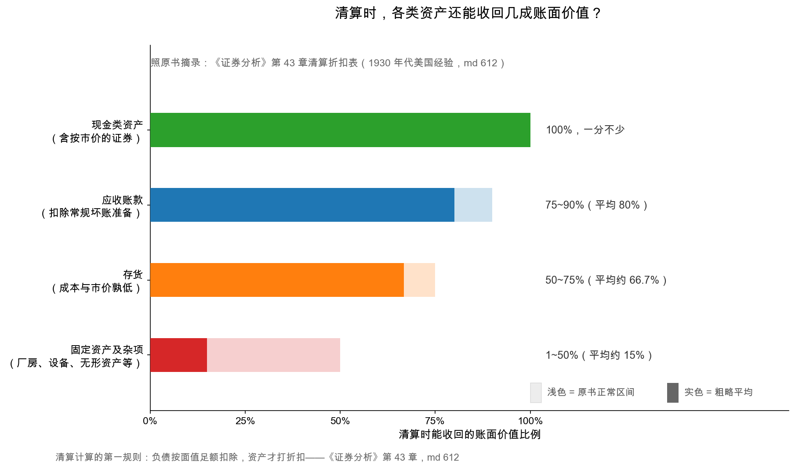

# 第 2 章：清算价值——公司散伙了值多少

> 本章你将：
> - 学会回答那个最不吉利也最有用的问题：这家公司今天散伙，股东能拿回多少；
> - 背下清算估值第一规则：**负债按面值足额扣，资产才打折扣**；
> - 用原书的清算折扣表，给白色汽车公司 1931 年做一次完整清算估算（数字照原书摘录）；
> - 理解"价格长期低于清算价值"的三选一悖论，以及把便宜兑现的三条路径；
> - 看一组真实散伙战绩：清算时股东普遍拿回市价的两三倍。

---

## 2.1 清算价值：把公司"拆开卖"的价格

**清算价值（liquidating value）**，原书定义直白（md 611）：**假如股东想把公司关掉，能从里面拿出来的钱**。可以是整店转让，也可以是资产一件件变卖、慢慢卖个好价。私营生意里这是家常便饭——奶茶店做不下去就转让设备、退押金；但上市公司里，主动清算稀有到近乎不存在。这个反差本章先记下，第 3 章给答案。

清算估值有一条铁律（md 612）：

> 📌 **划重点：清算估值第一规则——负债是真的，资产要打问号。** 欠的钱一分不少按面值扣；资产能变回多少钱，取决于它是什么。所以折扣只打在资产上，永远不打在负债上。

**各类资产清算时能收回几成？** 原书给了一张流传八十年的折扣表（数字照原书摘录，md 612）：

| 资产类型 | 正常区间 | 粗略平均 |
|---|---|---|
| 现金类资产（含按市价计的证券） | 100% | 100% |
| 应收账款（扣除常规坏账准备后） | 75%~90% | 80% |
| 存货（成本与市价孰低入账） | 50%~75% | 约 66.7%（原书写作 66 又 2/3） |
| 固定资产及杂项（房产、机器、设备、非流动投资、无形资产等） | 1%~50% | 约 15% |

看懂这张表，第 1 章的 net-net 就彻底通了：**流动资产平均能收回八成多，固定资产平均只能收回一成半**——所以"只数流动资产"的净-净口径，确实是清算价的一个粗略近似。原书还补过一个细节：零售分期付款形成的应收款（当年百货业赊销）要按更低的三到六折估。直觉记住一句：**资产越"像钱"，折扣越轻；资产越"像设备"，折扣越狠。**

## 2.2 完整算一遍：白色汽车公司，1931 年

**白色汽车公司（White Motor，卡车制造商），1931 年 12 月**：股价 8 美元，总股本 65 万股，整个公司的标价 $8 \times 650000 = 520$ 万美元。数字照原书摘录（md 612-613，单位：万美元），请跟着计算器走：

| 步骤 | 项目 | 账面 | 折扣 | 变现估计 |
|---|---|---|---|---|
| ① | 现金 + 政府及市政债券 | 863 | 100% | 约 860 |
| ② | 应收账款（已扣坏账准备） | 561 | 80% | 约 450 |
| ③ | 存货（成本与市价孰低） | 922 | 50%（卡车存货更难卖，打得比平均值狠） | 约 460 |
| ④ | 流动资产变现小计 | | | 约 1770 |
| ⑤ | 减：全部流动负债 | | 足额 | -135 |
| ⑥ | = 净流动资产变现 | | | 约 1630 |

先停一下，看一个惊人的事实：光第 ① 行，现金和债券 860 万，减掉全部流动负债 135 万，还剩约 725 万现金净额——**摊到每股约 11 美元，光现金就比 8 美元的股价贵**。原书原话：这一点"完全终结了争论"（md 612）。这就是现金资产价值口径：8 美元买到的收据，打开是 11 美元现金。

继续算下去：净流动资产变现约 1630 万（每股约 25 美元，即流动资产价值口径）；原书再把厂房净值 854 万按两成计约 140 万、子公司投资等按保守折扣计入，估出**清算价值约每股 31 美元**。对照一排数：清算估值 31、流动资产价值 34、账面价值 55、**市价 8**。格雷厄姆补了一句大实话：这些估计当然有误差，但"无论怎么留余量，都毫无疑问"——这家公司散伙能拿回的钱远超 8 美元（md 612）。

## 2.3 三选一悖论：要么价格错，要么公司该散伙

把第 1 章那条原则请到正中央（md 615）：**当一只股票持续卖在清算价值之下，要么价格太低，要么公司就该清算。** 逻辑上没有第三种稳态——若公司作为经营实体比死资产值钱，股价不该低于清算价；若不值钱，那就该清算。由此推出两条责任：

- **对股东**：这样的价格应当促使你追问——这门生意还值得继续做下去吗？
- **对管理层**：应当促使你采取一切正当行动弥合价差——包括反思自己的政策，并向股东交代"为什么不清算"。

原书进一步列出便宜兑现的三条路径（md 616）：**一、盈利能力修复**——行业回暖（佩珀雷尔纺织：1932 年亏损、股价 17.5 美元，行业好转后 1934 年涨到 100 美元，1936 年到 149.75 美元，数字照原书摘录）或更换打法（汉密尔顿毛纺：连续亏损、股价 13 美元 vs 净流动资产 38.5 美元，换管理层改产品线后一年多涨到约 40 美元）；**二、被出售或并购**——别人家能让这套资产多赚钱，就愿意按清算价以上出价（白色汽车 1932 年被斯图贝克收购，出价折合每股约 31.5 美元，股价应声从 8 美元涨到 27 美元以上）；**三、全部或部分清算**——下一节看战绩。

> 💡 **你可能会问：三条路径都要等"有人做点什么"，我要是只买不催呢？**
>
> 那就把期望放在"第三条不用任何人努力也成立"的部分：你买得足够便宜（比如白色汽车的现金净额就覆盖了股价），时间站在你这边；但想拿到"整段便宜"，通常需要某种**催化剂**——分红、回购、并购、清算。催化剂在谁手里？第 3 章见。

## 2.4 散伙战绩表：清算真的兑现过便宜吗

原书列了一张自愿清算（或出售）公司的战绩表（照原书摘录，md 637）。请拿计算器给每行算个倍数（到手价 ÷ 清算前股价）：

| 公司 | 清算/出售年份 | 清算前股价 | 股东实际拿到 |
|---|---|---|---|
| 美国胶业（American Glue） | 1930 | 53 美元 | 139 美元 |
| 贝内什父子（I. Benesch & Sons） | 1939 | 2.25 美元 | 6.63 美元 |
| 联邦针织（Federal Knitting Mills） | 1937 | 20 美元 | 34.20 美元 |
| 莱曼纺线（Lyman Mills） | 1927 | 112 美元 | 220.25 美元 |
| 莫霍克矿业（Mohawk Mining） | 1933 | 11 美元 | 28.50 美元 |
| 西格纳针织（Signature Hosiery 优先股） | 1931 | 3.125 美元 | 17.00 美元 |
| 内布拉斯加标准石油（Standard Oil of Nebraska） | 1939 | 6 美元 | 17.50 美元 |
| 联合船厂 A（United Shipyards "A"） | 1938 | 2.25 美元 | 11.10 美元 |

八行全部翻倍以上，多数在两三倍。原因原书一句话点破（md 637）：**市价主要由盈利决定，清算所得由资产决定**——市场情绪把前者打到谷底时，后者纹丝不动。莫霍克矿业尤其漂亮：1931 年末股价 11 美元、流动资产价值每股 28.5 美元，公司随即决定清算，1932-1934 年分派合计正好 28.5 美元/股——**清算变现几乎一分不差地落在清算前的流动资产价值上**（md 619）。那张折扣表的准头，被实战验证过。奥蒂斯公司也类似：1929 年 6 月 35 美元的股票，此后历年返还加清算累计到手约 102 美元（md 619-620）。

## 2.5 一个反直觉的案例：报表亏损，家底反而变厚

再看原书第 45 章的妙笔——曼哈顿衬衫公司（md 654-655，数字照原书摘录）。1930-1932 年大萧条，公司连年报亏，市价最低跌到 6 美元。若只看利润表，这是坏公司；可把它 1929 与 1932 两张资产负债表并排放，做清算估算：每股清算变现价值从 **12.50 美元涨到 14.75 美元**（账面价值从 25 美元跌到 20.5 美元）。为什么亏损的三年里清算底价反而上升？因为公司趁低价把存货和应收**变现成现金**、还清了银行借款——存货变现的实际损失远小于清算折扣表的悲观假设，现金占比越来越高，底越来越硬。1929 年末它的现金资产只有 88.5 万美元，1932 年末变成 196.1 万。

> ⚠️ **易踩坑：把"利润表变脸"当成"家底变薄"。** 对一家跌破清算价的公司，**利润表讲的是生意的故事，资产负债表讲的是你的退路**。利润连年亏、清算价却在爬升的股票，可能正是烟蒂里的上品；反过来，利润尚可、清算价逐年阴跌的，才是慢性漏气——第 1 章的哈普汽车就是后者的教科书。

## 2.6 当代落点：A港股里"清算"几乎不发生，意味着什么

先说清一个现实：A 股与港股都极少出现上市公司主动清算。港股更常见的"散伙价兑现"是**私有化要约**——控股股东或第三方出价买断全部流通股，把公司摘牌，这本质上是"用一笔接近资产价值的钱换走小股东的股份"，也正是烟蒂股最体面的退出通道之一。A 股的要约收购、吸收合并案例更少，但也存在。

这个现实是双刃剑：**好消息**是正因为没人清算，A港股的破净折价往往长期存在，耐心的买家总能等到从容的价格；**坏消息**是没人逼着兑现，便宜可以便宜十年——"散伙价"是理论底，不是到期兑付的现金。所以烟蒂策略对**耐心和分散**的要求极高，而"催化剂从哪来"，是下一章的主角。

## ✍️ 想一想

> 建议**先自己写两句话再看答案**。想不清楚的地方，就是下一遍该重读的地方。

### 问 1：按折扣表估一次清算价

手算：某公司资产如下——现金 2 亿、应收账款 4 亿、存货 6 亿、厂房 8 亿；全部负债 7 亿；总股本 2 亿股。按原书平均折扣（应收 80%、存货 66.7%、厂房 15%）估算：清算价值多少亿？每股多少元？若市价 1 元，清算价值比市价高百分之几？

**解题思路：** 这一问是 2.1 节**清算估值第一规则**的全流程演练：**负债足额扣、资产分类打折**。逐项套折扣表（现金 100%、应收 80%、存货约 66.7%、固定资产约 15%），加总后减负债，再除以股本。最后一问"清算价值比市价高百分之几"，分母是**市价**——这和上一章算"折价率"的分母正好相反，是最经典的换分母陷阱。

**参考答案：** 按 2.1 节折扣表逐项打折（单位：亿元）：

1. 现金 $2 \times 100\% = 2$；
2. 应收账款 $4 \times 80\% = 3.2$（原书给 75%~90%，粗略平均 80%）；
3. 存货 $6 \times 66.7\% \approx 4.0$（原书写作 66 又 2/3，也就是三分之二）；
4. 厂房 $8 \times 15\% = 1.2$（固定资产及杂项的正常区间只有 1%~50%，粗略平均约一成半）；
5. 变现小计 $= 2 + 3.2 + 4.0 + 1.2 = 10.4$ 亿；
6. 减全部负债 7 亿（足额，不打折）：**清算价值 $= 10.4 - 7 = 3.4$ 亿**；
7. 每股 $= 3.4 \div 2 = 1.7$ 元/股；
8. 市价 1 元时，清算价值比市价高 $(1.7 - 1) \div 1 = 0.7 = 70\%$。

换个角度看这笔账：市价 1 元，只相当于清算估算 1.7 元的约五九折。要注意它**不像** 2.2 节的白色汽车那样"光现金就比股价贵"——这里现金 2 亿摊到每股正好 1 元、等于市价，但它后面还站着 7 亿负债；真正撑起 3.4 亿清算价值的主力，是应收加存货合计约 7.2 亿的变现（厂房那 8 亿账面，只肯认 1.2 亿）。

**易错点：** ① 忘了先扣 7 亿负债，直接拿 10.4 亿除以 2 得 5.2 元/股——2.1 节第一规则说得很清楚：**负债是真的，资产的价值必须打问号；折扣只打在资产上，永远不打在负债上**；② 给厂房按账面 8 亿全算，或者只给现金打折、固定资产不打折，方向正好反了，而且还把存货按 75% 上限、厂房按 50% 上限算——那是"正常区间"的乐观端，清算估算该取粗略平均甚至更保守；③ 最后一问分母用错：$(1.7 - 1) \div 1.7 \approx 41\%$ 是"市价相对清算价的折价"，而"清算价值比市价高百分之几"的分母是**市价**，答案是 70%。

### 问 2：散伙战绩的倍数区间

手算：2.4 节战绩表里，"股东实际拿到 ÷ 清算前股价"最低的一行是几倍？最高的呢？八行粗略平均大约几倍？

**解题思路：** 拿计算器把 2.4 节八行逐个算"到手价 除以 清算前股价"，先找最低和最高，再谈平均。特别留神样本里有一行是**优先股**（西格纳针织），它的倍数天然比普通股夸张——做概括时要点出这一点，别让一个极端值代表全表。

**参考答案：** 逐个算（到手价 除以 清算前股价）：

| 公司 | 算式 | 倍数 |
|---|---|---|
| 美国胶业 | $139 \div 53$ | 约 2.6 |
| 贝内什父子 | $6.63 \div 2.25$ | 约 2.9 |
| 联邦针织 | $34.20 \div 20$ | **约 1.7（最低）** |
| 莱曼纺线 | $220.25 \div 112$ | 约 2.0 |
| 莫霍克矿业 | $28.50 \div 11$ | 约 2.6 |
| 西格纳针织（优先股） | $17.00 \div 3.125$ | **约 5.4（最高）** |
| 内布拉斯加标准石油 | $17.50 \div 6$ | 约 2.9 |
| 联合船厂 A | $11.10 \div 2.25$ | 约 4.9 |

- **最低：联邦针织，约 1.7 倍**（$34.20 \div 20 = 1.71$）。
- **最高：西格纳针织优先股，约 5.4 倍**（$17.00 \div 3.125 = 5.44$）。
- **八行粗略平均：约 3.1 倍**（合计约 25.1，除以 8）；中位数约 2.8 倍。

所以原书那句"八行全部翻倍以上，多数在两三倍"是站得住的：**最低的一行也有 1.7 倍。** 同时别忘了倍数最夸张的两行各有原因——西格纳那行是**优先股**，清算时优先受偿，普通股跌得越狠，它相对越占便宜；联合船厂则是 1938 年那个特殊年份的极端低估。翻回 2.4 节的原话：**市价主要由盈利决定，清算所得由资产决定**——这就是同一批公司能出现一两倍到五倍落差的根源。

**易错点：** ① 用"到手价 减 清算前股价"当倍数（美国胶业会答成 86 倍）；② 只报一个平均值，不讲分布，也不交代样本性质——这张表的价值恰恰在"**最低也有 1.7 倍**"和两行极端值各自的原因；更要记住这八家是**真的清算或出售了**的公司，是一份"幸存者名单"，倒推不出"买破净股就能赚两三倍"（2.6 节：A股/港股 主动清算几乎不发生）；③ 把西格纳针织优先股当成普通股的常态战绩——它倍数高，有优先受偿的结构性原因。

### 问 3：亏损表与变厚的家底

曼哈顿衬衫连年报亏，每股清算变现价值却从 12.50 美元升到 14.75 美元。用你自己的话说清：这两个指标为什么能背离？如果只看利润表选股，会错过什么、又可能踩进什么？

**解题思路：** 这一问的核心是 2.5 节那句提醒：**利润表讲的是生意的故事，资产负债表讲的是你的退路。** 答题分两步：先解释背离怎么发生的（亏损记在利润表，家底的形态变化记在资产负债表；把存货应收变现成现金、还清银行借款，会让清算底价上升），再答"错过什么、踩进什么"，正好用曼哈顿衬衫和哈普汽车这对正反案例。

**参考答案：** 分四步说清：

**一、为什么能背离。** 利润表按权责发生制记录"这一年生意做得怎么样"，资产负债表记录"这一刻家底是什么形态"。曼哈顿衬衫 1930-1932 年连年报亏、市价最低跌到 6 美元，但公司趁萧条低价把**存货和应收变现成现金、还清了银行借款**——存货变现的实际损失远小于清算折扣表的悲观假设，现金占比越来越高，**底就越来越硬**。于是出现那个反直觉的结果：每股清算变现价值从 **12.50 美元涨到 14.75 美元**（同期账面价值反而从 25 美元跌到 20.5 美元）。看现金这一项最直观：1929 年末只有 88.5 万美元，1932 年末变成 196.1 万。

**二、只看利润表，会错过什么。** 会错过**烟蒂里的上品**——利润连年亏、清算价却一路爬升的公司。这类公司的亏损里有相当一部分是变现过程的一次性代价，家底反而在变厚。

**三、只看利润表，可能踩进什么。** 会踩进它的反面——**利润尚可、清算价逐年阴跌**的慢性漏气股。1.3 节的哈普汽车就是教科书：1933 年初它也跌破清算价，可往前翻三年资产负债表，现金资产从 1016 万美元掉到 462 万，**烧掉过半**。同样便宜，一个桶在结冰，一个桶在漏水。

**四、落到动作上。** 对一家跌破清算价的公司，正确姿势是把**两张资产负债表并排做一次清算估算**（2.5 节正是拿 1929 与 1932 两张表对照），而不是盯着利润表的红字下结论。

**易错点：** ① 把"亏损"直接等同于"资产流失"——曼哈顿衬衫证明两者可以反向；② 只看单年利润表就下判断，不做 2.5 节那个"两张表并排"的清算估算；③ 听到"清算价上升"就兴奋——忘了核实它是像曼哈顿衬衫那样**真的变现成了现金**，还是只是账面重估，也忘了 2.6 节那盆冷水：A股/港股 里散伙价是**理论底，不是到期兑付的现金**。

## 📖 回到原书

**原书位置：** 第 43-44 章《流动资产价值的意义》《清算价值的含义》（md 第 611-642 页，原书 559-590）。

> The first rule in calculating liquidating value is that the liabilities are real but the value of the assets must be questioned. This means that all true liabilities shown on the books must be deducted at their face amount. The value to be ascribed to the assets, however, will vary according to their character.
>
> 计算清算价值的第一条规则是：负债是真实的，资产的价值则必须打上问号。这意味着账上所有真实负债都必须按面值足额扣除；而资产该记多少价值，则要看它们的性质各不相同。

一句话点评：一条规则划清了资产与负债在清算世界里的地位差——这张"不对称"正是整张折扣表的哲学底座，也是第 1 章 net-net 敢减"全部负债"的原因。

> On reflection this must appear to be an extraordinary state of affairs. The typical American corporation was apparently worth more dead than alive.
>
> 细想之下，这必定显得是桩离奇的事态：典型的美国公司，死掉显然比活着更值钱。

一句话点评：1930 年代美股最荒诞也最肥沃的裂缝——"散伙价高于市值"。它在成熟市场几乎绝迹，但在任何一次极端熊市里都会零星复活；认得出它的投资者，等于多带了一件救生装备。

---

下一章：[第 3 章：股东的权利——你手里的牌](03-股东的权利-你手里的牌.md)。散伙明明更划算，公司为什么偏偏不解散？答案不在算术里，而在权力结构里——名义上公司归股东，实际上方向盘握在管理层手里。
