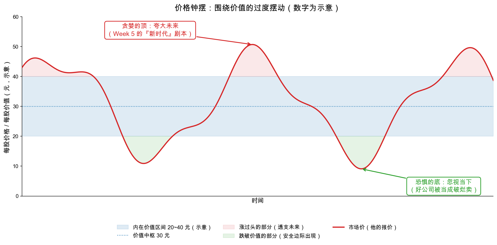

# 第 0 章：价格为什么会偏离价值

> 本章你将：
> - 拿到 Week 1 那张"钟摆图"背后的**为什么**：价格偏离价值的三大根源——夸大、简化、忽视；
> - 看懂偏离的两个方向：**贪婪期夸大未来**，**恐慌期忽视当下**；
> - 用原书最震撼的案例（A&P：9 年从 494 美元跌到 36 美元）亲眼见到"忽视当下"能离谱到什么程度；
> - 理解群体犯错的机制：投机者要"动静"，散户要"理由"，操盘者负责供应理由；
> - 明白"同样的证券，价格可以天差地别"不是夸张，是行情的常态。

上一周我们拆完了资产负债表，八周的"手艺课"到那里就齐了：三张表、利润的调整、
盈利能力、账面价值与清算价值——你已经握着一把能估出"价值区间"的尺子。
但还有一个从 Week 1 就悬着的问题没有回答：

**既然价值有锚，价格为什么还是疯？**

Week 1 第 2 章里我们看过那张图：价格像钟摆一样围着价值区间晃。当时我们只说"它晃"，
没说"它为什么晃"。这一章就来补上这个"为什么"——答案比你想的更人性化，
也因为更人性化，所以更永恒。

---

## 0.1 三大根源：夸大、简化、忽视

第 50 章开篇（md 721），格雷厄姆先把话挑明：市场给证券定价的过程，**不是自动的、机械的，
而是心理的**——它发生在千千万万买家和卖家脑子里。所以市场的错误，本质上是**群体的错误**。
而群体的错误，绝大多数可以追溯到三个根源（原书原话）：

> "exaggeration, oversimplification or neglect"——**夸大、过度简化、忽视。**

这三个词值得各配一句人话：

| 根源 | 原文 | 一句话人话 | 最常见于 |
|---|---|---|---|
| 夸大 | exaggeration | 把好消息/坏消息放大到离谱 | 行情火热或崩塌时 |
| 过度简化 | oversimplification | 用一个标签代替全部事实（"创业板=未来""银行=僵尸"） | 任何时候，尤其流行叙事盛行时 |
| 忽视 | neglect | 干脆没人看它一眼 | 冷门股、下跌途中、坏消息缠身时 |

把这三个根源沿着时间排开，就得到本章的主线——**偏离的两个方向**：

- **向上偏离（贪婪期）**：夸大未来。"这家公司会永远增长下去"——Week 5 批判过的
  "新时代理论"，就是这个根源的系统化版本；
- **向下偏离（恐慌期）**：忽视当下。"这家公司完蛋了，别跟我提数字"——
  事实明明摆在报表里，价格却当它不存在。

> 📌 **划重点：** 价格偏离价值，不是市场"蠢"，而是市场由人组成——人一成群，
> 就会一起夸大、一起简化、一起忽视。看懂这一点，偏离就从"风险"变成了"机会的来源"。

---

## 0.2 贪婪期：对未来的夸大

先看向上的钟摆。这部分你会觉得眼熟——Week 5 第 1 章拆"新时代理论"时，我们已经见过它
1929 年的样子：盈利会永远增长，所以价格怎么高都合理。本章要补的是**机制层面**：
夸大是怎么在一天天的行情里被制造、被放大的？

### 夸大的第一副面孔：对"利好"反应过度

格雷厄姆举了个今天读来仍然好笑的例子（md 731）：一家公司把现金股息从每年 5 美元提到
6 美元，股价应声上涨 20 美元。他算账道：你在更高价位买入，等于**预先一次性付清了
未来 20 年的全部新增股息**——而公司只是每年多给你 1 美元而已（数字照原书摘录）。

多送股、拆股、改名、合并，同理。格雷厄姆挖苦"合并热"的那句话堪称名句（md 732）：

> "Putting two and two together frequently produces five in the stock market."——
> **在股市里，二加二经常等于五；而这个五，之后还可能被拆成三加三。**
> （今天 A股 的"重组概念"、港股的"注资预期"，剧本一字未改。）

### 夸大的第二副面孔：把"还没发生的利润"当作永久的利润

1938 到 1939 年，二战军火订单满天飞，飞机制造股被爆炒。格雷厄姆提醒（md 730-731）：
市场是在**把尚未兑现的战争订单利润当作永久性的盈利基础来定价**——可战争订单恰恰是
全世界都盼着它结束的生意。波音公司 1938 年 12 月整家公司作价约 2527 万美元
（数字照原书摘录），定价的基础不是已赚到的钱，而是"想象中的将来"。

这正是 Week 5 那条高压线的具体样子：**最危险的从来不是相信增长，而是为增长习惯性地
支付高价。**

### 夸大的燃料：投机者要"动静"，散户要"理由"

为什么市场对无关紧要的利好反应如此剧烈？格雷厄姆给出的心理诊断非常毒辣（md 732）：

- 投机者**第一想要的是"动静"（action）**——不涨不跌的市场让投机者痛苦；
- 而开户的散户们**不肯承认自己在赌博**，他们坚持每次买入都要有一个像样的"理由"；
- 于是"送股""拆股""合并"这些纸面事件，就成了操盘者批量供应的"理由"。

原书结论一句话："这整套东西要不是如此有害，简直幼稚得可笑。"
（"The whole thing would be childish if it were not so vicious."）

> 💡 **你可能会问：市场大部分时间不是挺"有效"的吗？**
>
> 对，这正是格雷厄姆公道的地方。他在 md 726 明确说：市场的活动中**有足够多的
> 明智与判断**，多数时候价格和可确认的价值之间存在相当程度的对应关系；尤其涉及
> "未来前景"这种没法算的东西时，市场的集体判断常常比单个分析师高明。
> 问题出在：**情绪越界的次数，也足够多——多到够分析师忙一辈子。**
> 偏离不是常态被打破，而是常态之外永远有例外，而例外里藏着你的机会。

---

## 0.3 恐慌期：对当下的忽视——A&P 的 494 美元与 36 美元

钟摆的另一端更触目惊心。格雷厄姆说，如果你想找一个例子来说明股市的"真面目"，
找**大西洋与太平洋茶叶公司**（The Great Atlantic & Pacific Tea Company，当年美国
最大的连锁超市，下称 A&P）就够了。

先看数字（照原书摘录，md 725）：

| 年份 | 每股盈利 | 每股股息 | 当年股价区间 |
|---|---|---|---|
| 1929 | 11.77 美元 | 4.50 美元 | 494 ~ 162 美元 |
| 1932 | 10.02 美元 | 7.00 美元 | 168 ~ 103.5 美元 |
| 1937 | 3.50 美元 | 6.25 美元 | 117.5 ~ 45.25 美元 |
| 1938 | 6.71 美元 | 4.00 美元 | 72 ~ 36 美元 |

同一家公司：1929 年最高 **494 美元**，1938 年最低 **36 美元**——跌掉九成以上。
可这 9 年里公司的生意发生了什么？它一直是全美国（可能是全世界）最大的零售企业，
盈利和分红连年不断，门店越开越多，是"美国商业史上最了不起的成长故事"之一。

再看 1938 年低点时的账本（照原书摘录）：公司账上**现金类资产 8500 万美元**，
**净流动资产 1.34 亿美元**；而此时优先股加普通股的**全部市值加起来只有 1.26 亿美元**。

换句话说：**你按市价把整家公司买下来，它账上的流动资产就直接让你白赚 800 万美元，
外加一个全美第一的连锁生意**——Week 8 讲的"卖得比清算价值还便宜"的极致案例。
格雷厄姆原话：华尔街 1938 年给这家伟大公司的定价，等于说它**"作为一家活着的生意，
还不如散伙清算值钱"**。

为什么？原书列了三条理由（md 725）：一、当时有针对连锁店的税收威胁；
二、盈利最近有所下滑；三、大盘整体低迷。三条没有一条能否认"这家公司每年还在
实打实赚几千万美元"的事实——**价格跌成这样，不是因为生意消失，而是因为没人愿意看它一眼。**

这就是"忽视当下"的形态：恐慌不会替你算账，它只会把"现在所有人都想跑"这句话，
直接翻译成价格。

---

## 0.4 同样的证券，价格可以天差地别

A&P 还不是孤例。第 50 章摆了一组"对照组"，专门说明**价格与生意本身可以脱钩到什么程度**。

### 案例一：盈利暴增，价格躺平（被忽视）

一家叫**比尤特-苏必利尔**（Butte and Superior，实际主业是锌）的矿业公司，1915 年
每股盈利 33.47 美元、每股派息 18 美元——都是天文数字（照原书摘录）。结果全年股价
只在 36 到 80 美元之间晃。为什么这么便宜？原书两个字：**无人关照**。它不在市场
"明星名单"里，没有操盘者捧场，好消息传出去了，价格动都不动。

### 案例二：盈利小涨，价格上天入地（被夸大）

反过来，一家小盘股**马林斯车身**（Mullins Body），盈利其实只从每股 5.13 美元
温和涨到 6.53 美元，股价却从 1927 年的 **10 美元**炒到 1928 年的 **95 美元**，
1929 年又跌回 **10 美元**（数字照原书摘录）。格雷厄姆的评语冷冰冰：
一旦落进操盘者手里，马林斯**"就不再是一桩生意，而变成了行情纸带上的一个符号"**。
（"Mullins had ceased to be a business and had become a symbol on the ticker tape."）

### 两组案例放在一起看

| | 公司基本面 | 市场反应 | 偏离方向 |
|---|---|---|---|
| 比尤特-苏必利尔（1915） | 盈利股息双爆发 | 价格无动于衷 | 忽视 → 可能严重低估 |
| 马林斯车身（1927-1929） | 盈利温和增长 | 十倍暴涨再跌九成 | 夸大 → 严重高估 |
| A&P（1929-1938） | 生意持续壮大、年年盈利 | 494 跌到 36 | 忽视 → 卖得比流动资产便宜 |

三条曲线方向不同，病根相同：**市场报的不是"生意值多少"，而是"人群此刻的情绪是多少"。**

> 📌 **划重点：** "同样的证券，价格可以天差地别"——这句话的后半句更重要：
> **天差地别的价格，对应的往往是同一份事实。** 你赚的钱，不是来自预测下一次报价，
> 而是来自识别"价格已经和事实脱节"的时刻。

---

## 0.5 看图：钟摆的两端

把本章装进一张图——就是 Week 1 那张钟摆图的"成人版"，这次两端都写上了病因：

- **钟摆向上冲出区间**（红色地带）：价格里掺进的"未来"越来越多，Week 5 的新时代剧本；
- **钟摆向下砸穿区间**（绿色地带）：价格里"当下的事实"被视而不见，本章 A&P 的剧本；
- **蓝色地带是价值区间**：生意的事实决定的区域，移动得很慢——这正是你能"以不变应万变"的底气。

注意钟摆的形状：**两端总是过冲**。涨会涨过头，跌会跌过头——因为摆它的不是机器，
是人群的情绪。这也是为什么"偏离有自我修正的倾向"（Week 1 说过）成立，
但修正经常迟到：钟摆先要把这股情绪劲摆完。

> ⚠️ **易踩坑：把"偏离"当成"做错"的代名词。** 价格偏离价值不是市场犯了需要你
> 纠错的错，而是你获利的原材料。没有偏离，就没有便宜可捡；彻底"有效"的市场里，
> 分析师第一个失业。格雷厄姆要你做的不是抱怨偏离，而是**在偏离发生时站在事实一边**。

> 📌 **实战联系：** 向上的剧本你已经见过三遍：1999 年互联网泡沫、2015 年创业板
> "市梦率"、2021 年"核心资产不限价"。向下的剧本同样常见：2018 年底的 A股
> "国运怀疑论"、2022 年港股"离场潮"。每一次，当事人都觉得"这次不一样"——
> 而原书第 50 章告诉你：原因从来一样，就是那三个词，夸大、简化、忽视。
> 极端时刻具体怎么操作，留到本章第 4 章展开。

---

## ✍️ 想一想

> 建议**先自己写两句话再看答案**。想不清楚的地方，就是下一遍该重读的地方。

### 问 1：四种说法的病因标签

用"夸大、简化、忽视"三个词，给下列四种说法各贴一个标签，并说一句理由：
（a）"白酒赛道永不过时，闭眼买"；（b）"银行股涨不动，看都别看"；
（c）"公司改名叫'智能科技'了，要起飞"；（d）"这家公司去年亏损，垃圾"。

**解题思路：** 回到 0.1 的定义三连：**夸大**是把好消息或坏消息放大到离谱，**简化**是用一个标签代替全部事实，**忽视**是干脆没人看它一眼。做题时先问一句"这句话有没有在核对事实"，再看它错在"放大""贴标签"还是"不看"。（b）几乎就是原书"银行=僵尸"的例子原样改写，别想复杂了。

**参考答案：** 四种说法，四种病因（其中（d）一身兼两病）：

| 说法 | 主标签 | 理由 | 该补的功课 |
|---|---|---|---|
| （a）白酒赛道永不过时，闭眼买 | **夸大**（兼简化） | 把眼下的高景气外推成"永不过时"，正是贪婪期"这家公司会永远增长下去"的日常版；"赛道"两个字又是一个标签代替全部事实 | 问"以什么价格买"——Week 5 的高压线是**为增长习惯性支付高价**，不是相信增长 |
| （b）银行股涨不动，看都别看 | **简化** | 0.1 表格里原书的例子就是"银行=僵尸"：一句话给一个行业判了死刑，从此不再核对任何一家具体银行 | 打开任意一家银行的报表，看它的资产质量与价格，再决定"看不看" |
| （c）公司改名"智能科技"要起飞 | **夸大** | 0.2 的"纸面事件"：改名、送股、拆股、合并，都不改变一分钱的盈利与资产，却被当成利好爆炒 | 用第 1 章三问的**第一问**：公司变了吗？（改名不改生意） |
| （d）这家公司去年亏损，垃圾 | **忽视**（兼简化） | 这是恐慌期的形态：一个"亏损"标签抹掉了资产、现金、亏损原因和周期位置——A&P 就是这样被"没人愿意看它一眼"打到清算价以下的 | 回到 Week 8：先看资产负债表，再看这笔亏损是周期性的还是结构性的 |

如果必须一个说法只贴一个标签：（a）夸大、（b）简化、（c）夸大、（d）忽视。三个词只有三个，四种说法必然有一个重复——这不是出题不严谨，而是现实本来就这样：**三个根源从来不是排队出现的，它们经常叠在同一个句子里。**

**易错点：** ① 把三个标签当成给别人扣的帽子，忘了它是自查表——最该问的是"我昨天那句判断，用的是哪一个"；② 认为一句话只能有一个病根——（d）既是简化（贴标签）又导致忽视（不再看），（a）既是夸大又是简化；③ 贴完标签就收工——标签的价值是提示**下一步该补哪门功课**（看报表？问价格？还是先承认自己在赌），不是给结论。

### 问 2：三个利空里哪个最严重

A&P 1938 年的三个"利空"（税收威胁、盈利下滑、大盘低迷）里，哪一个是**事实层面**
最严重的？它严重到能把一家年年盈利的全美最大零售商打到清算价值以下吗？
说说你的判断依据。

**解题思路：** 先做一个分类动作：把三条"利空"分别归到**已经发生的事实**、**尚未落地的政策威胁**、**价格环境**三类里。题目问的是"事实层面"最严重的哪一条，别被"威胁听着最吓人"带跑。判断标准只有一条：**这条利空能不能用已经发生的公司事实把它解释掉？**

**参考答案：** 三条先分类，再判断：

| 利空 | 性质 | 严重程度 |
|---|---|---|
| 针对连锁店的税收威胁 | **尚未落地的政策**，关于未来的断言 | 它是三条里唯一可能**永久改变盈利能力**的一条（改税制会直接改经济性），值得盯；但 1938 年它还没发生，属于"想象出来的坏消息" |
| 盈利最近有所下滑 | **已发生、可核对的事实** | **事实层面最严重的一条**：1937 年每股盈利 3.50 美元，明显低于 1932 年的 10.02 美元和 1929 年的 11.77 美元 |
| 大盘整体低迷 | **价格环境**，不是公司事实 | 它只说明市场先生的情绪，不说明生意 |

所以答案是：**事实层面最严重的是"盈利下滑"**——它是三条里唯一已经落进报表的坏消息。但它严重到能把公司打到清算价值以下吗？**远远不到。** 判断依据有三条：

1. **盈利还在，而且在回升**：1938 年每股盈利回到 6.71 美元、每股股息 4.00 美元——下滑是"少赚"，不是"不赚"，更不是亏损；
2. **资产负债表摆在那里**：1938 年低点时公司账上现金类资产 8500 万美元、净流动资产 1.34 亿美元，而优先股加普通股的全部市值只有 1.26 亿美元——**买下整家公司，光流动资产就白赚 800 万美元，外加一个全美第一的连锁生意**；
3. **三条理由没有一条能否认"这家公司每年还在实打实赚几千万美元"**——这正是 0.3 的结论：价格跌成这样，不是因为生意消失，而是因为没人愿意看它一眼。

补一句更狠的对照：1929 年最高 494 美元，1938 年最低 36 美元，跌掉九成以上；而这 9 年里它一直是全美（可能是全世界）最大的零售企业，盈利和分红连年不断、门店越开越多。**跌掉的是报价，不是生意。**

**易错点：** ① 一看到"税收威胁"就选它——威胁确实最可能伤到长期价值，但题目问的是**事实层面**；把"可能发生的"和"已经发生的"混在一起，正是 0.2 说的人们对着"想象中的将来"定价的翻版；② 用"盈利下滑"直接推出"股价该跌"——盈利从 1929 年的 11.77 美元降到 1937 年的 3.50 美元，跌了约七成；可股价从 494 美元跌到 1938 年最低的 36 美元，跌了九成以上，多出来那部分就是情绪的放大器；③ 忘记看资产负债表就下结论——只要翻一眼净流动资产 1.34 亿美元与全部市值 1.26 亿美元这组数字，"会不会低于清算价值"这个问题就有答案了。

### 问 3：马林斯车身的倍数变化

0.4 的表格里，马林斯车身 1927 年盈利 5.13 美元、股价 10 美元；1928 年盈利 6.53 美元、
股价 95 美元。请算一下两个年份各自的"股价是盈利的几倍"，并用一句话解释这个倍数
为什么说明市场已经不把它当生意看了。

**解题思路：** 就是"股价除以每股盈利"这一个除法的两次运用：$10 \div 5.13$ 与 $95 \div 6.53$。算完别停在数字上，把**分子（价格）的涨幅**和**分母（盈利）的涨幅**并排放，看它们是不是一个量级——这才是题目要的那句话。

**参考答案：**
| 年份 | 每股盈利 | 股价 | 股价是盈利的几倍 |
|---|---|---|---|
| 1927 | 5.13 美元 | 10 美元 | $10 \div 5.13 \approx 1.9$ 倍 |
| 1928 | 6.53 美元 | 95 美元 | $95 \div 6.53 \approx 14.5$ 倍 |

一句话解释：**盈利只从 5.13 美元涨到 6.53 美元，倍数却从不到 2 倍飙到 14.5 倍——多出来的那十几倍，买的不是 1928 年赚到的钱，而是"想象中的将来"。**

把两头并排看更刺眼：$6.53 \div 5.13 \approx 1.27$，生意只好了约 27%；$95 \div 10 = 9.5$，价格却涨了 850%。价格里多出来的部分与盈利无关，只与"有人愿意用更高的价接手"有关。这正是 0.2 那句"把还没发生的利润当作永久的利润"，也是格雷厄姆给马林斯的判词：一旦落进操盘者手里，它就"**不再是一桩生意，而变成了行情纸带上的一个符号**"。符号可以凭空涨 9.5 倍，也就可以在 1929 年跌回 10 美元——**倍数扩张没有基本面支撑，回吐时也不需要基本面理由。**

最后一个提醒：单看 14.5 倍，放在很多行业里并不算天文数字。所以判据**不是"倍数高不高"，而是"倍数在一年里从 1.9 跳到 14.5 是靠什么"**——靠的是操盘与情绪，而不是盈利。倍数本身是中性的，倍数的突变才是信号。

**易错点：** ① 把"股价涨了 9.5 倍"和"盈利涨了 27%"混成一句"业绩大增所以股价大涨"——分母几乎没动，涨的全是估值；② 拿 14.5 倍去和今天的行业平均市盈率比，得出"也不算贵"——脱离"是不是被操盘者接管""盈利能不能持续"谈倍数，等于用体温计判断人品；③ 忘了 1929 年跌回 10 美元的结尾——它说明这个倍数不是"新常态"，只是市场先生情绪轮上的一次过站。

## 📖 回到原书

**第 50 章《价格与价值的背离》（Chapter 50: Discrepancies between Price and Value），
md 页码 page_721（原书第 669 页）**

> "Evidently the processes by which the securities market arrives at its appraisals are
> frequently illogical and erroneous. These processes, as we pointed out in our first
> chapter, are not automatic or mechanical but psychological, for they go on in the minds
> of people who buy or sell."

> **译文：** "显然，证券市场形成其估价的过程经常不合逻辑、充满错误。正如我们在第 1 章
> 指出的，这些过程不是自动的、机械的，而是心理的——因为它们发生在买卖者的头脑里。"

**一句话点评：** 全章的定盘星。"心理的"三个字既解释了偏离为何发生，
也预告了它为何永远会再发生——人不变，钟摆不停。

---
**第 50 章，md 页码 page_725 ~ page_726（原书第 673-674 页）**

> "We doubt that a better illustration can be found of the real nature of the stock
> market, which does not aim to evaluate businesses with any exactitude but rather to
> express its likes and dislikes, its hopes and fears, in the form of daily changing
> quotations."

> **译文：** "股市的真面目，我们怀疑再也找不到比这更好的注脚了：它并不打算精确地
> 评估企业，而是把它的好恶、它的希望与恐惧，用每天变动的报价表达出来。"

**一句话点评：** 注意这句话紧跟在 A&P 案例之后——它不是愤世嫉俗的牢骚，
而是一台"报价翻译机"：以后看到离谱的报价，先把它翻译回"情绪"，再谈生意。

---
看完了群体的疯狂，下一章我们把这疯狂**拟人化**——格雷厄姆笔下最著名的角色，
每天准时来敲门的合伙人，要登场了。
