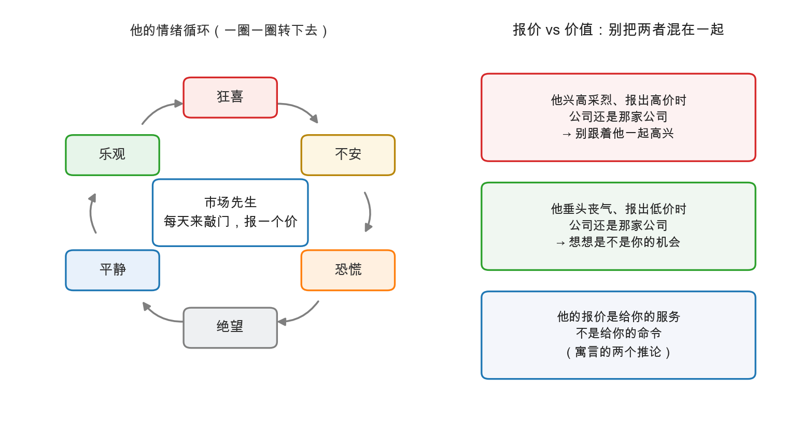

# 第 1 章：市场先生——情绪化的合伙人

> 本章你将：
> - 认识投资史上最著名的角色——**市场先生（Mr. Market）**：一个每天来敲门的情绪化合伙人；
> - 知道这个寓言的"出生证明"：完整版在《聪明的投资者》，本书第 50 章已有原型；
> - 掌握寓言的两个推论：**报价是服务，不是命令**；**别让他的情绪变成你的情绪**；
> - 学会"报价 vs 价值"的三问检查法；
> - 完成一次心理训练：把行情屏从"分数牌"变回"报价器"。

上一章我们说，市场的错误是**群体的错误**：夸大、简化、忽视。但"群体心理"四个字太抽象，
看不见摸不着，很难在每天盯盘时帮上你。

格雷厄姆深谙此道。他把整个群体心理**压缩成了一个人**——一个每天准时到你家门口报到、
情绪极不稳定的合伙人。这个角色后来成了价值投资的图腾。这一章，我们正式跟他见面。

---

## 1.1 先接上 Week 2 的一句话："利润是 opinion"

Week 2 我们学过一句贯穿全课的话：**利润是一个 opinion（观点、估计的区间），不是一个
精确的 fact（事实）**。会计判断揉在数字里，同一家公司能合法地算出不同的利润。

现在把这句话往前推一步：

- **利润是 opinion**——公司赚多少钱，是"估出来"的区间；
- **报价是 mood**——这家公司此刻卖多少钱，是"感受出来"的数字。

 Week 1 引用过格雷厄姆的传世比喻：市场不是称重机，是**投票机**——无数人登记自己的
选择，一半出于理性，一半出于情绪。所以你在屏幕上看到的价格，从来不是"这家公司值多少"
的读数，而是**"此刻人群的情绪温度"的读数**。

 opinion 已经够不精确了，再叠上一层 mood，你就能理解：为什么钟摆总要过冲，
为什么同一份事实能配上天差地别的价格。

> 📌 **划重点：** 价格等于"事实"乘以"情绪的放大器"：事实以季度为单位变化，
> 而放大器的增益天天在变。分不清这两层，是绝大多数亏损的心理起点。

---

## 1.2 寓言登场（先把"出生证明"看清楚）

在讲故事之前，必须先做一件事——**防伪托**。

你可能听说过这个寓言的完整版：一位情绪化的商人合伙人，每天上门报价，兴致高时把股份
喊上天，沮丧时贱价甩卖，而你可以自由选择理会或不理会。这个完整版出自格雷厄姆后来的
另一本书——**《聪明的投资者》（The Intelligent Investor）第 8 章**，不是眼前这本
《证券分析》。

《证券分析》里有什么？**原型**。第 50 章的两段表述（md 726）已经把寓言的两条腿都搭好了：

> 原型一："股市并不打算精确评估企业，而是把它的好恶、希望与恐惧，用**每天变动的报价**
> 表达出来。"（上一章末尾刚引用过）

> 原型二："市场的活动里确实有足够多的明智与判断，多数时候让价格与可确认的价值之间
> 保持相当程度的对应。**但情绪越界的次数也足够多**——市场的情绪会把它带向两个方向，
> 越过健全判断的边界。"

"每天变动的报价""好恶与希望恐惧""有时对应、有时越界"——寓言的全部要素都在这里，
只差一个具体的人物形象。格雷厄姆十几年后给这个形象起了名字、编了台词。
我们在本周就用这个寓言，但每用到寓言的细节时，你都要记得：**形象出自《聪明的投资者》，
思想原型就在本书第 50 章。**

现在，讲寓言本身：

> 想象你和一位合伙人共同拥有一家私人企业（不是股票，就是一家看得见门店、
> 摸得到存货的生意）。这位合伙人有个特点——**情绪极度不稳定**。他每天准时上门一次，
> 报一个价：要么按这个价把他手上的股份卖给你，要么按这个价把你手上的股份买走。
>
> 他心情好的日子（可能因为当天天气不错，也可能因为邻居夸了他的新西装），他会报出
> 高得离谱的价格，仿佛这家企业明天就要统治世界；他心情差的日子，他垂头丧气，
> 报出低得可怜的价格，仿佛企业下个月就要关门。他还有一个可爱之处：**他从不介意
> 被拒绝**。你今天不理他，他明天照样上门，带来一个新价格——通常和今天这个毫无关系。
>
> 格雷厄姆的结论：这位先生的**报价是给你用的，不是给你服从的**。他报得越离谱，
> 对你越有利——前提是你清楚自己的生意值多少，并且不被他的情绪传染。

### 为什么说"私人企业的合伙人"这个设定极其狡猾

因为它绕开了行情软件的一切迷惑。同一家奶茶店，如果每天有人在门口喊价，你不会因为
他今天喊得高就觉得自己富了，也不会因为他明天喊得低就觉得自己破产了——**你会去数
门店今天卖了多少杯奶茶**。可一旦这家店变成股票、价格变成屏幕上跳动的红绿数字，
绝大多数人立刻忘了自己持有的是"生意的一份"，开始跟着报价或喜或悲。

格雷厄姆的整个寓言，就是要把"生意感"还给股票。

---

## 1.3 寓言的两个推论

推论一：**报价是服务，不是命令。**

市场先生的报价对你只有一种用途：**成交机会**。他报得极高——你可以卖给他（或至少不买）；
他报得极低——你可以从他手里买。价格不承载"指令"，只承载"机会"。行情软件上那个
跳动的数字没有资格告诉你该高兴还是该害怕，它是店员递上的价签，不是法官敲下的判决。

推论二：**别被报价牵着走。**

被报价牵着走是什么样？涨了追，跌了割，每天对答案，情绪随屏幕翻红翻绿——格雷厄姆
在 md 724 有一句精准的画像：

> "It is the essential character of the speculator that he buys because he thinks stocks
> are going up not because they are cheap."
> ——**投机者的本质特征：他买入是因为"觉得股票要涨"，而不是因为"股票便宜"。**

注意这两句话的分量差别："要涨"是**预测市场先生的下一个报价**；"便宜"是**对照事实
判断当前报价**。前者把命运押在猜情绪上，后者把命运押在算价值上。Week 1 的投资定义
（深入分析 + 本金安全 + 满意回报）要求的是后者；跟着报价跑的人，连第一关都没过。

| | 投机者 | 格雷厄姆式投资者 |
|---|---|---|
| 报价是什么 | 对错的判决（涨=我对，跌=我错） | 交易的机会（高低皆可用） |
| 买入的依据 | "它要涨了" | "它比事实便宜" |
| 情绪来源 | 市场先生 | 自己的研究与纪律 |
| 盈利来源 | 下一个买家接盘 | 价格向价值的回归 + 企业本身赚的钱 |

> 💡 **你可能会问：不理报价，那每天红红绿绿的信息不就白费了？**
>
> 不是白费，是**降级使用**。报价仍然有用——它是你唯一能"成交"的那个变量；
> 它只是不该当**裁判**用。价值投资者不是不看来询价，而是看的时候心里清楚：
> 这是市场先生的今日情绪，不是企业的今日经营。企业今天经营得怎么样，
> 要去公告、财报和门店里找。

---

## 1.4 三问检查法：每次看到大波动，先过三道题

把寓言变成一个随手可用的工具。下次某只你关注的股票暴涨或暴跌，别急着点开新闻，
先问自己三个问题：

| 顺序 | 问题 | 对应的检查 | 常见答案 |
|---|---|---|---|
| 第一问 | **公司变了吗？** | 翻公告：主营、订单、财报有没有实质变化 | 绝大多数大波动：没变 |
| 第二问 | **变的只是他的情绪吗？** | 若公司没变，是市场先生的哪格情绪在报价 | 恐慌/狂喜的格子 |
| 第三问 | **谁在利用谁？** | 我该利用他的报价，还是他在利用我的情绪 | 纪律给你方向 |

三个问题问完，多数"重大行情"会自动降级为"市场先生又发神经了"。
真正的机会和真正的风险，反而会因为这三问而显形——**因为只有少数大波动
（约十分之一量级的感觉，示意）真的伴随基本面变化，那才是需要重估价值的时刻。**

---

## 1.5 看图：他的情绪循环，和你的对照卡

左边的情绪轮会一圈一圈转下去——这不是讽刺画，是机制：贪婪孕育粗心的自满，
自满埋下失望，失望发酵成恐慌，恐慌跌出极端便宜，便宜引来平静与乐观，乐观又孕育
贪婪。**你不需要预测他转到哪一格，只需要知道他一定会在极端格停留。**

右边三张对照卡，就是本章的全部操作要点：

- 他报高价时：公司还是那家公司 → 别跟着高兴；
- 他报低价时：公司还是那家公司 → 想想是不是机会；
- 总则：**报价是给你的服务，不是给你的命令。**

> ⚠️ **易踩坑：把"不理市场先生"执行成"不看公告"。** 寓言里的你靠"数奶茶"了解生意，
> 现实里的你靠**定期读财报和公告**了解生意。格雷厄姆在 Week 4 就提醒过：
> 投资是持续的行为，买入后仍要定期检查"买入理由还在不在"。忽视的是报价的干扰，
> 不是公司的信息——这两件事弄反了，"长期持有"会变成"长期装死"。

---

## 1.6 心理训练：把行情屏从"分数牌"变"报价器"

寓言听懂了，最后落实到每天的行为上。普通人和投资者的差别，常常就体现在**打开行情
软件那一瞬间的心理设定**：

- **分数牌心态**：屏幕是记分牌。绿了=我赢了，红了=我输了。于是每天收盘都在"对答案"，
  情绪跟着点位过山车，动作跟着情绪走——追高、割肉、频繁换股。
- **报价器心态**：屏幕是报价单。市场先生今天又来报了个价——**记下，对照价值区间，
  决定理不理他**。其余时间，他是空气。

三个可操作的小动作（不需要任何工具）：

1. **改称呼**：把"我的股票又跌了"改成"市场先生把那家公司的报价打低了"。
   一字之差，主语从"你"变回"他"；
2. **降频率**：把"看盘"从每天数次降到每天一次甚至每周一次。报价器不需要实时看，
   生意按季度汇报；
3. **换问题**：每次打开行情，把"涨了吗"换成"**价格离我估的价值区间远吗**"。
   不远，无事发生；远得离谱，才进入第 1.4 节的三问。

> 📌 **实战联系：** A股 散户交易占比高、行情信息极度过载（热搜、直播间、涨跌榜
> 轮番轰炸），"分数牌"的诱惑比任何市场都强。港股则另有一功：流动性差的中小盘，
> 市场先生可以**几个月不登门**（没有成交），报价一旦出现可能一步到位——
> 在港股做价值投资，"耐心等他上门"本身就是必修课。无论哪个市场，
> 第 4 章的"极端时刻复盘"会告诉你：当他情绪最极端的时候，正是你这三问最值钱的时候。

---

## ✍️ 想一想

> 建议**先自己写两句话再看答案**。想不清楚的地方，就是下一遍该重读的地方。

### 问 1：涨停了，两副眼镜两种读法

用"分数牌/报价器"两副眼镜，分别解读这句话："我买的股票今天涨停了！"
两种读法下，持有者接下来最可能做什么动作？

**解题思路：** 1.6 说得很直白：差别不在"看到什么"，而在**打开行情软件那一瞬间的心理设定**。做这道题，先把同一句"涨停了"翻译成两种内心独白，再顺着独白推动作——情绪会通向哪只手，比分析谁对谁错更重要。

**参考答案：**
| | 分数牌眼镜 | 报价器眼镜 |
|---|---|---|
| 内心独白 | "我买对了，我赢了" | "市场先生今天把这家公司的报价打高了" |
| 这句话的主语 | **我**（成绩单） | **他**（市场先生的今日情绪） |
| 情绪 | 兴奋、得意，或反过来怕回吐 | 平静，或警惕 |
| 最可能的动作 | 加仓、追高、截图晒收益、盯明天的连板、把浮盈当能力；也可能焦虑地"落袋为安" | 打开自己估的价值区间对一下：**价格离区间远吗**——远得离谱就考虑卖给他，不远就什么也不做 |
| 本质 | 把报价当**裁判**，让市场先生决定我的情绪与动作 | 把报价当**服务**，只当作一个可成交的价格 |

判断句式一句话：**分数牌问"我赚了多少"，报价器问"他报的价与价值差多少"。** 前者算的是相对于自己买入价的输赢，后者算的是相对于企业事实的贵贱——1.6 那三个小动作里的第一句"改称呼"（"我的股票又跌了"改成"市场先生把那家公司的报价打低了"），改的就是这个主语。

示范作答（报价器版）："涨停了？先翻公告——公司变了吗？没变的话，这就是他情绪轮上转到了乐观那一格。对照我估的区间：没到上沿就继续拿着，到了就分批卖给他。"

自检问题：我这次想下单，理由是"**它要涨了**"还是"**它便宜（或贵）了**"？md 724 那句"投机者的本质特征，他买入是因为觉得股票要涨，而不是因为股票便宜"，就是这把自查刀。

**易错点：** ① 把"报价器心态"理解成"不能卖"——恰恰相反，报价器心态下，他报得越高你越该考虑卖给他；② 以为涨停一定伴随基本面变化——按 1.4 的三问，绝大多数大波动的第一问答案是"公司没变"，只有极少数大波动真的需要重估价值（1.4 说的是"约十分之一量级的感觉，示意"）；③ 只改称呼不改动作——嘴上说"市场先生报价低了"，手上照样割肉，那只是换了个说法，主语还是"我"。

### 问 2：22 元与 45 元该怎么办

假设你研究后认定某公司的价值区间是 20 到 40 元（示意）。市场先生本周报价 22 元，
上周报价 45 元。两个价格分别落在情绪轮的哪一格？对照"三问检查法"，
你分别会做什么（买入/持有/不买/继续研究）？

**解题思路：** 两步走。第一步**定位**：把 22 元和 45 元放进 20 到 40 元这个坐标里——45 元在上沿之外，22 元其实**还在区间内**（只是贴着下沿 20），这一点最容易看错。第二步**过三问**：公司变了吗、变的只是他的情绪吗、谁在利用谁。判断的尺子是价值区间，不是"从 45 跌到 22，跌了一半所以便宜"。

**参考答案：**
| 报价 | 相对区间 | 情绪轮位置 | 动作 | 理由 |
|---|---|---|---|---|
| **22 元** | 在区间内，紧贴下沿 20 | "不安"往"恐慌"滑的那一格 | **不买**（放进观察清单，继续研究） | 安全边际的基准是保守下沿而不是中值：$20 - 22 = -2$ 元，**没有缓冲**。22 元只是"比上周便宜"，不是"比价值便宜" |
| **45 元** | 高于上沿 40 | "乐观/狂喜"那一格 | **不买；已持有则考虑卖给他**（至少不加仓） | 价格越过价值上沿，你手里的安全边际被报价吃光了，此时市场先生是来接盘的 |

三问逐条过一遍：

1. **公司变了吗？** 一周之内从 45 元报到 22 元，公司不可能一周之内变了一半。先去翻公告，答案大概率是"没变"；
2. **变的只是他的情绪吗？** 是。1.5 那张情绪轮上，他从"乐观/狂喜"一圈转到了"不安/恐慌"——**变的只是他今天站的那一格**；
3. **谁在利用谁？** 45 元时他在利用你的贪婪（怕错过），22 元时你可以利用他的沮丧——但前提是价格得**真的**便宜，而 22 元离 20 元的下沿只差 2 元，还不够格。

一句要背下来的话：**从 45 元跌到 22 元，跌幅超过一半，但安全边际不是涨跌幅，是价格与价值下沿的差额。** 45 元时你多付的是对未来的预付，22 元时你拿到的缓冲只有 2 元。想清楚这一点，"跌了很多所以可以抄底"这句话就自动失效了。

自检问题：如果它今天不是从 45 元跌下来的，而是**一直就在 22 元**，我还会觉得它便宜吗？——把"锚"从上周的报价换成公司的价值，答案会完全不同。

**易错点：** ① 认为 22 元落在价值区间内就"可以买"——区间内不提供安全边际，买它等于承认自己在赌上沿（Week 1 的老规矩）；② 用"跌了一半"当买入理由——那是拿上周的报价当锚，锚错了，判断全错；③ 45 元时因为"我 22 元都没买，现在更不买"而锁死自己——他报高价时你的正确动作是"卖给他"或"不买"，这与你的成本、你的后悔都无关。

### 问 3：市场先生也会不上门

寓言里那位合伙人"从不介意被拒绝，明天照常上门"。请想一想：现实中的市场
有没有"他不上门"的情况？（提示：想想港股长期零成交的小盘股。）这对"等低价"
策略意味着什么？

**解题思路：** 寓言为了讲道理，偷偷加了一个前提：**每天都有人愿意成交**。现实里这个前提经常不成立。先把"不上门"的几种形态列出来（不是只有港股小盘股），再反推"等低价"策略的隐含假设是否还站得住。

**参考答案：** 有，而且比寓言里普遍得多。"他不上门"至少三种形态：

| 形态 | 表现 | 典型场景 |
|---|---|---|
| **真的不来** | 长期零成交或极少成交，报价停在几天前 | 港股流动性差的中小盘（1.6 实战联系：市场先生可以**几个月不登门**） |
| **来了但你够不着** | 报价存在，却成交不了，或只能按极端价成交 | 涨跌停板封死、停牌、买卖价差极大、流动性瞬间枯竭 |
| **来得很突然** | 报价长期缺失后一次性出现，还**一步到位** | 港股小盘股复牌，或突然有资金关注时（1.6 原话） |

这对"等低价"策略意味着三件事：

1. **"等得到"不是天赋人权。** 寓言里他明天照常上门，所以"等他报低价"是一个必然兑现的策略；现实里如果一只票常年零成交，你可能永远等不到那个价，也可能等到了却买不到量。**"耐心等他上门"本身就是港股价值投资的必修课**——这句话的另一面是：你得接受"可能等不到"；
2. **折扣之外还要加一层流动性折价。** 一个卖不掉的资产，它的"便宜"里必须包含对"退出不确定"的补偿；仓位也要按"卖不掉"来设计（这直接接到第 4 章的前提一：钱必须是输得起时间的钱）；
3. **报价一旦出现可能一步到位、停留极短，所以档位必须提前写好。** 这正好是第 4 章"清单纪律"的伏笔：**功课在没人恐吓你的时候做，报价出现时只管执行**，而不是当场开始研究。

还有一条容易走反的推论：**"他不上门"不等于"没有价值"，也不等于"更便宜"。** 报价缺失只是没有成交，价值还在那里；但反过来，一个不存在的成交价也变不出收益——你无法用一个从未发生的报价成交。所以正确的动作是：**他不上门的日子，正是你读财报、做功课的日子**（1.5 的提醒：忽视的是报价的干扰，不是公司的信息）。

自检问题：我的持仓里，有没有"想卖也卖不掉"的品种？我的仓位大小，是否已经考虑了市场先生可能几个月不登门？

**易错点：** ① 把"市场先生每天上门"当公理——寓言为了讲清楚"报价是服务不是命令"，简化掉了成交的可得性，现实中流动性是分层的；② 把"流动性差"直接读成"折价大、机会好"——流动性折价是对退出不确定的补偿，不是免费礼物，有些小盘股的低估值永远不修复，因为根本没有对手盘；③ 空仓死等崩盘——如果你认定价值区间上沿也划算，就不该只在极端格动手；**无限期地等一个"更低的价"，本身也是一种被情绪绑架**，只不过绑你的是贪婪。

## 📖 回到原书

**第 50 章（续），md 页码 page_726（原书第 674 页）**

> "There is indeed enough sound sense and selective judgment in the market's activities
> to create on most occasions some degree of correspondence between market price and
> ascertainable or intrinsic value. But, on enough occasions to keep the analyst busy,
> the emotions of the stock market carry it in either direction beyond the limits of
> sound judgment."

> **译文：** "市场的活动中确实有足够多的明智与甄别判断，多数时候能让市场价格与
> 可确认的或内在的价值之间保持相当程度的对应。但在足够多的场合——多到让分析师
> 一辈子有活干——股市的情绪会把它带向两个方向，越过健全判断的边界。"

**一句话点评：** 这是"市场先生"寓言在本书中最完整的原型表述：一半时间讲道理，
一半时间闹情绪——格雷厄姆对市场的全部态度，都浓缩在这个"但"字上。

---
**第 50 章，md 页码 page_724（原书第 672 页）**

> "It is the essential character of the speculator that he buys because he thinks stocks
> are going up not because they are cheap, and conversely when he sells."

> **译文：** "投机者的本质特征就在于此：他买入，是因为他认为股票**要涨**，
> 而不是因为股票**便宜**；卖出时亦然。"

**一句话点评：** 一把锋利的自查刀：下次想下单时，把理由默念一遍——
"要涨了"和"够便宜了"，你用的是哪一个？

---
寓言到手了。可总有人想更进一步：既然他这么情绪化，能不能**预测他的下一步**？
下一章，格雷厄姆会告诉你为什么这条路走不通——以及它与正路的根本差别。
