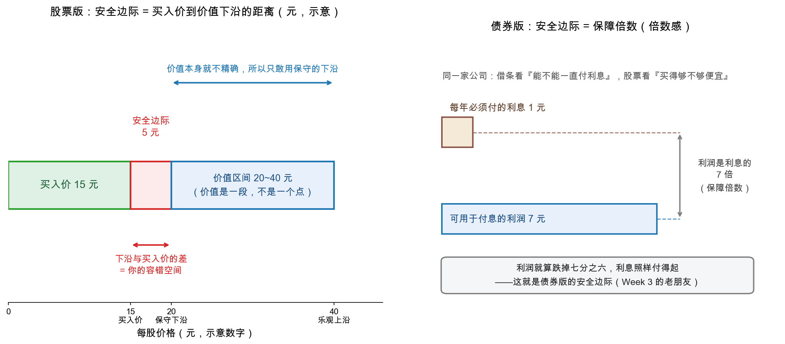

# 第 3 章：安全边际——整本书的落点

> 本章你将：
> - 亲眼看着 Week 1 埋下的"**价格 - 价值 - 安全边际**"铁三角补完最后一角；
> - 掌握安全边际在**三种场景**里的形态：债券是保障倍数、股票是价格折扣、成长股是保守假设；
> - 理解它真正买到的东西：**未来的容错空间**——"即使我看走眼了，结果仍然体面"；
> - 避开两个致命混淆：安全边际不是止损线，也不替代选股；
> - 用"一页纸"把九周的功夫串成一条线，看看全书是如何走到这里来的。

上一章的分家至此只剩一个悬念：证券分析凭什么"错了也扛得住"？
答案是全书真正的落点——**安全边际（margin of safety）**。

这个词你在 Week 1 就见过（第 2 章那张图的右半边）。当时它只是个初登场的新角色；
现在，九周之后，它要接棒了。先回收 Week 1 留下的那句话：

> Week 1 第 2 章：我们搭起了"价格 - 价值 - 安全边际"**铁三角**的前两条边
> （价格围绕价值区间波动；安全边际是买入价与价值下沿的差），并预告：
> "这个比喻我们 Week 9 讲'市场先生'时还会正式请回来。"

现在请回来，并且补完它。

---

## 3.1 铁三角补完

Week 1 那张表的第三行，当时只能空谈；现在三行都有了血肉：

| 铁三角 | 谁决定 | Week 1 时的你 | Week 9 时的你 |
|---|---|---|---|
| **价格** | 千万买卖者的情绪与行动 | "等它，利用它"（但不知道为什么它会疯） | 知道那是**市场先生的报价**：夸大未来或忽视当下的产物，仅供利用 |
| **价值（区间）** | 企业事实：资产、盈利、股息、确定远景 | "估它，保守地估"（还没有估的工具） | 有了一整套工具：三表 → 利润调整 → 盈利能力 → 账面/清算价值（Week 2-8） |
| **安全边际** | 你自己：买入价与价值下沿的差距 | "留它，越多越好"（不知道为什么必须留） | 知道它是**唯一由你完全掌控的变量**，也是全书一切技术的落点 |

三条边里，价格不由你，价值只部分由你（你的研究水平），**只有安全边际 100% 由你**——
下单那一刻，你亲手定下自己的容错空间。这就是为什么整本书八百页，最后收在它身上。

> 📌 **划重点：** 价值评估给你一个"大概值多少"，安全边际回答另一个问题：
> **"如果我估错了呢？"** 前者是手艺，后者是谦逊。缺了后者，前者越熟练越危险。

---

## 3.2 精确定义：用"保守价值"做基准

先把定义钉死（这是全课程最重要的一个定义）：

$$\text{安全边际} = \text{保守评估的价值} - \text{买入价}$$

注意关键词不是"价值"，是"**保守评估的**价值"：

- 你算出价值区间是 20 到 40 元（沿用 Week 1 的示意数字）——安全边际的基准是**下沿
  20 元**，不是中值 30，更不是上沿 40。理由很直白：既然价值是个区间，就说明
  你对它的认识有误差；误差方向永远往坏处备——**按最不利的合理读数来算**；
- 于是安全边际 = 20 减 15 = 5 元。这 5 元对应的不是"赚 5 元"，而是
  "**我可以在多大范围内估错，而结果仍然不伤筋动骨**"。

看图（左半边就是 Week 1 那张图的完整版；右半边马上讲）：

> ⚠️ **易踩坑：安全边际不是止损线。** "跌 20% 就卖"是**价格**上给自己划的线，
> 跟安全边际毫无关系——跌 20% 之后，可能反而比买入时便宜得多（安全边际更大了），
> 此时该研究的不是割不割，而是"价值还在不在"。安全边际是**价值与价格之间**的距离，
> 是买入前就定下的缓冲垫；止损线是买入后对价格的机械反应。格雷厄姆式的投资者
> 管前者，不管后者。

---

## 3.3 三种场景，一个灵魂

安全边际不是一个"股票技巧"，它是一个通用思想。第 52 章把它说成证券分析的第一要务
（md 755），而它在不同场景里长着不同的脸——Week 3 和 Week 5 的老朋友，现在归队：

### 形态一：债券——保障倍数（Week 3 的老朋友）

债券的本金安全不靠抵押物，靠**履行义务的能力**（Week 3 第 1 章的反直觉核心）。
"能力"怎么量化？就是**利息保障倍数**：可用于付息的利润除以利息费用。
倍数越高，缓冲垫越厚——利润就算大跌，利息照样付得起。

看右图那个 7 倍的例子：利润 7 元、利息 1 元，利润就算跌掉七分之六，借条依然安全。
**这个"7 倍"就是债券版的安全边际**：它量的不是"赚多少"，是"距离还不起还有多远"。
当年格雷厄姆给工业债的参考线是 7 倍（严线）到 2 倍（底线，Week 3 的数字），
今天你有印象就够了——**倍数感比数字本身重要**。

### 形态二：股票——价格远低于价值区间下沿

就是 3.2 的定义本身。左图那三段距离（15 元买入价 → 20 元保守下沿 → 20 到 40 元价值
区间）就是全部。历史上最极端的形态你已经在本周第 0 章见过了：A&P 1938 年，
**整家公司的价格低于它账上的净流动资产**——那已经不是"打折"，是"买一送一"级别的
安全边际。Week 8 讲的"破净股""类 net-net"，都是这个形态的当代变体。

### 形态三：成长股——只能靠"保守假设"获得

最微妙的一格。成长股的未来还没发生，价格里通常已经装满了乐观，**折扣从哪里来？**
格雷厄姆的答案冷峻如常（md 758，原话）：

> "Where growth is generally expected, the price is rarely reasonable."——
> **哪里有普遍预期的增长，哪里就很少有合理的价格。**

Week 5 我们已经论证过："增长值多少钱"没有公式，为增长习惯性支付高价是最危险的动作。
所以格雷厄姆式的处理只有两条路（md 758 的投资政策清单）：

1. **按"实际成就"定价**：只为已经发生的盈利和资产付钱，把"可能的增长"当作
   免费赠品——价格对了才买。增长兑现，是惊喜；不兑现，你按现有价值算也划算；
2. 如果你坚持为"诱人的成长故事"支付慷慨的价格——那么请诚实：按原书的分类，
   这属于**投机**（"把'成长股买高价'称为投机，我们与大多数权威意见相左"，
   md 761），就要用投机的方式管理它：小仓位、认赌服输、不挪用"投资"的钱。

| 场景 | 安全边际的形态 | 缓冲垫是什么 | Week |
|---|---|---|---|
| 债券 | 利息保障倍数 | 利润相对固定支出的富余 | Week 3 |
| 普通股 | 价格对价值下沿的折扣 | 估错值也买得便宜 | Week 1 → 9 |
| 成长股 | 保守假设 | 只为"已成就"付钱，增长当赠品 | Week 5 → 9 |

**三个形态，一个灵魂：不赌未来，为未来的不确定性预付缓冲。**

---

## 3.4 它买到的是什么：容错空间

最后回到第 52 章那句定义级的原话（md 755），把"为什么"说透：

> "The underlying idea is that even if the security turns out to be less attractive than
> it appeared, the commitment might still prove a satisfactory one."

> **译文：** "其底层思想是：即使这只证券最后证明不如当初看上去那么好，
> 这笔投入仍然可能是一个令人满意的决定。"

这就是安全边际买到的东西——**容错空间**。请注意这句话的结构：它不是承诺"买了就涨"，
而是承诺"**我看走眼了，也死不了**"。人算不如天算的地方太多了：行业突变、管理层
作恶、黑天鹅降临、以及最常见的一条——你自己高估了自己。缓冲垫越厚，
你被命运和错误击倒的门槛越高。

这也解释了为什么格雷厄姆连"抄底时机"都不追求精确（md 739）：分析的本质是
"时间因素是从属考虑"，判断买入时点允许留出几个月甚至更长的提前量——
**反正安全边际已经替时间的不确定买了单。**

> ⚠️ **易踩坑：安全边际不能替代选股。** 打五折的垃圾公司还是垃圾公司——Week 3
> 讲过"安全靠能力不靠承诺"，原书第 51 章的素材再补一刀：一家美国橡胶公司的
> 非累积优先股，1922 到 1927 年间利润对"利息加优先股股息"的覆盖倍数常年在 1.0 到 1.8 倍
> 之间挣扎（照原书摘录），纯看数字根本不配"投资级"，却凭名气常年卖在面值之上；
> 1928 年还冲到 109 美元，同年公司巨亏、停发股息，1929 年居然还能卖 92.5 美元，
> 到 1932 年只剩 3 美元出头（数字照原书摘录）。**名气不是安全边际，能力才是。**
> 正确顺序永远是：先过质量关（生意 + 报表），再谈折扣——"便宜"是这个顺序的
> 奖励，不是入场券。

---

## 3.5 九周一页纸：这本书是怎么走到这里来的

本章既然叫"整本书的落点"，就值得把九周的来路串一遍。你会发现每一步都在为
"安全边际"供货：

1. **Week 1**：投资 = 深入分析 + 本金安全 + 满意回报；内在价值是"被事实支持的区间"；
   铁三角初见——一切等待展开；
2. **Week 2**：三张报表扫盲——企业事实的"原材料仓库"；
3. **Week 3/4**：债券与条款——"本金安全"的第一课堂，保障倍数给了安全边际第一个身体；
4. **Week 5**：普通股 = 企业的部分所有权——让"股票"重新变成"生意"，为估值立桩；
   同时警告：为增长付高价没有公式；
5. **Week 6/7**：利润表分析——把"利润是 opinion"修成可靠的"盈利能力"，
   估出价值区间的第一个锚；
6. **Week 8**：资产负债表——账面价值与清算价值，估出第二个锚（最保守的底线）；
7. **Week 9**：价格为什么会偏离（市场先生）+ 你该怎么办（安全边际）——
   **把"事实"和"报价"之间的裂缝，正式变成你的策略。**

一根线终于穿完：**用事实估出价值区间 → 等市场先生报出离谱低价 → 按保守下沿
留出折扣 → 买入容错空间。** 这就是《证券分析》八百页的全部压缩包，
也是下一章要拿去真实市场里演练的东西。

> 📌 **实战联系：** 给自己定一条"安全边际声明"，写在买入任何股票之前：
> "我估计它的价值区间是 X 到 Y 元（依据：近五年平均盈利乘以倍数 Z，以及每股净资产 W）；
> 我只按不高于下沿的 8 折（示意）买入；如果我高估了三成，我的缓冲垫还剩多少？"
> 说不出这三个数字的买入，不是投资——回到 Week 1 的定义自查一遍：
> 缺"深入分析"的折扣，只是碰运气时给自己找的体面话。

---

## ✍️ 想一想

> 建议**先自己写两句话再看答案**。想不清楚的地方，就是下一遍该重读的地方。

### 问 1：安全边际与止损线之别

用一句话向一位只炒短线的朋友解释："安全边际"和"止损线"分别保护你免受什么？
为什么格雷厄姆要前者不要后者？

**解题思路：** 抓住一个区分：**止损线划在"价格"上，安全边际划在"价值与价格之间"。** 前者防的是"跌得更多"，后者防的是"我一开始就估错了"。想清楚这两件事各自归谁管（价格归市场先生，买入价归你自己），"为什么只要前者"就是自然结论。

**参考答案：** 一句话版本：**止损线保护你的账户不再继续缩水，安全边际保护你的判断错了也不致命**——前者管"价格又跌了"，后者管"我可能从一开始就算错了"。

| | 止损线 | 安全边际 |
|---|---|---|
| 划在哪里 | **价格**上（买入价往下若干百分比） | **价值与价格之间**（保守价值减买入价） |
| 什么时候定 | 买入之后，对价格做机械反应 | 买入之前，下单那一刻就定死 |
| 防的是什么 | 单次亏损继续扩大 | 估值错误、行业突变、管理层作恶、黑天鹅，以及最常见的一条——**你自己高估了自己** |
| 价格下跌时 | 触发卖出，把波动变成永久亏损 | 可能反而**变大**（价格更低了），此时该研究的是"价值还在不在" |
| 依据 | 涨跌幅 | 事实与保守估值 |
| 谁掌控 | 市场（价格说了算） | 你（买入价你说了算） |

为什么格雷厄姆要前者不要后者：

1. **止损线把命运交给了市场先生。** 它划在价格上，而价格由他的情绪决定（第 1 章：报价是服务，不是命令）。跌 20% 这件事本身可能毫无信息量——按三问的第一问，多数时候答案是"公司没变"；
2. **止损线会制造"被迫卖出"。** 第 4 章 2015 年那台平仓螺旋就是标本：跌 → 触发线 → 被迫卖出 → 跌得更深 → 触发更多线。止损线把这个机制**制度化**，等于自愿加入"不得不卖"的那一边；
3. **安全边际是唯一 100% 由你掌控的变量**（3.1 的三行表）：价格不由你，价值只部分由你，只有买入价你说了算。它对应的是原书那句"即使这只证券最后证明不如当初看上去那么好，这笔投入仍然可能是一个令人满意的决定"——**承诺的不是眼光，是容错**；
4. **两者的门派不同**：止损线的唯一判据是价格，属于投机；安全边际的判据是事实加保守估值，属于投资（Week 1 的定义：深入分析 + 本金安全 + 满意回报）。

给短线朋友的大白话版："你那条线防的是'它继续跌'，我那条线防的是'我看错了'。跌不跌市场说了算，看没看错我说了算——而且只要价值没变，它跌下去我只会更安全。"

自检问题：假设我的止损线被触发，是**公司变了**还是**价格变了**？如果只是价格变了，那个卖出动作，是谁在替我做的？

**易错点：** ① 把"跌 20% 就卖"叫成"我的安全边际是 20%"——数字一样，逻辑相反：一个在价格上割肉，一个在价值上留缓冲；② 用止损线替代研究——它只能限制单次亏损的幅度，不能提高判断的质量，更不能替你回答"这家公司值多少"；③ 反过来理解成"有安全边际就永不卖出"——这条原则反过来同样成立：价格**远低于**下沿时买入，价格**远高于**上沿时把安全边际兑现给市场先生。

### 问 2：折扣该按中值还是下沿算

某公司价值区间估为 30 到 50 元，当前价 28 元。请分别按"中值 40"和"下沿 30"计算
当前的折扣，并说明为什么格雷厄姆要求你只用后者做决定。

**解题思路：** 先老老实实算两次折扣，把两个结果的**量级差**摆出来；再从 3.2 的定义出发回答"为什么"——关键词不是"价值"，是"**保守评估的**价值"。别忘了题干这个价格设计得很刁：28 元确实低于下沿 30 元，所以问题不是"有没有"，而是"**够不够**"。

**参考答案：**
| 基准 | 算式 | 当前折扣 | 读起来像什么 |
|---|---|---|---|
| 中值 40 元 | $40 - 28 = 12$ 元 | 约 30%（$28 \div 40 = 0.7$） | "七折买入，空间不小" |
| **保守下沿 30 元** | $30 - 28 = 2$ 元 | 约 6.7%（$28 \div 30 \approx 0.93$） | "只有 2 元缓冲，薄得几乎不存在" |

为什么格雷厄姆要求只用下沿：

1. **定义里那个关键词。** 3.2 的定义是"**保守评估的**价值 减 买入价"——基准是下沿，不是中值，更不是上沿。理由很直白：价值是个区间，就说明你的认识有误差；而**误差方向永远往坏处备**，按最不利的合理读数来算；
2. **中值不含容错。** 用中值 40 算折扣，等于偷偷假设"我对价值的估计落在区间正中间而且准确"——可你恰恰不知道真实价值落在哪一点。中值代表"正常情形的期望"，期望不承担"我看走眼"的责任，下沿才承担；
3. **原书那句承诺只在下沿口径下成立。** "即使这只证券最后证明不如当初看上去那么好，这笔投入仍然可能是一个令人满意的决定"——如果你按中值算了 30% 的折扣，这 30% 全部依赖乐观估值兑现，"不如看上去那么好"的那一刻，缓冲就没了。

一个残酷的算术：如果我的估值整体还偏乐观了三成呢？按下沿算的这 2 元缓冲，连一次温和的高估都扛不住。所以结论是：**28 元的正确读法是"有 2 元缓冲、约 6.7%"，不是"七折"**——这个数字薄到不足以支撑买入。3.5 的声明模板给的动作是：把档位写成"不高于下沿的 8 折"（示意，即 24 元附近），分批执行，而不是在 28 元上说服自己"已经低于下沿了"。

自检问题：我算折扣时用的那个基准，是**我希望它值的钱**，还是**我敢拿来兜底的钱**？

**易错点：** ① 用中值或上沿算折扣，因为"那样算出来更便宜"——这是先有结论再挑算法；② 认为"28 元低于下沿 30 元，所以有安全边际，可以买"——**"有"和"够"是两回事**，2 元的缓冲垫扛不住一次像样的估错；③ 把 30 到 50 元当成"股价会去的两个目标位"——区间是**估值的不确定范围**，不是行情预测：下沿不是"必到"，上沿更不是"必涨"。

### 问 3：成长股的买点条件

3.3 节说成长股的安全边际"只能靠保守假设"。假设你看好某家新能源公司（不必是
真实公司），请写出你的"格雷厄姆式"买点条件：只为哪些"已发生的事实"付钱？
哪些部分当作免费赠品？什么情况下你会承认自己在投机？

**解题思路：** 题目是开放题，评分标准是"有没有把'已发生的事实'和'想象中的将来'分开"。先按 3.3 的两条路搭骨架——**只为"实际成就"定价，增长当赠品**；再把买点写成可执行的档位（3.5 的声明模板）；最后诚实回答"什么时候算投机"（原书 md 761 的判词：把"成长股买高价"称为投机，与大多数权威意见相左）。

**参考答案：** 示范作答分四段。

**一、只为"已发生的事实"付钱（可核对的清单）：**

1. **已经赚到的钱**：过去五年（最好覆盖一个完整周期）的平均盈利，而不是明年预测的盈利——这是 Week 6/7 修出来的"盈利能力"，也是价值区间的第一个锚；
2. **已经存在的资产**：每股净资产（账面价值），以及净流动资产这类最保守的底线——Week 8 的第二个锚；
3. **已经分到手的钱**：连续分红的历史记录。它是唯一不需要相信任何故事就能拿到的回报；
4. **已经落地的确定性**：在建产能、已签长单、现有装机与在手订单——只按"已经落地、可核对"的部分算，并且要打折（项目会延期、成本会超支）。

**二、当作免费赠品（一分钱不付）：**

- 行业渗透率还会翻倍；
- 下一代技术路线通吃；
- 海外市场打开、市占率继续提升；
- 管理层口径里"未来三年复合增长多少"。

赠品兑现了是惊喜；不兑现，我按现有价值算也划算——这正是 3.3 的原话。

**三、买点条件（写成可执行的档位）：**

- 先只按"已成就"算出保守价值区间 X 到 Y，**下沿 X 用最不利的合理假设**：不增长、毛利率回落、在建项目延期；
- 只在价格**低于 X 的 8 折**（3.5 的示意折扣）时开始分批买入，档位提前写好，跌到就执行；
- 特别声明：这一格里**价格中不含"增长溢价"这个东西**。原书那句"哪里有普遍预期的增长，哪里就很少有合理的价格"（md 758），说的就是别指望在这里捡到共识的便宜。

**四、什么时候承认自己在投机：**

只要出现下面任何一条，就老实承认——这不是投资，是投机：

- 买入理由里出现了"它明年会增长多少"（md 757 的双重风险：预测可能错；即使对了，也可能早就被价格消化，甚至消化过头）；
- 我为**普遍预期的增长**支付了溢价（价格里已经装满了乐观）；
- 我按很高的倍数买一家盈利尚未兑现的公司；
- 一旦承认，就按原书的分类管理它：**小仓位、认赌服输、不挪用"投资"的钱**（3.3 第 2 条）。

自检问题：如果这家公司三年不涨，我还拿得住吗？如果拿不住，说明我买的是价格，不是价值。

**易错点：** ① 把"保守假设"做成"把增长率从 50% 调到 40%"——那不叫保守，保守是把增长率设成零甚至负值，看这家公司还值多少钱；② 认为"成长股不能买"——原书从没说不能买，说的是**别为增长付溢价**：只为已成就付钱、增长当赠品，价格对了照样能买；③ 用"小仓位"给高估值买保险——小仓位控制的只是损失上限，不改变这笔钱的性质；一旦承认在投机，就不能拿养老、刚性用途的钱去补。

## 📖 回到原书

**第 52 章，md 页码 page_755（原书第 703 页）**

> "In security analysis the prime stress is laid upon protection against untoward
> events. We obtain this protection by insisting upon margins of safety, or values well
> in excess of the price paid. The underlying idea is that even if the security turns
> out to be less attractive than it appeared, the commitment might still prove a
> satisfactory one."

> **译文：** "在证券分析中，首要的重心放在防范不测事件上。我们获得这种保护的方式，
> 就是坚持安全边际——要求价值大大超过所付出的价格。其底层思想是：即使这只证券
> 最后证明不如当初看上去那么好，这笔投入仍然可能是一个令人满意的决定。"

**一句话点评：** 整本《证券分析》的心脏就在这里：它不向你承诺眼光，只向你出售
**容错**——这是普通人也能向大师买到的唯一一件东西。

---
**第 52 章，md 页码 page_758（原书第 706 页）**

> "Where growth is generally expected, the price is rarely reasonable."

> **译文：** "哪里有普遍预期的增长，哪里就很少有合理的价格。"

**一句话点评：** 十四个英文单词，说尽了从 1929 年的"新时代"到 2021 年"核心资产"
的全部行情：**共识本身就是溢价的来源，而溢价正是安全边际的天敌。**

---
铁三角补完了，全书的思想大厦封顶。最后一章，我们把这套东西搬进真实的市场——
去看看 A股 和港股近十年最极端的几个时刻，市场先生发疯时，谁在卖，谁在买，
以及普通投资者想站到买的一边，需要先备齐哪三样东西。
